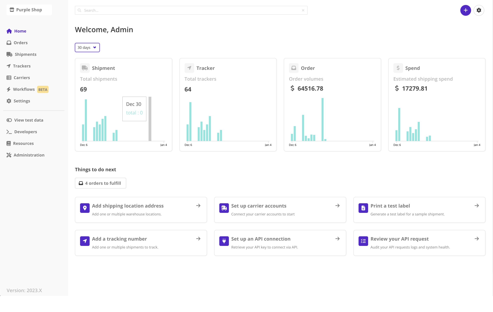
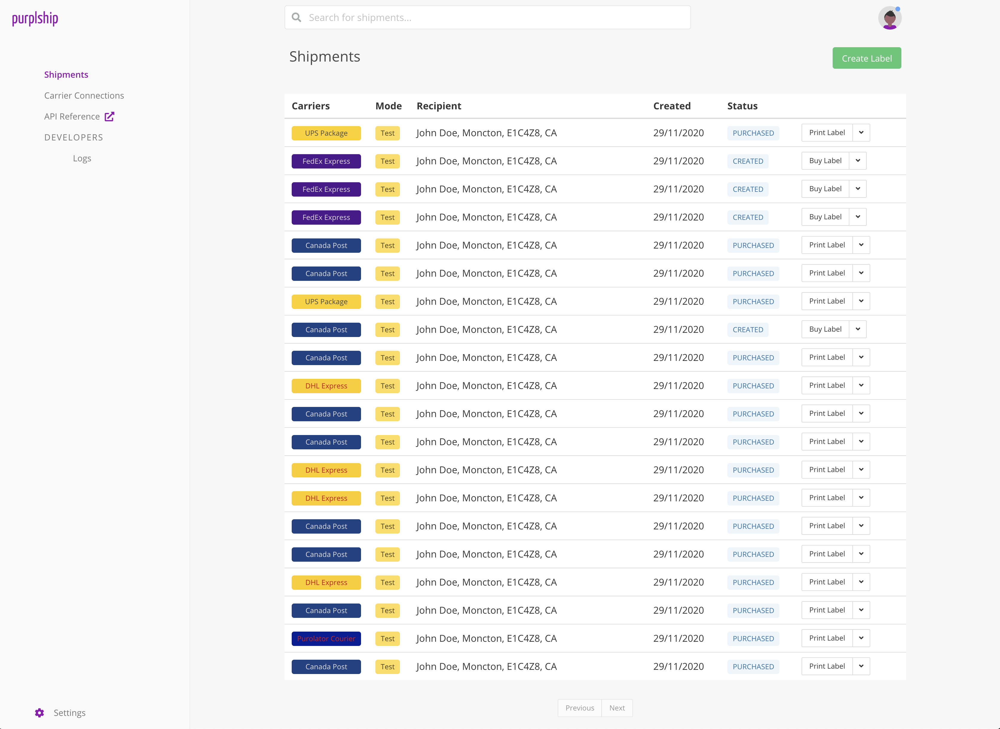

# Karrio

-   Website: <https://karrio.io>
-   Documentation: [https://docs.karrio.io/](https://docs.karrio.io/)
-   Forums: [Github Discussions](https://github.com/orgs/karrioapi/discussions)
-   Discord: [Karrio Discord server](https://discord.gg/gS88uE7sEx)
-   Issues: [Issue Tracker](https://github.com/karrioapi/karrio/issues)
-   Blog: [Blog](https://karrio.io/blog)


<a href="https://karrio.io" target="_blank">
  <picture>
    <source media="(prefers-color-scheme: dark)" srcset="https://raw.githubusercontent.com/karrioapi/karrio/main/apps/api/karrio/server/static/extra/branding/logo-inverted.svg" height="100px" />
    
  </picture>
</a>

[](https://github.com/karrioapi/karrio/actions/workflows/tests.yml)
[](./LICENSE)
[](https://www.codacy.com/gh/karrioapi/karrio/dashboard?utm_source=github.com&utm_medium=referral&utm_content=karrioapi/karrio&utm_campaign=Badge_Grade)
[](https://discord.gg/gS88uE7sEx)
[](https://hub.docker.com/r/karrio/server)


Karrio is a developer-first shipping integration and logistics automation platform
that helps developers build shipping experiences into their platforms.

**Get up and running in 1 minute with:**

```sh
git clone --depth 1 https://github.com/karrioapi/karrio
cd karrio/docker
docker compose up
```

-   Karrio server accessible at <http://localhost:5002>
-   Karrio dashboard accessible at <http://localhost:3000>

Default Login: `admin@example.com` | `demo`

## Features

-   **Headless Shipping**: Access a network of traditional and modern shipping carriers API-first.
-   **Extensible**: Build anything with webhooks, APIs and metadata.
-   **Multi-carrier SDK**: Use the karrio SDK to integrate with custom carrier APIs.
-   **Fulfilment**: Connect carrier accounts, get live rates and purchase shipping labels.
-   **Tracking**: Create package trackers, get real time tracking status and deliver a great shopping experience.
-   **Address Validation**: Validate shipping addresses using integrated 3rd party APIs.
-   **Cloud**: Optimized for deployments using Docker.
-   **Dashboard**: Use the karrio dashboard to orchestrate your logistics operations.

<p align="center">
  
  
</p>

## Get started

### Quick start demo

[A short video (less than 4 minutes)](https://youtu.be/dFHZosJPaLI) that goes over creating your first label and tracking your first package.

### Open-source hobby deploy (Advanced)

You can deploy a hobby instance in one line on Linux with Docker (recommended 4GB memory):

```bash
/bin/bash -c "$(curl -fsSL https://raw.githubusercontent.com/karrioapi/karrio/HEAD/bin/deploy-hobby)"
```

### Karrio Cloud

The simplest way to set up Karrio and take the front row in helping improve the platform is to request access to our managed deployment on [Karrio Cloud](https://www.karrio.io/get-started).

## Contact us

Chat with us for any commercial inquiries.

<a href="https://cal.com/karrio/discovery?utm_source=banner&utm_campaign=oss"></a>

## The problem: Shipping integration is still painful

-   Lack of documentation.
-   Multiple and inconsistent APIs.
-   Difficult access to account and API credentials for development.
-   Poor developer experience.

## Our philosophy

We help you integrate with your shipping carriers and improve your fulfilment processes without loosing control.

We believe that the logistics industry can greatly benefit from a unified, open and standardized shipping API that gives you direct access to a network of carriers, control over customers' personal data and **compliance**.

## What are the benefits?

Karrio is the only **platform-focused** open-source shipping platform with label generation, document generation and package tracking API that **you can host on your own infrastructure**.

We are an open-source alternative to expensive in-house carrier integration and multi-carrier Saas APIs. We're designed to be more **developer-friendly**, with the fullset of shipping functionalities without vendor-lockin.

### Shipping for platforms

With Karrio, you can extend your platform with native shipping capabilities. Improve merchants and customers experience on your Marketplace, eCommerce, ERP, WMS, OMS, 3PL and Logistics platform.
With Karrio, 3PLs and large volume shippers regain control over their shipping tech stack and processes.

### Shipping for enterprise

Karrio makes modern shipping accessible to brands, retailers as well as businesses in regulated industries.
Ideal for pharmacy shipping where compliance is a must.

## Support

If you have general questions about Karrio, want to say hello or just follow along, we'd like to invite you to join our [Discord Community](https://discord.gg/gS88uE7sEx).

If you run into any problems or issues, please create a Github issue and we'll try our best to help.

We strive to provide good support through our issue trackers on Github. 

## Contributing

See our Docs for instructions on [development setup](https://docs.karrio.io/contributing/development).

We <3 contributions big or small, check out our [guide on how to get started](https://docs.karrio.io/contributing/guidlines).

Not sure where to start? [Send us an email](mailto:dev@karrio.com?subject=Pairing%20session&body=I'd%20like%20to%20do%20a%20pairing%20session!) to chat with a member of our team.

### Contributors

<a href="https://github.com/karrioapi/karrio/graphs/contributors">
  
</a>

## License

This project uses the [Apache v2 license](LICENSE). The core Karrio platform will always remain open and free.

Any other questions, mail us at hello@karrio.io We’d love to meet you!

## Sponsors

We are building an open and global shipping platform that makes shipping integration and logistics automation fun and accessible using and building on top of open source software. 
Thanks for sponsoring and backing us.

<a href="https://appsandbrains.com/" target="_blank"></a>

### Past sponsors

<a href="https://www.chequesplus.com/" target="_blank"></a>
<a href="https://www.truckhardware.ca/" target="_blank"></a>
<a href="https://www.shipto.me/" target="_blank"></a>
<a href="https://en.platana.fr/" target="_blank"></a>


### Become a sponsor

<a href="https://github.com/sponsors/karrioapi" target="_blank"></a>
