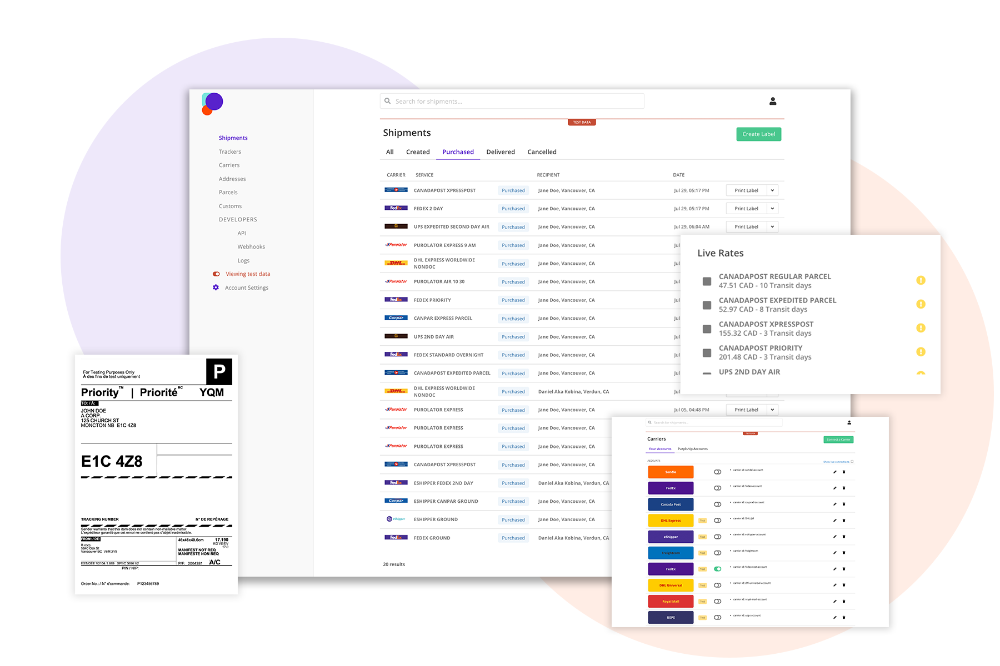

# Karrio

-   Website: <https://karrio.io>
-   Documentation: [https://docs.karrio.io/](https://docs.karrio.io/)
-   Forums: [Github Discussions](https://github.com/orgs/karrioapi/discussions)
-   Discord: [Karrio Discord server](https://discord.gg/gS88uE7sEx)
-   Issues: [Issue Tracker](https://github.com/karrioapi/karrio/issues)
-   Blog: [Blog](https://karrio.io/blog)


<a href="https://karrio.io" target="_blank">
  <picture>
    <source media="(prefers-color-scheme: dark)" srcset="https://raw.githubusercontent.com/karrioapi/karrio/main/apps/api/karrio/server/static/extra/branding/logo-inverted.svg" height="100px" />
    
  </picture>
</a>

The open-source platform for shipping integration

[](./LICENSE)
[](https://github.com/karrioapi/karrio/actions/workflows/tests.yml)
[](https://github.com/karrioapi/karrio/actions/workflows/build.yml)
[](https://www.codacy.com/gh/karrioapi/karrio/dashboard?utm_source=github.com&utm_medium=referral&utm_content=karrioapi/karrio&utm_campaign=Badge_Grade)
[](https://discord.gg/gS88uE7sEx)
[](https://hub.docker.com/r/karrio/server)

Karrio allows you to integrate with your shipping carriers to query, visualize and manage shipping API
transactions. Integrate, connect and process shipping transactions with a modern tech stack:

-   **Headless Shipping**: Access a network of shipping carriers API-first.
-   **Multi-carrier API**: Build shipping functionalities with webhooks, APIs and metadata.
-   **Multi-carrier SDK**: Use the karrio SDK to integrate with custom carrier APIs.
-   **Fulfil Orders**: Connect carrier accounts, get live rates and purchase shipping labels.
-   **Tracking**: Create package trackers and get real-time tracking status.
-   **Dashboard**: Use the karrio dashboard to test and visualize shipping transactions.
-   **Cloud**: Optimized for deployments using Docker.

**Karrio is not designed as an out-of-the-box shipping software to be used for purposes that differ to the feature scope above.**

In regard to development philosophy, Karrio has a relaxed, open & positive approach. At the end of the day this is free tool developed and maintained by people donating their own free time.

**Get up and running in 1 minute with:**

```sh
git clone --depth 1 https://github.com/karrioapi/karrio
cd karrio
git submodule update --init community
git submodule update --init ee/insiders
cd docker
docker compose up
```

-   Karrio server accessible at <http://localhost:5002>
-   Karrio dashboard accessible at <http://localhost:3002>

Default Login: `admin@example.com` | `demo`

<p align="center">
  
</p>

## Get started

### Quick start demo

[A short video (less than 4 minutes)](https://youtu.be/dFHZosJPaLI) that goes over creating your first label and tracking your first package.

### Open-source hobby deploy (Advanced)

You can deploy a hobby instance in one line on Linux with Docker (recommended 4GB memory):

```bash
/bin/bash -c "$(curl -fsSL https://raw.githubusercontent.com/karrioapi/karrio/HEAD/bin/deploy-hobby)"
```

## The problem: Shipping integration is still painful

-   Lack of documentation.
-   Multiple and inconsistent APIs.
-   Difficult access to account and API credentials for development.
-   Poor developer experience.

## Philosophy

Karrio makes it easy to integrate with shipping carriers and improve your fulfilment processes without losing control.

We believe that the logistics industry can greatly benefit from a unified, open and standardized shipping API that gives you direct access to a network of carriers, control over customers' personal data and **compliance**.

## Benefits

Karrio is the only **platform-focused** open-source developer tool that offers label generation, package tracking, carrier connections management and, document generation APIs that **you can host on your own infrastructure**.

We are an open-source alternative to expensive in-house carrier integration and multi-carrier Saas APIs. We're designed to be more **developer-friendly**, with the fullset of shipping functionalities without vendor-lockin.

### Shipping for platforms

With Karrio, you can extend your platform with native shipping capabilities. Improve merchants and customers' experience on your Marketplace, eCommerce, ERP, WMS, OMS, 3PL and Logistics platform.

With Karrio, 3PLs and large-volume shippers regain control over their shipping tech stack and processes.

### Shipping for retailers

Karrio makes modern shipping accessible to brands, retailers as well as businesses in regulated industries.

When onboarding new carriers, your IT team can meet their requirements in a week or less.

## Contributing

We <3 contributions big and small. In priority order (although everything is appreciated) with the most helpful first:

-   Ask general question on [Github Discussions](https://github.com/orgs/karrioapi/discussions)
-   Submit a [feature request](https://github.com/orgs/karrioapi/discussions)
-   Open a PR (see our instructions on [developing Karrio locally](https://docs.karrio.io/contributing/development))

### Contributors

<a href="https://github.com/karrioapi/karrio/graphs/contributors">
  
</a>

## Sponsors

We are building an open and global shipping tech stack that makes shipping integration fun and accessible using open-source software.

Special thanks to our sponsors

<a href="https://appsandbrains.com/" target="_blank"></a>
<a href="https://superroute.ca/" target="_blank"></a>

### Become a sponsor

<a href="https://github.com/sponsors/karrioapi" target="_blank"></a>
