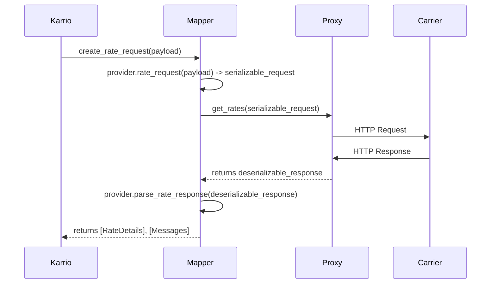

# API Requests

The `Proxy` class is responsible for handling all communication with the carrier's API. It contains methods for each supported operation (rating, shipping, tracking, etc.), and manages the specifics of authentication, request formatting, and response retrieval.

## Proxy Class Structure

The `Proxy` class is implemented in `karrio/mappers/[carrier_name]/proxy.py` and extends the base `karrio.api.proxy.Proxy` class. Its primary role is to make HTTP requests and return a `lib.Deserializable` object containing the raw response from the carrier.

Here is a template for a `proxy.py` file, which you can adapt for your integration.

```python
# karrio/mappers/[carrier_name]/proxy.py
import karrio.lib as lib
import karrio.api.proxy as proxy
import karrio.mappers.[carrier_name].settings as provider_settings

# IMPLEMENTATION INSTRUCTIONS:
# 1. Import the schema types specific to your carrier API if needed for type hinting
# 2. Uncomment and adapt the request examples below to work with your carrier API
# 3. Replace the stub responses with actual API calls once you've tested with the example data
# 4. Update URLs, headers, and authentication methods as required by your carrier API

class Proxy(proxy.Proxy):
    settings: provider_settings.Settings

    def get_rates(self, request: lib.Serializable) -> lib.Deserializable[str]:
        """
        Request shipping rates from the carrier's API.
        """
        # DEVELOPMENT ONLY: This is a stub response.
        # Replace it with the actual API call below.
        # response = "{}" # For JSON APIs
        # response = "<RateResponse></RateResponse>" # For XML APIs

        response = lib.request(
            url=f"{self.settings.server_url}/rating/v1/rates",
            data=lib.to_json(request.serialize()), # use request.serialize() for XML
            trace=self.trace_as("json"), # use "xml" for XML APIs
            method="POST",
            headers={
                "Content-Type": "application/json", # use "text/xml" for XML APIs
                "Authorization": f"Bearer {self.settings.api_key}" # Or other auth method
            },
        )

        return lib.Deserializable(response, lib.to_dict) # use lib.to_element for XML

    def create_shipment(self, request: lib.Serializable) -> lib.Deserializable[str]:
        """
        Create a shipment and request a shipping label from the carrier's API.
        """
        response = lib.request(
            url=f"{self.settings.server_url}/shipping/v1/shipments",
            data=lib.to_json(request.serialize()),
            trace=self.trace_as("json"),
            method="POST",
            headers={
                "Content-Type": "application/json",
                "Authorization": f"Bearer {self.settings.api_key}"
            },
        )

        return lib.Deserializable(response, lib.to_dict)

    def get_tracking(
        self, request: lib.Serializable
    ) -> lib.Deserializable:
        """
        Retrieve tracking details for one or more shipments.
        Some carriers offer a bulk tracking endpoint, while others require
        one request per tracking number.
        """
        # A helper function to make a single tracking request
        def _get_tracking(tracking_number: str):
            return lib.request(
                url=f"{self.settings.server_url}/tracking/v1/{tracking_number}",
                trace=self.trace_as("json"),
                method="GET",
                headers={"Authorization": f"Bearer {self.settings.api_key}"},
            )
            return tracking_number, "{}"

        # Use run_concurently to make parallel requests for each tracking number
        responses = lib.run_concurently(_get_tracking, request.serialize())

        return lib.Deserializable(
            responses,
            lambda res: [
                (num, lib.to_dict(track)) for num, track in res if any(track.strip())
            ],
        )

    # ... other methods for cancel_shipment, schedule_pickup, etc.
```

## HTTP Requests with `lib.request`

The `lib.request` function is a wrapper around Python's `requests` library that provides a unified way to make HTTP calls. It handles:

- HTTP method (e.g., `POST`, `GET`, `DELETE`)
- Request headers and body
- Tracing for debugging
- Basic error handling (e.g., for network issues)

The result of `lib.request` is typically passed into a `lib.Deserializable` object, which holds the raw response string and a parsing function (`lib.to_dict` for JSON, `lib.to_element` for XML) to be evaluated later by the `Mapper`.

### JSON API Example

```python
def get_rates(self, request: lib.Serializable) -> lib.Deserializable[str]:
    response = lib.request(
        url=f"{self.settings.server_url}/rates",
        data=lib.to_json(request.serialize()),
        trace=self.trace_as("json"),
        method="POST",
        headers={
            "Content-Type": "application/json",
            "Authorization": f"Bearer {self.settings.api_key}"
        },
    )
    return lib.Deserializable(response, lib.to_dict)
```

### XML/SOAP API Example

For XML/SOAP APIs, the pattern is similar, but you serialize the request directly to an XML string and use `lib.to_element` to parse the response.

```python
def get_rates(self, request: lib.Serializable) -> lib.Deserializable[str]:
    # The request object's serialize() method should produce the correct XML string,
    # often without needing to manually wrap it in a SOAP envelope.
    response = lib.request(
        url=f"{self.settings.server_url}/rates",
        data=request.serialize(),
        trace=self.trace_as("xml"),
        method="POST",
        headers={
            "Content-Type": "text/xml",
            "SOAPAction": "getRates"
        },
    )
    return lib.Deserializable(response, lib.to_element)
```

## Tracing and Debugging

Karrio includes a built-in tracing mechanism to help debug API calls. The `trace_as` method on the `Proxy` class sets up tracing for a particular format:

```python
trace=self.trace_as("json")  # For JSON APIs
trace=self.trace_as("xml")   # For XML APIs
```

This allows Karrio to record and display the full request and response for each API call, which is invaluable for debugging your integration.

## Authentication

Authentication logic is typically defined within the `Settings` class in `karrio/providers/[carrier_name]/utils.py`. This keeps the `Proxy` class clean and focused on making requests.

Common patterns include:

- **API Key**: A simple `api_key` property on the `Settings` class.
- **Basic Auth**: An `authorization` property that base64-encodes a username and password.
- **OAuth**: An `access_token` property that handles retrieving and caching a token.

Refer to the `PROVIDER_UTILS_TEMPLATE` in `karrio_cli/templates/sdk.py` for detailed examples of how to implement these patterns.

## Error Handling

The `Proxy` is only responsible for making the request and returning the response. It does not parse the content of the response to look for business logic errors.

Instead, error parsing is handled within the provider's `error.py` module, specifically in the `parse_error_response` function. This function is called by the `Mapper`'s response parsing methods (e.g., `parse_rate_response`, `parse_shipment_response`) after the response has been deserialized. This separation of concerns ensures that all response parsing, both for successful and failed requests, happens in the provider layer.

```python
# karrio/providers/[carrier_name]/error.py

def parse_error_response(response: dict, settings: Settings) -> List[Message]:
    """Parse a carrier's error response into a list of Karrio Messages."""
    errors = []
    # ... logic to extract error details from the response ...
    return errors
```

## API Request Flow

The typical flow of an API request in Karrio is:

1. A request is made to Karrio's unified API.
2. The request is routed to the correct carrier `Mapper`.
3. The `Mapper`'s request creation method (e.g., `create_rate_request`) transforms the unified request into a carrier-specific `Serializable` object.
4. The `Mapper` calls the corresponding method on the `Proxy` (e.g., `get_rates`).
5. The `Proxy` makes the HTTP request to the carrier's API and returns a `Deserializable` object.
6. The `Mapper`'s response parsing method (e.g., `parse_rate_response`) deserializes the response and parses it, along with any errors, into Karrio's unified models.
7. The unified response is returned.



## Best Practices

- **Keep it Simple**: The `Proxy` should only be concerned with the transport layer (making HTTP calls). All data transformation and business logic belongs in the `Mapper` and `provider` modules.
- **Use `self.settings`**: All necessary configuration, including credentials and server URLs, should be accessed via `self.settings`.
- **Implement Stubs First**: Use stubbed responses during initial development to test the request/response cycle without making live API calls.
- **Leverage Concurrent Execution**: For operations like tracking that may involve multiple requests, use `lib.run_concurently` to improve performance.

## Common API Operations

Most carrier integrations implement some or all of these common operations:

- **Rating**: Get shipping rates for a package
- **Shipping**: Create shipments and purchase labels
- **Tracking**: Track shipments by tracking number
- **Address Validation**: Validate and normalize shipping addresses
- **Pickup**: Schedule, cancel, or update pickups
- **Customs**: Generate customs documentation for international shipments

In the next section, we'll cover how to implement data mapping between Karrio's unified format and carrier-specific formats.
