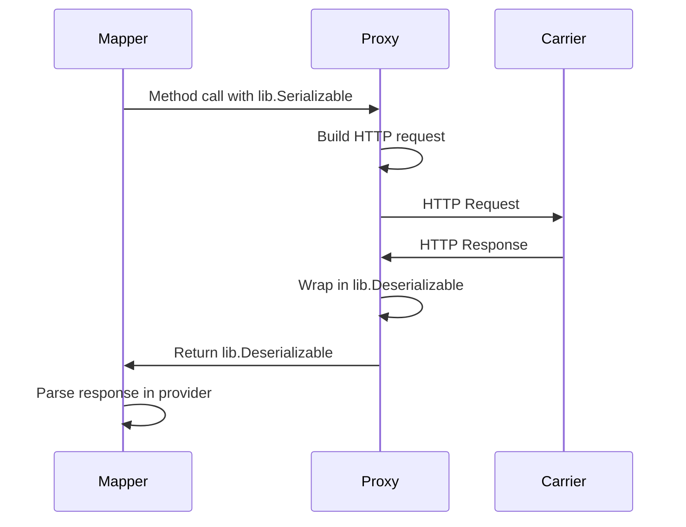

# API Requests

The `Proxy` class is responsible for handling all communication with the carrier's API. It contains methods for each supported operation (rating, shipping, tracking, etc.), and manages the specifics of authentication, request formatting, and response retrieval.

## Proxy Class Structure

The `Proxy` class is implemented in `karrio/mappers/[carrier_name]/proxy.py` and extends the base `karrio.api.proxy.Proxy` class. Its primary role is to make HTTP requests and return a `lib.Deserializable` object containing the raw response from the carrier.

**File**: `karrio/mappers/[carrier_name]/proxy.py`

```python
import karrio.lib as lib
import karrio.api.proxy as proxy
import karrio.mappers.[carrier_name].settings as provider_settings

class Proxy(proxy.Proxy):
    settings: provider_settings.Settings

    def get_rates(self, request: lib.Serializable) -> lib.Deserializable[str]:
        """Request shipping rates from the carrier's API."""

        response = lib.request(
            url=f"{self.settings.server_url}/rates",
            data=lib.to_json(request.serialize()),  # Use request.serialize() for XML
            trace=self.trace_as("json"),             # Use "xml" for XML APIs
            method="POST",
            headers={
                "Content-Type": "application/json",  # Use "text/xml" for XML APIs
                "Authorization": f"Bearer {self.settings.api_key}"  # Or access_token
            },
        )

        return lib.Deserializable(response, lib.to_dict)  # Use lib.to_element for XML

    def create_shipment(self, request: lib.Serializable) -> lib.Deserializable[str]:
        """Create a shipment and request a shipping label."""

        response = lib.request(
            url=f"{self.settings.server_url}/shipments",
            data=lib.to_json(request.serialize()),
            trace=self.trace_as("json"),
            method="POST",
            headers={
                "Content-Type": "application/json",
                "Authorization": f"Bearer {self.settings.api_key}"
            },
        )

        return lib.Deserializable(response, lib.to_dict)

    def get_tracking(self, request: lib.Serializable) -> lib.Deserializable:
        """Retrieve tracking details for one or more shipments."""

        def _get_tracking(tracking_number: str):
            return tracking_number, lib.request(
                url=f"{self.settings.server_url}/tracking/{tracking_number}",
                trace=self.trace_as("json"),
                method="GET",
                headers={"Authorization": f"Bearer {self.settings.api_key}"},
            )

        # Use concurrent requests for multiple tracking numbers
        responses = lib.run_concurently(_get_tracking, request.serialize())

        return lib.Deserializable(
            responses,
            lambda res: [
                (num, lib.to_dict(track)) for num, track in res if any(track.strip())
            ],
        )

    def cancel_shipment(self, request: lib.Serializable) -> lib.Deserializable[str]:
        """Cancel a shipment."""

        response = lib.request(
            url=f"{self.settings.server_url}/shipments/cancel",
            data=lib.to_json(request.serialize()),
            trace=self.trace_as("json"),
            method="POST",
            headers={
                "Content-Type": "application/json",
                "Authorization": f"Bearer {self.settings.api_key}"
            },
        )

        return lib.Deserializable(response, lib.to_dict)
```

## HTTP Requests with `lib.request`

The `lib.request` function is a wrapper around Python's `requests` library that provides:

- HTTP method handling (`POST`, `GET`, `DELETE`)
- Request headers and body management
- Tracing for debugging
- Basic error handling for network issues

The result is passed into a `lib.Deserializable` object with a parsing function (`lib.to_dict` for JSON, `lib.to_element` for XML).

### JSON API Example

```python
def get_rates(self, request: lib.Serializable) -> lib.Deserializable[str]:
    response = lib.request(
        url=f"{self.settings.server_url}/rates",
        data=lib.to_json(request.serialize()),
        trace=self.trace_as("json"),
        method="POST",
        headers={
            "Content-Type": "application/json",
            "Authorization": f"Bearer {self.settings.api_key}"
        },
    )
    return lib.Deserializable(response, lib.to_dict)
```

### XML/SOAP API Example

```python
def get_rates(self, request: lib.Serializable) -> lib.Deserializable[str]:
    response = lib.request(
        url=f"{self.settings.server_url}/rates",
        data=request.serialize(),  # XML string from generated schema
        trace=self.trace_as("xml"),
        method="POST",
        headers={
            "Content-Type": "text/xml",
            "SOAPAction": "getRates",
            "Authorization": f"Basic {self.settings.authorization}"
        },
    )
    return lib.Deserializable(response, lib.to_element)
```

## Authentication Patterns

Authentication logic is defined in the `Settings` class in `karrio/providers/[carrier_name]/utils.py`.

### API Key Authentication (Bearer Token)

```python
class Settings(core.Settings):
    api_key: str

    @property
    def auth_headers(self):
        return {"Authorization": f"Bearer {self.api_key}"}
```

**Usage in Proxy:**
```python
headers={
    "Content-Type": "application/json",
    "Authorization": f"Bearer {self.settings.api_key}"
}
```

### Basic Authentication

```python
class Settings(core.Settings):
    username: str
    password: str

    @property
    def authorization(self):
        pair = f"{self.username}:{self.password}"
        return base64.b64encode(pair.encode("utf-8")).decode("ascii")
```

**Usage in Proxy:**
```python
headers={
    "Content-Type": "application/json",
    "Authorization": f"Basic {self.settings.authorization}"
}
```

### OAuth 2.0 Authentication

```python
class Settings(core.Settings):
    client_id: str
    client_secret: str

    @property
    def access_token(self):
        """Retrieve and cache OAuth access token."""
        cache_key = f"{self.carrier_name}|{self.client_id}|{self.client_secret}"
        now = datetime.datetime.now() + datetime.timedelta(minutes=30)

        auth = self.connection_cache.get(cache_key) or {}
        token = auth.get("access_token")
        expiry = lib.to_date(auth.get("expiry"), current_format="%Y-%m-%d %H:%M:%S")

        if token is not None and expiry is not None and expiry > now:
            return token

        # Token expired or doesn't exist, get new one
        self.connection_cache.set(cache_key, lambda: login(self))
        new_auth = self.connection_cache.get(cache_key)
        return new_auth["access_token"]
```

**Usage in Proxy:**
```python
headers={
    "Content-Type": "application/json",
    "Authorization": f"Bearer {self.settings.access_token}"
}
```

## Tracing and Debugging

Karrio includes built-in tracing to help debug API calls:

```python
trace=self.trace_as("json")  # For JSON APIs
trace=self.trace_as("xml")   # For XML APIs
```

This records and displays the full request and response for each API call, invaluable for debugging.

## Error Handling

The `Proxy` class only handles HTTP communication. It does **not** parse response content for business logic errors.

Error parsing is handled in the provider's `error.py` module:

**File**: `karrio/providers/[carrier_name]/error.py`

```python
import typing
import karrio.lib as lib
import karrio.core.models as models
import karrio.providers.[carrier_name].utils as provider_utils

def parse_error_response(
    response: dict,  # Use lib.Element for XML APIs
    settings: provider_utils.Settings,
    **kwargs,
) -> typing.List[models.Message]:
    """Parse carrier error response into Karrio Messages."""

    # Extract errors based on carrier API structure
    errors = response.get("errors", []) if hasattr(response, 'get') else []

    # For XML APIs:
    # errors = response.xpath("//error") if hasattr(response, 'xpath') else []

    return [
        models.Message(
            carrier_id=settings.carrier_id,
            carrier_name=settings.carrier_name,
            code=error.get("code", ""),
            message=error.get("message", ""),
            details={**kwargs, "details": error.get("details", "")},
        )
        for error in errors
    ]
```

## Common API Patterns

### Single Request APIs

```python
def get_rates(self, request: lib.Serializable) -> lib.Deserializable[str]:
    response = lib.request(
        url=f"{self.settings.server_url}/rates",
        data=lib.to_json(request.serialize()),
        trace=self.trace_as("json"),
        method="POST",
        headers=self.settings.auth_headers,
    )
    return lib.Deserializable(response, lib.to_dict)
```

### Bulk Request APIs

```python
def get_tracking(self, request: lib.Serializable) -> lib.Deserializable:
    response = lib.request(
        url=f"{self.settings.server_url}/tracking/bulk",
        data=lib.to_json({"tracking_numbers": request.serialize()}),
        trace=self.trace_as("json"),
        method="POST",
        headers=self.settings.auth_headers,
    )
    return lib.Deserializable(response, lib.to_dict)
```

### Concurrent Individual Requests

```python
def get_tracking(self, request: lib.Serializable) -> lib.Deserializable:
    def _get_tracking(tracking_number: str):
        return tracking_number, lib.request(
            url=f"{self.settings.server_url}/tracking/{tracking_number}",
            trace=self.trace_as("json"),
            method="GET",
            headers=self.settings.auth_headers,
        )

    responses = lib.run_concurently(_get_tracking, request.serialize())

    return lib.Deserializable(
        responses,
        lambda res: [
            (num, lib.to_dict(track)) for num, track in res if any(track.strip())
        ],
    )
```

### File Upload APIs

```python
def upload_document(self, request: lib.Serializable) -> lib.Deserializable[str]:
    data = request.serialize()

    response = lib.request(
        url=f"{self.settings.server_url}/documents",
        files={"document": ("document.pdf", data["content"], "application/pdf")},
        data={"metadata": lib.to_json(data["metadata"])},
        trace=self.trace_as("json"),
        method="POST",
        headers={"Authorization": f"Bearer {self.settings.api_key}"},
    )

    return lib.Deserializable(response, lib.to_dict)
```

## API Request Flow



## Best Practices

1. **Keep it Simple**: The `Proxy` should only handle HTTP communication
2. **Use Settings Properties**: Access all configuration via `self.settings`
3. **Implement Stubs First**: Use stubbed responses during development
4. **Handle Timeouts**: Set appropriate timeout values for different operations
5. **Use Concurrent Requests**: For operations involving multiple requests
6. **Proper Error Handling**: Let provider layer handle business logic errors
7. **Trace Everything**: Use `trace_as()` for debugging all requests

## Testing Proxy Implementation

```python
# Test with stubbed responses during development
def get_rates(self, request: lib.Serializable) -> lib.Deserializable[str]:
    # DEVELOPMENT ONLY: Replace with actual API call
    stubbed_response = {
        "rates": [
            {
                "serviceCode": "standard",
                "serviceName": "Standard Service",
                "totalCharge": 10.50,
                "currency": "USD"
            }
        ]
    }

    return lib.Deserializable(lib.to_json(stubbed_response), lib.to_dict)
```

## Testing Proxy Implementation

**CRITICAL**: Every proxy method must be tested with exact patterns:

### 1. Endpoint Verification Test
```python
def test_get_rates(self):
    """Test that proxy calls correct API endpoint."""
    with patch("karrio.mappers.[carrier_id].proxy.lib.request") as mock:
        mock.return_value = "{}"  # Use "<r></r>" for XML APIs
        karrio.Rating.fetch(self.RateRequest).from_(gateway)

        print(f"Called URL: {mock.call_args[1]['url']}")
        self.assertEqual(
            mock.call_args[1]["url"],
            f"{gateway.settings.server_url}/rates"  # Adapt to actual endpoint
        )
```

### 2. Authentication Header Test
```python
def test_authentication_headers(self):
    """Verify correct authentication headers are sent."""
    with patch("karrio.mappers.[carrier_id].proxy.lib.request") as mock:
        mock.return_value = "{}"
        karrio.Rating.fetch(self.RateRequest).from_(gateway)

        headers = mock.call_args[1]["headers"]
        print(f"Headers sent: {headers}")
        self.assertIn("Authorization", headers)
        # For API key auth:
        self.assertTrue(headers["Authorization"].startswith("Bearer "))
        # For Basic auth:
        # self.assertTrue(headers["Authorization"].startswith("Basic "))
```

### 3. Request Data Format Test
```python
def test_request_data_format(self):
    """Verify request data is properly formatted."""
    with patch("karrio.mappers.[carrier_id].proxy.lib.request") as mock:
        mock.return_value = "{}"
        karrio.Rating.fetch(self.RateRequest).from_(gateway)

        sent_data = mock.call_args[1]["data"]
        print(f"Sent data: {sent_data}")

        # For JSON APIs:
        self.assertIsInstance(sent_data, str)
        parsed_data = lib.to_dict(sent_data)
        self.assertIn("shipper", parsed_data)  # Verify structure

        # For XML APIs:
        # self.assertTrue(sent_data.startswith("<?xml"))
```

### 4. Concurrent Request Test (for tracking)
```python
def test_concurrent_tracking_requests(self):
    """Test concurrent tracking requests work correctly."""
    with patch("karrio.mappers.[carrier_id].proxy.lib.request") as mock:
        mock.return_value = '{"status": "delivered"}'

        request = models.TrackingRequest(tracking_numbers=["123", "456"])
        response = karrio.Tracking.fetch(request).from_(gateway).parse()

        print(f"Number of API calls: {mock.call_count}")
        # Verify one call per tracking number
        self.assertEqual(mock.call_count, len(request.tracking_numbers))
```

### 5. Development Stub Testing
During development, test with stubbed responses:
```python
def test_stubbed_rates_response(self):
    """Test parsing works with stubbed response (development phase)."""
    # Use stubbed response during development
    stubbed_response = {
        "rates": [{"serviceCode": "std", "totalCharge": 10.50}]
    }

    with patch("karrio.mappers.[carrier_id].proxy.lib.request") as mock:
        mock.return_value = lib.to_json(stubbed_response)
        response = karrio.Rating.fetch(self.RateRequest).from_(gateway).parse()

        print(f"Stubbed response parsed: {lib.to_dict(response)}")
        self.assertEqual(len(response[0]), 1)  # One rate returned
        self.assertEqual(response[0][0].service, "std")
```

### Proxy Testing Rules
- **Mock all HTTP calls**: Never make real API calls in tests
- **Test exact URLs**: Verify endpoints match carrier documentation
- **Verify authentication**: Ensure correct headers are sent
- **Test data format**: Verify JSON/XML structure is correct
- **Use stubbed data**: Test with realistic carrier response formats
- **Debug prints**: Always add print statements before assertions

The `Proxy` class forms the communication bridge between Karrio's unified interface and the carrier's specific API, handling all the technical details of HTTP communication while keeping business logic in the provider layer.
