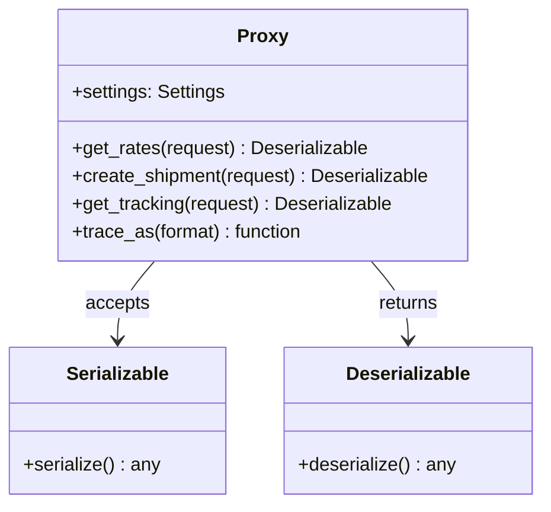
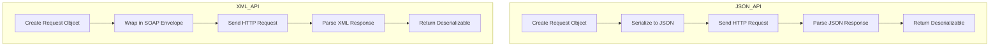
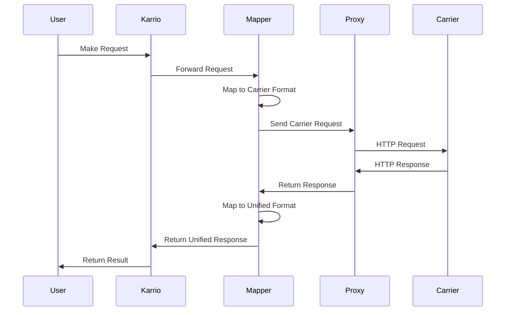

# API Requests

The `Proxy` class is responsible for handling communication with the carrier's API. It defines methods for each API operation (rating, shipping, tracking, etc.) and handles authentication, request formatting, and response parsing.

## Proxy Class Structure

The `Proxy` class is implemented in the `karrio/mappers/[carrier_name]/proxy.py` file and extends the base `karrio.api.proxy.Proxy` class:

```python
import karrio.lib as lib
import karrio.api.proxy as proxy
import karrio.mappers.[carrier_name].settings as provider_settings
import karrio.providers.[carrier_name].utils as provider_utils


class Proxy(proxy.Proxy):
    """API client for the Freight Express carrier."""

    settings: provider_settings.Settings

    def get_rates(self, request: lib.Serializable) -> lib.Deserializable[dict]:
        """Request shipping rates from the Freight Express API."""
        endpoint = provider_utils.get_endpoint_url(self.settings, "shipping/v1/rates")
        headers = provider_utils.get_auth_header(self.settings)

        response = lib.request(
            url=endpoint,
            data=lib.to_json(request.serialize()),
            headers={
                **headers,
                "Accept": "application/json",
                "Content-Type": "application/json",
            },
            method="POST",
            trace=self.trace_as("json"),
        )

        return lib.Deserializable(response, lib.to_dict)

    def create_shipment(self, request: lib.Serializable) -> lib.Deserializable[dict]:
        """Create a shipment and purchase a label."""
        endpoint = provider_utils.get_endpoint_url(self.settings, "shipping/v1/shipments")
        headers = provider_utils.get_auth_header(self.settings)

        response = lib.request(
            url=endpoint,
            data=lib.to_json(request.serialize()),
            headers={
                **headers,
                "Accept": "application/json",
                "Content-Type": "application/json",
            },
            method="POST",
            trace=self.trace_as("json"),
        )

        return lib.Deserializable(response, lib.to_dict)

    def get_tracking(self, request: lib.Serializable) -> lib.Deserializable[dict]:
        """Track a shipment by tracking number."""
        data = request.serialize()
        tracking_numbers = ",".join(data.get("tracking_ids", []))
        endpoint = provider_utils.get_endpoint_url(
            self.settings, f"tracking/v1/shipments?tracking_numbers={tracking_numbers}"
        )
        headers = provider_utils.get_auth_header(self.settings)

        response = lib.request(
            url=endpoint,
            headers={
                **headers,
                "Accept": "application/json",
            },
            method="GET",
            trace=self.trace_as("json"),
        )

        return lib.Deserializable(response, lib.to_dict)

    # More API methods as needed...
```



## HTTP Requests

The `Proxy` class uses the `lib.request` function to make HTTP requests to the carrier API. This function handles:

- HTTP method (GET, POST, etc.)
- Request headers
- Request body
- Response parsing
- Error handling

For each API operation, you'll typically:

1. Construct the API endpoint URL
2. Set up authentication headers
3. Serialize the request data (for POST/PUT requests)
4. Make the HTTP request
5. Return a `Deserializable` object with the response

### Example: JSON API Request

For JSON-based APIs, requests typically look like this:

```python
def create_shipment(self, request: lib.Serializable) -> lib.Deserializable[dict]:
    """Create a shipment and purchase a label."""
    endpoint = f"{self.settings.server_url}/shipping/v1/shipments"
    headers = {
        "Authorization": f"Bearer {self.settings.api_key}",
        "Accept": "application/json",
        "Content-Type": "application/json",
    }

    response = lib.request(
        url=endpoint,
        data=lib.to_json(request.serialize()),
        headers=headers,
        method="POST",
        trace=self.trace_as("json"),
    )

    return lib.Deserializable(response, lib.to_dict)
```

### Example: XML API Request

For XML/SOAP-based APIs, requests look slightly different:

```python
def create_shipment(self, request: lib.Serializable) -> lib.Deserializable[str]:
    """Create a shipment and purchase a label."""
    endpoint = f"{self.settings.server_url}/soap/shipping"
    headers = {
        "Content-Type": "text/xml; charset=utf-8",
        "SOAPAction": "http://api.carrier.com/shipping/create",
    }

    # For SOAP APIs, we often need to wrap the XML in a SOAP envelope
    xml_request = f"""
    <soapenv:Envelope xmlns:soapenv="http://schemas.xmlsoap.org/soap/envelope/"
                     xmlns:ship="http://api.carrier.com/shipping">
        <soapenv:Header>
            <ship:Authentication>
                <ship:Username>{self.settings.username}</ship:Username>
                <ship:Password>{self.settings.password}</ship:Password>
            </ship:Authentication>
        </soapenv:Header>
        <soapenv:Body>
            {request.serialize()}
        </soapenv:Body>
    </soapenv:Envelope>
    """

    response = lib.request(
        url=endpoint,
        data=xml_request,
        headers=headers,
        method="POST",
        trace=self.trace_as("xml"),
    )

    return lib.Deserializable(response, lib.xml_to_dict)
```



## Tracing and Debugging

Karrio includes a built-in tracing mechanism to help debug API calls. The `trace_as` method on the `Proxy` class sets up tracing for a particular format (JSON, XML, etc.):

```python
trace=self.trace_as("json")  # For JSON APIs
trace=self.trace_as("xml")   # For XML APIs
```

This allows Karrio to record and display API requests and responses for debugging purposes.

## Authentication

Authentication is typically handled by utility functions in the `karrio/providers/[carrier_name]/utils.py` file. These functions generate the appropriate headers based on the carrier's authentication requirements:

```python
def get_auth_header(settings: Settings) -> Dict[str, str]:
    """Generate authentication headers for API requests."""
    if settings.api_key:
        return {"Authorization": f"Bearer {settings.api_key}"}

    # Basic auth
    credentials = f"{settings.username}:{settings.password}"
    encoded = base64.b64encode(credentials.encode()).decode()
    return {"Authorization": f"Basic {encoded}"}
```

## Error Handling

API errors should be handled gracefully by checking the response status code and content. Common error handling patterns include:

```python
response = lib.request(
    url=endpoint,
    data=lib.to_json(request.serialize()),
    headers=headers,
    method="POST",
    trace=self.trace_as("json"),
)

# Check for API errors in the response
if response.get("error"):
    error_message = response.get("error", {}).get("message", "Unknown error")
    # Handle error appropriately
    # This will typically be handled by the error parsing function
```

A separate error parsing module (`karrio/providers/[carrier_name]/error.py`) is often used to standardize error handling:

```python
def parse_error_response(response: dict, settings: Settings) -> List[Message]:
    """Parse error response into standardized Karrio Messages."""
    errors = []

    if "error" in response:
        error = response["error"]
        errors.append(
            Message(
                code=error.get("code", "ERROR"),
                message=error.get("message", "Unknown error"),
                carrier_name=settings.carrier_name,
                carrier_id=settings.carrier_id,
            )
        )

    # ... more error parsing logic

    return errors
```

## API Request Flow

The typical flow of an API request in Karrio is:

1. The user makes a request through Karrio's unified API
2. The request is routed to the appropriate carrier extension
3. The `Mapper` transforms the unified request into a carrier-specific format
4. The `Proxy` makes the API call to the carrier
5. The carrier responds with data
6. The `Mapper` transforms the carrier-specific response back into Karrio's unified format
7. The unified response is returned to the user



## Best Practices

When implementing API requests:

1. **Use Helper Functions**: Extract common logic into utility functions
2. **Handle Errors Gracefully**: Always check for and handle API errors
3. **Log Important Information**: Use tracing to record API requests and responses
4. **Respect Rate Limits**: Implement retry logic with backoff for rate-limited APIs
5. **Timeouts**: Set appropriate timeouts for API calls
6. **Clean Code**: Keep HTTP request logic separate from business logic

## Common API Operations

Most carrier integrations implement some or all of these common operations:

- **Rating**: Get shipping rates for a package
- **Shipping**: Create shipments and purchase labels
- **Tracking**: Track shipments by tracking number
- **Address Validation**: Validate and normalize shipping addresses
- **Pickup**: Schedule, cancel, or update pickups
- **Customs**: Generate customs documentation for international shipments

In the next section, we'll cover how to implement data mapping between Karrio's unified format and carrier-specific formats.


