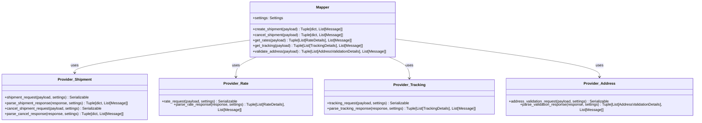
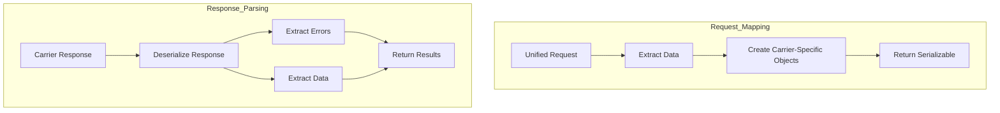
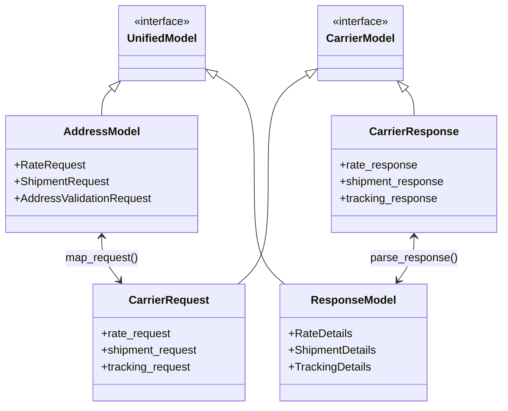

# Data Mapping

The core of a Karrio carrier integration is the data mapping layer, which transforms between Karrio's unified API format and carrier-specific formats. This section covers how to implement mapping functions for different carrier operations.

## Mapper Implementation

The `Mapper` class is implemented in the `karrio/mappers/[carrier_name]/mapper.py` file. It extends the base `karrio.api.mapper.Mapper` class and provides implementations for various operations.

```python
import typing
import karrio.lib as lib
import karrio.api.mapper as mapper
import karrio.core.models as models

import karrio.mappers.[carrier_name].settings as provider_settings
import karrio.providers.[carrier_name].rate as provider_rate
import karrio.providers.[carrier_name].shipment as provider_shipment
import karrio.providers.[carrier_name].tracking as provider_tracking
import karrio.providers.[carrier_name].address as provider_address
import karrio.providers.[carrier_name].utils as provider_utils


class Mapper(mapper.Mapper):
    """Mapper for Freight Express carrier."""

    settings: provider_settings.Settings

    def create_shipment(
        self, payload: models.ShipmentRequest
    ) -> typing.Tuple[dict, typing.List[models.Message]]:
        """Create a shipment with Freight Express."""
        request = provider_shipment.shipment_request(payload, self.settings)
        response = self.proxy.create_shipment(request)
        return provider_shipment.parse_shipment_response(response, self.settings)

    def cancel_shipment(
        self, payload: models.ShipmentCancelRequest
    ) -> typing.Tuple[dict, typing.List[models.Message]]:
        """Cancel a shipment with Freight Express."""
        request = provider_shipment.cancel_shipment_request(payload, self.settings)
        response = self.proxy.cancel_shipment(request)
        return provider_shipment.parse_cancel_response(response, self.settings)

    def get_rates(
        self, payload: models.RateRequest
    ) -> typing.Tuple[typing.List[models.RateDetails], typing.List[models.Message]]:
        """Get shipping rates from Freight Express."""
        request = provider_rate.rate_request(payload, self.settings)
        response = self.proxy.get_rates(request)
        return provider_rate.parse_rate_response(response, self.settings)

    def get_tracking(
        self, payload: models.TrackingRequest
    ) -> typing.Tuple[typing.List[models.TrackingDetails], typing.List[models.Message]]:
        """Track a shipment with Freight Express."""
        request = provider_tracking.tracking_request(payload, self.settings)
        response = self.proxy.get_tracking(request)
        return provider_tracking.parse_tracking_response(response, self.settings)

    def validate_address(
        self, payload: models.AddressValidationRequest
    ) -> typing.Tuple[typing.List[models.AddressValidationDetails], typing.List[models.Message]]:
        """Validate an address with Freight Express."""
        request = provider_address.address_validation_request(payload, self.settings)
        response = self.proxy.validate_address(request)
        return provider_address.parse_validation_response(response, self.settings)
```

The `Mapper` class delegates the actual mapping to provider-specific modules:

- `karrio/providers/[carrier_name]/rate.py` - Rating operations
- `karrio/providers/[carrier_name]/shipment/` - Shipping operations
- `karrio/providers/[carrier_name]/tracking.py` - Tracking operations
- `karrio/providers/[carrier_name]/address.py` - Address validation operations



## Provider Mapping Functions

For each operation, there are typically two mapping functions:

1. **Request Mapping**: Transforms Karrio's unified request into carrier-specific format
2. **Response Parsing**: Transforms carrier-specific response into Karrio's unified format

### Request Mapping Example: Rating

Here's an example of mapping a rate request:

```python
import typing
import karrio.lib as lib
import karrio.core.models as models
import karrio.core.units as units
import karrio.schemas.[carrier_name].rate_request as carrier
import karrio.providers.[carrier_name].units as provider_units
import karrio.providers.[carrier_name].utils as provider_utils


def rate_request(
    payload: models.RateRequest, settings: provider_utils.Settings
) -> lib.Serializable:
    """Create a rate request for Freight Express."""
    # Extract data from the unified payload
    shipper = lib.to_address(payload.shipper)
    recipient = lib.to_address(payload.recipient)
    packages = lib.to_packages(payload.parcels)
    options = lib.to_shipping_options(payload.options)
    services = lib.to_services(payload.services, provider_units.Service)

    # Create the carrier-specific request
    request = carrier.RateRequest(
        shipFrom=carrier.Address(
            name=shipper.person_name,
            addressLine1=shipper.street,
            addressLine2=shipper.address_line2,
            city=shipper.city,
            stateOrRegion=shipper.state_code,
            postalCode=shipper.postal_code,
            countryCode=shipper.country_code,
            phoneNumber=shipper.phone_number,
            email=shipper.email,
        ),
        shipTo=carrier.Address(
            name=recipient.person_name,
            addressLine1=recipient.street,
            addressLine2=recipient.address_line2,
            city=recipient.city,
            stateOrRegion=recipient.state_code,
            postalCode=recipient.postal_code,
            countryCode=recipient.country_code,
            phoneNumber=recipient.phone_number,
            email=recipient.email,
        ),
        serviceTypes=list(services),
        shipDate=lib.fdatetime(
            options.shipment_date.state, "%Y-%m-%d", "%Y-%m-%dT%H:%M:%S.%fZ"
        ),
        containerSpecifications=[
            carrier.ContainerSpecification(
                dimensions=carrier.Dimensions(
                    height=package.height.IN,
                    length=package.length.IN,
                    width=package.width.IN,
                    unit="IN",
                ),
                weight=carrier.Weight(
                    value=package.weight.LB,
                    unit="LB",
                ),
            )
            for package in packages
        ],
    )

    # Return the request as a serializable object
    return lib.Serializable(request, lib.to_dict)
```

### Response Parsing Example: Rating

And here's an example of parsing a rate response:

```python
import typing
import karrio.lib as lib
import karrio.core.models as models
import karrio.core.errors as errors
import karrio.schemas.[carrier_name].rate_response as carrier
import karrio.providers.[carrier_name].error as provider_error
import karrio.providers.[carrier_name].units as provider_units
import karrio.providers.[carrier_name].utils as provider_utils


def parse_rate_response(
    _response: lib.Deserializable[dict],
    settings: provider_utils.Settings,
) -> typing.Tuple[typing.List[models.RateDetails], typing.List[models.Message]]:
    """Parse a rate response from Freight Express."""
    # Deserialize the raw response
    response = _response.deserialize()

    # Check for errors
    errors: typing.List[models.Message] = sum(
        [
            provider_error.parse_error_response(data, settings)
            for data in response.get("errors", [])
        ],
        [],
    )

    # Extract rate details
    rates = [
        _extract_rate_details(data, settings)
        for data in response.get("serviceRates", [])
    ]

    return rates, errors


def _extract_rate_details(
    data: dict,
    settings: provider_utils.Settings,
) -> models.RateDetails:
    """Extract rate details from a service rate."""
    # Convert raw data to carrier-specific object
    rate = lib.to_object(carrier.ServiceRate, data)

    # Calculate transit days
    transit = (
        lib.to_date(rate.promise.deliveryWindow.start, "%Y-%m-%dT%H:%M:%S.%fZ").date()
        - lib.to_date(rate.promise.receiveWindow.end, "%Y-%m-%dT%H:%M:%S.%fZ").date()
    ).days

    # Create a unified rate details object
    return models.RateDetails(
        carrier_id=settings.carrier_id,
        carrier_name=settings.carrier_name,
        service=provider_units.Service.map(rate.serviceType).name_or_key,
        total_charge=lib.to_decimal(rate.totalCharge.value),
        currency=rate.totalCharge.unit,
        transit_days=transit,
        extra_charges=[
            models.ChargeDetails(
                name=charge.name,
                amount=lib.to_decimal(charge.value),
                currency=charge.unit,
            )
            for charge in rate.charges
        ],
        meta=dict(
            service_name=rate.serviceType,
            service_code=rate.serviceCode,
        ),
    )
```



## Common Mapping Patterns

### Address Mapping

Converting between Karrio's address format and carrier-specific formats:

```python
def address_request(
    payload: models.AddressValidationRequest, settings: provider_utils.Settings
) -> lib.Serializable:
    """Create an address validation request."""
    address = lib.to_address(payload.address)

    request = carrier.AddressValidationRequest(
        address=carrier.Address(
            addressLine1=address.street,
            addressLine2=address.address_line2,
            city=address.city,
            stateOrRegion=address.state_code,
            postalCode=address.postal_code,
            countryCode=address.country_code,
        ),
    )

    return lib.Serializable(request, lib.to_dict)
```

### Shipment Mapping

Creating a shipment request, which is often more complex:

```python
def shipment_request(
    payload: models.ShipmentRequest, settings: provider_utils.Settings
) -> lib.Serializable:
    """Create a shipment request."""
    shipper = lib.to_address(payload.shipper)
    recipient = lib.to_address(payload.recipient)
    packages = lib.to_packages(payload.parcels)
    options = lib.to_shipping_options(payload.options)
    services = lib.to_services(payload.service, provider_units.Service)
    service = next(iter(services), None)
    payment = payload.payment

    # Handle customs for international shipments
    customs = None
    if payload.customs:
        customs = carrier.Customs(
            contents=payload.customs.content_type,
            nonDelivery=payload.customs.non_delivery,
            items=[
                carrier.CustomsItem(
                    description=item.description,
                    originCountry=item.origin_country,
                    quantity=item.quantity,
                    weight=item.weight.value,
                    value=item.value_amount,
                    hsCode=item.hs_code,
                )
                for item in payload.customs.commodities
            ],
        )

    # Create the shipment request
    request = carrier.ShipmentRequest(
        shipFrom=carrier.Address(
            name=shipper.person_name,
            addressLine1=shipper.street,
            addressLine2=shipper.address_line2,
            city=shipper.city,
            stateOrRegion=shipper.state_code,
            postalCode=shipper.postal_code,
            countryCode=shipper.country_code,
            phoneNumber=shipper.phone_number,
            email=shipper.email,
        ),
        shipTo=carrier.Address(
            name=recipient.person_name,
            addressLine1=recipient.street,
            addressLine2=recipient.address_line2,
            city=recipient.city,
            stateOrRegion=recipient.state_code,
            postalCode=recipient.postal_code,
            countryCode=recipient.country_code,
            phoneNumber=recipient.phone_number,
            email=recipient.email,
        ),
        serviceType=service,
        shipDate=lib.fdatetime(
            options.shipment_date.state, "%Y-%m-%d", "%Y-%m-%dT%H:%M:%S.%fZ"
        ),
        packageCount=len(packages),
        returnService=options.return_service or False,
        signatureRequired=options.signature_confirmation or False,
        packages=[
            carrier.Package(
                dimensions=carrier.Dimensions(
                    height=package.height.IN,
                    length=package.length.IN,
                    width=package.width.IN,
                    unit="IN",
                ),
                weight=carrier.Weight(
                    value=package.weight.LB,
                    unit="LB",
                ),
                reference=package.reference or "",
            )
            for package in packages
        ],
        billing=carrier.Billing(
            accountNumber=settings.account_number,
            paymentType=payment.paid_by,
        ),
        customs=customs,
        reference=payload.reference,
        labelFormat=options.label_format or "PDF",
    )

    return lib.Serializable(request, lib.to_dict)
```

### Tracking Mapping

Creating a tracking request, which is often simpler:

```python
def tracking_request(
    payload: models.TrackingRequest, settings: provider_utils.Settings
) -> lib.Serializable:
    """Create a tracking request."""
    # Tracking is often just a list of tracking numbers
    request = {
        "tracking_ids": payload.tracking_numbers,
    }

    return lib.Serializable(request, dict)
```

## Unified Data Model

Karrio's unified data model is defined in the `karrio.core.models` module. It provides standard classes for various shipping operations:

- `AddressValidationRequest` / `AddressValidationDetails`
- `RateRequest` / `RateDetails`
- `ShipmentRequest` / `ShipmentDetails`
- `TrackingRequest` / `TrackingDetails`
- `PickupRequest` / `PickupDetails`

Your mapping functions should transform between these unified models and carrier-specific formats.



## Helper Functions

Karrio provides several helper functions to simplify common mapping tasks:

```python
# Convert a payload address to a standardized Address object
address = lib.to_address(payload.address)

# Convert a list of parcels to standardized Package objects
packages = lib.to_packages(payload.parcels)

# Convert shipping options to a standardized ShippingOptions object
options = lib.to_shipping_options(payload.options)

# Convert service string(s) to carrier-specific service codes
services = lib.to_services(payload.services, provider_units.Service)

# Format a date or datetime string
formatted_date = lib.fdatetime(
    date_string, "%Y-%m-%d", "%Y-%m-%dT%H:%M:%S.%fZ"
)

# Convert a string to a decimal value
amount = lib.to_decimal("123.45")

# Convert a string to a date object
date = lib.to_date("2023-09-15", "%Y-%m-%d")

# Convert a dict to a specific object type
obj = lib.to_object(carrier.Address, address_dict)
```

## Best Practices

When implementing data mapping:

1. **Stay Pure**: Keep mapping functions pure (no side effects)
2. **Handle Missing Data**: Provide defaults for optional fields
3. **Validate Data**: Check for required fields and valid formats
4. **Type Safety**: Use type hints to ensure type safety
5. **Error Handling**: Gracefully handle mapping errors
6. **Documentation**: Document complex mapping logic
7. **Unit Testing**: Write tests for mapping functions

In the next section, we'll cover how to test your carrier integration.


