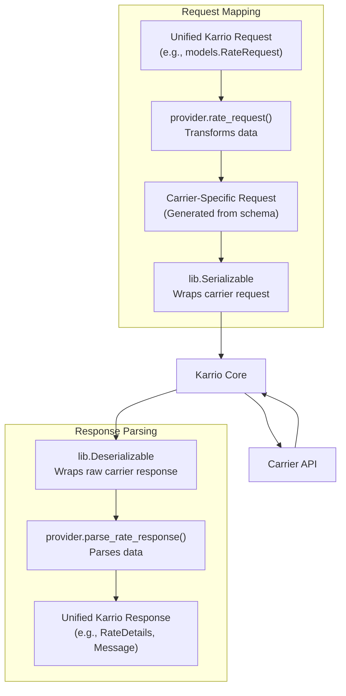
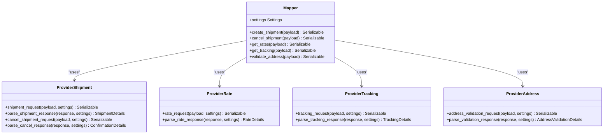

# Data Mapping

The core of a Karrio carrier integration is the data mapping layer. This layer is responsible for the crucial task of transforming data between Karrio's unified models and the specific formats required by the carrier's API.

This transformation logic lives in two places:

1.  The **`Mapper` class** in `karrio/mappers/[carrier_name]/mapper.py`.
2.  The **provider functions** in `karrio/providers/[carrier_name]/`.

## Mapper Implementation

The `Mapper` class connects Karrio's core logic to your provider-specific implementation. It inherits from `karrio.api.mapper.Mapper` and its methods are straightforward delegations to the functions in your `provider` module.

A `Mapper` has distinct methods for creating requests and parsing responses for each capability (rating, shipping, tracking, etc.).

```python
# karrio/mappers/[carrier_name]/mapper.py
import typing
import karrio.lib as lib
import karrio.api.mapper as mapper
import karrio.core.models as models
import karrio.providers.[carrier_name] as provider
import karrio.mappers.[carrier_name].settings as provider_settings


class Mapper(mapper.Mapper):
    settings: provider_settings.Settings

    # --------------------------------------------------------------------
    # REQUEST CREATION METHODS
    # --------------------------------------------------------------------

    def create_rate_request(
        self, payload: models.RateRequest
    ) -> lib.Serializable:
        return provider.rate_request(payload, self.settings)

    def create_shipment_request(
        self, payload: models.ShipmentRequest
    ) -> lib.Serializable:
        return provider.shipment_request(payload, self.settings)

    def create_tracking_request(
        self, payload: models.TrackingRequest
    ) -> lib.Serializable:
        return provider.tracking_request(payload, self.settings)

    # ... other request mappers for cancel, pickup, etc.

    # --------------------------------------------------------------------
    # RESPONSE PARSING METHODS
    # --------------------------------------------------------------------

    def parse_rate_response(
        self, response: lib.Deserializable[str]
    ) -> typing.Tuple[typing.List[models.RateDetails], typing.List[models.Message]]:
        return provider.parse_rate_response(response, self.settings)

    def parse_shipment_response(
        self, response: lib.Deserializable[str]
    ) -> typing.Tuple[models.ShipmentDetails, typing.List[models.Message]]:
        return provider.parse_shipment_response(response, self.settings)

    def parse_tracking_response(
        self, response: lib.Deserializable[str]
    ) -> typing.Tuple[typing.List[models.TrackingDetails], typing.List[models.Message]]:
        return provider.parse_tracking_response(response, self.settings)

    # ... other response parsers for cancel, pickup, etc.
```

## Provider Mapping Functions

The actual mapping logic resides in functions within your `provider` modules (e.g., `rate.py`, `shipment/create.py`). For each operation, you will implement two functions: one to create the request and one to parse the response.



### Request Mapping Example: Rating

This function takes a unified `models.RateRequest` and transforms it into a `lib.Serializable` object containing the carrier-specific request payload.

```python
# karrio/providers/[carrier_name]/rate.py
import typing
import karrio.lib as lib
import karrio.core.models as models
import karrio.providers.[carrier_name].units as provider_units
import karrio.providers.[carrier_name].utils as provider_utils
# Import your generated carrier schema
import karrio.schemas.[carrier_name].rate_request as carrier

def rate_request(
    payload: models.RateRequest,
    settings: provider_utils.Settings,
) -> lib.Serializable:
    """
    Transforms a Karrio RateRequest into a carrier-specific rate request.
    """
    # Use Karrio helpers to parse the unified payload
    shipper = lib.to_address(payload.shipper)
    recipient = lib.to_address(payload.recipient)
    packages = lib.to_packages(payload.parcels)
    services = lib.to_services(payload.services, provider_units.ShippingService)
    options = lib.to_shipping_options(
        payload.options,
        package_options=packages.options,
        initializer=provider_units.shipping_options_initializer,
    )

    # Use the generated schema to construct the carrier request
    request = carrier.RateRequestType(
        shipper=carrier.AddressType(
            address_line1=shipper.address_line1,
            city=shipper.city,
            postal_code=shipper.postal_code,
            country_code=shipper.country_code,
            # ... other address fields
        ),
        recipient=carrier.AddressType(
            address_line1=recipient.address_line1,
            city=recipient.city,
            postal_code=recipient.postal_code,
            country_code=recipient.country_code,
            # ... other address fields
        ),
        packages=[
            carrier.PackageType(
                weight=package.weight.KG,
                # ... other package fields
            )
            for package in packages
        ],
        services=[s.value for s in services],
        # ... other request fields
    )

    # Return a Serializable object containing the request and a serializer function
    return lib.Serializable(request, lib.to_dict) # or lib.to_xml, etc.
```

### Response Parsing Example: Rating

This function takes a `lib.Deserializable` object (containing the raw carrier response) and parses it into a tuple of `RateDetails` and `Message` objects.

```python
# karrio/providers/[carrier_name]/rate.py
import typing
import karrio.lib as lib
import karrio.core.models as models
import karrio.providers.[carrier_name].error as provider_error
import karrio.providers.[carrier_name].utils as provider_utils
# Import your generated carrier schema
import karrio.schemas.[carrier_name].rate_response as carrier

def parse_rate_response(
    _response: lib.Deserializable[str],
    settings: provider_utils.Settings,
) -> typing.Tuple[typing.List[models.RateDetails], typing.List[models.Message]]:
    """
    Parses a carrier rate response into a list of Karrio RateDetails.
    """
    response = _response.deserialize()

    # Use the provider's error parser to check for and extract any errors
    messages = provider_error.parse_error_response(response, settings)
    # Extract the rate-related data from the response
    rates = response.get("rates", [])

    # Map the carrier rates to Karrio's unified RateDetails model
    rate_details = [_extract_details(rate, settings) for rate in rates]

    return rate_details, messages


def _extract_details(
    detail: dict,
    settings: provider_utils.Settings,
) -> models.RateDetails:
    """Helper function to map a single carrier rate to a RateDetails object."""
    rate = lib.to_object(carrier.RateType, detail)

    return models.RateDetails(
        carrier_name=settings.carrier_name,
        carrier_id=settings.carrier_id,
        service=rate.service_name,
        total_charge=lib.to_money(rate.total_charge),
        currency=rate.currency,
        transit_days=rate.transit_days,
        # ... other details
    )
```

### Tracking Request Mapping

Tracking requests are often simpler. Many carriers just need a list of tracking numbers. The `tracking_request` function should return a `Serializable` object containing this list.

```python
# karrio/providers/[carrier_name]/tracking.py
def tracking_request(
    payload: models.TrackingRequest,
    settings: provider_utils.Settings,
) -> lib.Serializable:
    """
    Create a tracking request object.
    """
    # Simply serialize the list of tracking numbers
    return lib.Serializable(payload.tracking_numbers)
```

## Helper Functions

Karrio provides several helper functions in `karrio.lib` to simplify common mapping tasks:

- `lib.to_address`: Converts a payload address to a standardized `Address` object.
- `lib.to_packages`: Converts a list of parcels to standardized `Package` objects.
- `lib.to_shipping_options`: Converts shipping options to a standardized `ShippingOptions` object.
- `lib.to_services`: Converts service string(s) to a list of carrier-specific service codes/enums.
- `lib.fdatetime`: Formats a date or datetime string into another format.
- `lib.to_money`: Converts a value to a `Decimal` money type.
- `lib.to_object`: Converts a dictionary into a specific `jstruct` data class object.

## Best Practices

- **Stay Pure**: Mapping functions should be pure and free of side effects (like making API calls).
- **Use Helpers**: Leverage the `karrio.lib` helper functions to standardize data conversion.
- **Handle Missing Data**: Provide sensible defaults for optional fields.
- **Use Enums**: Define carrier-specific units, services, and options as enums in `units.py` for type safety and clarity.
- **Unit Test**: Write unit tests for your mapping functions to ensure they handle various inputs correctly.



## Unified Data Model

Karrio's unified data model is defined in the `karrio.core.models` module. It provides standard classes for various shipping operations:

- `AddressValidationRequest` / `AddressValidationDetails`
- `RateRequest` / `RateDetails`
- `ShipmentRequest` / `ShipmentDetails`
- `TrackingRequest` / `TrackingDetails`
- `PickupRequest` / `PickupDetails`

Your mapping functions should transform between these unified models and carrier-specific formats.


## Helper Functions

Karrio provides several helper functions to simplify common mapping tasks:

```python
# Convert a payload address to a standardized Address object
address = lib.to_address(payload.address)

# Convert a list of parcels to standardized Package objects
packages = lib.to_packages(payload.parcels)

# Convert shipping options to a standardized ShippingOptions object
options = lib.to_shipping_options(payload.options)

# Convert service string(s) to carrier-specific service codes
services = lib.to_services(payload.services, provider_units.Service)

# Format a date or datetime string
formatted_date = lib.fdatetime(
    date_string, "%Y-%m-%d", "%Y-%m-%dT%H:%M:%S.%fZ"
)

# Convert a string to a decimal value
amount = lib.to_decimal("123.45")

# Convert a string to a date object
date = lib.to_date("2023-09-15", "%Y-%m-%d")

# Convert a dict to a specific object type
obj = lib.to_object(carrier.Address, address_dict)
```

## Best Practices

When implementing data mapping:

1. **Stay Pure**: Keep mapping functions pure (no side effects)
2. **Handle Missing Data**: Provide defaults for optional fields
3. **Validate Data**: Check for required fields and valid formats
4. **Type Safety**: Use type hints to ensure type safety
5. **Error Handling**: Gracefully handle mapping errors
6. **Documentation**: Document complex mapping logic
7. **Unit Testing**: Write tests for mapping functions

In the next section, we'll cover how to test your carrier integration.
