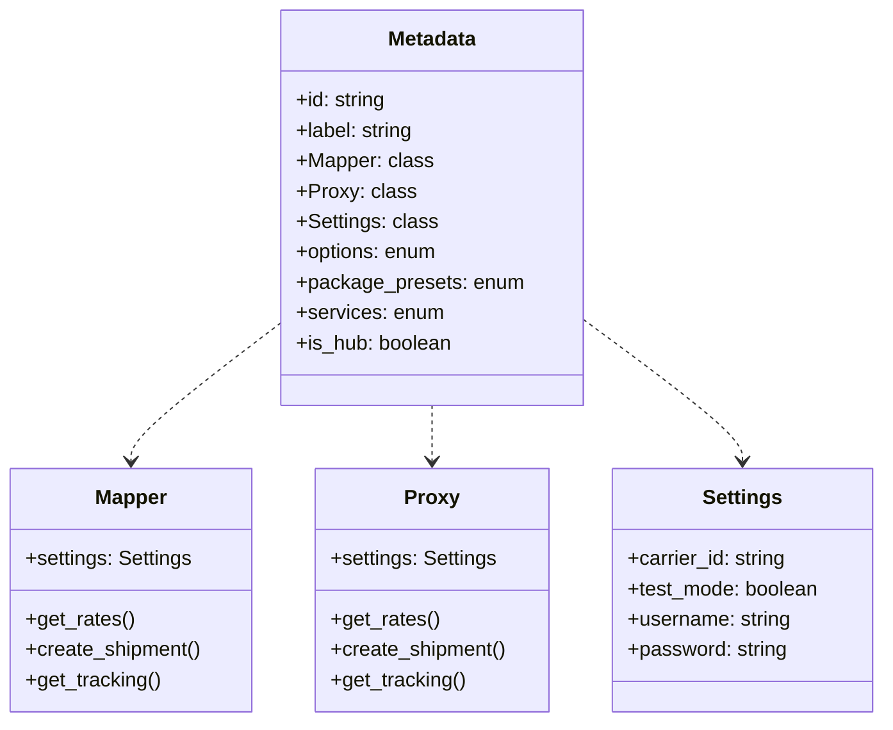
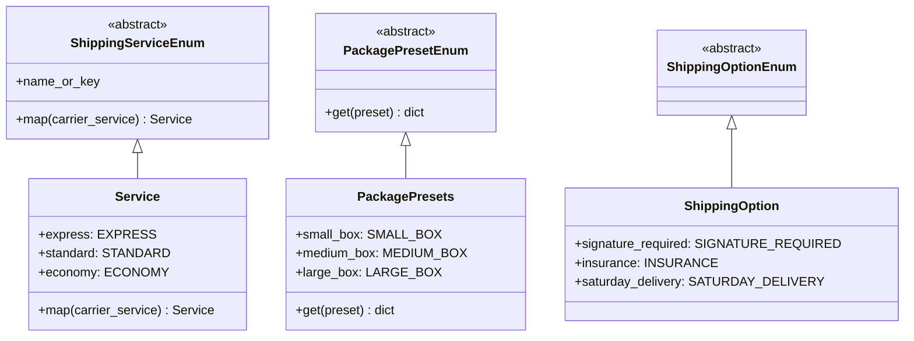
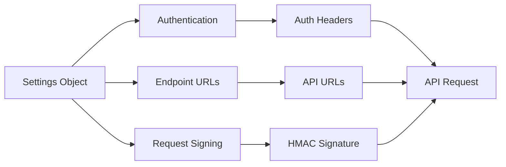

# Metadata & Configuration

Every Karrio carrier extension needs proper metadata and configuration settings to function correctly. This section covers how to define carrier metadata, connection settings, and data units.

## Plugin Metadata

The core of your carrier extension is the `METADATA` object defined in the `karrio/mappers/[carrier_name]/__init__.py` file. This metadata identifies your extension to Karrio and specifies the integration classes required.

```python
from karrio.core.metadata import Metadata

from karrio.mappers.[carrier_name].mapper import Mapper
from karrio.mappers.[carrier_name].proxy import Proxy
from karrio.mappers.[carrier_name].settings import Settings
import karrio.providers.[carrier_name].units as units


METADATA = Metadata(
    id="freight_express",  # Unique carrier identifier
    label="Freight Express",  # Human-readable carrier name

    # Integration classes
    Mapper=Mapper,  # Maps between Karrio and carrier formats
    Proxy=Proxy,    # Handles API communication
    Settings=Settings,  # Defines connection parameters

    # Data units (optional)
    options=units.ShippingOption,  # Enum of shipping options
    package_presets=units.PackagePresets,  # Enum of package templates
    services=units.ShippingService,  # Enum of shipping services

    is_hub=False  # Set to True for hub-like carriers (e.g., EasyPost, Shippo)
)
```

The metadata defines several critical aspects of your carrier integration:

- **id**: A unique identifier for your carrier (e.g., `freight_express`, `dhl_express`)
- **label**: A human-readable name displayed in the Karrio UI
- **Mapper**: The class that implements data mapping functions
- **Proxy**: The class that implements API client functionality
- **Settings**: The class that defines connection parameters
- **Data units**: Optional enums that define carrier-specific options, services, etc.
- **is_hub**: A flag indicating whether this is a hub-like carrier integration



## Connection Settings

The `Settings` class defines the parameters needed to connect to the carrier's API. It's implemented in the `karrio/mappers/[carrier_name]/settings.py` file.

```python
import attr
from karrio.providers.[carrier_name] import Settings as BaseSettings

@attr.s(auto_attribs=True)
class Settings(BaseSettings):
    """Freight Express connection settings."""

    # API credentials and identifiers
    username: str  # Required field (no default)
    password: str  # Required field (no default)
    account_number: str = None  # Optional field with default

    # Common settings (typically included in all carriers)
    id: str = None  # Internal connection ID
    test_mode: bool = False  # Whether to use test/sandbox mode
    carrier_id: str = "freight_express"  # Should match the METADATA id
    account_country_code: str = "US"  # Country of the carrier account
    metadata: dict = {}  # Additional metadata
    config: dict = {}  # Additional configuration options
```

The settings class typically includes:

1. **API Authentication Parameters**: Credentials required for the carrier's API (username, password, API keys, etc.)
2. **Carrier-Specific Identifiers**: Account numbers, contract IDs, or other identifiers
3. **Common Settings**: Standard settings used by Karrio (test mode, carrier ID, etc.)
4. **Optional Configuration**: Additional settings specific to the carrier

## Data Units

Carrier-specific enumerations can be defined in the `karrio/providers/[carrier_name]/units.py` file. These enums define shipping services, options, and package presets supported by the carrier.

```python
import karrio.lib as lib


class Service(lib.Enum):
    """Freight Express shipping services."""

    express = "EXPRESS"  # Freight Express Fast Shipping
    standard = "STANDARD"  # Freight Express Standard Shipping
    economy = "ECONOMY"  # Freight Express Economy Shipping


class PackagePresets(lib.Enum):
    """Freight Express package presets."""

    small_box = "SMALL_BOX"
    medium_box = "MEDIUM_BOX"
    large_box = "LARGE_BOX"


class ShippingOption(lib.Enum):
    """Freight Express shipping options."""

    signature_required = lib.OptionEnum("SIGNATURE_REQUIRED", bool)
    insurance = lib.OptionEnum("INSURANCE", float)
    saturday_delivery = lib.OptionEnum("SATURDAY_DELIVERY", bool)
```

These enums serve several purposes:

1. **Service Mapping**: Define carrier-specific service codes and map them to standardized Karrio services
2. **Package Presets**: Define standard package sizes with dimensions and weights
3. **Shipping Options**: Define additional service options that can be requested



## Authentication and Utils

Utility functions for API authentication and other common operations can be defined in the `karrio/providers/[carrier_name]/utils.py` file.

These utility functions typically include:

1. **Authentication Helpers**: Functions to generate auth headers, sign requests, etc.
2. **URL Construction**: Functions to build API endpoint URLs
3. **Error Handling**: Functions to extract and process error messages
4. **Data Transformation**: Helper functions for data formatting



## Configuration Schema (Frontend)

For your carrier to appear in the Karrio dashboard, you'll need to define a configuration schema. This is done in the frontend code, but is mentioned here for completeness.

After completing your extension and generating the API specs, the carrier will be added to the available carriers in the UI with a form that reflects the required and optional settings.

## Best Practices

When defining metadata and settings:

1. **Mandatory vs. Optional**: Clearly distinguish between required and optional parameters
2. **Descriptive Names**: Use clear, descriptive names for services, options, and settings
3. **Default Values**: Provide sensible defaults for optional parameters
4. **Documentation**: Add docstrings explaining each class and parameter
5. **Type Hints**: Use proper type hints for all parameters
6. **Testing**: Create tests that verify correct settings parsing and validation

In the next section, we'll cover how to implement API requests using the proxy class.


