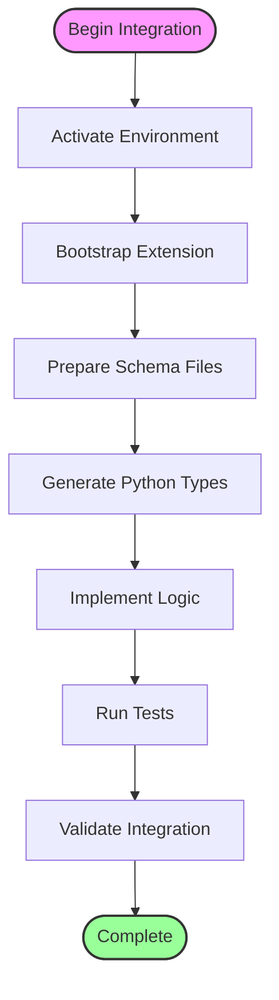
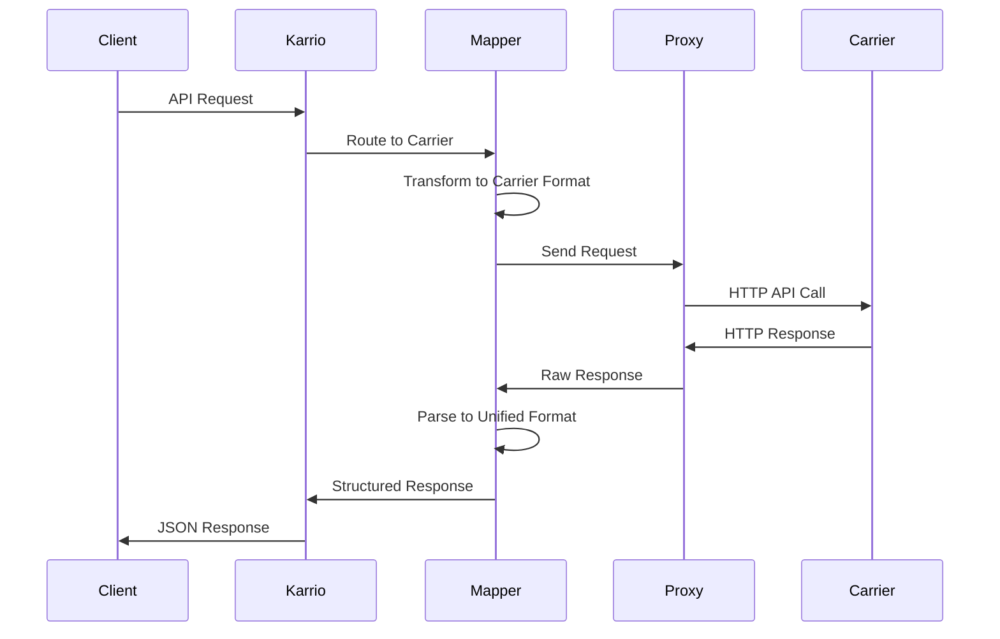

# Carrier Integration

Karrio is designed to be easily extensible with new carrier integrations. This guide will walk you through the process of creating a custom carrier integration using Karrio's built-in CLI tools and following established patterns.

## Overview

Integrating a new carrier into Karrio involves several key steps:

1. **Environment Setup**: Activate the Karrio development environment
2. **Bootstrapping**: Use the CLI to generate the extension structure
3. **Schema Preparation**: Create API schema files from carrier documentation
4. **Schema Generation**: Generate Python types from carrier API schemas
5. **Implementation**: Implement the mapping and API communication logic
6. **Testing**: Validate the integration works correctly



## Prerequisites

Before you begin, ensure you have:

- A Karrio development environment set up
- Basic Python programming knowledge
- Access to the carrier's API documentation
- Understanding of the carrier's authentication and request/response format

## Extension Structure

Karrio supports two integration patterns:

### Direct Carrier Pattern (Standard)
Located in `modules/connectors/[carrier_name]/` for carriers like UPS, FedEx, DHL with direct APIs.

### Hub Carrier Pattern (Aggregators)
Located in `community/plugins/[carrier_name]/` for multi-carrier services like Easyship, ShipEngine.

**Standard Extension Structure:**
```text
modules/connectors/[carrier_name]/
├── pyproject.toml           # Package configuration
├── setup.py                 # Legacy setup file
├── README.md               # Documentation
├── generate                 # Schema generation script
├── schemas/                 # Raw API schema files
│   ├── error_response.json
│   ├── rate_request.json
│   ├── rate_response.json
│   └── ...
├── karrio/
│   ├── mappers/            # Integration layer
│   │   └── [carrier_name]/
│   │       ├── __init__.py   # Legacy metadata
│   │       ├── mapper.py     # Main integration class
│   │       ├── proxy.py      # API client
│   │       └── settings.py   # Connection settings
│   ├── providers/          # Implementation logic
│   │   └── [carrier_name]/
│   │       ├── __init__.py
│   │       ├── rate.py       # Rating implementation
│   │       ├── tracking.py   # Tracking implementation
│   │       ├── shipment.py   # Shipping implementation
│   │       ├── units.py      # Enums and constants
│   │       ├── utils.py      # Utility functions
│   │       └── error.py      # Error handling
│   ├── plugins/            # New plugin structure
│   │   └── [carrier_name]/
│   │       └── __init__.py   # Plugin metadata
│   └── schemas/            # Generated Python types
│       └── [carrier_name]/
│           ├── __init__.py
│           ├── rate_request.py
│           └── ...
└── tests/                  # Test suite
    └── [carrier_name]/
        ├── __init__.py
        ├── fixture.py
        ├── test_rate.py
        └── ...
```

## Step 1: Environment Setup

**CRITICAL**: Always start by activating the Karrio development environment:

```bash
# From the project root directory
source ./bin/activate-env
```

This makes the Karrio CLI (`kcli`) and development tools available.

## Step 2: Bootstrap the Extension

Use the Karrio CLI to generate the complete extension structure:

```bash
# Interactive mode - CLI will prompt for details
./bin/cli sdk add-extension

# Or with parameters
./bin/cli sdk add-extension \
  --path modules/connectors \
  --carrier-slug dhl_express \
  --display-name "DHL Express" \
  --features "rating,shipping,tracking" \
  --is-xml-api false \
  --confirm
```

**Available Parameters:**
- `--path`: `modules/connectors` (direct carriers) or `community/plugins` (hub carriers)
- `--carrier-slug`: Unique identifier (e.g., `dhl_express`, `fedex`)
- `--display-name`: Human-readable name (e.g., "DHL Express")
- `--features`: Comma-separated list: `address`, `document`, `manifest`, `pickup`, `rating`, `shipping`, `tracking`
- `--is-xml-api`: `true` for XML/SOAP APIs, `false` for JSON APIs

## Step 3: Prepare Schema Files

Create JSON (or XML) schema files in the `schemas/` directory based on the carrier's API documentation:

**Required Files:**
- `error_response.json` (always required)
- `rate_request.json` + `rate_response.json` (if rating enabled)
- `shipment_request.json` + `shipment_response.json` (if shipping enabled)
- `tracking_request.json` + `tracking_response.json` (if tracking enabled)

**Note**: Use actual API request/response examples, not JSON Schema definitions.

## Step 4: Generate Python Types

Generate strongly-typed Python classes from your schema files:

```bash
# Generate schemas for a specific carrier
./bin/run-generate-on modules/connectors/[carrier_name]

# For hub carriers
./bin/run-generate-on community/plugins/[carrier_name]
```

This command:
1. Finds and executes the `generate` script in your extension
2. Uses `kcli codegen generate` to convert JSON/XML to Python classes
3. Creates type-safe classes with `attrs` and `jstruct` decorators

## Step 5: Implementation

After generation, implement the integration logic in the created files:

1. **Settings** (`karrio/mappers/[carrier_name]/settings.py`): Define connection credentials
2. **Units** (`karrio/providers/[carrier_name]/units.py`): Define services, options, packaging types
3. **Proxy** (`karrio/mappers/[carrier_name]/proxy.py`): Implement API communication
4. **Provider Logic** (`karrio/providers/[carrier_name]/*.py`): Implement request/response mapping

## Step 6: Testing & Validation

**CRITICAL**: Karrio uses a standardized testing framework. Follow these patterns exactly:

### Testing Framework Rules
- **Use Python's `unittest`** (never pytest)
- **Follow exact naming patterns** for test files and methods
- **Include mandatory debug prints** before all assertions
- **Use `assertListEqual`** with full dict data structures
- **Mock carrier API responses** with actual formats

### Test Structure (NEVER DEVIATE)
Every feature requires exactly 4 test methods:
```python
class Test[CarrierName][Feature](unittest.TestCase):
    def test_create_[feature]_request(self):      # Request transformation
    def test_[action_verb](self):                 # HTTP endpoint (mocked)
    def test_parse_[feature]_response(self):      # Success parsing
    def test_parse_error_response(self):          # Error handling
```

### Run Tests
```bash
# Test specific carrier - MANDATORY BEFORE COMPLETION
python -m unittest discover -v -f modules/connectors/[carrier_name]/tests

# All SDK tests must still pass - MANDATORY
source ./bin/activate-env && ./bin/run-sdk-tests

# Plugin registration check - MANDATORY
./bin/cli plugins list | grep [carrier_name]
```

### Test Data Pattern
Each test file must end with exactly these structures:
- `[Feature]Payload` - Karrio input format
- `[Feature]Request` - Carrier request format
- `[Feature]Response` - Mock carrier response
- `ErrorResponse` - Mock error response
- `Parsed[Feature]Response` - Expected Karrio output `[data, []]`
- `ParsedErrorResponse` - Expected error format `[[], [errors]]`

## Validation Checklist

**🚨 MANDATORY**: All criteria must pass before integration is considered complete:

### Phase 1: Setup & Generation
- [ ] **Environment**: `source ./bin/activate-env` executed successfully
- [ ] **CLI Scaffolding**: Used `./bin/cli sdk add-extension` (never manual creation)
- [ ] **Schema Files**: API samples created in `schemas/` directory
- [ ] **Schema Generation**: `./bin/run-generate-on [path]` executed successfully
- [ ] **Generated Types**: Python classes exist in `karrio/schemas/[carrier_name]/`
- [ ] **Import Test**: `python -c "import karrio.schemas.[carrier_name]"` works

### Phase 2: Implementation
- [ ] **Settings**: Connection credentials configured properly
- [ ] **Units**: Services, options, packaging types defined
- [ ] **Proxy**: HTTP communication implemented with proper authentication
- [ ] **Provider Logic**: All required features implemented using generated types
- [ ] **Mapper Untouched**: `mapper.py` left unchanged from CLI generation
- [ ] **Error Handling**: Carrier errors parsed to Karrio `Message` objects

### Phase 3: Testing & Registration
- [ ] **Test Structure**: All test files follow exact naming patterns
- [ ] **Test Methods**: Each feature has exactly 4 required test methods
- [ ] **Carrier Tests**: `python -m unittest discover -v -f [path]/tests` passes
- [ ] **SDK Tests**: `./bin/run-sdk-tests` still passes (no regressions)
- [ ] **Plugin List**: `./bin/cli plugins list | grep [carrier_name]` shows plugin
- [ ] **Plugin Details**: `./bin/cli plugins show [carrier_name]` works
- [ ] **Installation**: `pip install -e [path]` succeeds without errors

### Phase 4: Final Validation
- [ ] **Schema Regeneration**: `./bin/run-generate-on [path]` still works
- [ ] **Fresh Install**: Clean reinstall works after uninstall
- [ ] **All Features**: Every enabled feature (rating, shipping, etc.) tested
- [ ] **Error Scenarios**: Error responses properly handled and tested

## Architecture Overview



## Next Steps

Follow the detailed guides for specific implementation areas:

- [Schema Generation](/docs/developing/carrier-integration/schema-generation): Generate Python types from API schemas
- [Metadata](/docs/developing/carrier-integration/metadata): Configure connection settings and data units
- [API Requests](/docs/developing/carrier-integration/api-requests): Implement HTTP communication
- [Data Mapping](/docs/developing/carrier-integration/data-mapping): Transform between formats

## ⚠️ Critical Rules & Common Pitfalls

### **ABSOLUTE RULES** (Violation Will Cause Failure)

1. **🚨 NEVER Manual File Creation**:
   - Always use `./bin/cli sdk add-extension` for scaffolding
   - If CLI fails, fix the tool - never create files manually
   - Manually created integrations will not work correctly

2. **🚨 NEVER Edit Generated Files**:
   - Never modify files in `karrio/schemas/[carrier_name]/`
   - Never modify `mapper.py` (CLI generated, delegation only)
   - Only edit source schema files and regenerate

3. **🚨 NEVER Skip Environment Activation**:
   - Must run `source ./bin/activate-env` before ANY command
   - This makes CLI tools available and ensures correct dependencies

4. **🚨 NEVER Deviate from Test Patterns**:
   - Test file names, class names, method names are FIXED
   - Only adapt data content, never structure or naming
   - Use `unittest` framework only (never pytest)

### **Common Mistakes**
- **Editing mapper.py**: This file only contains delegation methods
- **Wrong test assertions**: Use `assertListEqual` with full dict structures
- **Missing debug prints**: Always add print statements before assertions
- **Inconsistent naming**: Follow exact patterns from existing integrations
- **Manual schema editing**: Only modify source files in `schemas/` directory

### **Success Tips**
- Study existing integrations like UPS, FedEx for direct carriers
- Study Easyship, ShipEngine for hub carrier patterns
- Always test both success and error scenarios
- Ensure all 6 success criteria pass before considering complete
