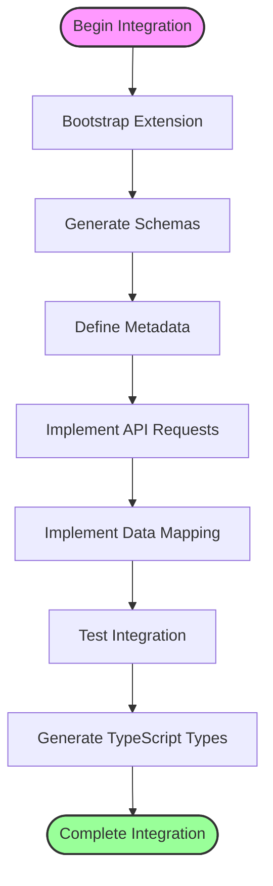
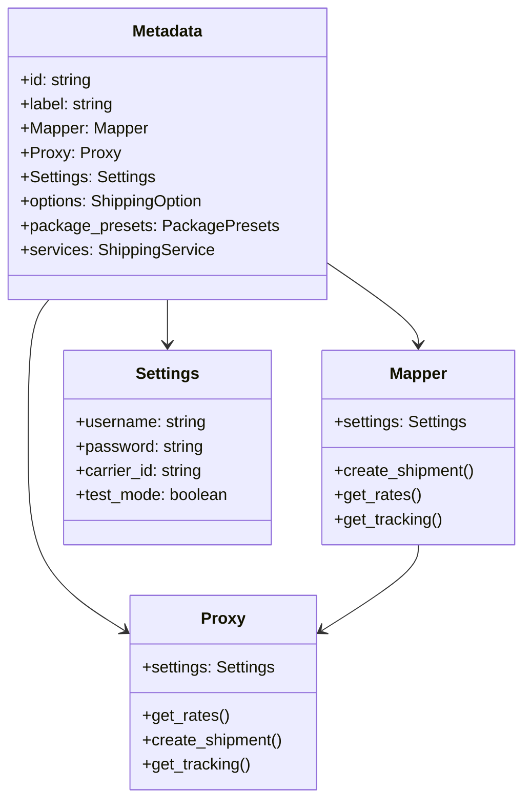
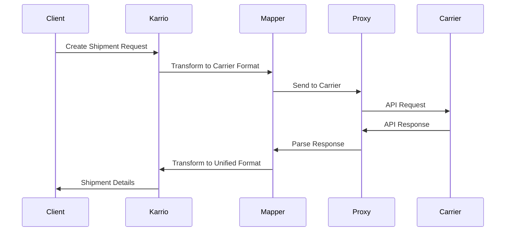

# Carrier Integration

Karrio is designed to be easily extensible with new carrier integrations. This guide will walk you through the process of creating a custom carrier integration, from setting up the initial structure to implementing the specific API calls and data mapping.

## Overview

Integrating a new carrier into Karrio involves several key steps:

1. **Bootstrapping the Extension**: Creating the initial package structure and boilerplate code
2. **Generating Schemas**: Converting carrier API documentation into Python types
3. **Defining Metadata**: Setting up carrier connection settings and data units
4. **Implementing API Requests**: Creating the communication layer with the carrier's API
5. **Mapping Data**: Transforming between Karrio's unified format and carrier-specific formats
6. **Testing and Validation**: Ensuring the integration works correctly



## Prerequisites

Before you begin, make sure you have:

- A development environment set up for Karrio
- Basic knowledge of Python programming
- Access to the carrier's API documentation
- Understanding of the carrier's API request/response format

## Plugin Architecture

Karrio offers a flexible plugin architecture that supports two different structures:

1. **New Structure (Recommended)**: Includes a dedicated `plugins` directory for carrier integrations and other plugin types
2. **Legacy Structure**: Directly defines carriers in the `mappers` directory (supported for backward compatibility)

Plugins can be loaded in several ways:

- From the default `plugins` directory in the current working directory
- From a custom directory specified in the `KARRIO_PLUGINS` environment variable
- Programmatically by adding plugin directories via code

```python
# Load plugins programmatically
import karrio.plugins as plugins
plugins.add_plugin_directory('/path/to/your/plugins')
```

## Extension Structure Overview

A Karrio carrier extension follows a standardized structure. Here's the recommended structure:

```text
modules/connectors/[carrier_name]/
├── setup.py                # Package setup file
├── generate                # Schema generation script
├── schemas/                # API schema files
│   ├── rate_request.json   # (or .xsd for XML APIs)
│   ├── rate_response.json
│   └── ...
└── karrio/
    ├── plugins/            # Plugin registration (new structure)
    │   └── [carrier_name]/
    │       └── __init__.py    # Contains METADATA
    ├── mappers/            # Integration layer
    │   └── [carrier_name]/
    │       ├── __init__.py    # Contains METADATA (legacy structure)
    │       ├── mapper.py      # Data mapping functions
    │       ├── proxy.py       # API client
    │       └── settings.py    # Connection settings
    ├── providers/          # Provider-specific code
    │   └── [carrier_name]/
    │       ├── __init__.py
    │       ├── units.py       # Enums & constants
    │       ├── utils.py       # Utility functions
    │       ├── error.py       # Error handling
    │       ├── rate.py        # Rating implementation
    │       ├── tracking.py    # Tracking implementation
    │       ├── shipment/      # Shipping implementation
    │       │   ├── __init__.py
    │       │   ├── create.py
    │       │   └── cancel.py
    │       └── ...
    └── schemas/            # Generated API data types
        └── [carrier_name]/
            ├── __init__.py
            ├── rate_request.py
            ├── rate_response.py
            └── ...
```

### Plugin Discovery and Loading

Karrio dynamically discovers and loads plugins using a structured approach:

1. **Discovery**: Scans configured directories for plugin structures
2. **Module Import**: Imports modules based on their types (plugins, mappers, validators)
3. **Metadata Collection**: Extracts METADATA from each plugin's `__init__.py` file
4. **Namespace Extension**: Extends the Karrio namespace with plugin modules

This dynamic loading system allows for hot-swapping plugins and modular carrier integrations without modifying the core codebase.



## Bootstrapping a New Extension

Karrio provides a CLI tool to quickly scaffold a new carrier extension. The tool creates all the necessary files and directories with the appropriate structure.

```bash
# Run the extension creation command
kcli add-extension
```

This will start an interactive process:

```text
Carrier slug: freight_express            # Unique carrier identifier (e.g., dhl_express, ups, fedex)
Display name: Freight Express            # Human-readable carrier name (e.g., DHL, UPS, FedEx)
Features [tracking, rating, shipping]:   # The features you want to implement
Version [2024.3]:                        # The extension version
Is XML API? [y/N]:                       # Whether the carrier uses XML for API communication
```

After confirmation, the tool will generate the extension structure in the `modules/connectors/[carrier_name]` directory.

## Extension Anatomy

At the core of Karrio's design is a modular architecture that separates carrier integrations from the unified interface abstraction. Each carrier integration is contained in its own Python package, making it easy to add, update, or remove carriers without affecting the rest of the system.

### Key Components

1. **Metadata**: Defined in the plugin's `__init__.py` file (either in `plugins/[carrier_name]/__init__.py` or `mappers/[carrier_name]/__init__.py`), this identifies your extension to Karrio.

2. **Settings**: The `settings.py` file defines the connection parameters needed for the carrier's API.

3. **Proxy**: The `proxy.py` file implements the API client that communicates with the carrier's services.

4. **Mapper**: The `mapper.py` file contains functions that transform data between Karrio's unified format and carrier-specific formats.

5. **Schemas**: Generated Python data types that represent the carrier's API request and response structures.



## Plugin Deployment

Once you've built your extension, there are several ways to deploy it:

1. **Standalone Plugin Package**: Create a Python package that can be installed with pip
2. **Local Plugin Directory**: Place the extension in a `plugins` directory in your project
3. **Environment Variable**: Use the `KARRIO_PLUGINS` environment variable to specify a custom plugins location

For production use, it's recommended to create a proper Python package that can be installed with pip and versioned appropriately.

## Detailed Guides

To complete your carrier integration, follow these detailed guides:

- [Schema Generation](/docs/developing/carrier-integration/schema-generation): Learn how to generate Python data types from carrier API documentation
- [Metadata](/docs/developing/carrier-integration/metadata): Define carrier connection settings and data units
- [API Requests](/docs/developing/carrier-integration/api-requests): Implement API calls for different carrier operations
- [Data Mapping](/docs/developing/carrier-integration/data-mapping): Transform data between Karrio's unified format and carrier-specific formats

## Final Steps

After implementing your carrier integration, you'll need to:

1. Test your integration thoroughly with unit tests
2. Update the API specs and generate TypeScript types
3. Set up the carrier in the Karrio dashboard

## Example Integrations

For reference, you can explore existing carrier integrations in the Karrio codebase:

- [Canada Post](https://github.com/karrioapi/karrio/tree/main/modules/connectors/canadapost)
- [DHL Express](https://github.com/karrioapi/karrio/tree/main/modules/connectors/dhl_express)
- [FedEx](https://github.com/karrioapi/karrio/tree/main/modules/connectors/fedex)
- [UPS](https://github.com/karrioapi/karrio/tree/main/modules/connectors/ups)

These integrations cover a variety of API types (REST, SOAP) and carrier features (rating, shipping, tracking, etc.).

## Troubleshooting Plugin Loading

If your plugin isn't loading correctly:

1. Check the plugin directory structure matches the expected format
2. Ensure the METADATA object is properly defined in the `__init__.py` file
3. Verify all required dependencies are installed
4. Look for import errors in the application logs
5. Use `get_failed_plugin_modules()` to get information about plugins that failed to load

Karrio provides detailed logging of plugin loading failures to help diagnose issues.


