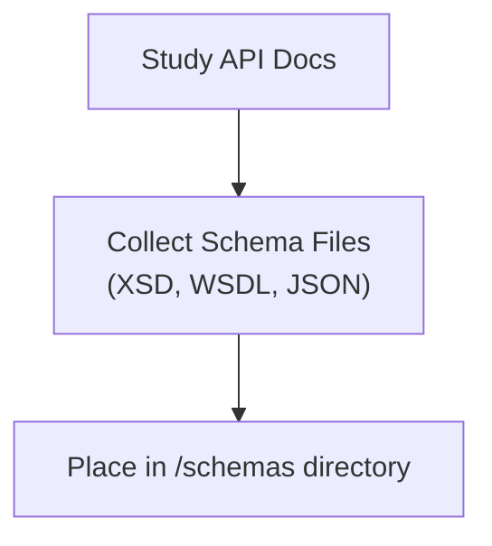
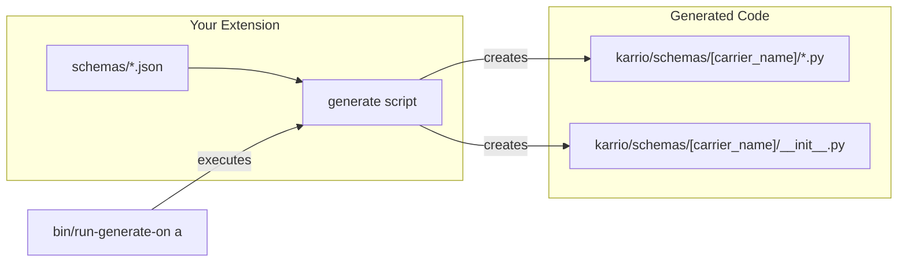
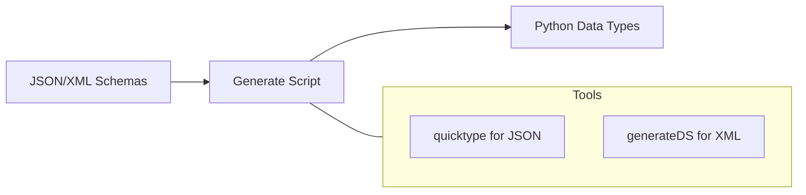
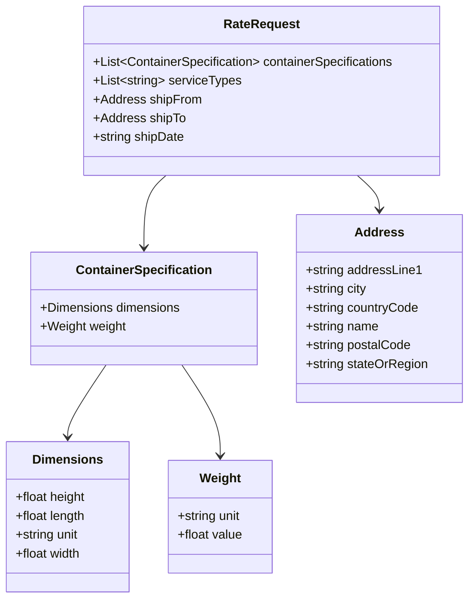

# Schema Generation

Karrio uses strongly-typed data structures to ensure data integrity and improve the developer experience. This process, called schema generation, converts a carrier's API specification (in formats like JSON Schema, XSD, or WSDL) into Python data classes. These classes represent the exact structure of the requests you send to and the responses you receive from the carrier's API.

## 1. Prepare Schema Files

First, you need to obtain the schema files from the carrier. These are typically provided in their developer documentation.

- **For JSON APIs**: You will need sample JSON request/response pairs or, ideally, JSON Schema files (`.json`).
- **For XML/SOAP APIs**: You will need XSD (`.xsd`) or WSDL (`.wsdl`) files.

Place these files inside the `modules/connectors/[carrier_name]/schemas/` directory of your extension. It's best practice to name them logically, for example:

- `rate_request.json` / `rate_response.json`
- `shipping_request.xsd` / `shipping_response.xsd`
- `tracking.wsdl`



## 2. Create the `generate` Script

Next, you'll create a `generate` shell script in the root of your extension directory (`modules/connectors/[carrier_name]/`). This script will call Karrio's code generation tools to process your schema files.

### For JSON APIs

Karrio uses `kcli codegen` which wraps `quicktype` to generate Python data classes from JSON or JSON Schema.

```bash
#!/bin/bash
# modules/connectors/[carrier_name]/generate
set -e
kcli codegen a --src-dir schemas --out-dir karrio/schemas
```

### For XML/SOAP APIs

Karrio uses `generateDS` to transform XSD and WSDL files into Python classes.

```bash
#!/bin/bash
# modules/connectors/[carrier_name]/generate
set -e
kcli codegen x --src-dir schemas --out-dir karrio/schemas
```

The `kcli` command automatically finds all relevant schema files in the source directory, runs the appropriate generator, and places the output Python files in the specified output directory, creating an `__init__.py` file to export all the generated types.

## 3. Run Code Generation

Once the `generate` script is in place, execute it using the following command from the project root:

```bash
# The 'a' stands for 'all', but you can specify the extension name
bin/run-generate-on a
```

This command iterates through all extensions in `modules/connectors/`, finds the `generate` script in each one, and executes it. The generated Python modules will appear in `modules/connectors/[carrier_name]/karrio/schemas/[carrier_name]/`.



## Generated Code Structure

The output will be a set of Python files, each corresponding to a schema file. These files will contain `jstruct` or `attr`-decorated classes that you can import and use in your provider mapping functions.

**Example Generated Python Class (from JSON):**

```python
# karrio/schemas/[carrier_name]/rate_request.py
import attr
import jstruct
import typing

@attr.s(auto_attribs=True)
class AddressType:
    address_line1: str
    city: str
    postal_code: str
    country_code: str
    # ...

@attr.s(auto_attribs=True)
class RateRequestType:
    shipper: AddressType
    recipient: AddressType
    packages: typing.List[typing.Any]
    # ...
```

## Using Generated Types

These generated classes are the building blocks of your data mapping logic.

- In your **request mapping** functions (e.g., `provider.rate_request`), you will instantiate these classes and populate them with data from the unified Karrio models.
- In your **response parsing** functions (e.g., `provider.parse_rate_response`), you will use `lib.to_object` to cast the raw dictionary or XML element response into these generated classes, giving you strongly-typed access to the response data.

## Advanced CLI Tools

The `kcli codegen` command offers several utilities for more granular control over schema generation.

### `kcli codegen x` and `kcli codegen a`

Generate code from XML (`x`) or JSON/JSON Schema (`a`) files. These are the underlying commands used by the `generate` script.

### `kcli codegen t`

Transform Python code generated by `quicktype` (using `dataclasses`) into code that uses `attrs` and `jstruct` decorators.

### `kcli codegen tree`

The `create-tree` command is a powerful utility for developers. It inspects a generated Python class and prints a tree structure representing a complete instantiation of that class. This is extremely useful for understanding the shape of complex, nested API request objects and serves as a boilerplate for writing your mapping functions.

**Usage**

```bash
kcli codegen tree --module=[path.to.module] --class-name=[ClassName] --module-alias=[alias]
```

**Example**

Let's generate a tree for the `ShipmentRequestType` from the UPS integration's generated schemas.

**Command:**

```bash
kcli codegen tree --module=karrio.schemas.ups.shipping_request --class-name=ShipmentRequestType --module-alias=ups
```

**Output:**

```python
ups.ShipmentRequestType(
    Request=ups.RequestType(
        SubVersion=None,
        RequestOption=None,
        TransactionReference=ups.TransactionReferenceType(
            CustomerContext=None,
            ToolVersion=None,
        ),
    ),
    Shipment=ups.ShipmentType(
        Description=None,
        ReturnService=ups.ReturnServiceType(
            Code=None,
            Description=None,
        ),
        DocumentsOnlyIndicator=None,
        Shipper=ups.ShipperType(
            Name=None,
            AttentionName=None,
            CompanyDisplayableName=None,
            TaxIdentificationNumber=None,
            Phone=ups.ShipToPhoneType(
                Number=None,
                Extension=None,
            ),
            ShipperNumber=None,
            FaxNumber=None,
            EMailAddress=None,
            Address=ups.AlternateDeliveryAddressAddressType(
                AddressLine=None,
                City=None,
                StateProvinceCode=None,
                PostalCode=None,
                CountryCode=None,
                ResidentialAddressIndicator=None,
                POBoxIndicator=None,
            ),
        ),
        ShipTo=ups.ShipToType(
            Name=None,
            AttentionName=None,
            # ... and so on for the entire structure
        ),
        # ...
    ),
    LabelSpecification=ups.LabelSpecificationType(
        LabelImageFormat=ups.LabelImageFormatType(
            Code=None,
            Description=None,
        ),
        HTTPUserAgent=None,
        LabelStockSize=ups.LabelStockSizeType(
            Height=None,
            Width=None,
        ),
    ),
)
```

This generated code can be copied directly into your `shipment_request` mapping function as a starting point, saving significant time and preventing errors.



## Generated Code Structure

The generated code will be placed in the `karrio/schemas/[carrier_name]/` directory of your extension. Each schema file will generate a corresponding Python file with data classes that represent the API structures.

Example generated Python class for a JSON API:

```python
import attr
import jstruct
import typing

@attr.s(auto_attribs=True)
class Dimensions:
    height: typing.Optional[float] = None
    length: typing.Optional[float] = None
    unit: typing.Optional[str] = None
    width: typing.Optional[float] = None

@attr.s(auto_attribs=True)
class Weight:
    unit: typing.Optional[str] = None
    value: typing.Optional[float] = None

@attr.s(auto_attribs=True)
class ContainerSpecification:
    dimensions: typing.Optional[Dimensions] = None
    weight: typing.Optional[Weight] = None

# More classes...

@attr.s(auto_attribs=True)
class RateRequest:
    containerSpecifications: typing.Optional[typing.List[ContainerSpecification]] = jstruct.JList[ContainerSpecification]
    serviceTypes: typing.Optional[typing.List[str]] = jstruct.JList[str]
    shipFrom: typing.Optional[Address] = None
    shipTo: typing.Optional[Address] = None
    shipDate: typing.Optional[str] = None
```



## Using Generated Types

Once generated, these Python data types become the foundation of your carrier integration. You'll use them to:

1. Create carrier-specific API requests
2. Parse carrier-specific API responses
3. Map between Karrio's unified format and carrier-specific formats

In the next sections, we'll cover how to use these generated types in your integration.

## Troubleshooting

If you encounter issues during code generation:

- Ensure your schema files are valid (for JSON: valid JSON, for XML: valid XML schema)
- Check that your `generate` script references the correct schema files
- For XML APIs, ensure generateDS is installed with Karrio's development dependencies

## CLI Tools for Schema Generation

Karrio provides several CLI tools to help with schema generation and code transformation. The `kcli` command includes utilities for code generation, particularly for transforming JSON schemas into Python code using jstruct.

### Transform

The `transform` command converts Python code generated by quicktype (using dataclasses) into code that uses attrs and jstruct decorators.

```bash
# Transform from stdin to stdout
cat input.py | kcli codegen transform > output.py

# Transform from file to file
kcli codegen transform input.py output.py

# Transform from file to stdout
kcli codegen transform input.py

# Disable appending 'Type' to class names
kcli codegen transform input.py output.py --no-append-type-suffix
```

### Generate

The `generate` command generates Python code with jstruct from a JSON schema file using quicktype.

```bash
# Generate Python code with jstruct from a JSON schema
kcli codegen generate --src=schema.json --out=output.py

# Specify Python version
kcli codegen generate --src=schema.json --out=output.py --python-version=3.8

# Generate without --just-types
kcli codegen generate --src=schema.json --out=output.py --just-types=false

# Disable appending 'Type' to class names
kcli codegen generate --src=schema.json --out=output.py --no-append-type-suffix
```

### Create Tree

The `create-tree` command generates a Python code tree from a class definition. It's useful for visualizing the structure of complex nested objects and generating initialization code templates.

```bash
# Generate a tree for a class
kcli codegen create-tree --module=karrio.schemas.allied_express.label_request --class-name=LabelRequest

# Generate a tree with a module alias
kcli codegen create-tree --module=karrio.schemas.allied_express.label_request --class-name=LabelRequest --module-alias=allied
```
