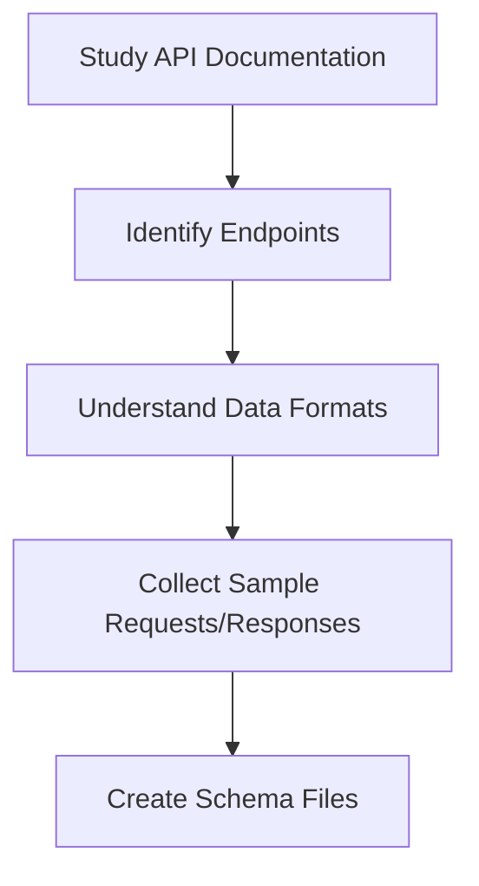
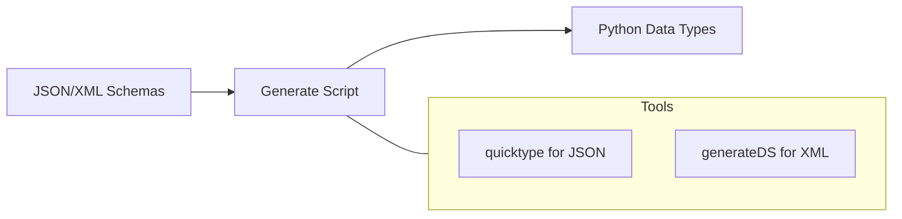
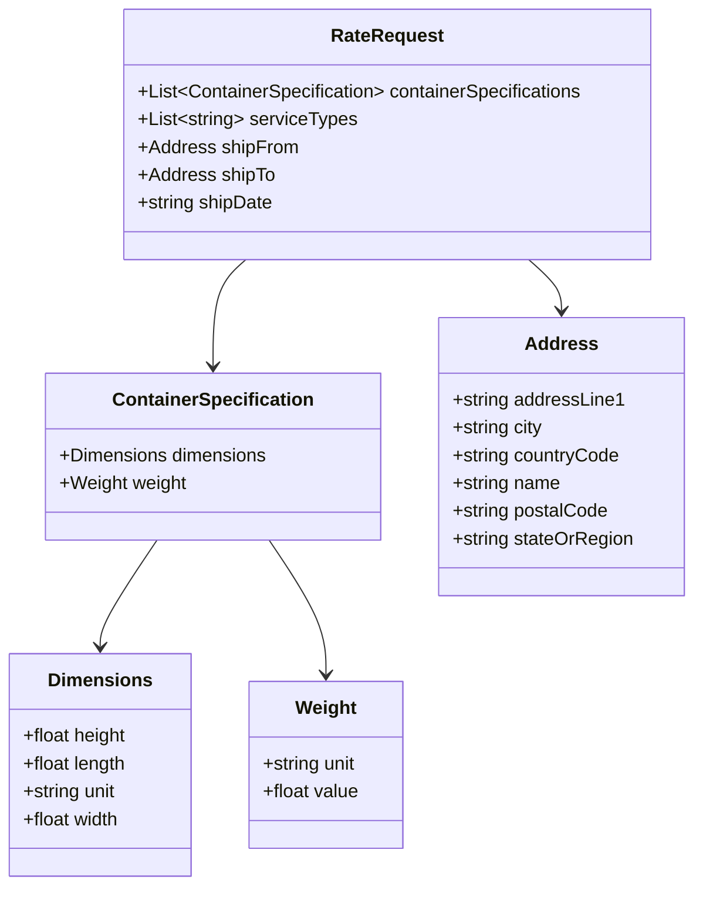

# Schema Generation

Karrio uses strongly typed data structures for carrier integrations to ensure type safety and improve developer experience. This section covers how to generate Python data types from carrier API documentation.

## Understanding API Schemas

Before generating schemas, you need to understand the carrier's API structure. This involves:

1. Studying the carrier's API documentation
2. Identifying key API endpoints (rating, shipping, tracking, etc.)
3. Understanding the request and response formats
4. Collecting sample API requests and responses



## Schema Files Preparation

Karrio supports both JSON and XML API formats. The approach differs slightly depending on which format your carrier uses.

### For JSON APIs

1. Create `.json` files based on the carrier's API documentation and place them in the `schemas/` directory of your extension.
2. For each API operation (rating, shipping, tracking), create at least:
   - A request schema (e.g., `rate_request.json`)
   - A response schema (e.g., `rate_response.json`)

Example JSON schema file for a rate request:

```json
{
  "containerSpecifications": [
    {
      "dimensions": {
        "height": 10,
        "length": 15,
        "unit": "IN",
        "width": 12
      },
      "weight": {
        "unit": "LB",
        "value": 5
      }
    }
  ],
  "serviceTypes": ["EXPRESS", "GROUND"],
  "shipFrom": {
    "addressLine1": "123 Shipper St",
    "city": "Shiptown",
    "countryCode": "US",
    "name": "Shipper Name",
    "postalCode": "12345",
    "stateOrRegion": "CA",
    "phoneNumber": "123-456-7890"
  },
  "shipTo": {
    "addressLine1": "456 Recipient Rd",
    "city": "Receiverville",
    "countryCode": "US",
    "name": "Recipient Name",
    "postalCode": "54321",
    "stateOrRegion": "NY",
    "phoneNumber": "098-765-4321"
  },
  "shipDate": "2023-09-15T12:00:00Z"
}
```

### For XML/SOAP APIs

1. Collect `.xsd` files from the carrier's API documentation and place them in the `schemas/` directory.
2. For SOAP-based APIs, extract the `<xs:schema>` sections from `.wsdl` files into separate `.xsd` files.

Example XML schema structure:

```xml
<?xml version="1.0" encoding="UTF-8"?>
<xs:schema xmlns:xs="http://www.w3.org/2001/XMLSchema">
  <xs:element name="RateRequest">
    <xs:complexType>
      <xs:sequence>
        <xs:element name="FromPostalCode" type="xs:string"/>
        <xs:element name="ToPostalCode" type="xs:string"/>
        <xs:element name="Weight" type="xs:decimal"/>
        <xs:element name="WeightUnit" type="xs:string"/>
        <!-- Additional elements... -->
      </xs:sequence>
    </xs:complexType>
  </xs:element>
</xs:schema>
```

## Creating the Generate Script

The `generate` script in your extension's root directory is responsible for running the appropriate code generation tools. The script should be updated to include your schema files.

### For JSON APIs

Karrio uses a modified version of `quicktype` to generate Python data classes from JSON schemas:

```bash
#!/bin/bash

# Ensure script exits on error
set -e

# Get the directory of this script
DIR="$( cd "$( dirname "${BASH_SOURCE[0]}" )" && pwd )"

# Define the source directory and the output package directory
SOURCE_DIR="$DIR/schemas"
PACKAGE_DIR="$DIR/karrio/schemas/freight_express"

# Create output directory if it doesn't exist
mkdir -p "$PACKAGE_DIR"

# Run code generation for each schema file
kcli codegen generate \
  --src="$SOURCE_DIR/rate_request.json" \
  --out="$PACKAGE_DIR/rate_request.py" \
  --toplevel-class="RateRequest"

kcli codegen generate \
  --src="$SOURCE_DIR/rate_response.json" \
  --out="$PACKAGE_DIR/rate_response.py" \
  --toplevel-class="RateResponse"

# Add more schema files as needed...

# Create or update __init__.py to expose the generated classes
echo "# Generated code - DO NOT modify by hand
from karrio.schemas.freight_express.rate_request import RateRequest
from karrio.schemas.freight_express.rate_response import RateResponse
# Add more imports as needed...
" > "$PACKAGE_DIR/__init__.py"

echo "Code generation completed successfully!"
```

### For XML/SOAP APIs

Karrio uses `generateDS` to transform XML schemas into Python classes:

```bash
#!/bin/bash

# Ensure script exits on error
set -e

# Get the directory of this script
DIR="$( cd "$( dirname "${BASH_SOURCE[0]}" )" && pwd )"

# Define the source directory and the output package directory
SOURCE_DIR="$DIR/schemas"
PACKAGE_DIR="$DIR/karrio/schemas/freight_express"

# Create output directory if it doesn't exist
mkdir -p "$PACKAGE_DIR"

# Run generateDS for each schema file
generateDS.py \
  --no-dates \
  --no-versions \
  --member-specs=list \
  -o "$PACKAGE_DIR/rate_request.py" \
  "$SOURCE_DIR/rate_request.xsd"

generateDS.py \
  --no-dates \
  --no-versions \
  --member-specs=list \
  -o "$PACKAGE_DIR/rate_response.py" \
  "$SOURCE_DIR/rate_response.xsd"

# Add more schema files as needed...

# Create or update __init__.py to expose the generated classes
echo "# Generated code - DO NOT modify by hand
from karrio.schemas.freight_express.rate_request import *
from karrio.schemas.freight_express.rate_response import *
# Add more imports as needed...
" > "$PACKAGE_DIR/__init__.py"

echo "Code generation completed successfully!"
```

## Running Code Generation

After setting up your schema files and the `generate` script, you can run the code generation process:

```bash
# Run the generate script
bin/run-generate-on modules/connectors/[carrier_name]
```

This command runs your `generate` script to create Python data types from your schemas.



## Generated Code Structure

The generated code will be placed in the `karrio/schemas/[carrier_name]/` directory of your extension. Each schema file will generate a corresponding Python file with data classes that represent the API structures.

Example generated Python class for a JSON API:

```python
import attr
import jstruct
import typing

@attr.s(auto_attribs=True)
class Dimensions:
    height: typing.Optional[float] = None
    length: typing.Optional[float] = None
    unit: typing.Optional[str] = None
    width: typing.Optional[float] = None

@attr.s(auto_attribs=True)
class Weight:
    unit: typing.Optional[str] = None
    value: typing.Optional[float] = None

@attr.s(auto_attribs=True)
class ContainerSpecification:
    dimensions: typing.Optional[Dimensions] = None
    weight: typing.Optional[Weight] = None

# More classes...

@attr.s(auto_attribs=True)
class RateRequest:
    containerSpecifications: typing.Optional[typing.List[ContainerSpecification]] = jstruct.JList[ContainerSpecification]
    serviceTypes: typing.Optional[typing.List[str]] = jstruct.JList[str]
    shipFrom: typing.Optional[Address] = None
    shipTo: typing.Optional[Address] = None
    shipDate: typing.Optional[str] = None
```



## Using Generated Types

Once generated, these Python data types become the foundation of your carrier integration. You'll use them to:

1. Create carrier-specific API requests
2. Parse carrier-specific API responses
3. Map between Karrio's unified format and carrier-specific formats

In the next sections, we'll cover how to use these generated types in your integration.

## Troubleshooting

If you encounter issues during code generation:

- Ensure your schema files are valid (for JSON: valid JSON, for XML: valid XML schema)
- Check that your `generate` script references the correct schema files
- For XML APIs, ensure generateDS is installed with Karrio's development dependencies

## CLI Tools for Schema Generation

Karrio provides several CLI tools to help with schema generation and code transformation. The `kcli` command includes utilities for code generation, particularly for transforming JSON schemas into Python code using jstruct.

### Transform

The `transform` command converts Python code generated by quicktype (using dataclasses) into code that uses attrs and jstruct decorators.

```bash
# Transform from stdin to stdout
cat input.py | kcli codegen transform > output.py

# Transform from file to file
kcli codegen transform input.py output.py

# Transform from file to stdout
kcli codegen transform input.py

# Disable appending 'Type' to class names
kcli codegen transform input.py output.py --no-append-type-suffix
```

### Generate

The `generate` command generates Python code with jstruct from a JSON schema file using quicktype.

```bash
# Generate Python code with jstruct from a JSON schema
kcli codegen generate --src=schema.json --out=output.py

# Specify Python version
kcli codegen generate --src=schema.json --out=output.py --python-version=3.8

# Generate without --just-types
kcli codegen generate --src=schema.json --out=output.py --just-types=false

# Disable appending 'Type' to class names
kcli codegen generate --src=schema.json --out=output.py --no-append-type-suffix
```

### Create Tree

The `create-tree` command generates a Python code tree from a class definition. It's useful for visualizing the structure of complex nested objects and generating initialization code templates.

```bash
# Generate a tree for a class
kcli codegen create-tree --module=karrio.schemas.allied_express.label_request --class-name=LabelRequest

# Generate a tree with a module alias
kcli codegen create-tree --module=karrio.schemas.allied_express.label_request --class-name=LabelRequest --module-alias=allied
```


