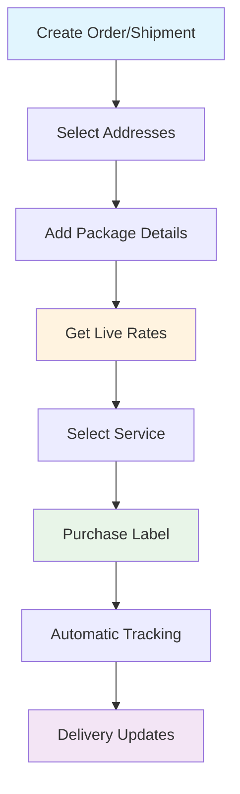

# Karrio Dashboard Guide

  

    Community Edition
  

  

    Core Feature
  

The Karrio dashboard is your complete control center for managing shipping operations. Built with a focus on simplicity and efficiency, it provides intuitive access to all shipping features including rate comparison, label generation, order management, and tracking.

  

    Dashboard Overview
  

  

    
  

## Key Features

The dashboard provides comprehensive tools for modern shipping operations:

### [Test Mode](/docs/developing/dashboard-guide/test-mode)

Switch between production and sandbox environments to test integrations safely before going live.

- **Test Mode**: Use carrier sandbox APIs for development and testing
- **Live Mode**: Process real shipments with production carrier connections
- **Seamless Switching**: Toggle between modes without losing work

### [Label Creation](/docs/developing/dashboard-guide/label-creation)

Create shipping labels with intuitive forms and real-time rate comparison.

- **Multi-Carrier Rates**: Compare prices across all connected carriers
- **Smart Forms**: Auto-populate addresses and package details
- **Instant Purchase**: Buy labels directly from rate comparison

### [Tracker Management](/docs/developing/dashboard-guide/trackers)

Monitor shipments with real-time tracking updates and comprehensive status information.

- **Automated Tracking**: Set up tracking for all shipments
- **Status Updates**: Real-time delivery status notifications
- **Event History**: Complete tracking event timeline

### [Order Management](/docs/developing/dashboard-guide/orders)

Manage orders from creation to fulfillment with integrated shipping workflows.

- **Order Creation**: Build orders with line items and shipping details
- **Fulfillment**: Process orders into shipments seamlessly
- **Bulk Operations**: Handle multiple orders efficiently

### [Document Templates](/docs/developing/dashboard-guide/document-templates)

Create and manage custom document templates for invoices, packing slips, and labels.

- **Template Designer**: Visual template editor with drag-and-drop
- **Custom Fields**: Add business-specific information
- **Bulk Printing**: Generate documents for multiple orders

### [Developer Tools](/docs/developing/dashboard-guide/developer-tools)

Access API documentation, webhooks, and integration tools directly from the dashboard.

- **API Explorer**: Test endpoints with interactive documentation
- **Webhook Management**: Configure event notifications
- **Request Logs**: Monitor API usage and troubleshoot issues

## Data Flow

### Shipping Workflow

## Best Practices

### Organization Setup

For optimal dashboard experience:

- **Configure Addresses**: Set up default shipping locations
- **Connect Carriers**: Add all preferred shipping accounts
- **Set Preferences**: Configure default package types and options
- **Create Templates**: Design custom documents for your business

### Daily Operations

Streamline your workflow:

- **Use Test Mode**: Verify integrations before live processing
- **Batch Operations**: Handle multiple shipments efficiently
- **Monitor Tracking**: Keep customers informed with status updates
- **Review Analytics**: Track shipping costs and performance

## Dashboard Sections

### Overview Cards

The main dashboard shows at-a-glance metrics:

- **Real-time Charts**: Visual representation of shipping activity
- **Quick Actions**: One-click access to common tasks
- **Recent Activity**: Latest shipments and orders
- **Performance Metrics**: Cost analysis and delivery statistics

### Navigation Menu

Organized by function for intuitive access:

- **Shipping Operations**: Labels, orders, and tracking
- **Management**: Carriers, settings, and templates
- **Development**: APIs, webhooks, and logs
- **Analytics**: Reports and usage statistics

## Next Steps

Ready to use the Karrio dashboard? Explore each section in detail:

1. **[Live vs Test Mode](/docs/developing/dashboard-guide/test-mode)** - Switch between production and development
2. **[Label Creation](/docs/developing/dashboard-guide/label-creation)** - Create shipping labels efficiently
3. **[Tracker Management](/docs/developing/dashboard-guide/trackers)** - Monitor shipment deliveries
4. **[Order Management](/docs/developing/dashboard-guide/orders)** - Process orders and fulfillment
5. **[Document Templates](/docs/developing/dashboard-guide/document-templates)** - Design custom business documents
6. **[Developer Tools](/docs/developing/dashboard-guide/developer-tools)** - Access APIs and integration tools

---

**Need help?** Join our [community Discord](https://discord.gg/gS88uE7sEx) or contact our support team.
