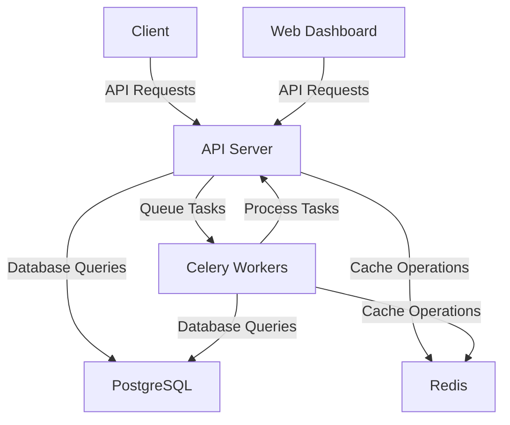

# Local Development

This section provides information for developers who want to contribute to Karrio or build custom integrations.

## Architecture Overview

Karrio is built with a microservices architecture, consisting of several components:

- **API Server**: Django REST Framework application that provides the core API
- **Web Dashboard**: React application for the user interface
- **Worker**: Celery workers for background tasks
- **Database**: PostgreSQL for data storage
- **Cache**: Redis for caching and as a message broker



## Development Environment

For detailed instructions on setting up your development environment, see the [Local Development](/docs/local-development) guide.

## Code Organization

The Karrio codebase is organized as follows:

- **`/api`**: Django REST Framework API
  - **`/api/core`**: Core models and utilities
  - **`/api/carriers`**: Carrier-specific integrations
  - **`/api/endpoints`**: API endpoints
- **`/web`**: React web dashboard
  - **`/web/src/components`**: Reusable UI components
  - **`/web/src/pages`**: Page components
  - **`/web/src/services`**: API client services
- **`/worker`**: Celery worker tasks
- **`/docs`**: Documentation

## Adding a New Carrier

One of the most common contributions is adding support for a new shipping carrier. Here's a high-level overview of the process:

1. Create a new carrier module in `/api/carriers/`
2. Implement the required interfaces:
   - `CarrierInterface`: Base interface for all carriers
   - `ShippingInterface`: For shipping operations
   - `TrackingInterface`: For tracking operations
   - `RateInterface`: For rate calculation
3. Add carrier-specific settings to the configuration
4. Add tests for the new carrier
5. Update documentation

For a detailed guide, see [Adding a New Carrier](/docs/developing/adding-a-carrier).

## API Development

When developing against the Karrio API, you should follow these best practices:

- Use versioned endpoints (e.g., `/v2/shipments`)
- Implement proper error handling
- Follow RESTful principles
- Write comprehensive tests
- Document all changes

For more information, see the [API Development Guide](/docs/api-development).

## Testing

Karrio uses a comprehensive testing strategy:

- **Unit Tests**: Test individual functions and methods
- **Integration Tests**: Test interactions between components
- **End-to-End Tests**: Test complete workflows

To run tests:

```bash
# Run all tests
docker-compose exec api python manage.py test

# Run specific tests
docker-compose exec api python manage.py test api.carriers.tests.test_usps
```

## Documentation

Documentation is a crucial part of the development process. When making changes:

- Update the relevant documentation files
- Add examples for new features
- Update API reference for endpoint changes
- Add diagrams for complex workflows

## Continuous Integration

Karrio uses GitHub Actions for continuous integration:

- **Linting**: Checks code style and formatting
- **Testing**: Runs the test suite
- **Building**: Builds Docker images
- **Deployment**: Deploys to staging environments

All pull requests must pass CI checks before being merged.

## Release Process

Karrio follows a semantic versioning approach:

- **Major Versions**: Breaking changes
- **Minor Versions**: New features, non-breaking changes
- **Patch Versions**: Bug fixes

The release process involves:

1. Creating a release branch
2. Running comprehensive tests
3. Building release artifacts
4. Updating documentation
5. Publishing the release

## Getting Help

If you need help with development:

- Join the [Community Forum](https://github.com/orgs/karrioapi/discussions)
- Review the [Contributing Guidelines](/docs/open-source-contribution/introduction-os)
