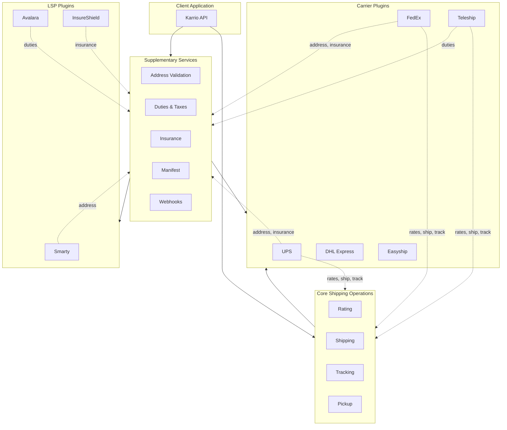
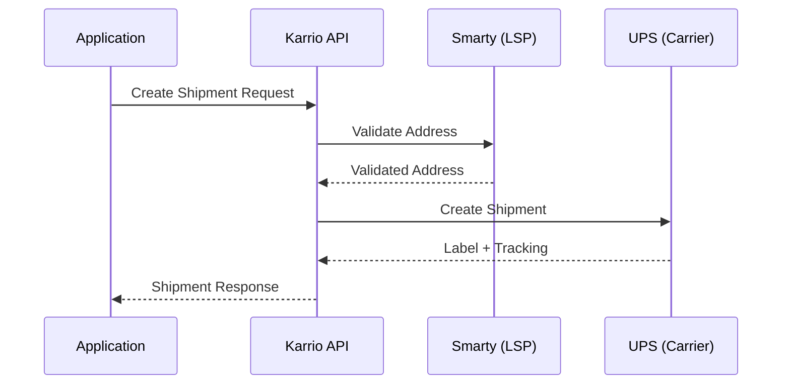

# Plugin Development

Karrio plugins extend the platform with shipping carriers and logistics service providers (LSP). All plugins follow the same Mapper/Proxy/Settings pattern.

## Plugin Types

| Type | `service_type` | Description | Examples |
|------|----------------|-------------|----------|
| **Carrier** | `"carrier"` | Full shipping integration (rates, shipments, tracking) | UPS, FedEx, DHL |
| **LSP** | `"LSP"` | Logistics Service Provider (standalone services) | Smarty, InsureShield, Avalara |

### When to Use Each Type

**Carrier plugins** (`service_type="carrier"`) are for shipping carriers that provide core logistics operations. Some carriers also offer additional services:
- **Address validation**: UPS, FedEx, DHL Express, Easyship, EasyPost
- **Insurance**: UPS, FedEx, DHL Express, Easyship, EasyPost
- **Duties & taxes**: Teleship, Easyship

**LSP plugins** (`service_type="LSP"`) are for standalone service providers that specialize in specific logistics capabilities:
- **Address validation**: Smarty, Google Geocoding, AddressComplete
- **Insurance**: InsureShield, Shipsurance
- **Duties & taxes**: Avalara, Zonos

## Architecture Overview

Karrio's plugin system allows carriers and LSP services to work together, supplementing core shipping operations with specialized capabilities.



### How It Works

1. **Core operations** (rating, shipping, tracking, pickup) are handled by carrier plugins
2. **Supplementary services** can be provided by:
   - The same carrier (e.g., UPS address validation during shipment)
   - A dedicated LSP plugin (e.g., Smarty for address validation)
3. **Flexibility**: Use carrier-provided services or integrate specialized LSP providers based on your needs

### Example Flow: Shipment with Address Validation



## Supported Capabilities

Plugins can implement any combination of features:

| Feature | Proxy Method | Description |
|---------|-------------|-------------|
| Rating | `get_rates` | Fetch shipping rates |
| Shipping | `create_shipment`, `cancel_shipment` | Create/cancel shipments |
| Tracking | `get_tracking` | Track packages |
| Pickup | `schedule_pickup`, `modify_pickup`, `cancel_pickup` | Manage pickups |
| Address | `validate_address` | Validate addresses |
| Document | `upload_document` | Upload trade documents |
| Manifest | `create_manifest` | Create shipping manifests |
| Webhook | `register_webhook`, `deregister_webhook` | Carrier webhook management |
| Callback | OAuth and webhook event processing | Handle carrier callbacks |
| Duties | `calculate_duties` | Calculate duties and taxes |
| Insurance | `apply_insurance` | Apply shipment insurance |

## Quick Start

### Bootstrap with CLI

```bash
# Activate environment
source ./bin/activate-env

# Create carrier plugin
./bin/cli sdk add-extension \
  --path modules/connectors \
  --carrier-slug my_carrier \
  --display-name "My Carrier" \
  --features "rating,shipping,tracking" \
  --confirm

# Create LSP plugin (e.g., address validation service)
./bin/cli sdk add-extension \
  --path plugins \
  --carrier-slug my_lsp \
  --display-name "My LSP Service" \
  --features "address" \
  --confirm
```

### Generated Structure

```text
my_carrier/
├── pyproject.toml              # Package config with entrypoints
├── generate                    # Schema generation script
├── schemas/                    # API schema files (JSON/XML)
├── karrio/
│   ├── plugins/my_carrier/     # Plugin registration
│   │   └── __init__.py         # METADATA definition
│   ├── mappers/my_carrier/     # Integration layer
│   │   ├── mapper.py           # Request/response routing
│   │   ├── proxy.py            # HTTP client
│   │   └── settings.py         # Credentials config
│   ├── providers/my_carrier/   # Implementation
│   │   ├── rate.py             # Rating logic
│   │   ├── tracking.py         # Tracking logic
│   │   ├── shipment/           # Shipping logic
│   │   ├── units.py            # Services, options
│   │   ├── utils.py            # Helpers
│   │   └── error.py            # Error parsing
│   └── schemas/my_carrier/     # Generated Python types
└── tests/my_carrier/           # Test suite
```

## Plugin Metadata

Define your plugin in `karrio/plugins/[name]/__init__.py`:

### Carrier Plugin

```python
from karrio.core.metadata import PluginMetadata
from karrio.mappers.my_carrier.mapper import Mapper
from karrio.mappers.my_carrier.proxy import Proxy
from karrio.mappers.my_carrier.settings import Settings

METADATA = PluginMetadata(
    id="my_carrier",
    label="My Carrier",
    description="Ship with My Carrier",
    status="beta",
    service_type="carrier",  # default

    # Required components
    Mapper=Mapper,
    Proxy=Proxy,
    Settings=Settings,

    # Optional: callback handler
    # Callback=Callback,

    # Optional metadata
    is_hub=False,  # True for aggregators like Easyship
    website="https://mycarrier.com",
    documentation="https://api.mycarrier.com/docs",
)
```

### LSP Plugin (Logistics Service Provider)

```python
from karrio.core.metadata import PluginMetadata
from karrio.mappers.smarty.mapper import Mapper
from karrio.mappers.smarty.proxy import Proxy
from karrio.mappers.smarty.settings import Settings

METADATA = PluginMetadata(
    id="smarty",
    label="Smarty",
    description="Address validation and verification service",
    status="production-ready",
    service_type="LSP",  # Marks as Logistics Service Provider

    Mapper=Mapper,
    Proxy=Proxy,
    Settings=Settings,

    website="https://www.smarty.com",
)
```

> **Note**: The same Mapper/Proxy/Settings pattern applies to all LSP types—whether for address validation (Smarty), insurance (InsureShield), or duties calculation (Avalara).

## Core Components

### Settings

Define connection credentials:

```python
# karrio/mappers/my_carrier/settings.py
import attr
import karrio.core.settings as settings

@attr.s(auto_attribs=True)
class Settings(settings.Settings):
    api_key: str
    secret_key: str = None
    account_number: str = None

    # Connection config
    id: str = None
    test_mode: bool = False
    carrier_id: str = "my_carrier"

    @property
    def carrier_name(self):
        return "my_carrier"

    @property
    def server_url(self):
        return (
            "https://sandbox.api.mycarrier.com"
            if self.test_mode
            else "https://api.mycarrier.com"
        )
```

### Proxy

Implement HTTP communication:

```python
# karrio/mappers/my_carrier/proxy.py
import karrio.lib as lib
import karrio.api.proxy as proxy
from karrio.mappers.my_carrier.settings import Settings

class Proxy(proxy.Proxy):
    settings: Settings

    def get_rates(self, request: lib.Serializable) -> lib.Deserializable:
        response = lib.request(
            url=f"{self.settings.server_url}/v1/rates",
            data=lib.to_json(request.serialize()),
            headers={
                "Authorization": f"Bearer {self.settings.api_key}",
                "Content-Type": "application/json",
            },
            method="POST",
            trace=self.trace_as("json"),
        )
        return lib.Deserializable(response, lib.to_dict)

    def create_shipment(self, request: lib.Serializable) -> lib.Deserializable:
        # Similar pattern...
        pass
```

### Mapper

Route requests to provider implementations:

```python
# karrio/mappers/my_carrier/mapper.py
import typing
import karrio.lib as lib
import karrio.api.mapper as mapper
import karrio.core.models as models
import karrio.providers.my_carrier as provider
from karrio.mappers.my_carrier.settings import Settings

class Mapper(mapper.Mapper):
    settings: Settings

    def create_rate_request(self, payload: models.RateRequest) -> lib.Serializable:
        return provider.rate_request(payload, self.settings)

    def parse_rate_response(
        self, response: lib.Deserializable
    ) -> typing.Tuple[typing.List[models.RateDetails], typing.List[models.Message]]:
        return provider.parse_rate_response(response, self.settings)
```

### Provider Implementation

Transform between Karrio models and carrier API:

```python
# karrio/providers/my_carrier/rate.py
import karrio.schemas.my_carrier.rate_request as rate_req
import karrio.schemas.my_carrier.rate_response as rate_res
import typing
import karrio.lib as lib
import karrio.core.models as models
from karrio.providers.my_carrier import units
from karrio.providers.my_carrier.utils import Settings

def rate_request(payload: models.RateRequest, settings: Settings) -> lib.Serializable:
    request = rate_req.RateRequestType(
        origin=payload.shipper.postal_code,
        destination=payload.recipient.postal_code,
        weight=payload.parcels[0].weight,
        # Map other fields...
    )
    return lib.Serializable(request, lib.to_dict)

def parse_rate_response(
    response: lib.Deserializable[dict],
    settings: Settings,
) -> typing.Tuple[typing.List[models.RateDetails], typing.List[models.Message]]:
    data = response.deserialize()
    rates = [
        models.RateDetails(
            carrier_id=settings.carrier_id,
            carrier_name=settings.carrier_name,
            service=units.ShippingService.map(r["serviceCode"]).name_or_key,
            total_charge=lib.to_money(r["totalPrice"]),
            currency=r["currency"],
        )
        for r in data.get("rates", [])
    ]
    return rates, []
```

## Plugin Registration

### Entrypoint (Recommended)

In `pyproject.toml`:

```toml
[project.entry-points."karrio.plugins"]
my_carrier = "karrio.plugins.my_carrier"
```

### Directory-based

Place plugin in `./plugins/` or set `KARRIO_PLUGINS` environment variable.

## Development Workflow

```bash
# 1. Bootstrap
./bin/cli sdk add-extension --path modules/connectors ...

# 2. Add schema files to schemas/ directory

# 3. Generate Python types
./bin/run-generate-on modules/connectors/my_carrier

# 4. Implement provider logic

# 5. Run tests
python -m unittest discover -v modules/connectors/my_carrier/tests

# 6. Verify registration
./bin/cli plugins list | grep my_carrier
./bin/cli plugins show my_carrier
```

## Adding Features to Existing Plugins

```bash
./bin/cli sdk add-features \
  --path modules/connectors \
  --carrier-slug my_carrier \
  --display-name "My Carrier" \
  --features "pickup,manifest" \
  --confirm
```

## Testing

Follow the standard test pattern:

```python
# tests/my_carrier/test_rate.py
import unittest
from unittest.mock import patch
import karrio.sdk as karrio
import karrio.lib as lib
from .fixture import gateway

class TestMyCarrierRating(unittest.TestCase):
    def setUp(self):
        self.RateRequest = karrio.core.models.RateRequest(**RatePayload)

    def test_create_rate_request(self):
        request = gateway.mapper.create_rate_request(self.RateRequest)
        self.assertEqual(request.serialize(), RateRequest)

    def test_get_rates(self):
        with patch("karrio.mappers.my_carrier.proxy.lib.request") as mock:
            mock.return_value = RateResponse
            karrio.Rating.fetch(self.RateRequest).from_(gateway)
            self.assertEqual(mock.call_args[1]["url"], "https://api...")

    def test_parse_rate_response(self):
        with patch("karrio.mappers.my_carrier.proxy.lib.request") as mock:
            mock.return_value = RateResponse
            result = karrio.Rating.fetch(self.RateRequest).from_(gateway).parse()
            self.assertListEqual(lib.to_dict(result), ParsedRateResponse)

# Test data at end of file
RatePayload = {...}
RateRequest = {...}
RateResponse = """..."""
ParsedRateResponse = [[...], []]
```

## Resources

- [Carrier Integration Guide](/docs/developing/carrier-integration) - Detailed carrier implementation
- [CLI Guide](/docs/developing/cli-guide) - CLI commands reference
- [Schema Generation](/docs/developing/carrier-integration/schema-generation) - Generate Python types
