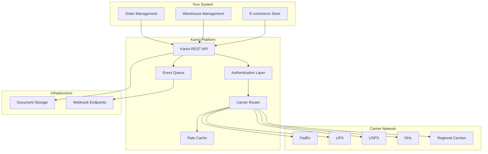
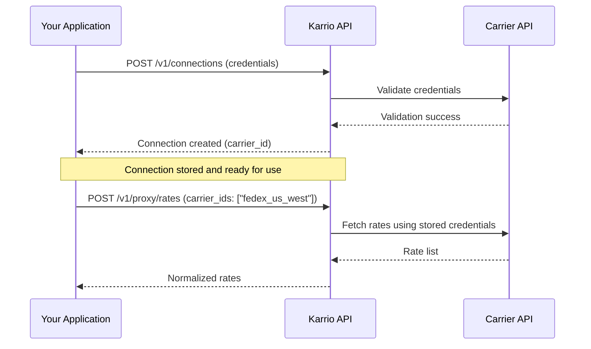
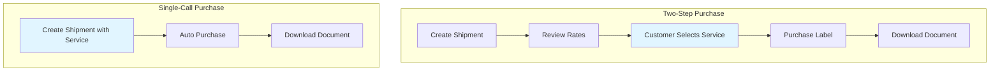
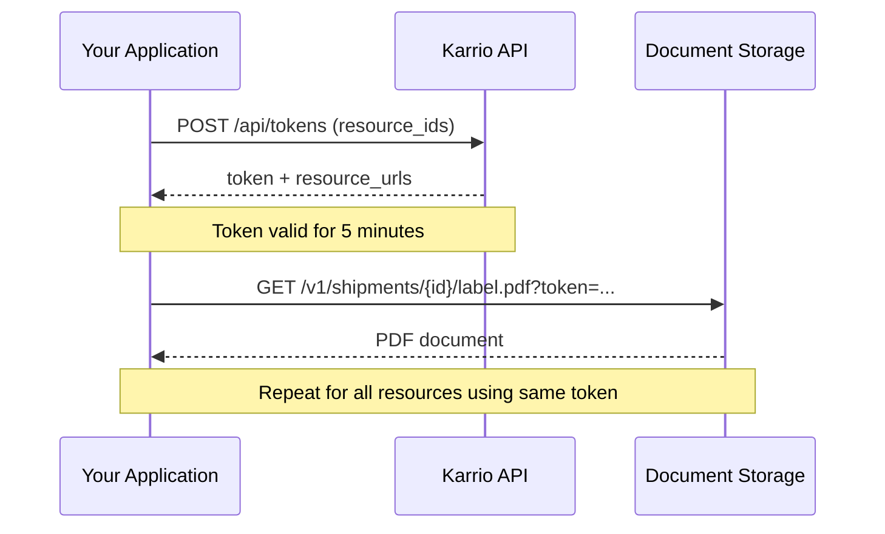
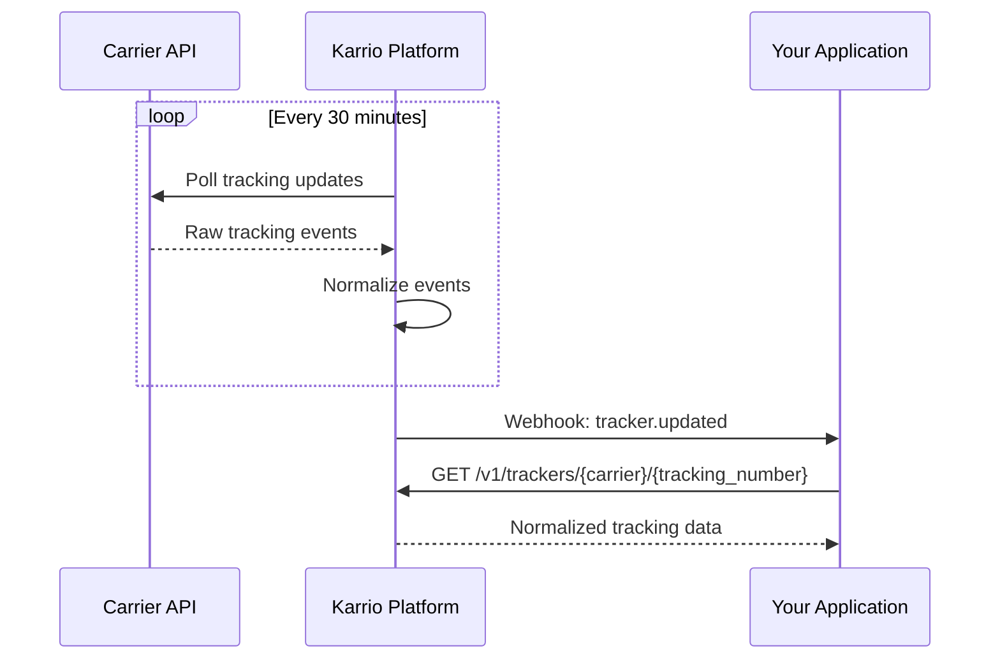

# Shipping Integration Guide

Modern fulfillment platforms need to support multiple carriers without implementing dozens of carrier-specific APIs. Karrio provides a unified REST interface that normalizes carrier interactions into a consistent workflow: authenticate, connect carriers, fetch rates, purchase labels, track packages, and receive real-time updates.

This guide walks through the complete integration lifecycle using real API examples and production-ready patterns. Each section includes the JSON payloads you'll work with and highlights the fields that matter for building reliable shipping workflows.

> [!TIP]
> Everything below works in both **test mode** and **live mode**. Point your requests at `http://localhost:5002` when developing locally, and add the `x-test-mode: true` header to interact with carrier sandboxes.

## Architecture Overview

Karrio sits between your fulfillment system and carrier networks, handling the complexity of multi-carrier integration while you maintain a single API contract.



The platform handles authentication, rate shopping across carriers, label generation, document storage, and event distribution. Your application makes REST calls and receives webhooks—no need to maintain carrier-specific SDKs or handle individual API quirks.

## Authentication & Authorization

Karrio supports two authentication mechanisms designed for different integration patterns. API keys are recommended for server-to-server communication, while JWT tokens work well for client-side applications or temporary access scenarios.

### API Key Authentication

Server-side integrations should use API keys. Include your key in the `Authorization` header for every request:

```bash
Authorization: Token <YOUR_API_KEY>
```

API keys are permanent credentials that can be revoked or rotated through the dashboard. They carry the same permissions as the user who created them.

### JWT Token Authentication

For client-side applications or temporary access, use JWT tokens. First, obtain a token pair:

```bash filename="Request"
curl -X POST "$KARRIO_API_URL/api/token" \
  -H "Content-Type: application/json" \
  -d '{
    "email": "admin@example.com",
    "password": "demo"
  }'
```

```json filename="Response"
{
  "access": "eyJ0eXAiOiJKV1QiLCJhbGciOiJSUzI1NiJ9...",
  "refresh": "eyJ0eXAiOiJKV1QiLCJhbGciOiJSUzI1NiJ9..."
}
```

Access tokens expire after a set period. Use the refresh token to obtain new access tokens without re-authenticating. For subsequent requests, use Bearer authentication:

```bash
Authorization: Bearer <ACCESS_TOKEN>
```

## Carrier Connection Workflow

Before you can fetch rates or purchase labels, you need to connect at least one carrier account. Karrio maintains these connections and uses them to route shipping requests.

### Use Case: Multi-Region Fulfillment

Consider an e-commerce platform with warehouses in North America and Europe. Each region uses different carriers with separate accounts. By connecting multiple carriers and tagging them with metadata, you can route shipments based on origin, destination, or business rules.

**Endpoint**: `POST /v1/connections`

```bash filename="Request"
curl -X POST "$KARRIO_API_URL/v1/connections" \
  -H "Authorization: Token $KARRIO_API_KEY" \
  -H "Content-Type: application/json" \
  -d '{
    "carrier_name": "fedex",
    "carrier_id": "fedex_us_west",
    "credentials": {
      "api_key": "YOUR_API_KEY",
      "secret_key": "YOUR_SECRET_KEY",
      "account_number": "YOUR_ACCOUNT_NUMBER"
    },
    "test_mode": false,
    "metadata": {
      "region": "us-west",
      "fulfillment_center": "LAX"
    }
  }'
```

```json filename="Response"
{
  "id": "car_1a2b3c4d5e6f",
  "carrier_id": "fedex_us_west",
  "carrier_name": "fedex",
  "display_name": "FedEx",
  "test_mode": false,
  "active": true,
  "capabilities": ["rating", "shipping", "tracking", "manifest"],
  "metadata": {
    "region": "us-west",
    "fulfillment_center": "LAX"
  },
  "created_at": "2024-01-15T10:00:00Z"
}
```

The `capabilities` array tells you what operations this carrier supports. Not all carriers support all features—some may only offer tracking, while others provide full shipping and manifesting capabilities. The `carrier_id` becomes your reference for this specific connection in subsequent API calls.

### Connection Flow



## Rate Shopping Experience

Rate shopping is typically the first interaction customers have with shipping costs. The Proxy API provides stateless rate requests—no shipment records are created, making it ideal for checkout flows where you need quotes without commitment.

### Use Case: Real-Time Checkout Quotes

A customer adds items to their cart and proceeds to checkout. Your application sends their address and parcel details to Karrio, which queries all connected carriers in parallel and returns normalized rates within seconds.

**Endpoint**: `POST /v1/proxy/rates`

```bash filename="Request"
curl -X POST "$KARRIO_API_URL/v1/proxy/rates" \
  -H "Authorization: Token $KARRIO_API_KEY" \
  -H "Content-Type: application/json" \
  -d '{
    "shipper": {
      "postal_code": "V6M2V9",
      "city": "Vancouver",
      "country_code": "CA",
      "state_code": "BC",
      "address_line1": "5840 Oak St",
      "person_name": "Jane Doe",
      "company_name": "Sender Corp"
    },
    "recipient": {
      "postal_code": "E1C4Z8",
      "city": "Moncton",
      "country_code": "CA",
      "state_code": "NB",
      "address_line1": "125 Church St",
      "person_name": "John Smith",
      "company_name": "Receiver Inc"
    },
    "parcels": [
      {
        "weight": 1.0,
        "weight_unit": "KG",
        "package_preset": "canadapost_corrugated_small_box"
      }
    ],
    "options": {
      "currency": "CAD",
      "insurance": 100.00,
      "signature_confirmation": true
    },
    "carrier_ids": ["canadapost"]
  }'
```

```json filename="Response"
{
  "rates": [
    {
      "id": "rat_a1b2c3d4e5f6",
      "object_type": "rate",
      "carrier_name": "canadapost",
      "carrier_id": "canadapost",
      "currency": "CAD",
      "service": "canadapost_priority",
      "total_charge": 106.71,
      "transit_days": 2,
      "estimated_delivery": "2024-01-20",
      "extra_charges": [
        { "name": "Base charge", "amount": 101.83, "currency": "CAD" },
        { "name": "Fuel surcharge", "amount": 2.7, "currency": "CAD" },
        { "name": "SMB Savings", "amount": -11.74, "currency": "CAD" },
        { "name": "Discount", "amount": -9.04, "currency": "CAD" },
        { "name": "Duties and taxes", "amount": 13.92, "currency": "CAD" }
      ],
      "meta": {
        "service_name": "CANADAPOST PRIORITY",
        "rate_provider": "canadapost",
        "carrier_connection_id": "car_1a2b3c4d5e6f"
      },
      "test_mode": true
    },
    {
      "id": "rat_b2c3d4e5f6g7",
      "object_type": "rate",
      "carrier_name": "canadapost",
      "carrier_id": "canadapost",
      "currency": "CAD",
      "service": "canadapost_expedited_parcel",
      "total_charge": 45.20,
      "transit_days": 5,
      "estimated_delivery": "2024-01-23",
      "extra_charges": [
        { "name": "Base charge", "amount": 42.50, "currency": "CAD" },
        { "name": "Fuel surcharge", "amount": 2.70, "currency": "CAD" }
      ],
      "meta": {
        "service_name": "CANADAPOST EXPEDITED PARCEL",
        "rate_provider": "canadapost"
      },
      "test_mode": true
    }
  ],
  "messages": []
}
```

The response includes everything needed to present shipping options to customers. The `service` field is the key identifier you'll use when purchasing labels. The `extra_charges` array provides transparency into carrier fees, surcharges, and discounts—useful for displaying itemized breakdowns or debugging rate discrepancies.

### Rate Request Options

Karrio supports a wide range of shipping options that modify pricing and service availability:

- **insurance**: Shipment insurance value
- **signature_confirmation**: Require signature on delivery
- **saturday_delivery**: Enable Saturday delivery (carrier-specific)
- **dangerous_good**: Mark as hazardous material
- **hold_at_location**: Hold at carrier facility for pickup
- **currency**: Preferred currency for rate display
- **declared_value**: Customs value for international shipments

## Label Purchase Workflows

Label purchase is the core transaction in shipping. Karrio supports two distinct workflows: two-step purchases that save rates for later selection, and single-call purchases that complete transactions immediately.

### Two-Step Purchase Flow

This workflow is ideal when you need to present multiple shipping options to customers and let them choose before committing to a purchase.

#### Step 1: Create Shipment and Fetch Rates

**Endpoint**: `POST /v1/shipments`

```bash filename="Request"
curl -X POST "$KARRIO_API_URL/v1/shipments" \
  -H "Authorization: Token $KARRIO_API_KEY" \
  -H "Content-Type: application/json" \
  -d '{
    "shipper": {
      "postal_code": "V6M2V9",
      "city": "Vancouver",
      "country_code": "CA",
      "state_code": "BC",
      "address_line1": "5840 Oak St",
      "person_name": "Jane Doe",
      "company_name": "Sender Corp",
      "phone_number": "514-000-9999"
    },
    "recipient": {
      "postal_code": "E1C4Z8",
      "city": "Moncton",
      "country_code": "CA",
      "state_code": "NB",
      "address_line1": "125 Church St",
      "person_name": "John Smith",
      "company_name": "Receiver Inc",
      "phone_number": "514-000-0000"
    },
    "parcels": [
      {
        "weight": 1.0,
        "weight_unit": "KG",
        "package_preset": "canadapost_corrugated_small_box"
      }
    ],
    "payment": {
      "paid_by": "sender",
      "currency": "CAD"
    },
    "carrier_ids": ["canadapost"]
  }'
```

```json filename="Response"
{
  "id": "ship_a1b2c3d4e5f6",
  "object_type": "shipment",
  "status": "draft",
  "carrier_name": null,
  "tracking_number": null,
  "label_url": null,
  "rates": [
    {
      "id": "rat_a1b2c3d4e5f6",
      "service": "canadapost_priority",
      "total_charge": 106.71,
      "currency": "CAD",
      "transit_days": 2
    }
  ],
  "shipper": { "...": "..." },
  "recipient": { "...": "..." },
  "parcels": [ { "...": "..." } ],
  "test_mode": true,
  "created_at": "2024-01-15T10:00:00Z"
}
```

The shipment is created in `draft` status with available rates attached. Present these rates to your customer, collect their selection, and proceed to purchase.

#### Step 2: Purchase Selected Rate

**Endpoint**: `POST /v1/shipments/{id}/purchase`

```bash filename="Request"
curl -X POST "$KARRIO_API_URL/v1/shipments/ship_a1b2c3d4e5f6/purchase" \
  -H "Authorization: Token $KARRIO_API_KEY" \
  -H "Content-Type: application/json" \
  -d '{
    "selected_rate_id": "rat_a1b2c3d4e5f6"
  }'
```

```json filename="Response"
{
  "id": "ship_a1b2c3d4e5f6",
  "object_type": "shipment",
  "status": "purchased",
  "carrier_name": "canadapost",
  "carrier_id": "canadapost",
  "tracking_number": "123456789012",
  "shipment_identifier": "123456789012",
  "tracking_url": "/v1/trackers/canadapost/123456789012",
  "label_url": "/v1/shipments/ship_a1b2c3d4e5f6/label",
  "label_type": "PDF",
  "service": "canadapost_priority",
  "selected_rate": {
    "id": "rat_a1b2c3d4e5f6",
    "service": "canadapost_priority",
    "total_charge": 106.71,
    "currency": "CAD",
    "carrier_name": "canadapost"
  },
  "meta": {
    "service_name": "CANADAPOST PRIORITY",
    "rate_provider": "canadapost"
  },
  "test_mode": true,
  "created_at": "2024-01-15T10:00:00Z"
}
```

The shipment transitions to `purchased` status. You now have a `tracking_number` for monitoring and a `label_url` for document retrieval.

### Single-Call Purchase Flow

For automated workflows or when the service selection is predetermined, you can purchase labels in a single API call by specifying the `service` directly.

**Endpoint**: `POST /v1/shipments`

```bash filename="Request"
curl -X POST "$KARRIO_API_URL/v1/shipments" \
  -H "Authorization: Token $KARRIO_API_KEY" \
  -H "Content-Type: application/json" \
  -d '{
    "shipper": { "...": "..." },
    "recipient": { "...": "..." },
    "parcels": [ { "...": "..." } ],
    "service": "canadapost_priority",
    "label_type": "PDF",
    "reference": "ORDER-5002",
    "carrier_ids": ["canadapost"]
  }'
```

```json filename="Response"
{
  "id": "ship_b2c3d4e5f6g7",
  "status": "purchased",
  "carrier_name": "canadapost",
  "tracking_number": "123456789012",
  "label_url": "/v1/shipments/ship_b2c3d4e5f6g7/label",
  "service": "canadapost_priority",
  "reference": "ORDER-5002"
}
```

Karrio fetches rates internally, selects the matching service, and purchases the label in one transaction. This reduces round trips and simplifies automation for high-volume workflows.

### Purchase Flow Comparison



## Document Management

Shipping labels and commercial invoices are sensitive documents. Karrio uses a token-based access system that generates short-lived URLs for secure document retrieval.

### Use Case: Batch Label Printing

A warehouse needs to print 50 labels every morning. Instead of making 50 separate authenticated requests, they request a single batch token that grants access to all labels for 5 minutes—enough time to download and print everything.

### Document Access Flow



### Request Resource Token

**Endpoint**: `POST /api/tokens`

```bash filename="Request"
curl -X POST "$KARRIO_API_URL/api/tokens" \
  -H "Authorization: Token $KARRIO_API_KEY" \
  -H "Content-Type: application/json" \
  -d '{
    "resource_type": "shipment",
    "resource_ids": ["ship_a1b2c3d4e5f6"],
    "access": ["label"],
    "format": "pdf",
    "expires_in": 300
  }'
```

```json filename="Response"
{
  "token": "eyJ0eXAiOiJKV1QiLCJhbGciOiJIUzI1NiJ9...",
  "expires_at": "2024-01-15T10:05:00Z",
  "resource_urls": {
    "ship_a1b2c3d4e5f6": "/v1/shipments/ship_a1b2c3d4e5f6/label.pdf?token=eyJ0eXAiOiJKV1QiLCJhbGciOiJIUzI1NiJ9..."
  }
}
```

The `resource_urls` map provides ready-to-use download URLs for each requested resource. These URLs can be shared with warehouse systems, embedded in emails, or used for direct browser downloads—all without exposing your API key.

### Download Document

```bash filename="Request"
curl -X GET "$KARRIO_API_URL/v1/shipments/ship_a1b2c3d4e5f6/label.pdf?token=eyJ0eXAiOiJKV1QiLCJhbGciOiJIUzI1NiJ9..." \
  --output label.pdf
```

### Supported Access Types

- **label**: Shipping label (PDF, PNG, ZPL, GIF)
- **invoice**: Commercial invoice for international shipments
- **manifest**: End-of-day manifest for carrier pickup
- **batch_labels**: Multiple labels combined into one document
- **batch_invoices**: Multiple invoices combined into one document

## Order Management Integration

Karrio provides an optional order management layer for platforms that want to sync orders from external systems and track fulfillment status.

### Use Case: Shopify to Karrio Sync

An e-commerce store receives orders through Shopify. A webhook triggers when orders are placed, sending order data to Karrio for storage. Warehouse staff then creates shipments directly from these orders, and Karrio updates the order status as fulfillment progresses.

**Endpoint**: `POST /v1/orders`

```bash filename="Request"
curl -X POST "$KARRIO_API_URL/v1/orders" \
  -H "Authorization: Token $KARRIO_API_KEY" \
  -H "Content-Type: application/json" \
  -d '{
    "order_id": "ORDER-5002",
    "order_date": "2024-01-15",
    "source": "Shopify",
    "shipping_to": {
      "person_name": "John Smith",
      "address_line1": "125 Church St",
      "city": "Moncton",
      "country_code": "CA",
      "postal_code": "E1C4Z8"
    },
    "line_items": [
      {
        "sku": "ITEM-001",
        "title": "Widget",
        "quantity": 2,
        "weight": 0.75,
        "weight_unit": "KG",
        "value_amount": 25.00,
        "value_currency": "CAD"
      }
    ],
    "metadata": {
      "customer_id": "12345",
      "sales_channel": "web"
    }
  }'
```

```json filename="Response"
{
  "id": "ord_a1b2c3d4e5f6",
  "object_type": "order",
  "order_id": "ORDER-5002",
  "order_date": "2024-01-15",
  "source": "Shopify",
  "status": "unfulfilled",
  "shipping_to": { "...": "..." },
  "line_items": [ { "...": "..." } ],
  "shipments": [],
  "metadata": { "...": "..." },
  "test_mode": true,
  "created_at": "2024-01-15T10:00:00Z"
}
```

Orders remain in `unfulfilled` status until shipments are created and purchased. The `shipments` array populates as labels are purchased, providing a complete audit trail of fulfillment activity.

## Tracking and Event Distribution

Tracking provides visibility into package movement from pickup to delivery. Karrio polls carrier tracking APIs and normalizes events into a consistent format across all carriers.

### Tracking Data Flow



### Retrieve Tracking Details

**Endpoint**: `GET /v1/trackers/{carrier_name}/{tracking_number}`

```bash filename="Request"
curl -X GET "$KARRIO_API_URL/v1/trackers/ups/1Z12345E6205277936" \
  -H "Authorization: Token $KARRIO_API_KEY"
```

```json filename="Response"
{
  "id": "trk_a1b2c3d4e5f6",
  "object_type": "tracker",
  "carrier_name": "ups",
  "carrier_id": "ups_package",
  "tracking_number": "1Z12345E6205277936",
  "status": "in_transit",
  "delivered": false,
  "estimated_delivery": "2024-01-20",
  "events": [
    {
      "code": "KB",
      "date": "2024-01-15",
      "time": "10:39",
      "description": "Package received by carrier",
      "location": "BONN, DE"
    },
    {
      "code": "IT",
      "date": "2024-01-16",
      "time": "08:15",
      "description": "In transit",
      "location": "FRANKFURT, DE"
    }
  ],
  "info": {
    "carrier_tracking_link": "https://www.ups.com/track?tracknum=1Z12345E6205277936",
    "package_weight": 1.5,
    "package_weight_unit": "KG",
    "shipping_date": "2024-01-15"
  },
  "test_mode": true
}
```

Events are sorted chronologically with the most recent first. The `status` field provides a high-level state (`in_transit`, `delivered`, `out_for_delivery`, `delivery_failed`), while individual events give detailed scan history.

### Webhook Configuration

Real-time updates arrive via webhooks. Register an endpoint to receive notifications when tracking status changes, labels are purchased, or orders are fulfilled.

Configure webhooks through the dashboard at `Developers > Webhooks` or use the API. Subscribe to specific event types to filter what notifications you receive.

**Example Webhook Payload:**

```json
{
  "event": "tracker.updated",
  "data": {
    "id": "trk_a1b2c3d4e5f6",
    "tracking_number": "123456789012",
    "carrier_name": "canadapost",
    "status": "delivered",
    "delivered": true,
    "events": [
      {
        "code": "DEL",
        "description": "Delivered",
        "date": "2024-01-20",
        "time": "14:30",
        "location": "Moncton, NB"
      }
    ]
  },
  "pending_webhooks": 0,
  "test_mode": true
}
```

Respond with `200 OK` immediately to acknowledge receipt. Process the payload asynchronously in a background worker to avoid blocking the webhook delivery. Store `event.id` to detect and ignore duplicate deliveries.

## Advanced Configuration

### Carrier-Specific Options

Different carriers support unique features beyond the standard options. Consult the API reference for carrier-specific parameters.

**FedEx Freight Example:**

```json
{
  "options": {
    "fedex_freight_class": "CLASS_50",
    "fedex_smart_post_hub_id": "5531",
    "fedex_smart_post_indicia": "PARCEL_SELECT"
  }
}
```

**UPS Saturday Delivery:**

```json
{
  "options": {
    "ups_saturday_delivery_indicator": true,
    "ups_shipper_release": true
  }
}
```

### International Shipments

Cross-border shipments require customs declarations. Include commodity details, HS codes, and duty payment information to ensure smooth customs clearance.

```json
{
  "customs": {
    "content_type": "merchandise",
    "incoterm": "DDU",
    "invoice": "INV-001",
    "invoice_date": "2024-01-15",
    "commodities": [
      {
        "description": "Widget",
        "quantity": 2,
        "weight": 0.75,
        "weight_unit": "KG",
        "value_amount": 25.00,
        "value_currency": "CAD",
        "hs_code": "8471.30.01",
        "origin_country": "CA"
      }
    ],
    "duty": {
      "paid_by": "sender",
      "account_number": "123456"
    }
  }
}
```

## Production Considerations

### Error Handling

Carrier APIs can be unpredictable. Implement retry logic with exponential backoff for network failures, and handle carrier-specific error codes gracefully. The `messages` array in responses contains warnings and errors from carriers.

### Rate Caching

Cache rate responses for 5-15 minutes to improve checkout performance while maintaining pricing accuracy. Rates can change frequently due to fuel surcharges and dimensional weight calculations, so balance performance with freshness.

### Address Validation

Validate addresses before rating to prevent carrier rejections and unexpected surcharges. Invalid addresses lead to failed shipments and additional fees.

### Async Processing

Offload label generation and webhook processing to background queues. This keeps your application responsive and prevents timeouts during high-volume periods.

### Test Mode

Thoroughly test integrations in test mode before connecting production carrier credentials. Test mode uses carrier sandboxes, allowing you to verify workflows without incurring charges.

## Reference Materials

- **API Reference**: Navigate to `/openapi` on your instance for interactive API documentation
- **Carrier Connections**: Review supported carriers at `/v1/references`
- **Local Development**: Follow the [Setup API in a local instance](/docs/developing/api-development) guide
- **Custom Carriers**: Learn about [Carrier Integration](/docs/developing/carrier-integration) for adding bespoke carriers
