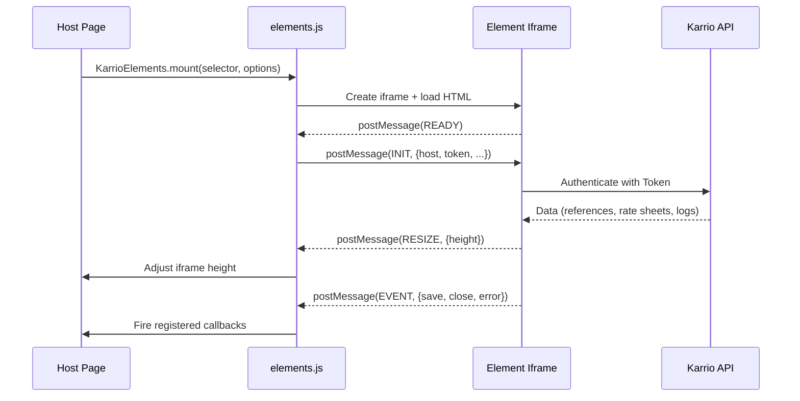

# Embeddable Elements

<div className="flex gap-2 mb-6">
  <div className="inline-flex items-center rounded-md bg-purple-50 px-2 py-1 text-xs font-medium text-purple-700 ring-1 ring-inset ring-purple-700/10 dark:bg-purple-400/10 dark:text-purple-400 dark:ring-purple-400/30">
    <span className="text-xs">Insiders</span>
  </div>
  <div className="inline-flex items-center rounded-md bg-amber-50 px-2 py-1 text-xs font-medium text-amber-700 ring-1 ring-inset ring-amber-700/10 dark:bg-amber-400/10 dark:text-amber-400 dark:ring-amber-400/30">
    <span className="text-xs">Enterprise</span>
  </div>
</div>

Embed Karrio's shipping UI components directly into any web application. Embeddable Elements are self-contained, iframe-based widgets that work with any frontend framework or vanilla HTML, no React dependency required on the host page.

## Overview

Karrio Elements provide drop-in UI components that connect to your Karrio instance via API token. Each element runs inside an isolated iframe, ensuring zero CSS conflicts, framework compatibility, and secure token handling.

### Available Elements

| Element | Description | Use Case |
|---------|-------------|----------|
| **Rate Sheet Editor** | Full-featured rate sheet creation and editing interface | Custom rate management in partner portals |
| **Developer Tools** | Interactive developer drawer with API logs, events, webhooks, GraphiQL, and Swagger playground | Debugging and API exploration in admin panels |
| **Template Editor** | HTML document template editor with live preview and PDF generation | Custom packing slips, invoices, and shipping documents |
| **Carrier Connections** | Carrier account management with connection list, creation, editing, and OAuth support | Carrier onboarding in partner portals |

## Architecture



The host page loads a lightweight script (`elements.js`, ~3KB, no React) that manages iframe lifecycle and communication via `postMessage`. The iframe contains the full React application, pre-built and bundled with all dependencies.

## Quick Start

### 1. Include the Elements Script

Add the elements script to your HTML page. This script exposes `window.KarrioElements`.

```html filename="index.html"
<script src="https://your-karrio-instance/static/karrio/elements/elements.js"></script>
```

### 2. Mount a Rate Sheet Editor

```html filename="ratesheet-example.html"
<div id="editor"></div>

<script>
  const editor = KarrioElements.mount('#editor', {
    host: 'https://api.karrio.io',
    token: 'key_xxxxxxxxxx',
    rateSheetId: 'rsh_...', // optional, omit for new sheet
    carrier: 'custom',       // optional
    connectionId: 'conn_...', // optional
    admin: false,             // use admin GraphQL endpoint
    iframeSrc: 'https://your-karrio-instance/static/karrio/elements/ratesheet.html',
  });

  editor
    .on('save', (data) => console.log('Rate sheet saved:', data))
    .on('close', () => editor.unmount())
    .on('error', (err) => console.error('Error:', err));
</script>
```

### 3. Mount Developer Tools

```html filename="devtools-example.html"
<div id="devtools"></div>

<script>
  const devtools = KarrioElements.mountDevtools('#devtools', {
    host: 'https://api.karrio.io',
    token: 'key_xxxxxxxxxx',
    admin: false,
    defaultView: 'activity', // activity, api-keys, logs, events, webhooks, apps, playground, graphiql
    iframeSrc: 'https://your-karrio-instance/static/karrio/elements/devtools.html',
  });

  devtools
    .on('close', () => devtools.unmount())
    .on('error', (err) => console.error('Error:', err));
</script>
```

### 4. Mount a Template Editor

```html filename="template-editor-example.html"
<div id="template"></div>

<script>
  const tmpl = KarrioElements.mountTemplateEditor('#template', {
    host: 'https://api.karrio.io',
    token: 'key_xxxxxxxxxx',
    templateId: 'tpl_...', // optional, omit for new template
    admin: false,
    iframeSrc: 'https://your-karrio-instance/static/karrio/elements/template-editor.html',
  });

  tmpl
    .on('save', () => console.log('Template saved'))
    .on('close', () => tmpl.unmount())
    .on('error', (err) => console.error('Error:', err));
</script>
```

### 5. Mount Carrier Connections

```html filename="connections-example.html"
<div id="connections"></div>

<script>
  const conn = KarrioElements.mountConnections('#connections', {
    host: 'https://api.karrio.io',
    token: 'key_xxxxxxxxxx',
    connectionId: 'car_...', // optional, opens edit dialog for this connection
    carrier: 'fedex',        // optional, pre-selects carrier for new connection
    admin: false,
    iframeSrc: 'https://your-karrio-instance/static/karrio/elements/connections.html',
  });

  conn
    .on('save', (data) => console.log('Connection saved:', data))
    .on('close', () => conn.unmount())
    .on('error', (err) => console.error('Error:', err));
</script>
```

## API Reference

### `KarrioElements.mount(selector, options)`

Mounts the Rate Sheet Editor element.

**Parameters:**

| Parameter | Type | Required | Description |
|-----------|------|----------|-------------|
| `selector` | `string \| HTMLElement` | Yes | CSS selector or DOM element to mount into |
| `options.host` | `string` | Yes | Karrio API base URL (e.g. `https://api.karrio.io`) |
| `options.token` | `string` | Yes | Karrio API key (`key_...`) |
| `options.rateSheetId` | `string` | No | ID of existing rate sheet to edit. Omit for new |
| `options.carrier` | `string` | No | Carrier slug (e.g. `custom`, `fedex`) |
| `options.connectionId` | `string` | No | Carrier connection ID |
| `options.admin` | `boolean` | No | Use admin GraphQL endpoint (`/admin/graphql`) |
| `options.iframeSrc` | `string` | No | Custom URL for the ratesheet HTML page |

**Returns:** `EditorHandle`

| Method | Description |
|--------|-------------|
| `.on(event, callback)` | Register event listener. Returns handle for chaining |
| `.unmount()` | Remove the element from the DOM |
| `.update(options)` | Update configuration and re-initialize |

**Events:** `save`, `close`, `error`

---

### `KarrioElements.mountDevtools(selector, options)`

Mounts the Developer Tools drawer element.

**Parameters:**

| Parameter | Type | Required | Description |
|-----------|------|----------|-------------|
| `selector` | `string \| HTMLElement` | Yes | CSS selector or DOM element to mount into |
| `options.host` | `string` | Yes | Karrio API base URL |
| `options.token` | `string` | Yes | Karrio API key |
| `options.admin` | `boolean` | No | Use admin GraphQL endpoint |
| `options.defaultView` | `string` | No | Tab to open by default (see below) |
| `options.iframeSrc` | `string` | No | Custom URL for the devtools HTML page |

**Default Views:** `activity`, `api-keys`, `logs`, `events`, `webhooks`, `apps`, `playground`, `graphiql`

**Returns:** `DevtoolsHandle`

| Method | Description |
|--------|-------------|
| `.on(event, callback)` | Register event listener. Returns handle for chaining |
| `.unmount()` | Remove the element from the DOM |

**Events:** `close`, `error`

---

### `KarrioElements.mountTemplateEditor(selector, options)`

Mounts the Document Template Editor element.

**Parameters:**

| Parameter | Type | Required | Description |
|-----------|------|----------|-------------|
| `selector` | `string \| HTMLElement` | Yes | CSS selector or DOM element to mount into |
| `options.host` | `string` | Yes | Karrio API base URL |
| `options.token` | `string` | Yes | Karrio API key |
| `options.admin` | `boolean` | No | Use admin GraphQL endpoint |
| `options.templateId` | `string` | No | ID of existing template to edit. Omit for new |
| `options.iframeSrc` | `string` | No | Custom URL for the template-editor HTML page |

**Returns:** `EditorHandle`

| Method | Description |
|--------|-------------|
| `.on(event, callback)` | Register event listener. Returns handle for chaining |
| `.unmount()` | Remove the element from the DOM |
| `.update(options)` | Update configuration and re-initialize |

**Events:** `save`, `close`, `error`

---

### `KarrioElements.mountConnections(selector, options)`

Mounts the Carrier Connections management element.

**Parameters:**

| Parameter | Type | Required | Description |
|-----------|------|----------|-------------|
| `selector` | `string \| HTMLElement` | Yes | CSS selector or DOM element to mount into |
| `options.host` | `string` | Yes | Karrio API base URL |
| `options.token` | `string` | Yes | Karrio API key |
| `options.admin` | `boolean` | No | Use admin GraphQL endpoint |
| `options.connectionId` | `string` | No | Open edit dialog for this connection on mount |
| `options.carrier` | `string` | No | Pre-select carrier when adding a new connection |
| `options.iframeSrc` | `string` | No | Custom URL for the connections HTML page |

**Returns:** `EditorHandle`

| Method | Description |
|--------|-------------|
| `.on(event, callback)` | Register event listener. Returns handle for chaining |
| `.unmount()` | Remove the element from the DOM |
| `.update(options)` | Update configuration and re-initialize |

**Events:** `save`, `close`, `error`

## Self-Hosting Elements

When self-hosting Karrio, elements are built and served as static files from the Django server.

### Build Elements

```bash filename="Terminal"
./bin/server build:elements
```

This command:
1. Installs dependencies and builds the Vite project in `packages/elements/`
2. Copies all output files to `apps/api/karrio/server/static/karrio/elements/`
3. Runs `collectstatic` to make them available at `/static/karrio/elements/`

### Output Files

| File | Description |
|------|-------------|
| `elements.js` | Host-side mounting script (~3KB, no React) |
| `globals.css` | Shared Tailwind CSS styles |
| `ratesheet.js` | Rate Sheet Editor React bundle |
| `ratesheet.html` | Rate Sheet Editor iframe shell |
| `devtools.js` | Developer Tools React bundle |
| `devtools.css` | Developer Tools styles (GraphiQL, Swagger) |
| `devtools.html` | Developer Tools iframe shell |
| `template-editor.js` | Template Editor React bundle |
| `template-editor.html` | Template Editor iframe shell |
| `connections.js` | Carrier Connections React bundle |
| `connections.html` | Carrier Connections iframe shell |
| `chunks/` | Shared code-split chunks |

### Serving from Django

Once built, elements are available at:

```
https://your-karrio-instance/static/karrio/elements/elements.js
https://your-karrio-instance/static/karrio/elements/ratesheet.html
https://your-karrio-instance/static/karrio/elements/devtools.html
https://your-karrio-instance/static/karrio/elements/template-editor.html
https://your-karrio-instance/static/karrio/elements/connections.html
```

Set the `iframeSrc` option to point to the HTML files on your Karrio instance.

## Framework Integration Examples

### React

```tsx filename="KarrioEditor.tsx"
import { useEffect, useRef } from 'react';

declare global {
  interface Window {
    KarrioElements: {
      mount: (selector: string | HTMLElement, options: any) => any;
      mountDevtools: (selector: string | HTMLElement, options: any) => any;
    };
  }
}

export function KarrioRateSheetEditor({ host, token, rateSheetId, onSave, onClose }: {
  host: string;
  token: string;
  rateSheetId?: string;
  onSave?: (data: any) => void;
  onClose?: () => void;
}) {
  const containerRef = useRef<HTMLDivElement>(null);
  const handleRef = useRef<any>(null);

  useEffect(() => {
    if (!containerRef.current) return;

    handleRef.current = window.KarrioElements.mount(containerRef.current, {
      host,
      token,
      rateSheetId,
    });

    handleRef.current
      .on('save', (data: any) => onSave?.(data))
      .on('close', () => onClose?.());

    return () => handleRef.current?.unmount();
  }, [host, token, rateSheetId]);

  return <div ref={containerRef} style={{ minHeight: 600 }} />;
}
```

### Vue 3

```vue filename="KarrioEditor.vue"
<template>
  <div ref="container" style="min-height: 600px" />
</template>

<script setup>
import { ref, onMounted, onUnmounted } from 'vue';

const props = defineProps({
  host: { type: String, required: true },
  token: { type: String, required: true },
  rateSheetId: String,
});

const emit = defineEmits(['save', 'close']);
const container = ref(null);
let handle = null;

onMounted(() => {
  handle = window.KarrioElements.mount(container.value, {
    host: props.host,
    token: props.token,
    rateSheetId: props.rateSheetId,
  });

  handle
    .on('save', (data) => emit('save', data))
    .on('close', () => emit('close'));
});

onUnmounted(() => handle?.unmount());
</script>
```

### Vanilla JavaScript

```html filename="vanilla.html"
<!DOCTYPE html>
<html>
<head>
  <title>Karrio Rate Sheet Editor</title>
  <style>
    #editor { max-width: 1200px; margin: 40px auto; }
  </style>
</head>
<body>
  <div id="editor"></div>

  <script src="/static/karrio/elements/elements.js"></script>
  <script>
    const editor = KarrioElements.mount('#editor', {
      host: 'https://api.karrio.io',
      token: 'key_xxxxxxxxxx',
    });

    editor.on('close', () => {
      editor.unmount();
      window.location.href = '/rate-sheets';
    });
  </script>
</body>
</html>
```

## Security Considerations

> [!NOTE]
> Elements use iframe isolation to prevent CSS and JavaScript conflicts with the host page. All API communication happens within the iframe using token-based authentication.

- **Token scope**: Use API keys with the minimum required permissions. Rate Sheet Editor needs rate sheet read/write access. Developer Tools needs read access to logs, events, and webhooks.
- **CORS**: The Karrio API must allow requests from the iframe origin. When self-hosting, ensure your CORS configuration includes the domain serving the element HTML files.
- **iframe sandboxing**: The host page creates iframes with standard permissions. For additional security, configure your CSP headers to restrict the iframe `src` to your Karrio instance.

## Troubleshooting

### Element does not load

Verify that the `iframeSrc` URL is accessible from the browser. Open the URL directly to confirm the HTML page loads.

### 401 Unauthorized errors

Ensure the API token is valid and has the required permissions. Elements use `Token` authentication (not `Bearer`).

### Chunks fail to load (404)

All element files (`*.js`, `*.css`, `chunks/`) must be served from the same directory as the HTML file. If using a CDN or custom path, ensure all files are co-located.

### CSS conflicts

Elements render inside an iframe, so host page styles cannot leak in. If styles look wrong, verify that `globals.css` and (for devtools) `devtools.css` are loaded by the HTML shell.

## Next Steps

- [API Integration](/docs/platform/app-store/api-integration) - Learn about the GraphQL and REST APIs used by elements
- [Building Apps](/docs/platform/app-store/building-apps) - Build full Karrio Apps with custom UI
- [Webhooks](/docs/products/webhooks) - Set up real-time event notifications
