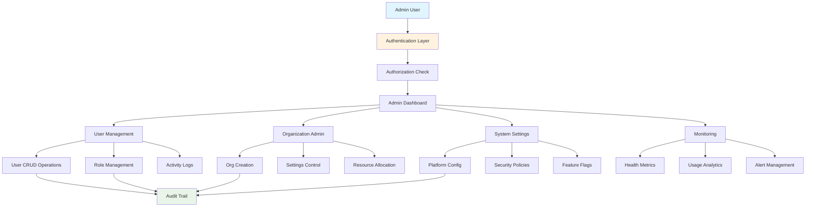

# Admin Console & System Management

<div className="flex gap-2 mb-6">
  <div className="inline-flex items-center rounded-md bg-purple-50 px-2 py-1 text-xs font-medium text-purple-700 ring-1 ring-inset ring-purple-700/10 dark:bg-purple-400/10 dark:text-purple-400 dark:ring-purple-400/30">
    <span className="text-xs">Insiders</span>
  </div>
  <div className="inline-flex items-center rounded-md bg-gray-50 px-2 py-1 text-xs font-medium text-gray-700 ring-1 ring-inset ring-gray-700/10 dark:bg-gray-400/10 dark:text-gray-400 dark:ring-gray-400/30">
    <span className="text-xs">System Admin</span>
  </div>
</div>

Every Karrio Insiders project comes with a comprehensive admin console, providing centralized system management, user administration, platform configuration, and monitoring tools for enterprise deployments.

## Features

### System Administration

You don't have to manage your Karrio platform manually. Our admin console provides complete oversight of users, organizations, system settings, and platform health from a single interface.

<div className="bg-gray-50 dark:bg-gray-900 rounded-lg p-4 my-6">
  <div className="text-sm text-gray-600 dark:text-gray-400 mb-2">
    Admin Console Dashboard
  </div>
  <div className="bg-white dark:bg-gray-800 rounded border h-64 flex items-center justify-center">
    <span className="text-gray-400">
      Screenshot: Admin dashboard with system metrics, user management, and
      organization overview
    </span>
  </div>
</div>

### User Management

Complete user lifecycle management including creation, role assignment, activity monitoring, and security controls.

### Organization Administration

Manage organizations across your platform with settings control, user allocation, and resource monitoring.

### Platform Configuration

System-wide settings management including security policies, feature flags, and integration configurations.

### Monitoring & Analytics

Real-time platform health monitoring, usage analytics, and performance metrics with alerting capabilities.

### Security Management

Advanced security controls including access policies, audit logs, and compliance monitoring.

### Additional features

- Karrio extends admin console with customizable dashboards and automated monitoring.
- Every admin action includes detailed audit trails and approval workflows.
- Karrio manages role-based access controls and permission inheritance.
- Support for custom admin plugins and third-party integrations.

## Data Flow

### Admin Console Architecture



## API Reference

### GraphQL API

#### Admin Authentication

```graphql
mutation AdminLogin($input: AdminLoginInput!) {
  adminLogin(input: $input) {
    token
    user {
      id
      email
      isStaff
      isSuperuser
      permissions
    }
    errors {
      field
      messages
    }
  }
}
```

**Variables:**

```json
{
  "input": {
    "email": "admin@company.com",
    "password": "admin_password"
  }
}
```

**Response:**

```json
{
  "data": {
    "adminLogin": {
      "token": "eyJ0eXAiOiJKV1QiLCJhbGciOiJIUzI1NiJ9...",
      "user": {
        "id": "admin_1234567890",
        "email": "admin@company.com",
        "isStaff": true,
        "isSuperuser": true,
        "permissions": [
          "admin.users",
          "admin.organizations",
          "admin.system",
          "admin.monitoring"
        ]
      },
      "errors": []
    }
  }
}
```

#### User Management

```graphql
query GetUsers($filter: UserFilter, $pagination: PaginationInput) {
  users(filter: $filter, first: $pagination.first, after: $pagination.after) {
    edges {
      node {
        id
        email
        firstName
        lastName
        isActive
        dateJoined
        lastLogin
        organizations {
          id
          name
          role
        }
      }
    }
    pageInfo {
      hasNextPage
      hasPreviousPage
      startCursor
      endCursor
    }
    totalCount
  }
}
```

**Variables:**

```json
{
  "filter": {
    "isActive": true,
    "organizationId": "org_1234567890"
  },
  "pagination": {
    "first": 20,
    "after": null
  }
}
```

**Response:**

```json
{
  "data": {
    "users": {
      "edges": [
        {
          "node": {
            "id": "usr_1234567890",
            "email": "user@example.com",
            "firstName": "John",
            "lastName": "Doe",
            "isActive": true,
            "dateJoined": "2024-01-15T10:30:00Z",
            "lastLogin": "2024-01-20T14:22:00Z",
            "organizations": [
              {
                "id": "org_1234567890",
                "name": "Acme Corp",
                "role": "admin"
              }
            ]
          }
        }
      ],
      "pageInfo": {
        "hasNextPage": true,
        "hasPreviousPage": false,
        "startCursor": "cursor123",
        "endCursor": "cursor456"
      },
      "totalCount": 150
    }
  }
}
```

#### Create User

```graphql
mutation CreateUser($input: CreateUserInput!) {
  createUser(input: $input) {
    user {
      id
      email
      firstName
      lastName
      isActive
    }
    errors {
      field
      messages
    }
  }
}
```

**Variables:**

```json
{
  "input": {
    "email": "newuser@example.com",
    "firstName": "Jane",
    "lastName": "Smith",
    "password": "secure_password",
    "isActive": true,
    "organizationId": "org_1234567890",
    "role": "member"
  }
}
```

**Response:**

```json
{
  "data": {
    "createUser": {
      "user": {
        "id": "usr_1234567891",
        "email": "newuser@example.com",
        "firstName": "Jane",
        "lastName": "Smith",
        "isActive": true
      },
      "errors": []
    }
  }
}
```

#### Organization Management

```graphql
query GetOrganizations($filter: OrganizationFilter) {
  organizations(filter: $filter) {
    edges {
      node {
        id
        name
        slug
        isActive
        createdAt
        userCount
        shipmentCount
        settings {
          maxUsers
          maxShipmentsPerMonth
          allowedCarriers
          features
        }
      }
    }
  }
}
```

**Variables:**

```json
{
  "filter": {
    "isActive": true,
    "createdAfter": "2024-01-01T00:00:00Z"
  }
}
```

**Response:**

```json
{
  "data": {
    "organizations": {
      "edges": [
        {
          "node": {
            "id": "org_1234567890",
            "name": "Acme Corporation",
            "slug": "acme-corp",
            "isActive": true,
            "createdAt": "2024-01-15T10:30:00Z",
            "userCount": 25,
            "shipmentCount": 1500,
            "settings": {
              "maxUsers": 50,
              "maxShipmentsPerMonth": 10000,
              "allowedCarriers": ["fedex", "ups", "usps"],
              "features": ["tracking", "webhooks", "batch_processing"]
            }
          }
        }
      ]
    }
  }
}
```

### REST API

#### System Configuration

```bash
curl -X GET "https://api.karrio.io/admin/system/config" \
  -H "Authorization: Token ADMIN_API_KEY"
```

**Response:**

```json
{
  "config": {
    "ALLOW_SIGNUP": false,
    "ALLOW_ADMIN_APPROVED_SIGNUP": true,
    "MULTI_ORGANIZATIONS": true,
    "ORDERS_MANAGEMENT": true,
    "AUDIT_LOGGING": true,
    "WEBHOOK_NOTIFICATIONS": true,
    "RATE_LIMITING": {
      "enabled": true,
      "requests_per_minute": 1000
    },
    "SECURITY": {
      "password_min_length": 8,
      "session_timeout": 3600,
      "require_2fa": false
    },
    "FEATURES": {
      "batch_processing": true,
      "document_generation": true,
      "advanced_tracking": true
    }
  }
}
```

#### Update System Settings

```bash
curl -X POST "https://api.karrio.io/admin/system/config" \
  -H "Authorization: Token ADMIN_API_KEY" \
  -H "Content-Type: application/json" \
  -d '{
    "ALLOW_SIGNUP": false,
    "ALLOW_ADMIN_APPROVED_SIGNUP": true,
    "MULTI_ORGANIZATIONS": true,
    "SECURITY": {
      "password_min_length": 12,
      "session_timeout": 7200,
      "require_2fa": true
    }
  }'
```

**Response:**

```json
{
  "success": true,
  "updated_settings": [
    "SECURITY.password_min_length",
    "SECURITY.session_timeout",
    "SECURITY.require_2fa"
  ],
  "message": "System configuration updated successfully"
}
```

#### Platform Health Status

```bash
curl -X GET "https://api.karrio.io/admin/health" \
  -H "Authorization: Token ADMIN_API_KEY"
```

**Response:**

```json
{
  "status": "healthy",
  "timestamp": "2024-01-15T10:30:00Z",
  "services": {
    "database": {
      "status": "healthy",
      "response_time": 15,
      "connections": 25
    },
    "redis": {
      "status": "healthy",
      "response_time": 2,
      "memory_usage": "45%"
    },
    "carrier_apis": {
      "status": "healthy",
      "ups": "operational",
      "fedex": "operational",
      "usps": "degraded"
    }
  },
  "metrics": {
    "active_users": 150,
    "organizations": 12,
    "shipments_today": 450,
    "api_requests_per_minute": 750
  }
}
```

## Admin Features

### User Administration

Complete user lifecycle management:

```javascript
class UserAdmin {
  constructor(adminToken) {
    this.adminToken = adminToken;
  }

  async createUser(userData) {
    const query = `
      mutation CreateUser($input: CreateUserInput!) {
        createUser(input: $input) {
          user {
            id
            email
            firstName
            lastName
            isActive
          }
          errors {
            field
            messages
          }
        }
      }
    `;

    const response = await fetch("/graphql", {
      method: "POST",
      headers: {
        Authorization: `Token ${this.adminToken}`,
        "Content-Type": "application/json",
      },
      body: JSON.stringify({
        query,
        variables: { input: userData },
      }),
    });

    return await response.json();
  }

  async updateUserRole(userId, organizationId, role) {
    const query = `
      mutation UpdateUserRole($input: UpdateUserRoleInput!) {
        updateUserRole(input: $input) {
          success
          errors {
            field
            messages
          }
        }
      }
    `;

    return await this.graphqlRequest(query, {
      input: { userId, organizationId, role },
    });
  }

  async getUserActivity(userId, timeRange = "7d") {
    const query = `
      query GetUserActivity($userId: ID!, $timeRange: String!) {
        userActivity(userId: $userId, timeRange: $timeRange) {
          activities {
            timestamp
            action
            resource
            details
            ipAddress
          }
          summary {
            totalActions
            lastSeen
            mostActiveHour
          }
        }
      }
    `;

    return await this.graphqlRequest(query, { userId, timeRange });
  }
}
```

### Organization Management

Comprehensive organization administration:

```javascript
class OrganizationAdmin {
  constructor(adminToken) {
    this.adminToken = adminToken;
  }

  async createOrganization(orgData) {
    const query = `
      mutation CreateOrganization($input: CreateOrganizationInput!) {
        createOrganization(input: $input) {
          organization {
            id
            name
            slug
            settings
          }
          errors {
            field
            messages
          }
        }
      }
    `;

    return await this.graphqlRequest(query, { input: orgData });
  }

  async updateOrganizationSettings(orgId, settings) {
    const query = `
      mutation UpdateOrganizationSettings($input: UpdateOrganizationSettingsInput!) {
        updateOrganizationSettings(input: $input) {
          organization {
            id
            settings
          }
          errors {
            field
            messages
          }
        }
      }
    `;

    return await this.graphqlRequest(query, {
      input: { organizationId: orgId, settings },
    });
  }

  async getOrganizationMetrics(orgId, timeRange = "30d") {
    const query = `
      query GetOrganizationMetrics($orgId: ID!, $timeRange: String!) {
        organizationMetrics(organizationId: $orgId, timeRange: $timeRange) {
          shipments {
            total
            successful
            failed
            trend
          }
          users {
            active
            inactive
            newSignups
          }
          costs {
            totalShipping
            averagePerShipment
            topCarriers
          }
        }
      }
    `;

    return await this.graphqlRequest(query, { orgId, timeRange });
  }
}
```

### System Monitoring

Platform health and performance monitoring:

```javascript
class SystemMonitor {
  constructor(adminToken) {
    this.adminToken = adminToken;
    this.alertThresholds = {
      apiResponseTime: 1000, // ms
      errorRate: 0.01, // 1%
      activeConnections: 1000,
    };
  }

  async getSystemHealth() {
    const response = await fetch("/admin/health", {
      headers: {
        Authorization: `Token ${this.adminToken}`,
      },
    });

    return await response.json();
  }

  async getPerformanceMetrics(timeRange = "24h") {
    const response = await fetch(`/admin/metrics?range=${timeRange}`, {
      headers: {
        Authorization: `Token ${this.adminToken}`,
      },
    });

    return await response.json();
  }

  async checkAlerts() {
    const health = await this.getSystemHealth();
    const alerts = [];

    // Check API response times
    if (
      health.services.database.response_time >
      this.alertThresholds.apiResponseTime
    ) {
      alerts.push({
        type: "performance",
        severity: "warning",
        message: "Database response time is elevated",
        value: health.services.database.response_time,
      });
    }

    // Check carrier API status
    Object.entries(health.services.carrier_apis).forEach(
      ([carrier, status]) => {
        if (status === "degraded" || status === "down") {
          alerts.push({
            type: "service",
            severity: status === "down" ? "critical" : "warning",
            message: `${carrier.toUpperCase()} API is ${status}`,
            carrier,
          });
        }
      },
    );

    return alerts;
  }

  async generateHealthReport() {
    const health = await this.getSystemHealth();
    const metrics = await this.getPerformanceMetrics();
    const alerts = await this.checkAlerts();

    return {
      timestamp: new Date().toISOString(),
      overallStatus: health.status,
      services: health.services,
      platformMetrics: health.metrics,
      performanceMetrics: metrics,
      activeAlerts: alerts,
      recommendations: this.generateRecommendations(health, metrics, alerts),
    };
  }

  generateRecommendations(health, metrics, alerts) {
    const recommendations = [];

    if (alerts.some((alert) => alert.type === "performance")) {
      recommendations.push({
        category: "performance",
        priority: "high",
        message: "Consider scaling database resources or optimizing queries",
      });
    }

    if (metrics.api_requests_per_minute > 800) {
      recommendations.push({
        category: "capacity",
        priority: "medium",
        message:
          "API usage approaching limits, consider rate limiting adjustments",
      });
    }

    return recommendations;
  }
}
```

## Security Features

### Access Control

Role-based access control with fine-grained permissions:

```javascript
const adminRoles = {
  superAdmin: {
    permissions: [
      "admin.users.create",
      "admin.users.update",
      "admin.users.delete",
      "admin.organizations.create",
      "admin.organizations.update",
      "admin.organizations.delete",
      "admin.system.config",
      "admin.monitoring.view",
    ],
  },
  organizationAdmin: {
    permissions: [
      "admin.users.create",
      "admin.users.update",
      "admin.organizations.view",
      "admin.organizations.update",
    ],
    scope: "organization",
  },
  supportAdmin: {
    permissions: [
      "admin.users.view",
      "admin.organizations.view",
      "admin.monitoring.view",
    ],
    readonly: true,
  },
};

class AccessControl {
  constructor(userRole, organizationId = null) {
    this.userRole = userRole;
    this.organizationId = organizationId;
  }

  hasPermission(permission, resourceId = null) {
    const roleConfig = adminRoles[this.userRole];

    if (!roleConfig || !roleConfig.permissions.includes(permission)) {
      return false;
    }

    // Check scope restrictions
    if (roleConfig.scope === "organization" && resourceId) {
      return this.organizationId === resourceId;
    }

    return true;
  }

  canAccessResource(resourceType, resourceId) {
    const basePermission = `admin.${resourceType}.view`;
    return this.hasPermission(basePermission, resourceId);
  }
}
```

### Audit Logging

Comprehensive audit trail for all admin actions:

```javascript
class AuditLogger {
  static async logAction(action, adminUser, details = {}) {
    const auditEntry = {
      timestamp: new Date().toISOString(),
      action,
      adminUserId: adminUser.id,
      adminUserEmail: adminUser.email,
      ipAddress: details.ipAddress,
      userAgent: details.userAgent,
      resourceType: details.resourceType,
      resourceId: details.resourceId,
      changes: details.changes,
      success: details.success !== false,
    };

    // Store in audit log
    await this.storeAuditEntry(auditEntry);

    // Send to monitoring system
    if (this.isHighRiskAction(action)) {
      await this.alertSecurityTeam(auditEntry);
    }
  }

  static isHighRiskAction(action) {
    const highRiskActions = [
      "user.delete",
      "organization.delete",
      "system.config_change",
      "admin.privilege_escalation",
    ];

    return highRiskActions.includes(action);
  }

  static async getAuditTrail(filters = {}) {
    const query = `
      query GetAuditTrail($filter: AuditFilter!) {
        auditTrail(filter: $filter) {
          entries {
            timestamp
            action
            adminUser {
              id
              email
            }
            resourceType
            resourceId
            changes
            success
          }
        }
      }
    `;

    return await this.graphqlRequest(query, { filter: filters });
  }
}
```

## Use Cases

### Enterprise Platform Management

Perfect for large-scale Karrio deployments:

- **Multi-Organization Management**: Centralized control of multiple business units
- **User Lifecycle Management**: Automated user provisioning and deprovisioning
- **Compliance Monitoring**: Audit trails and compliance reporting
- **Performance Optimization**: System monitoring and capacity planning

### SaaS Platform Operations

Designed for Karrio-based SaaS platforms:

- **Customer Organization Management**: Self-service and admin-managed customer accounts
- **Feature Flag Management**: Controlled rollout of new features
- **Usage Monitoring**: Track customer usage and billing metrics
- **Support Operations**: Customer support tools and account management

### Managed Service Providers

Built for MSPs offering shipping services:

- **Client Management**: Manage multiple client organizations
- **Service Level Monitoring**: Track SLA compliance and performance
- **Resource Allocation**: Manage capacity and resource distribution
- **Billing Integration**: Usage tracking for billing purposes

## Getting Started

Ready to manage your Karrio platform with the admin console? Follow these steps:

1. **Set up admin authentication** with appropriate role assignments
2. **Configure system settings** for your deployment requirements
3. **Implement monitoring** and alerting for platform health
4. **Establish audit procedures** for compliance and security

### Next Steps

- Learn about [user management](/docs/products/user-management) for detailed user administration
- Explore [multi-organizations](/docs/products/multi-orgs) for organization management
- Set up [webhooks](/docs/products/webhooks) for system event notifications
- Configure [api logs](/docs/products/api-logs) for detailed API monitoring
