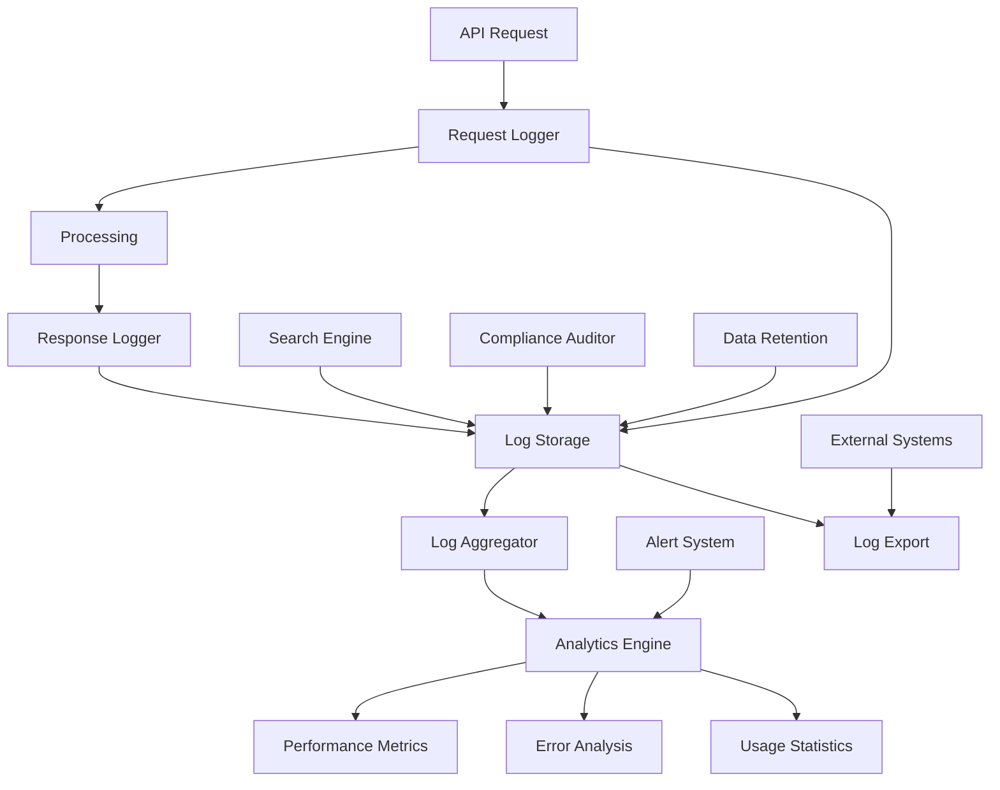

# API Logs

<div className="flex gap-2 mb-6">
  <div className="inline-flex items-center rounded-md bg-purple-50 px-2 py-1 text-xs font-medium text-purple-700 ring-1 ring-inset ring-purple-700/10 dark:bg-purple-400/10 dark:text-purple-400 dark:ring-purple-400/30">
    <span className="text-xs">Insiders</span>
  </div>
  <div className="inline-flex items-center rounded-md bg-teal-50 px-2 py-1 text-xs font-medium text-teal-700 ring-1 ring-inset ring-teal-700/10 dark:bg-teal-400/10 dark:text-teal-400 dark:ring-teal-400/30">
    <span className="text-xs">Monitoring</span>
  </div>
</div>

Every Karrio Insiders project comes with comprehensive API logging and monitoring capabilities, providing detailed request/response tracking, performance analytics, error monitoring, and usage insights with advanced search and filtering capabilities.

## Features

### Complete Request/Response Logging

You don't have to guess what's happening with your API calls. Our logging system captures every API interaction with full request and response details for comprehensive debugging and monitoring.

<div className="bg-gray-50 dark:bg-gray-900 rounded-lg p-4 my-6">
  <div className="text-sm text-gray-600 dark:text-gray-400 mb-2">
    API Logs Dashboard
  </div>
  <div className="bg-white dark:bg-gray-800 rounded border overflow-hidden">
    
  </div>
</div>

### Performance Monitoring

Track response times, throughput, and system performance across all API endpoints with detailed metrics and alerting.

### Error Analysis

Comprehensive error tracking with categorization, impact analysis, and debugging information to quickly identify and resolve issues.

### Advanced Search & Filtering

Powerful search capabilities across all log data with filtering by endpoint, user, organization, time range, and custom metadata.

### Compliance Auditing

Complete audit trails for regulatory compliance including data access logs, user activity, and system changes.

### Additional features

- Karrio extends API logs with custom retention policies and data export capabilities.
- Every log entry includes structured metadata for advanced analytics and reporting.
- Karrio manages log aggregation and real-time streaming for immediate insights.
- Support for custom log processors and external monitoring system integration.

## Data Flow

### API Logging Architecture



## API Reference

### GraphQL API

#### Query API Logs

```graphql
query GetLogs($filter: LogFilter) {
  logs(filter: $filter) {
    page_info {
      count
      has_next_page
      has_previous_page
      start_cursor
      end_cursor
    }
    edges {
      node {
        id
        path
        host
        data
        method
        response_ms
        remote_addr
        requested_at
        status_code
        query_params
        response
        records {
          id
          key
          timestamp
          test_mode
          created_at
          meta
          record
        }
      }
    }
  }
}
```

**Variables:**

```json
{
  "filter": {
    "method": ["POST", "GET"],
    "status_code": [200, 201, 400, 500],
    "path": "/v1/connections",
    "offset": 0,
    "first": 20
  }
}
```

**Response:**

```json
{
  "data": {
    "logs": {
      "page_info": {
        "count": 1185,
        "has_next_page": true,
        "has_previous_page": false,
        "start_cursor": "MTg2OA==",
        "end_cursor": "MTgzOA=="
      },
      "edges": [
        {
          "node": {
            "id": 1868,
            "path": "/v1/connections",
            "host": "localhost:5002",
            "data": {
              "active": true,
              "capabilities": ["shipping", "tracking"],
              "carrier_id": "aeroship:us:test",
              "carrier_name": "generic",
              "credentials": {
                "custom_carrier_name": "aeroship",
                "display_name": "Aeroship"
              },
              "metadata": {
                "description": "Generic test carrier for development"
              }
            },
            "method": "POST",
            "response_ms": 32,
            "remote_addr": "127.0.0.1",
            "requested_at": "2025-05-31T19:07:24.551739+00:00",
            "status_code": 201,
            "query_params": {},
            "response": {
              "id": "car_0f52413a83244fe49bd2d544d0440fb4",
              "object_type": "carrier-connection",
              "carrier_name": "aeroship",
              "display_name": "Aeroship",
              "carrier_id": "aeroship:us:test",
              "credentials": {
                "display_name": "Aeroship",
                "custom_carrier_name": "aeroship"
              },
              "capabilities": ["shipping"],
              "config": {},
              "metadata": {
                "description": "Generic test carrier for development"
              },
              "is_system": false,
              "active": true,
              "test_mode": true
            },
            "records": []
          }
        }
      ]
    }
  }
}
```

#### Get Single Log Entry

```graphql
query GetLog($id: Int!) {
  log(id: $id) {
    id
    requested_at
    response_ms
    path
    remote_addr
    host
    method
    query_params
    data
    response
    status_code
    records {
      id
      key
      timestamp
      test_mode
      created_at
      meta
      record
    }
  }
}
```

**Variables:**

```json
{
  "id": 1868
}
```

**Response:**

```json
{
  "data": {
    "log": {
      "id": 1868,
      "requested_at": "2025-05-31T19:07:24.551739+00:00",
      "response_ms": 32,
      "path": "/v1/connections",
      "remote_addr": "127.0.0.1",
      "host": "localhost:5002",
      "method": "POST",
      "query_params": {},
      "data": {
        "active": true,
        "capabilities": ["shipping", "tracking"],
        "carrier_id": "aeroship:us:test",
        "carrier_name": "generic",
        "credentials": {
          "custom_carrier_name": "aeroship",
          "display_name": "Aeroship"
        }
      },
      "response": {
        "id": "car_0f52413a83244fe49bd2d544d0440fb4",
        "object_type": "carrier-connection",
        "carrier_name": "aeroship",
        "display_name": "Aeroship",
        "active": true,
        "test_mode": true
      },
      "status_code": 201,
      "records": []
    }
  }
}
```

### JavaScript/TypeScript SDK

Using the Karrio SDK to access API logs:

```typescript
import { useLogs, useLog } from '@karrio/hooks';

// Query logs with filtering
const LogsComponent = () => {
  const { query, filter, setFilter } = useLogs({
    method: ['POST', 'GET'],
    status_code: [200, 201, 400, 500],
    offset: 0,
    first: 20
  });

  const handleFilterChange = (newFilter) => {
    setFilter({
      ...filter,
      ...newFilter
    });
  };

  if (query.isLoading) return <div>Loading logs...</div>;
  if (query.error) return <div>Error loading logs</div>;

  return (
    <div>
      <h3>API Request Logs</h3>
      {query.data?.logs.edges.map(({ node: log }) => (
        <div key={log.id}>
          <p>{log.method} {log.path} - {log.status_code}</p>
          <p>Response time: {log.response_ms}ms</p>
          <p>Host: {log.host}</p>
          <p>Remote address: {log.remote_addr}</p>
          <p>Requested at: {log.requested_at}</p>
        </div>
      ))}
    </div>
  );
};

// Get single log entry
const LogDetailComponent = ({ logId }) => {
  const { query } = useLog(logId);

  if (query.isLoading) return <div>Loading log...</div>;
  if (query.error) return <div>Error loading log</div>;

  const log = query.data?.log;

  return (
    <div>
      <h3>Log Details</h3>
      <p>ID: {log?.id}</p>
      <p>Path: {log?.path}</p>
      <p>Method: {log?.method}</p>
      <p>Status: {log?.status_code}</p>
      <p>Response time: {log?.response_ms}ms</p>
      <pre>{JSON.stringify(log?.data, null, 2)}</pre>
      <pre>{JSON.stringify(log?.response, null, 2)}</pre>
    </div>
  );
}
```

## Log Retention & Compliance

### Data Retention Policies

Configure automatic data retention based on your compliance requirements:

- **Standard Retention**: 90 days for request/response logs
- **Extended Retention**: 1 year for audit logs and compliance data
- **Custom Policies**: Define retention based on data sensitivity and regulations

### Export Capabilities

Export log data for external analysis or archival:

```typescript
// Export logs to external systems
const exportLogs = async (filter, format = "json") => {
  const { query } = useLogs(filter);

  // Export to various formats
  const exportFormats = ["json", "csv", "parquet"];

  return query.data?.logs.edges.map(({ node }) => ({
    id: node.id,
    timestamp: node.requested_at,
    method: node.method,
    path: node.path,
    status_code: node.status_code,
    response_time_ms: node.response_ms,
    remote_addr: node.remote_addr,
  }));
};
```

## Use Cases

### API Debugging & Troubleshooting

Perfect for development teams diagnosing integration issues:

- **Request/Response Analysis**: Complete request and response data for debugging
- **Performance Investigation**: Identify slow endpoints and bottlenecks
- **Error Pattern Analysis**: Track error frequencies and root causes
- **User-Specific Issues**: Investigate problems for specific users or organizations

### Operations & Monitoring

Essential for platform monitoring and capacity planning:

- **Real-Time Performance**: Monitor response times and system health
- **Usage Analytics**: Track API adoption and growth patterns
- **Capacity Planning**: Analyze traffic for infrastructure scaling decisions
- **Alert Generation**: Automated alerts for errors and performance degradation

### Compliance & Auditing

Meet regulatory requirements with comprehensive audit trails:

- **Access Logging**: Complete audit trail of data access and modifications
- **Regulatory Compliance**: GDPR, HIPAA, SOC2 compliance reporting
- **Security Monitoring**: Track suspicious activity and access patterns
- **Data Retention**: Automated retention policies and secure archival

## Getting Started

Ready to implement comprehensive API logging with Karrio? Follow these steps:

1. **Configure log retention** policies for your compliance requirements
2. **Set up monitoring** and alerting for critical API metrics
3. **Implement log analysis** workflows for debugging and optimization
4. **Create compliance reports** for audit and regulatory requirements

### Next Steps

- Learn about [webhooks](/docs/products/webhooks) for real-time event monitoring
- Explore [events](/docs/products/events) to understand the full event system
- Set up [admin console](/docs/products/admin-console) for centralized log management
- Configure [workflows](/docs/products/workflows) for automated log-based triggers
