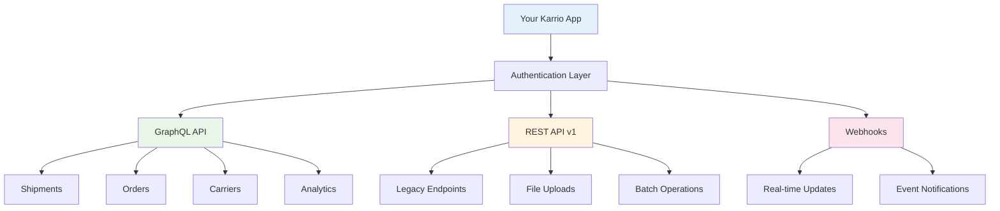

# API Integration

<div className="flex gap-2 mb-6">
  <div className="inline-flex items-center rounded-md bg-purple-50 px-2 py-1 text-xs font-medium text-purple-700 ring-1 ring-inset ring-purple-700/10 dark:bg-purple-400/10 dark:text-purple-400 dark:ring-purple-400/30">
    <span className="text-xs">Insiders</span>
  </div>
  <div className="inline-flex items-center rounded-md bg-amber-50 px-2 py-1 text-xs font-medium text-amber-700 ring-1 ring-inset ring-amber-700/10 dark:bg-amber-400/10 dark:text-amber-400 dark:ring-amber-400/30">
    <span className="text-xs">Enterprise</span>
  </div>
</div>

Learn how to integrate your Karrio Apps with Karrio's powerful APIs to access shipping data, manage orders, and automate workflows.

## Overview

Karrio provides comprehensive APIs that allow your apps to:

- **Access shipping data** - shipments, rates, tracking, labels
- **Manage carrier connections** - configure and test carrier integrations
- **Process orders** - create, update, and fulfill orders
- **Handle webhooks** - receive real-time notifications
- **Manage customers** - addresses, preferences, and profiles
- **Generate reports** - analytics, insights, and custom data exports

## API Architecture

Karrio offers multiple API interfaces to suit different use cases:



## GraphQL API

### Setup and Authentication

Your app automatically receives authentication credentials when installed:

```tsx
import { createKarrioClient } from "@karrio/app-store";

export default function MyApp({ app, context }) {
  // API client is automatically configured with your app's credentials
  const karrio = context.karrio;

  // Or create a custom client
  const customClient = createKarrioClient(app.installation.api_key);

  // GraphQL queries and mutations
  const fetchShipments = async () => {
    const query = `
      query GetShipments($first: Int!) {
        shipments(first: $first) {
          edges {
            node {
              id
              tracking_number
              status
              recipient {
                name
                address
              }
              carrier {
                name
                service
              }
              created_at
            }
          }
        }
      }
    `;

    const result = await karrio.graphql(query, { first: 10 });
    return result.data.shipments;
  };

  return <div>{/* Your app UI */}</div>;
}
```

### Common GraphQL Operations

#### Fetching Shipments

```tsx
const SHIPMENTS_QUERY = `
  query GetShipments(
    $first: Int
    $after: String
    $filters: ShipmentFilter
  ) {
    shipments(first: $first, after: $after, filter: $filters) {
      edges {
        node {
          id
          tracking_number
          status
          service
          recipient {
            name
            company
            address_line1
            city
            state_code
            postal_code
            country_code
          }
          shipper {
            name
            company
            address_line1
            city
            state_code
            postal_code
            country_code
          }
          parcels {
            weight
            width
            height
            length
            weight_unit
            dimension_unit
          }
          carrier {
            name
            carrier_id
          }
          rates {
            service
            total_charge
            currency
            estimated_delivery
          }
          messages {
            code
            message
            level
          }
          created_at
          updated_at
        }
      }
      pageInfo {
        hasNextPage
        hasPreviousPage
        startCursor
        endCursor
      }
    }
  }
`;

export function useShipments(filters = {}) {
  const [shipments, setShipments] = useState([]);
  const [loading, setLoading] = useState(false);
  const [error, setError] = useState(null);

  const fetchShipments = async (variables = {}) => {
    try {
      setLoading(true);
      const result = await karrio.graphql(SHIPMENTS_QUERY, {
        first: 20,
        filters,
        ...variables,
      });

      setShipments(result.data.shipments.edges.map((edge) => edge.node));
    } catch (err) {
      setError(err.message);
    } finally {
      setLoading(false);
    }
  };

  useEffect(() => {
    fetchShipments();
  }, []);

  return { shipments, loading, error, refetch: fetchShipments };
}
```

#### Updating Shipments

```tsx
const UPDATE_SHIPMENT_MUTATION = `
  mutation UpdateShipment($input: PartialShipmentMutationInput!) {
    partial_shipment_update(input: $input) {
      shipment {
        id
        tracking_number
        status
        label_url
        selected_rate {
          service
          total_charge
          currency
        }
      }
      errors {
        field
        messages
      }
    }
  }
`;

export function useUpdateShipment() {
  const [updating, setUpdating] = useState(false);

  const updateShipment = async (shipmentId: string, updateData) => {
    try {
      setUpdating(true);

      const result = await karrio.graphql(UPDATE_SHIPMENT_MUTATION, {
        input: {
          id: shipmentId,
          ...updateData,
        },
      });

      if (result.data.partial_shipment_update.errors?.length > 0) {
        throw new Error(
          result.data.partial_shipment_update.errors[0].messages[0],
        );
      }

      return result.data.partial_shipment_update.shipment;
    } catch (error) {
      throw error;
    } finally {
      setUpdating(false);
    }
  };

  return { updateShipment, updating };
}
```

#### Working with Shipments via REST API

Since GraphQL mutations for creating shipments use the REST API under the hood, you can also use the REST endpoints directly:

```tsx
export function useShipmentOperations() {
  const [loading, setLoading] = useState(false);

  const fetchRates = async (rateData) => {
    try {
      setLoading(true);

      const response = await karrio.post("/v1/proxy/rates", {
        recipient: {
          name: rateData.recipient.name,
          company: rateData.recipient.company,
          address_line1: rateData.recipient.address_line1,
          city: rateData.recipient.city,
          state_code: rateData.recipient.state_code,
          postal_code: rateData.recipient.postal_code,
          country_code: rateData.recipient.country_code,
          phone_number: rateData.recipient.phone_number,
          email: rateData.recipient.email,
        },
        parcels: rateData.parcels.map((parcel) => ({
          weight: parcel.weight,
          width: parcel.width,
          height: parcel.height,
          length: parcel.length,
          weight_unit: parcel.weight_unit || "LB",
          dimension_unit: parcel.dimension_unit || "IN",
        })),
        services: rateData.services, // Optional: specific services
        options: rateData.options || {},
        reference: rateData.reference,
      });

      return response.rates;
    } catch (error) {
      throw error;
    } finally {
      setLoading(false);
    }
  };

  const createShipment = async (shipmentData) => {
    try {
      setLoading(true);

      const response = await karrio.post("/v1/shipments", {
        recipient: shipmentData.recipient,
        parcels: shipmentData.parcels,
        service: shipmentData.service,
        options: shipmentData.options || {},
        reference: shipmentData.reference,
        selected_rate_id: shipmentData.selected_rate_id,
      });

      return response;
    } catch (error) {
      throw error;
    } finally {
      setLoading(false);
    }
  };

  return { fetchRates, createShipment, loading };
}
```

#### Managing Carrier Connections

```tsx
const USER_CONNECTIONS_QUERY = `
  query GetUserConnections($filter: CarrierFilter) {
    user_connections(filter: $filter) {
      id
      carrier_id
      carrier_name
      display_name
      active
      test_mode
      capabilities
      services {
        service_name
        service_code
      }
      created_at
    }
  }
`;

const CREATE_CARRIER_MUTATION = `
  mutation CreateCarrier($input: CreateCarrierConnectionMutationInput!) {
    create_carrier_connection(input: $input) {
      carrier {
        id
        carrier_id
        display_name
        active
      }
      errors {
        field
        messages
      }
    }
  }
`;

export function useCarrierConnections() {
  const [carriers, setCarriers] = useState([]);
  const [loading, setLoading] = useState(false);

  const fetchCarriers = async () => {
    try {
      setLoading(true);
      const result = await karrio.graphql(USER_CONNECTIONS_QUERY, {
        filter: { active: true },
      });
      setCarriers(result.data.user_connections);
    } catch (error) {
      console.error("Failed to fetch carriers:", error);
    } finally {
      setLoading(false);
    }
  };

  const createCarrier = async (carrierData) => {
    const result = await karrio.graphql(CREATE_CARRIER_MUTATION, {
      input: {
        carrier_id: carrierData.carrier_id,
        display_name: carrierData.display_name,
        test_mode: carrierData.test_mode || false,
        active: carrierData.active || true,
        settings: carrierData.settings,
      },
    });

    if (result.data.create_carrier_connection.errors?.length > 0) {
      throw new Error(
        result.data.create_carrier_connection.errors[0].messages[0],
      );
    }

    return result.data.create_carrier_connection.carrier;
  };

  useEffect(() => {
    fetchCarriers();
  }, []);

  return { carriers, loading, fetchCarriers, createCarrier };
}
```

## REST API Integration

### Using the REST Client

```tsx
import { createKarrioClient } from "@karrio/app-store";

export default function MyApp({ app, context }) {
  const karrio = context.karrio;

  // REST API calls
  const fetchShipments = async () => {
    try {
      const response = await karrio.get("/v1/shipments", {
        limit: 20,
        offset: 0,
      });

      return response.results;
    } catch (error) {
      console.error("Failed to fetch shipments:", error);
      throw error;
    }
  };

  const createShipment = async (shipmentData) => {
    try {
      const response = await karrio.post("/v1/shipments", shipmentData);
      return response;
    } catch (error) {
      console.error("Failed to create shipment:", error);
      throw error;
    }
  };

  const uploadDocument = async (file, shipmentId) => {
    try {
      const formData = new FormData();
      formData.append("file", file);
      formData.append("shipment_id", shipmentId);

      const response = await karrio.post("/v1/documents", formData, {
        headers: {
          "Content-Type": "multipart/form-data",
        },
      });

      return response;
    } catch (error) {
      console.error("Failed to upload document:", error);
      throw error;
    }
  };

  return <div>{/* Your app UI */}</div>;
}
```

### Common REST Endpoints

#### Shipments

```tsx
// GET /v1/shipments - List shipments
const shipments = await karrio.get("/v1/shipments", {
  limit: 20,
  offset: 0,
  status: "in_transit",
  carrier: "fedex",
});

// POST /v1/shipments - Create shipment
const newShipment = await karrio.post("/v1/shipments", {
  recipient: {
    name: "John Doe",
    address_line1: "123 Main St",
    city: "New York",
    state_code: "NY",
    postal_code: "10001",
    country_code: "US",
  },
  parcels: [
    {
      weight: 1.5,
      width: 10,
      height: 10,
      length: 10,
      weight_unit: "LB",
      dimension_unit: "IN",
    },
  ],
  service: "fedex_ground",
});

// GET /v1/shipments/{id} - Get specific shipment
const shipment = await karrio.get(`/v1/shipments/${shipmentId}`);

// PUT /v1/shipments/{id} - Update shipment
const updatedShipment = await karrio.put(`/v1/shipments/${shipmentId}`, {
  reference: "Updated reference",
});

// DELETE /v1/shipments/{id} - Cancel shipment
await karrio.delete(`/v1/shipments/${shipmentId}`);
```

#### Tracking

```tsx
// GET /v1/trackers - List tracking records
const trackers = await karrio.get("/v1/trackers");

// POST /v1/trackers - Create tracking record
const tracker = await karrio.post("/v1/trackers", {
  tracking_number: "1Z999AA1234567890",
  carrier_name: "ups",
});

// GET /v1/trackers/{id} - Get tracking details
const trackingDetails = await karrio.get(`/v1/trackers/${trackerId}`);
```

#### Rate Shopping

```tsx
// POST /v1/rates - Get shipping rates
const rates = await karrio.post("/v1/rates", {
  recipient: {
    name: "John Doe",
    address_line1: "123 Main St",
    city: "New York",
    state_code: "NY",
    postal_code: "10001",
    country_code: "US",
  },
  parcels: [
    {
      weight: 1.5,
      width: 10,
      height: 10,
      length: 10,
      weight_unit: "LB",
      dimension_unit: "IN",
    },
  ],
  services: ["fedex_ground", "ups_ground", "usps_priority"],
});
```

## Webhooks Integration

### Setting Up Webhooks

```tsx
// In your app's API route (e.g., /api/webhooks/karrio)
import { NextRequest, NextResponse } from "next/server";
import { authenticateAppRequest } from "@karrio/app-store";

export async function POST(request: NextRequest) {
  try {
    // Authenticate the webhook request
    const appContext = await authenticateAppRequest("your-app-id", request);

    const payload = await request.json();

    // Handle different webhook events
    switch (payload.event) {
      case "shipment.created":
        await handleShipmentCreated(payload.data);
        break;

      case "shipment.delivered":
        await handleShipmentDelivered(payload.data);
        break;

      case "tracking.updated":
        await handleTrackingUpdated(payload.data);
        break;

      default:
        console.log("Unhandled webhook event:", payload.event);
    }

    return NextResponse.json({ received: true });
  } catch (error) {
    console.error("Webhook error:", error);
    return NextResponse.json(
      { error: "Webhook processing failed" },
      { status: 500 },
    );
  }
}

async function handleShipmentCreated(shipment) {
  // Send notification to your system
  await sendNotification({
    type: "shipment_created",
    message: `New shipment created: ${shipment.tracking_number}`,
    data: shipment,
  });

  // Update your database
  await updateShipmentRecord(shipment);
}

async function handleShipmentDelivered(shipment) {
  // Mark as delivered in your system
  await markShipmentDelivered(shipment.id);

  // Send delivery confirmation
  await sendDeliveryConfirmation(shipment);
}

async function handleTrackingUpdated(tracking) {
  // Update tracking information
  await updateTrackingInfo(tracking);

  // Notify customers if needed
  if (tracking.status === "exception") {
    await notifyCustomerOfException(tracking);
  }
}
```

### Webhook Event Types

```tsx
interface WebhookEvent {
  event: string;
  created_at: string;
  data: any;
  test_mode: boolean;
}

// Available webhook events:
const WEBHOOK_EVENTS = {
  // Shipment events
  "shipment.created": "Shipment created",
  "shipment.cancelled": "Shipment cancelled",
  "shipment.delivered": "Shipment delivered",
  "shipment.failed": "Shipment failed",

  // Tracking events
  "tracking.updated": "Tracking information updated",
  "tracking.delivered": "Package delivered",
  "tracking.exception": "Delivery exception",

  // Order events
  "order.created": "Order created",
  "order.fulfilled": "Order fulfilled",
  "order.cancelled": "Order cancelled",

  // Carrier events
  "carrier.connected": "Carrier connection established",
  "carrier.disconnected": "Carrier connection lost",
  "carrier.rate_updated": "Carrier rates updated",
};
```

## Real-time Data

### Server-Sent Events (SSE)

```tsx
import { useEffect, useState } from "react";

export function useRealtimeShipments(appContext) {
  const [shipments, setShipments] = useState([]);
  const [connectionStatus, setConnectionStatus] = useState("connecting");

  useEffect(() => {
    const eventSource = new EventSource(
      `/api/sse/shipments?token=${appContext.apiKey}`,
      {
        withCredentials: true,
      },
    );

    eventSource.onopen = () => {
      setConnectionStatus("connected");
    };

    eventSource.onmessage = (event) => {
      const data = JSON.parse(event.data);

      switch (data.type) {
        case "shipment_created":
          setShipments((prev) => [data.shipment, ...prev]);
          break;

        case "shipment_updated":
          setShipments((prev) =>
            prev.map((s) => (s.id === data.shipment.id ? data.shipment : s)),
          );
          break;

        case "shipment_deleted":
          setShipments((prev) => prev.filter((s) => s.id !== data.shipment_id));
          break;
      }
    };

    eventSource.onerror = () => {
      setConnectionStatus("error");
    };

    return () => {
      eventSource.close();
    };
  }, [appContext.apiKey]);

  return { shipments, connectionStatus };
}
```

### WebSocket Integration

```tsx
import { useEffect, useState, useRef } from "react";

export function useWebSocketConnection(appContext) {
  const [socket, setSocket] = useState(null);
  const [connectionStatus, setConnectionStatus] = useState("disconnected");
  const reconnectTimeoutRef = useRef(null);

  const connect = () => {
    const ws = new WebSocket(
      `wss://api.karrio.io/ws?token=${appContext.apiKey}`,
    );

    ws.onopen = () => {
      setConnectionStatus("connected");
      setSocket(ws);

      // Subscribe to channels
      ws.send(
        JSON.stringify({
          type: "subscribe",
          channels: ["shipments", "tracking", "orders"],
        }),
      );
    };

    ws.onmessage = (event) => {
      const data = JSON.parse(event.data);
      handleWebSocketMessage(data);
    };

    ws.onclose = () => {
      setConnectionStatus("disconnected");
      setSocket(null);

      // Attempt to reconnect after 3 seconds
      reconnectTimeoutRef.current = setTimeout(() => {
        connect();
      }, 3002);
    };

    ws.onerror = (error) => {
      console.error("WebSocket error:", error);
      setConnectionStatus("error");
    };
  };

  const disconnect = () => {
    if (socket) {
      socket.close();
    }
    if (reconnectTimeoutRef.current) {
      clearTimeout(reconnectTimeoutRef.current);
    }
  };

  const sendMessage = (message) => {
    if (socket && socket.readyState === WebSocket.OPEN) {
      socket.send(JSON.stringify(message));
    }
  };

  useEffect(() => {
    connect();
    return disconnect;
  }, []);

  return { socket, connectionStatus, sendMessage };
}

function handleWebSocketMessage(data) {
  switch (data.type) {
    case "shipment_update":
      // Handle real-time shipment updates
      break;
    case "tracking_update":
      // Handle real-time tracking updates
      break;
    default:
      console.log("Unknown message type:", data.type);
  }
}
```

## Error Handling

### API Error Management

```tsx
import { useState } from "react";

export class APIError extends Error {
  constructor(message, code, details = null) {
    super(message);
    this.name = "APIError";
    this.code = code;
    this.details = details;
  }
}

export function useApiCall() {
  const [loading, setLoading] = useState(false);
  const [error, setError] = useState(null);

  const executeCall = async (apiCall) => {
    try {
      setLoading(true);
      setError(null);

      const result = await apiCall();
      return result;
    } catch (err) {
      const apiError = handleApiError(err);
      setError(apiError);
      throw apiError;
    } finally {
      setLoading(false);
    }
  };

  return { executeCall, loading, error };
}

function handleApiError(error) {
  if (error.response) {
    // API returned an error response
    const { status, data } = error.response;

    switch (status) {
      case 400:
        return new APIError(
          data.message || "Bad request",
          "BAD_REQUEST",
          data.errors,
        );
      case 401:
        return new APIError("Authentication failed", "UNAUTHORIZED");
      case 403:
        return new APIError("Access denied", "FORBIDDEN");
      case 404:
        return new APIError("Resource not found", "NOT_FOUND");
      case 429:
        return new APIError("Rate limit exceeded", "RATE_LIMITED");
      case 500:
        return new APIError("Internal server error", "SERVER_ERROR");
      default:
        return new APIError(
          `HTTP ${status}: ${data.message || "Unknown error"}`,
          "HTTP_ERROR",
        );
    }
  } else if (error.request) {
    // Network error
    return new APIError(
      "Network error - please check your connection",
      "NETWORK_ERROR",
    );
  } else {
    // Other error
    return new APIError(
      error.message || "Unknown error occurred",
      "UNKNOWN_ERROR",
    );
  }
}
```

### Retry Logic

```tsx
export function useRetryableApiCall(maxRetries = 3, retryDelay = 1000) {
  const { executeCall } = useApiCall();

  const executeWithRetry = async (apiCall) => {
    let lastError;

    for (let attempt = 1; attempt <= maxRetries; attempt++) {
      try {
        return await executeCall(apiCall);
      } catch (error) {
        lastError = error;

        // Don't retry certain errors
        if (error.code === "UNAUTHORIZED" || error.code === "FORBIDDEN") {
          throw error;
        }

        // If this was the last attempt, throw the error
        if (attempt === maxRetries) {
          throw error;
        }

        // Wait before retrying
        await new Promise((resolve) =>
          setTimeout(resolve, retryDelay * attempt),
        );
      }
    }

    throw lastError;
  };

  return { executeWithRetry };
}
```

## Testing API Integrations

### Mock API Responses

```tsx
// __tests__/api-integration.test.tsx
import { render, screen, waitFor } from "@testing-library/react";
import { rest } from "msw";
import { setupServer } from "msw/node";
import MyApp from "../MyApp";

const server = setupServer(
  rest.get("/v1/shipments", (req, res, ctx) => {
    return res(
      ctx.json({
        results: [
          {
            id: "1",
            tracking_number: "TEST123",
            status: "delivered",
            recipient: { name: "John Doe" },
          },
        ],
      }),
    );
  }),

  rest.post("/v1/shipments", (req, res, ctx) => {
    return res(
      ctx.json({
        id: "2",
        tracking_number: "TEST456",
        status: "created",
      }),
    );
  }),
);

beforeAll(() => server.listen());
afterEach(() => server.resetHandlers());
afterAll(() => server.close());

test("fetches and displays shipments", async () => {
  render(<MyApp />);

  await waitFor(() => {
    expect(screen.getByText("TEST123")).toBeInTheDocument();
    expect(screen.getByText("John Doe")).toBeInTheDocument();
  });
});

test("creates new shipment", async () => {
  render(<MyApp />);

  // Simulate creating a shipment
  // ... test implementation
});
```

## API Coverage Notes

Some operations in the examples above use REST endpoints because:

- **Shipment Creation**: Use `POST /v1/shipments` REST endpoint
- **Rate Fetching**: Use `POST /v1/proxy/rates` REST endpoint
- **Tracking Data**: Use `GET /v1/trackers/{tracking_number}` REST endpoint

The GraphQL API focuses on data querying and app management, while shipping operations are primarily handled through REST endpoints.

## Best Practices

### 1. Caching Strategy

```tsx
import { useQuery } from "@tanstack/react-query";

export function useShipmentsWithCache() {
  return useQuery({
    queryKey: ["shipments"],
    queryFn: fetchShipments,
    staleTime: 5 * 60 * 1000, // 5 minutes
    cacheTime: 10 * 60 * 1000, // 10 minutes
    refetchOnWindowFocus: false,
  });
}
```

### 2. Request Optimization

```tsx
// Batch multiple requests
export async function batchApiCalls(calls) {
  return Promise.allSettled(calls);
}

// Use pagination for large datasets
export function usePaginatedShipments(pageSize = 20) {
  const [page, setPage] = useState(1);

  const query = useQuery({
    queryKey: ["shipments", page],
    queryFn: () =>
      fetchShipments({
        limit: pageSize,
        offset: (page - 1) * pageSize,
      }),
    keepPreviousData: true,
  });

  return {
    ...query,
    page,
    setPage,
    hasNextPage: query.data?.count > page * pageSize,
  };
}
```

### 3. Rate Limiting

```tsx
import { throttle } from "lodash";

// Throttle API calls to avoid rate limits
const throttledApiCall = throttle(apiCall, 1000); // Max 1 call per second
```

## Next Steps

- **[Examples](/docs/products/app-store/examples)** - See complete integration examples
- **[Deployment](/docs/products/app-store/deployment)** - Deploy your integrated app
- **[Authentication](/docs/products/app-store/authentication)** - Review authentication methods

## Resources

- **[GraphQL Playground](https://api.karrio.io/graphql)** - Interactive GraphQL explorer
- **[API Reference](https://docs.karrio.io/api)** - Complete API documentation
- **[Postman Collection](https://postman.karrio.io)** - Ready-to-use API requests
- **[Status Page](https://status.karrio.io)** - API uptime and incidents

---

_Master Karrio's APIs to build powerful, data-driven shipping applications!_
