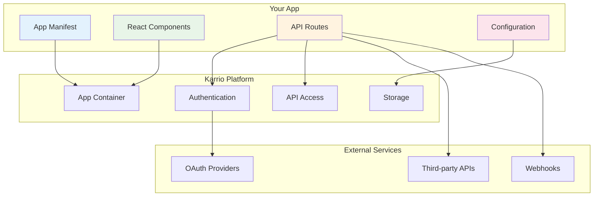

# Karrio Apps - Getting Started

<div className="flex gap-2 mb-6">
  <div className="inline-flex items-center rounded-md bg-purple-50 px-2 py-1 text-xs font-medium text-purple-700 ring-1 ring-inset ring-purple-700/10 dark:bg-purple-400/10 dark:text-purple-400 dark:ring-purple-400/30">
    <span className="text-xs">Insiders</span>
  </div>
  <div className="inline-flex items-center rounded-md bg-amber-50 px-2 py-1 text-xs font-medium text-amber-700 ring-1 ring-inset ring-amber-700/10 dark:bg-amber-400/10 dark:text-amber-400 dark:ring-amber-400/30">
    <span className="text-xs">Enterprise</span>
  </div>
</div>

Karrio Apps enable developers to extend Karrio's shipping platform with custom integrations, embedded user interfaces, and powerful automation. Whether you're building internal tools or creating apps for the marketplace, this guide will help you get started.

## What are Karrio Apps?

Karrio Apps are custom integrations that can:

- **Embed UI components** directly in the Karrio dashboard
- **Access Karrio's API** with proper authentication and permissions
- **Store configuration data** securely with encrypted credentials
- **Handle webhooks** for real-time data synchronization
- **Integrate with external services** like e-commerce platforms, ERPs, and carriers

## Quick Start

### 1. Create Your First App

Start by creating a simple "Hello World" app to understand the basics:

```bash
# Create a new app directory
mkdir my-karrio-app
cd my-karrio-app

# Create the app manifest
touch manifest.ts
touch component.tsx
```

Create your app manifest:

```typescript
// manifest.ts
import { AppManifest } from "@karrio/app-store/types";

export const manifest: AppManifest = {
  id: "hello-world",
  name: "Hello World",
  version: "1.0.0",
  description: "A simple hello world app for Karrio",
  author: {
    name: "Your Name",
    email: "you@example.com",
  },
  permissions: ["manage_shipments"],
  assets: {
    icon: "./assets/icon.svg",
    screenshots: ["./assets/screenshot1.png"],
    readme: "./README.md",
  },
  components: {
    main: "./component.tsx",
  },
};
```

Create your main component:

```tsx
// component.tsx
import React from "react";
import { AppComponentProps } from "@karrio/app-store/types";

export default function HelloWorldApp({ app, context }: AppComponentProps) {
  const { user, organization } = context;

  return (
    <div className="p-6">
      <h1 className="text-2xl font-bold mb-4">Hello World!</h1>
      <p className="text-gray-600 mb-4">
        Welcome to your first Karrio app, {user.full_name}!
      </p>
      <div className="bg-gray-50 p-4 rounded-lg">
        <h2 className="font-semibold mb-2">App Information</h2>
        <ul className="text-sm space-y-1">
          <li>
            <strong>App ID:</strong> {app.id}
          </li>
          <li>
            <strong>Organization:</strong> {organization.name}
          </li>
          <li>
            <strong>Installation ID:</strong> {app.installation.id}
          </li>
        </ul>
      </div>
    </div>
  );
}
```

### 2. Install and Test Your App

Install your app through the Karrio dashboard or via API:

```graphql
mutation InstallApp {
  install_app(
    input: {
      app_id: "hello-world"
      app_type: "private"
      access_scopes: ["manage_shipments"]
    }
  ) {
    installation {
      id
      app_id
      api_key
      is_active
    }
    errors {
      field
      messages
    }
  }
}
```

Your app will now be available in the Karrio dashboard with its own dedicated space.

## App Types

Karrio supports three types of apps:

### Built-in Apps

Pre-installed apps that come with Karrio. These are developed and maintained by the Karrio team.

```typescript
// Install a built-in app
const installation = await installApp({
  app_id: "shipping-optimizer",
  app_type: "builtin",
});
```

### Marketplace Apps

Public apps available in the Karrio App Store. These go through a review process before being published.

```typescript
// Install a marketplace app
const installation = await installApp({
  app_id: "shopify-integration",
  app_type: "marketplace",
  access_scopes: ["manage_shipments", "manage_orders"],
});
```

### Private Apps

Custom apps built for specific organizations. These can be internal tools or custom integrations.

```typescript
// Install a private app with OAuth
const installation = await installApp({
  app_id: "custom-erp-sync",
  app_type: "private",
  requires_oauth: true,
  oauth_app_data: {
    display_name: "Custom ERP Sync",
    launch_url: "https://your-app.com/karrio/launch",
    redirect_uris: "https://your-app.com/karrio/callback",
  },
});
```

## App Architecture

Karrio Apps follow a structured architecture that ensures security, scalability, and maintainability:



## Key Features

### 🔐 Secure Authentication

- Automatic API key generation for each app installation
- OAuth2 integration for external service authentication
- JWT-based session management for embedded apps
- Encrypted credential storage

### 🎨 Embedded UI Components

- React-based component system
- Access to Karrio's design system and UI components
- Responsive layouts that work across devices
- Real-time data updates

### 🔌 API Integration

- Full access to Karrio's GraphQL and REST APIs
- Scoped permissions for fine-grained access control
- Rate limiting and request validation
- Webhook support for real-time events

### ⚙️ Configuration Management

- Secure storage of app settings and credentials
- User-friendly configuration interfaces
- Environment-specific configurations
- Automatic encryption of sensitive data

## Development Workflow

### 1. Planning Your App

Before you start coding, consider:

- What problem does your app solve?
- What Karrio data do you need access to?
- Do you need to integrate with external services?
- Will your app have a user interface?

### 2. Setting Up Development

```bash
# Clone the Karrio repository (for access to types and utilities)
git clone https://github.com/karrioapi/karrio.git

# Install dependencies
npm install @karrio/app-store @karrio/types

# Set up your development environment
export KARRIO_API_URL="http://localhost:8000"
export KARRIO_API_KEY="your-dev-api-key"
```

### 3. Building Your App

Follow the modular architecture:

```text
my-app/
├── manifest.ts          # App configuration
├── component.tsx        # Main React component
├── configuration.tsx    # Settings interface (optional)
├── api/                 # Server-side logic
│   ├── webhooks.ts      # Webhook handlers
│   └── sync.ts          # Background jobs
├── assets/              # Static assets
│   ├── icon.svg
│   └── screenshots/
└── types.ts            # TypeScript definitions
```

### 4. Testing and Deployment

- Test your app in a development environment
- Use the Karrio test suite for integration testing
- Deploy to staging for user acceptance testing
- Submit to the marketplace or install privately

## Example Apps

### Shipping Task Manager

A simple task management app for shipping operations:

```tsx
import React, { useState } from "react";
import { Button, Card, Badge } from "@karrio/ui";

export default function ShippingTasksApp({ app, karrio }) {
  const [tasks, setTasks] = useState([]);

  const addTask = async (title: string, priority: string) => {
    const task = {
      id: Date.now().toString(),
      title,
      priority,
      completed: false,
      created_at: new Date().toISOString(),
    };

    setTasks([...tasks, task]);

    // Optionally sync with external system
    await karrio.post("/api/tasks", task);
  };

  return (
    <div className="space-y-4">
      <div className="flex justify-between items-center">
        <h2 className="text-xl font-semibold">Shipping Tasks</h2>
        <Button onClick={() => addTask("New Task", "medium")}>Add Task</Button>
      </div>

      <div className="grid gap-4">
        {tasks.map((task) => (
          <Card key={task.id} className="p-4">
            <div className="flex justify-between items-center">
              <h3 className="font-medium">{task.title}</h3>
              <Badge variant={task.priority}>{task.priority}</Badge>
            </div>
          </Card>
        ))}
      </div>
    </div>
  );
}
```

### E-commerce Integration

Connect Karrio with your e-commerce platform:

```tsx
export default function ShopifyIntegrationApp({ app, karrio, context }) {
  const [connected, setConnected] = useState(false);
  const [orders, setOrders] = useState([]);

  const connectShopify = async () => {
    // OAuth flow to connect with Shopify
    const authUrl = await app.oauth.getAuthorizationUrl("shopify");
    window.location.href = authUrl;
  };

  const syncOrders = async () => {
    const shopifyOrders = await app.api.get("/shopify/orders");
    const shipments = await Promise.all(
      shopifyOrders.map((order) =>
        karrio.createShipment({
          recipient: order.shipping_address,
          parcels: order.line_items.map((item) => ({
            weight: item.weight,
            description: item.title,
          })),
        }),
      ),
    );

    setOrders(shipments);
  };

  return (
    <div className="space-y-6">
      {!connected ? (
        <div className="text-center py-8">
          <h2 className="text-xl mb-4">Connect your Shopify Store</h2>
          <Button onClick={connectShopify}>Connect with Shopify</Button>
        </div>
      ) : (
        <div>
          <div className="flex justify-between items-center mb-4">
            <h2 className="text-xl">Recent Orders</h2>
            <Button onClick={syncOrders}>Sync Orders</Button>
          </div>

          {/* Order list and management */}
          <OrdersList orders={orders} karrio={karrio} />
        </div>
      )}
    </div>
  );
}
```

## Next Steps

Ready to build your first Karrio app? Here's what to explore next:

1. **[Authentication](/docs/products/app-store/authentication)** - Learn about secure authentication methods
2. **[Building Apps](/docs/products/app-store/building-apps)** - Deep dive into app development
3. **[App Manifest](/docs/products/app-store/app-manifest)** - Understand app configuration
4. **[UI Components](/docs/products/app-store/ui-components)** - Build beautiful interfaces
5. **[API Integration](/docs/products/app-store/api-integration)** - Connect with Karrio's APIs
6. **[Examples](/docs/products/app-store/examples)** - See more real-world examples

## Support

Need help building your app? Here are some resources:

- **Documentation**: Comprehensive guides and API references
- **Community**: Join our Discord server for discussions
- **GitHub**: Report issues and contribute to the platform
- **Support**: Contact our team for enterprise support

---

_Ready to transform shipping with custom apps? Let's build something amazing together!_
