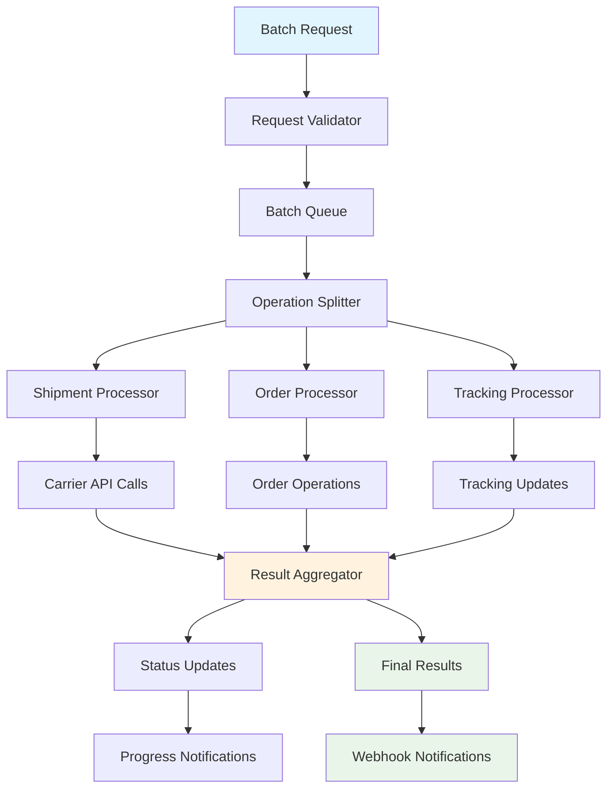

---

sidebarTitle: Batch Processing
title: Batch Processing
description: Process multiple shipments, orders, and tracking requests efficiently with bulk operations
tags: ["batch", "bulk", "processing", "operations", "efficiency", "automation"]

---

# Batch Processing

Karrio's Batch Processing system enables efficient handling of large volumes of shipping operations. Process hundreds or thousands of shipments, orders, and tracking requests in single API calls with automatic error handling and progress monitoring.

## Overview

Instead of making individual API calls for each operation, batch processing allows you to submit multiple operations together, reducing API overhead and improving performance. Perfect for high-volume shippers, e-commerce platforms, and enterprise integrations.

### Key Benefits

- **High Performance**: Process thousands of operations in single requests
- **Error Isolation**: Individual operation failures don't affect the entire batch
- **Progress Monitoring**: Real-time status updates on batch processing
- **Automatic Retry**: Failed operations are automatically retried
- **Resource Optimization**: Reduced API calls and improved throughput

## Architecture

### Batch Processing Flow



### Supported Operations

#### Shipment Operations

- **Bulk Shipment Creation**: Create multiple shipments simultaneously
- **Bulk Label Purchase**: Purchase labels for multiple shipments
- **Bulk Rate Requests**: Get rates for multiple shipment requests
- **Bulk Cancellation**: Cancel multiple shipments

#### Order Operations

- **Bulk Order Creation**: Create multiple orders
- **Bulk Order Fulfillment**: Fulfill multiple orders with shipments
- **Bulk Status Updates**: Update status for multiple orders

#### Tracking Operations

- **Bulk Tracking Creation**: Create trackers for multiple packages
- **Bulk Status Updates**: Update tracking status for multiple packages
- **Bulk Tracking Requests**: Request tracking updates for multiple packages

## Getting Started

### 1. Create Your First Batch

```bash
curl -X POST "https://api.karrio.io/v1/batches/shipments" \
  -H "Authorization: Token YOUR_API_KEY" \
  -H "Content-Type: application/json" \
  -d '{
    "shipments": [
      {
        "recipient": {
          "person_name": "John Doe",
          "address_line1": "123 Main St",
          "city": "New York",
          "state_code": "NY",
          "postal_code": "10001",
          "country_code": "US"
        },
        "parcels": [
          {
            "weight": 2.5,
            "weight_unit": "LB"
          }
        ]
      },
      {
        "recipient": {
          "person_name": "Jane Smith",
          "address_line1": "456 Oak Ave",
          "city": "Los Angeles",
          "state_code": "CA",
          "postal_code": "90210",
          "country_code": "US"
        },
        "parcels": [
          {
            "weight": 1.8,
            "weight_unit": "LB"
          }
        ]
      }
    ],
    "options": {
      "async": true,
      "notify_webhook": "https://your-app.com/webhooks/batch"
    }
  }'
```

### 2. Monitor Batch Progress

```javascript
const karrio = require("karrio");

const client = new karrio.Client({
  apiKey: "YOUR_API_KEY",
  testMode: true,
});

// Submit batch operation
const batch = await client.batches.shipments.create({
  shipments: shipmentData,
  options: {
    async: true,
    auto_purchase: false,
  },
});

console.log("Batch ID:", batch.id);

// Monitor progress
const checkProgress = async () => {
  const status = await client.batches.operations.retrieve(batch.id);

  console.log(`Progress: ${status.completed_count}/${status.total_count}`);
  console.log(`Status: ${status.status}`);
  console.log(`Success Rate: ${status.success_rate}%`);

  if (status.status === "completed") {
    console.log("Batch completed!");
    console.log("Results:", status.results);
  } else if (status.status === "processing") {
    // Check again in 30 seconds
    setTimeout(checkProgress, 30000);
  }
};

checkProgress();
```

### 3. Handle Batch Results

```javascript
// Process batch results
function processBatchResults(batchResults) {
  const successful = batchResults.filter((result) => result.success);
  const failed = batchResults.filter((result) => !result.success);

  console.log(`Successful operations: ${successful.length}`);
  console.log(`Failed operations: ${failed.length}`);

  // Process successful shipments
  successful.forEach((result) => {
    console.log(`Shipment created: ${result.data.tracking_number}`);
    // Update your database, send notifications, etc.
  });

  // Handle failed operations
  failed.forEach((result) => {
    console.error(`Operation failed: ${result.error.message}`);
    // Log errors, retry if appropriate, notify administrators
  });
}
```

## Batch Operations

### Bulk Shipment Creation

Create multiple shipments efficiently:

```javascript
// Create batch of shipments
const shipmentBatch = await client.batches.shipments.create({
  shipments: [
    {
      recipient: {
        person_name: "Customer 1",
        address_line1: "123 First St",
        city: "New York",
        state_code: "NY",
        postal_code: "10001",
        country_code: "US",
      },
      parcels: [{ weight: 2.0, weight_unit: "LB" }],
      reference: "ORDER-001",
    },
    {
      recipient: {
        person_name: "Customer 2",
        address_line1: "456 Second Ave",
        city: "Los Angeles",
        state_code: "CA",
        postal_code: "90210",
        country_code: "US",
      },
      parcels: [{ weight: 1.5, weight_unit: "LB" }],
      reference: "ORDER-002",
    },
  ],
  options: {
    auto_purchase: true, // Automatically purchase labels
    carrier_ids: ["fedex_connection", "ups_connection"],
    async: true,
  },
});
```

### Bulk Order Processing

Process multiple orders in batch:

```javascript
// Create batch of orders
const orderBatch = await client.batches.orders.create({
  orders: [
    {
      order_id: "ORDER-001",
      customer: {
        name: "John Doe",
        email: "john@example.com",
        shipping_address: {
          address_line1: "123 Main St",
          city: "New York",
          state_code: "NY",
          postal_code: "10001",
          country_code: "US",
        },
      },
      line_items: [
        {
          sku: "PRODUCT-001",
          quantity: 2,
          weight: 1.0,
          weight_unit: "LB",
        },
      ],
    },
    {
      order_id: "ORDER-002",
      customer: {
        name: "Jane Smith",
        email: "jane@example.com",
        shipping_address: {
          address_line1: "456 Oak Ave",
          city: "Los Angeles",
          state_code: "CA",
          postal_code: "90210",
          country_code: "US",
        },
      },
      line_items: [
        {
          sku: "PRODUCT-002",
          quantity: 1,
          weight: 0.5,
          weight_unit: "LB",
        },
      ],
    },
  ],
  options: {
    auto_fulfill: true, // Automatically create shipments
    async: true,
  },
});
```

### Bulk Tracking Updates

Update tracking for multiple packages:

```javascript
// Create batch tracking requests
const trackingBatch = await client.batches.trackers.create({
  tracking_requests: [
    {
      tracking_number: "1Z999AA1234567890",
      carrier_name: "ups",
    },
    {
      tracking_number: "1234567890123456",
      carrier_name: "fedex",
    },
    {
      tracking_number: "9400111899562123456789",
      carrier_name: "usps",
    },
  ],
  options: {
    async: true,
    update_existing: true,
  },
});
```

## Advanced Features

### Data Import

Import data from CSV or Excel files:

```javascript
// Import shipments from CSV
const importBatch = await client.batches.dataImport.create({
  file: fs.readFileSync("shipments.csv"),
  file_type: "csv",
  operation_type: "shipments",
  mapping: {
    "Customer Name": "recipient.person_name",
    Address: "recipient.address_line1",
    City: "recipient.city",
    State: "recipient.state_code",
    ZIP: "recipient.postal_code",
    Weight: "parcels[0].weight",
    "Order ID": "reference",
  },
  options: {
    skip_header: true,
    auto_purchase: false,
    validate_addresses: true,
  },
});

console.log("Import batch ID:", importBatch.id);
```

### Batch Validation

Validate data before processing:

```javascript
// Validate batch data before submission
const validation = await client.batches.validate({
  operation_type: "shipments",
  data: shipmentData,
  validation_rules: {
    required_fields: ["recipient.address_line1", "recipient.postal_code"],
    address_validation: true,
    weight_limits: { min: 0.1, max: 150 },
  },
});

if (validation.valid) {
  // Proceed with batch creation
  const batch = await client.batches.shipments.create({
    shipments: shipmentData,
  });
} else {
  // Handle validation errors
  console.error("Validation errors:", validation.errors);
}
```

### Batch Scheduling

Schedule batch operations for later execution:

```javascript
// Schedule batch for later processing
const scheduledBatch = await client.batches.schedule({
  operation_type: "shipments",
  data: shipmentData,
  schedule: {
    execute_at: "2024-01-15T09:00:00Z",
    timezone: "America/New_York",
  },
  options: {
    auto_purchase: true,
    notify_webhook: "https://your-app.com/webhooks/scheduled-batch",
  },
});
```

## Error Handling and Recovery

### Partial Failure Handling

Handle scenarios where some operations succeed and others fail:

```javascript
// Process batch with error handling
async function processBatchWithRetry(batchData) {
  try {
    const batch = await client.batches.shipments.create({
      shipments: batchData,
      options: {
        continue_on_error: true, // Don't stop on individual failures
        max_retries: 3,
      },
    });

    // Wait for completion
    const results = await waitForBatchCompletion(batch.id);

    // Separate successful and failed operations
    const successful = results.filter((r) => r.success);
    const failed = results.filter((r) => !r.success);

    // Retry failed operations with different settings
    if (failed.length > 0) {
      const retryData = failed.map((f) => f.original_data);
      await retryFailedOperations(retryData);
    }

    return { successful, failed };
  } catch (error) {
    console.error("Batch processing error:", error);
    throw error;
  }
}

async function retryFailedOperations(failedData) {
  // Retry with different carrier or settings
  const retryBatch = await client.batches.shipments.create({
    shipments: failedData,
    options: {
      carrier_ids: ["backup_carrier"], // Use backup carrier
      service_preference: "ground", // Use cheaper service
    },
  });

  return retryBatch;
}
```

### Batch Recovery

Recover from interrupted batch operations:

```javascript
// Resume interrupted batch
async function resumeBatch(batchId) {
  const batch = await client.batches.operations.retrieve(batchId);

  if (batch.status === "failed" || batch.status === "partial") {
    // Get failed operations
    const failedOperations = batch.results.filter((r) => !r.success);

    if (failedOperations.length > 0) {
      // Retry failed operations
      const retryData = failedOperations.map((op) => op.original_data);

      const retryBatch = await client.batches.shipments.create({
        shipments: retryData,
        options: {
          parent_batch_id: batchId, // Link to original batch
          retry_attempt: true,
        },
      });

      return retryBatch;
    }
  }

  return batch;
}
```

## Performance Optimization

### Batch Sizing

Optimize batch sizes for best performance:

```javascript
// Optimal batch sizing strategy
function createOptimalBatches(data, maxBatchSize = 100) {
  const batches = [];

  for (let i = 0; i < data.length; i += maxBatchSize) {
    const batchData = data.slice(i, i + maxBatchSize);
    batches.push(batchData);
  }

  return batches;
}

// Process large datasets in optimal batches
async function processLargeDataset(largeDataset) {
  const batches = createOptimalBatches(largeDataset, 100);
  const results = [];

  // Process batches in parallel (with concurrency limit)
  const concurrencyLimit = 3;

  for (let i = 0; i < batches.length; i += concurrencyLimit) {
    const batchGroup = batches.slice(i, i + concurrencyLimit);

    const batchPromises = batchGroup.map((batchData) =>
      client.batches.shipments.create({
        shipments: batchData,
        options: { async: true },
      }),
    );

    const batchResults = await Promise.all(batchPromises);
    results.push(...batchResults);

    // Wait between batch groups to avoid rate limits
    if (i + concurrencyLimit < batches.length) {
      await new Promise((resolve) => setTimeout(resolve, 1000));
    }
  }

  return results;
}
```

### Progress Monitoring

Implement efficient progress monitoring:

```javascript
// Efficient batch monitoring
class BatchMonitor {
  constructor(client) {
    this.client = client;
    this.activeBatches = new Map();
  }

  async monitorBatch(batchId, callback) {
    this.activeBatches.set(batchId, {
      callback,
      lastCheck: Date.now(),
    });

    this.startMonitoring();
  }

  async startMonitoring() {
    if (this.monitoringInterval) return;

    this.monitoringInterval = setInterval(async () => {
      const batchIds = Array.from(this.activeBatches.keys());

      if (batchIds.length === 0) {
        clearInterval(this.monitoringInterval);
        this.monitoringInterval = null;
        return;
      }

      // Check all active batches
      for (const batchId of batchIds) {
        try {
          const status = await this.client.batches.operations.retrieve(batchId);
          const batchInfo = this.activeBatches.get(batchId);

          // Call callback with status update
          batchInfo.callback(status);

          // Remove completed batches
          if (status.status === "completed" || status.status === "failed") {
            this.activeBatches.delete(batchId);
          }
        } catch (error) {
          console.error(`Error monitoring batch ${batchId}:`, error);
        }
      }
    }, 10000); // Check every 10 seconds
  }
}

// Usage
const monitor = new BatchMonitor(client);

monitor.monitorBatch(batchId, (status) => {
  console.log(
    `Batch ${status.id}: ${status.completed_count}/${status.total_count} completed`,
  );

  if (status.status === "completed") {
    console.log("Batch completed successfully!");
  }
});
```

## Integration with Karrio Ecosystem

### With Webhooks

Receive real-time batch updates:

```javascript
// Handle batch webhook events
app.post("/webhooks/batch", (req, res) => {
  const event = req.body;

  switch (event.type) {
    case "batch.started":
      console.log(`Batch ${event.data.id} started processing`);
      break;

    case "batch.progress":
      console.log(`Batch ${event.data.id}: ${event.data.progress}% complete`);
      break;

    case "batch.completed":
      console.log(`Batch ${event.data.id} completed`);
      processBatchResults(event.data.results);
      break;

    case "batch.failed":
      console.error(`Batch ${event.data.id} failed:`, event.data.error);
      handleBatchFailure(event.data);
      break;
  }

  res.status(200).send("OK");
});
```

### With Orders and Shipments

Seamless integration with order fulfillment:

```javascript
// Batch order fulfillment workflow
async function fulfillOrdersBatch(orders) {
  // Create orders in batch
  const orderBatch = await client.batches.orders.create({
    orders: orders,
    options: { async: true },
  });

  // Wait for order creation to complete
  const orderResults = await waitForBatchCompletion(orderBatch.id);

  // Extract successful orders
  const successfulOrders = orderResults
    .filter((r) => r.success)
    .map((r) => r.data);

  // Create shipments for successful orders
  const shipmentData = successfulOrders.map((order) => ({
    recipient: order.customer.shipping_address,
    parcels: order.line_items.map((item) => ({
      weight: item.weight,
      weight_unit: item.weight_unit,
      items: [item],
    })),
    reference: order.order_id,
    metadata: { order_id: order.id },
  }));

  // Create shipments in batch
  const shipmentBatch = await client.batches.shipments.create({
    shipments: shipmentData,
    options: {
      auto_purchase: true,
      async: true,
    },
  });

  return { orderBatch, shipmentBatch };
}
```

## Best Practices

### Data Preparation

```javascript
// Validate and prepare data before batch processing
function prepareBatchData(rawData) {
  return rawData
    .filter((item) => validateItem(item))
    .map((item) => normalizeItem(item))
    .slice(0, 1000); // Limit batch size
}

function validateItem(item) {
  // Check required fields
  if (!item.recipient?.address_line1 || !item.recipient?.postal_code) {
    console.warn("Invalid item - missing address:", item);
    return false;
  }

  // Check weight limits
  if (!item.parcels?.[0]?.weight || item.parcels[0].weight <= 0) {
    console.warn("Invalid item - missing or invalid weight:", item);
    return false;
  }

  return true;
}

function normalizeItem(item) {
  return {
    ...item,
    recipient: {
      ...item.recipient,
      country_code: item.recipient.country_code || "US",
      postal_code: item.recipient.postal_code.replace(/\s+/g, ""),
    },
  };
}
```

### Error Recovery

```javascript
// Implement robust error recovery
async function robustBatchProcessing(data) {
  const maxRetries = 3;
  let attempt = 0;

  while (attempt < maxRetries) {
    try {
      const batch = await client.batches.shipments.create({
        shipments: data,
        options: {
          continue_on_error: true,
          timeout: 300, // 5 minutes
        },
      });

      const results = await waitForBatchCompletion(batch.id);

      // Check success rate
      const successRate =
        results.filter((r) => r.success).length / results.length;

      if (successRate >= 0.95) {
        // 95% success rate threshold
        return results;
      } else {
        // Retry failed items
        const failedData = results
          .filter((r) => !r.success)
          .map((r) => r.original_data);

        data = failedData;
        attempt++;
      }
    } catch (error) {
      console.error(`Batch attempt ${attempt + 1} failed:`, error);
      attempt++;

      if (attempt < maxRetries) {
        // Exponential backoff
        await new Promise((resolve) =>
          setTimeout(resolve, Math.pow(2, attempt) * 1000),
        );
      }
    }
  }

  throw new Error("Batch processing failed after maximum retries");
}
```

## What's Next

Ready to implement batch processing? Explore these resources:

### API Documentation

- **[Batch Operations API](/docs/reference/api/batches)**: Complete batch processing API
- **[Data Import API](/docs/reference/api/data-import)**: Import data from files
- **[Batch Monitoring](/docs/reference/api/batch-monitoring)**: Monitor batch progress

### Integration Guides

- **[CSV Import Guide](/docs/guides/csv-import)**: Import shipments from CSV files
- **[E-commerce Batch Processing](/docs/integrations/ecommerce-batch)**: Batch process e-commerce orders
- **[Enterprise Integration](/docs/integrations/enterprise-batch)**: Enterprise-scale batch processing

### Performance Guides

- **[Optimization Guide](/docs/guides/batch-optimization)**: Optimize batch performance
- **[Error Handling](/docs/guides/batch-error-handling)**: Handle batch errors effectively
- **[Monitoring and Alerting](/docs/guides/batch-monitoring)**: Monitor batch operations

---

**Need help with batch processing?** Join our [community Discord](https://discord.gg/karrio) or contact our support team for enterprise batch processing guidance.
