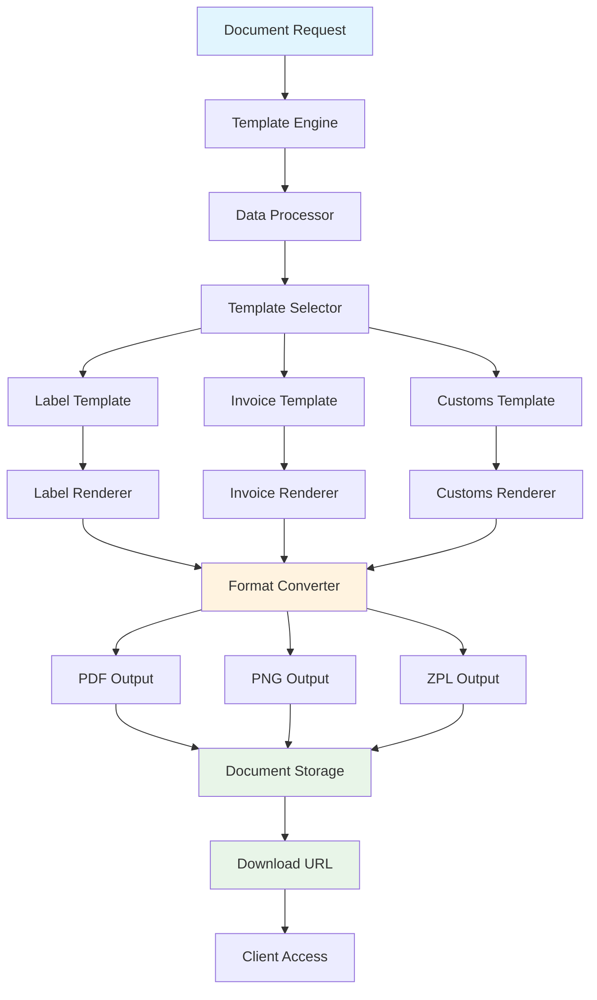

# Document Generation

<div className="flex gap-2 mb-6">
  <div className="inline-flex items-center rounded-md bg-green-50 px-2 py-1 text-xs font-medium text-green-700 ring-1 ring-inset ring-green-600/20 dark:bg-green-400/10 dark:text-green-400 dark:ring-green-400/30">
    <span className="text-xs">Community Edition</span>
  </div>
  <div className="inline-flex items-center rounded-md bg-blue-50 px-2 py-1 text-xs font-medium text-blue-700 ring-1 ring-inset ring-blue-700/10 dark:bg-blue-400/10 dark:text-blue-400 dark:ring-blue-400/30">
    <span className="text-xs">Core Feature</span>
  </div>
</div>

Every Karrio project comes with comprehensive document generation capabilities, providing automated creation of shipping labels, commercial invoices, customs documents, and other shipping paperwork with customizable templates and multi-format support.

## Features

### Automated Document Creation

You don't have to manually create shipping documents. Our document generation system automatically creates professional labels, invoices, and customs forms during shipment processing.

<div className="bg-gray-50 dark:bg-gray-900 rounded-lg p-4 my-6">
  <div className="text-sm text-gray-600 dark:text-gray-400 mb-2">
    Document Generation Dashboard
  </div>
  <div className="bg-white dark:bg-gray-800 rounded border overflow-hidden">
    
  </div>
</div>

### Multi-Format Support

Generate documents in multiple formats including PDF, PNG, ZPL, and EPL to support different printer types and use cases.

### Custom Templates

Create branded document templates that match your business identity with custom logos, colors, and layouts. **Note**: Custom document generation currently supports PDF format only, with additional formats coming in future releases.

### Regulatory Compliance

Ensure all generated documents meet international shipping requirements and carrier specifications.

### Batch Processing

Generate multiple documents efficiently with bulk operations and automated workflows.

### Additional features

- Karrio extends document generation with real-time template customization and branding.
- Every document includes automatic validation against carrier and regulatory requirements.
- Karrio manages document storage and retrieval with secure access controls.
- Support for thermal printers and industrial label printing systems.

## Data Flow

### Document Generation Flow



## API Reference

### REST API

#### Generate Shipping Label (Automatic)

Shipping labels are automatically generated when you create a shipment. You can specify the format:

```bash
curl -X POST "https://api.karrio.io/v1/shipments" \
  -H "Authorization: Token YOUR_API_KEY" \
  -H "Content-Type: application/json" \
  -d '{
    "carrier_ids": ["ups-account"],
    "label_type": "PDF",
    "parcels": [
      {
        "weight": 2.5,
        "weight_unit": "LB"
      }
    ],
    "recipient": {
      "person_name": "John Doe",
      "address_line1": "123 Main St",
      "city": "New York",
      "state_code": "NY",
      "postal_code": "10001",
      "country_code": "US"
    },
    "shipper": {
      "person_name": "Jane Smith",
      "address_line1": "456 Oak Ave",
      "city": "Chicago",
      "state_code": "IL",
      "postal_code": "60601",
      "country_code": "US"
    }
  }'
```

**Response:**

```json
{
  "id": "shp_1234567890",
  "status": "purchased",
  "tracking_number": "1Z12345E0205271688",
  "label_url": "https://api.karrio.io/v1/shipments/shp_1234567890/label.pdf",
  "selected_rate": {
    "total_charge": 15.99,
    "currency": "USD"
  },
  "created_at": "2024-01-15T10:30:00Z"
}
```

#### Generate Custom Document (PDF Only)

For custom documents like invoices and customs forms:

```bash
curl -X POST "https://api.karrio.io/v1/documents/templates/generate" \
  -H "Authorization: Token YOUR_API_KEY" \
  -H "Content-Type: application/json" \
  -d '{
    "template": "commercial_invoice",
    "shipment_id": "shp_1234567890",
    "data": {
      "invoice_number": "INV-2024-001",
      "invoice_date": "2024-01-15",
      "terms": "Net 30"
    }
  }'
```

**Response:**

```json
{
  "id": "doc_1234567890",
  "shipment_id": "shp_1234567890",
  "document_type": "commercial_invoice",
  "file_type": "PDF",
  "document_url": "https://api.karrio.io/v1/documents/doc_1234567890.pdf",
  "file_name": "commercial_invoice_1234567890.pdf",
  "created_at": "2024-01-15T10:30:00Z"
}
```

#### Get Document

```bash
curl -X GET "https://api.karrio.io/v1/documents/doc_1234567890" \
  -H "Authorization: Token YOUR_API_KEY"
```

**Response:**

```json
{
  "id": "doc_1234567890",
  "shipment_id": "shp_1234567890",
  "document_type": "shipping_label",
  "file_type": "PDF",
  "document_url": "https://api.karrio.io/v1/documents/doc_1234567890.pdf",
  "file_name": "shipping_label_1234567890.pdf",
  "file_size": 156789,
  "created_at": "2024-01-15T10:30:00Z"
}
```

#### List Documents

```bash
curl -X GET "https://api.karrio.io/v1/documents?shipment_id=shp_1234567890" \
  -H "Authorization: Token YOUR_API_KEY"
```

**Response:**

```json
{
  "count": 3,
  "results": [
    {
      "id": "doc_1234567890",
      "shipment_id": "shp_1234567890",
      "document_type": "shipping_label",
      "file_type": "PDF",
      "document_url": "https://api.karrio.io/v1/documents/doc_1234567890.pdf",
      "created_at": "2024-01-15T10:30:00Z"
    },
    {
      "id": "doc_1234567891",
      "shipment_id": "shp_1234567890",
      "document_type": "commercial_invoice",
      "file_type": "PDF",
      "document_url": "https://api.karrio.io/v1/documents/doc_1234567891.pdf",
      "created_at": "2024-01-15T10:30:00Z"
    }
  ]
}
```

#### Upload Custom Document

```bash
curl -X POST "https://api.karrio.io/v1/documents/upload" \
  -H "Authorization: Token YOUR_API_KEY" \
  -F "file=@custom-invoice.pdf" \
  -F "document_type=commercial_invoice" \
  -F "shipment_id=shp_1234567890"
```

**Response:**

```json
{
  "id": "doc_1234567892",
  "shipment_id": "shp_1234567890",
  "document_type": "commercial_invoice",
  "file_type": "PDF",
  "document_url": "https://api.karrio.io/v1/documents/doc_1234567892.pdf",
  "file_name": "custom-invoice.pdf",
  "file_size": 234567,
  "created_at": "2024-01-15T11:00:00Z"
}
```

### GraphQL API

#### Query Documents

```graphql
query GetDocuments($filter: DocumentFilter) {
  documents(filter: $filter) {
    edges {
      node {
        id
        shipment_id
        document_type
        file_type
        document_url
        file_name
        file_size
        created_at
      }
    }
    pageInfo {
      hasNextPage
      hasPreviousPage
    }
  }
}
```

**Variables:**

```json
{
  "filter": {
    "shipment_id": "shp_1234567890",
    "document_type": "shipping_label"
  }
}
```

**Response:**

```json
{
  "data": {
    "documents": {
      "edges": [
        {
          "node": {
            "id": "doc_1234567890",
            "shipment_id": "shp_1234567890",
            "document_type": "shipping_label",
            "file_type": "PDF",
            "document_url": "https://api.karrio.io/v1/documents/doc_1234567890.pdf",
            "file_name": "shipping_label_1234567890.pdf",
            "file_size": 156789,
            "created_at": "2024-01-15T10:30:00Z"
          }
        }
      ],
      "pageInfo": {
        "hasNextPage": false,
        "hasPreviousPage": false
      }
    }
  }
}
```

#### Generate Document Mutation

```graphql
mutation GenerateDocument($data: GenerateDocumentMutationInput!) {
  generate_document(data: $data) {
    id
    shipment_id
    document_type
    file_type
    document_url
    file_name
  }
}
```

**Variables:**

```json
{
  "data": {
    "shipment_id": "shp_1234567890",
    "document_type": "shipping_label",
    "file_type": "PDF",
    "options": {
      "include_return_label": false,
      "label_size": "4x6"
    }
  }
}
```

## Document Types

### Shipping Labels

Generate professional shipping labels for all carriers:

- **Standard Labels** - Basic shipping labels with tracking numbers
- **Return Labels** - Pre-paid return shipping labels
- **International Labels** - Labels with customs information
- **Thermal Labels** - Optimized for thermal printers

### Commercial Documents

Create business documents for international shipping:

- **Commercial Invoices** - Detailed invoices for international shipments
- **Packing Lists** - Itemized lists of shipment contents
- **Customs Declarations** - Required customs forms and declarations
- **Certificates of Origin** - Origin certificates for trade compliance

### Carrier Documents

Generate carrier-specific documentation:

- **Manifests** - End-of-day manifests for carrier pickup
- **Pickup Receipts** - Confirmation documents for scheduled pickups
- **Delivery Receipts** - Proof of delivery documents

## File Formats

### PDF Documents

- **Use Cases**: Professional documents, archival, email attachments
- **Features**: High quality, printable, searchable text
- **Typical Size**: 100-500KB per document

### PNG Images

- **Use Cases**: Web display, email signatures, mobile apps
- **Features**: High resolution, transparent backgrounds
- **Typical Size**: 50-200KB per image

### ZPL Format

- **Use Cases**: Zebra thermal printers, warehouse operations
- **Features**: Optimized for thermal printing, compact
- **Typical Size**: 5-15KB per label

### EPL Format

- **Use Cases**: Eltron thermal printers, legacy systems
- **Features**: Simple command structure, reliable printing
- **Typical Size**: 3-10KB per label

## Use Cases

### E-commerce Fulfillment

Perfect for online stores processing orders:

- **Automated Label Generation**: Create shipping labels during order fulfillment
- **Custom Branding**: Add your logo and branding to all documents
- **Multi-Carrier Support**: Generate labels for any connected carrier
- **Return Management**: Create return labels for customer convenience

### Enterprise Shipping

Designed for high-volume shipping operations:

- **Batch Document Generation**: Process hundreds of documents simultaneously
- **Template Management**: Standardize document formats across locations
- **Compliance Documentation**: Ensure regulatory compliance for international shipping
- **Integration Workflows**: Automate document generation in existing systems

### International Commerce

Handle complex international shipping requirements:

- **Customs Documentation**: Automatic customs forms and declarations
- **Commercial Invoices**: Professional invoices with all required information
- **Certificate Management**: Generate certificates of origin and other trade documents
- **Multi-Language Support**: Create documents in local languages

## Integration Examples

### Automatic Document Generation

```javascript
// Generate documents during shipment creation
const shipment = await karrio.shipments.create({
  // ... shipment data
});

// Documents are automatically generated
// Documents are automatically generated with shipments
// Check shipment.documents array for generated documents

console.log(
  "Generated documents:",
  shipment.documents?.map((d) => d.document_type) || [],
);
```

### Custom Template Usage

```javascript
// Create shipment with custom options for document generation
const shipment = await karrio.shipments.create({
  shipmentData: {
    // ... shipment data
    options: {
      label_type: "PDF", // Specify document format
      // Custom branding options available through carrier settings
    },
  },
});

// Documents are generated automatically with the shipment
console.log("Label URL:", shipment.label_url);
```

## Getting Started

Ready to start generating documents with Karrio? Follow these steps:

1. **Create your first shipment** with [shipments](/docs/products/shipments)
2. **Generate shipping labels** automatically during shipment creation
3. **Customize templates** to match your brand identity
4. **Set up bulk processing** for high-volume operations

### Next Steps

- Learn about [shipments](/docs/products/shipments) to create documents automatically
- Explore [batch processing](/docs/products/batch-processing) for bulk document generation
- Set up [webhooks](/docs/products/webhooks) for document generation notifications
- Configure [multi-orgs](/docs/products/multi-orgs) for tenant-specific document branding

---

**Need help with document generation?** Join our [community Discord](https://discord.gg/karrio) or check our template gallery for inspiration.
