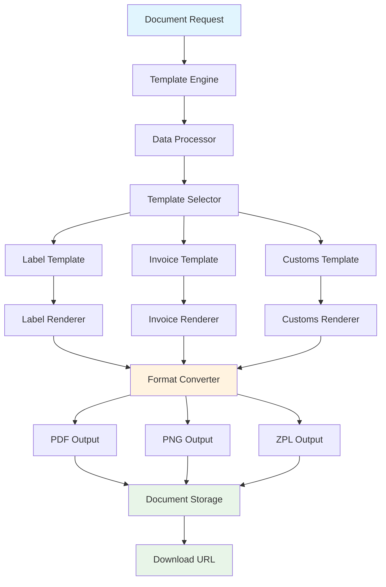

# Document Generation

Karrio's Document Generation system creates professional shipping labels, commercial invoices, customs documents, and other shipping-related paperwork. Use pre-built templates or create custom designs that match your brand.

## Overview

Automate the creation of all shipping documents required for domestic and international shipments. From simple shipping labels to complex customs documentation, generate professional documents that meet carrier requirements and regulatory standards.

### Key Benefits

- **Automated Generation**: Create documents automatically during shipment processing
- **Custom Templates**: Design branded templates that match your business identity
- **Multi-Format Support**: Generate documents in PDF, PNG, ZPL, and other formats
- **Regulatory Compliance**: Ensure documents meet international shipping requirements
- **Batch Processing**: Generate multiple documents efficiently

## Architecture

### Document Generation Flow



### Document Types

#### Shipping Labels

- **Standard Labels**: Basic shipping labels with tracking numbers
- **Return Labels**: Pre-paid return shipping labels
- **International Labels**: Labels with customs information
- **Thermal Labels**: Optimized for thermal printers

#### Commercial Documents

- **Commercial Invoices**: Detailed invoices for international shipments
- **Packing Lists**: Itemized lists of shipment contents
- **Customs Declarations**: Required customs forms and declarations
- **Certificates of Origin**: Origin certificates for trade compliance

#### Carrier-Specific Documents

- **Manifests**: End-of-day manifests for carrier pickup
- **Pickup Receipts**: Confirmation documents for scheduled pickups
- **Delivery Receipts**: Proof of delivery documents

## Getting Started

### 1. Generate Your First Document

```bash
curl -X POST "https://api.karrio.io/v1/documents/generate" \
  -H "Authorization: Token YOUR_API_KEY" \
  -H "Content-Type: application/json" \
  -d '{
    "shipment_id": "shp_1234567890",
    "template": "standard_label",
    "format": "PDF",
    "options": {
      "include_return_label": false,
      "label_size": "4x6"
    }
  }'
```

### 2. Create Documents with Custom Data

```javascript
const karrio = require("karrio");

const client = new karrio.Client({
  apiKey: "YOUR_API_KEY",
  testMode: true,
});

// Generate shipping label
const labelDoc = await client.documents.generate({
  type: "shipping_label",
  data: {
    shipper: {
      company_name: "Your Company",
      address_line1: "123 Business St",
      city: "New York",
      state_code: "NY",
      postal_code: "10001",
      country_code: "US",
    },
    recipient: {
      person_name: "John Doe",
      address_line1: "456 Customer Ave",
      city: "Los Angeles",
      state_code: "CA",
      postal_code: "90210",
      country_code: "US",
    },
    tracking_number: "1Z999AA1234567890",
    service: "UPS Ground",
    carrier: "UPS",
  },
  template: "standard_4x6",
  format: "PDF",
});

console.log("Label URL:", labelDoc.document_url);
```

### 3. Upload Custom Documents

```javascript
// Upload custom document
const upload = await client.documents.upload({
  file: fs.readFileSync("custom-invoice.pdf"),
  filename: "custom-invoice.pdf",
  document_type: "commercial_invoice",
  shipment_id: "shp_1234567890",
  metadata: {
    created_by: "user_123",
    department: "shipping",
  },
});

// List documents for a shipment
const documents = await client.documents.list({
  shipment_id: "shp_1234567890",
});

documents.results.forEach((doc) => {
  console.log(`${doc.document_type}: ${doc.document_url}`);
});
```

## Document Templates

### Built-in Templates

Karrio provides pre-designed templates for common document types:

#### Label Templates

- `standard_4x6` - Standard 4"x6" shipping label
- `standard_4x6_thermal` - Thermal printer optimized
- `return_label_4x6` - Return shipping label
- `international_4x6` - International shipping label with customs

#### Invoice Templates

- `commercial_invoice_standard` - Standard commercial invoice
- `commercial_invoice_detailed` - Detailed invoice with extended information
- `packing_list_standard` - Standard packing list
- `customs_declaration` - Customs declaration form

### Custom Templates

Create branded templates that match your business:

```javascript
// Create custom template
const template = await client.documents.templates.create({
  name: "branded_label",
  type: "shipping_label",
  format: "PDF",
  template_data: {
    layout: {
      width: 4,
      height: 6,
      unit: "inch",
    },
    elements: [
      {
        type: "logo",
        position: { x: 0.5, y: 0.5 },
        size: { width: 1, height: 0.5 },
        source: "https://your-domain.com/logo.png",
      },
      {
        type: "text",
        position: { x: 0.5, y: 1.5 },
        content: "{{shipper.company_name}}",
        font: "Arial",
        size: 12,
        weight: "bold",
      },
      {
        type: "barcode",
        position: { x: 0.5, y: 4 },
        content: "{{tracking_number}}",
        format: "CODE128",
      },
    ],
  },
});

// Use custom template
const document = await client.documents.generate({
  type: "shipping_label",
  template: template.id,
  data: shipmentData,
  format: "PDF",
});
```

## Integration with Karrio Ecosystem

### With Shipments

Automatic document generation during shipment creation:

```javascript
// Create shipment with automatic document generation
const shipment = await client.shipments.create({
  // ... shipment data
  options: {
    auto_generate_documents: true,
    document_templates: {
      shipping_label: "branded_4x6",
      commercial_invoice: "detailed_invoice",
    },
    document_formats: ["PDF", "PNG"],
  },
});

// Documents are automatically generated and attached
console.log("Label URL:", shipment.label_url);
console.log("Invoice URL:", shipment.invoice_url);
```

### With Orders

Generate documents during order fulfillment:

```javascript
// Fulfill order with document generation
const fulfillment = await client.orders.fulfill({
  order_id: "order_123",
  generate_documents: {
    packing_list: {
      template: "branded_packing_list",
      include_images: true,
    },
    shipping_label: {
      template: "standard_4x6",
      format: "PDF",
    },
  },
});
```

## Best Practices

### Error Handling

```javascript
async function generateDocumentSafely(documentData) {
  try {
    const document = await client.documents.generate(documentData);
    return document;
  } catch (error) {
    if (error.code === "TEMPLATE_NOT_FOUND") {
      // Fall back to default template
      return await client.documents.generate({
        ...documentData,
        template: "default_template",
      });
    } else if (error.code === "INVALID_DATA") {
      // Log validation errors
      console.error("Document data validation failed:", error.details);
      throw error;
    } else {
      // Retry with exponential backoff
      await new Promise((resolve) => setTimeout(resolve, 1000));
      return await client.documents.generate(documentData);
    }
  }
}
```

### Document Storage

Documents are automatically stored and made available via secure URLs:

```javascript
// Generated documents include URLs
const document = await client.documents.generate({
  type: "shipping_label",
  shipment_id: "shp_1234567890",
  format: "PDF",
});

console.log("Document URL:", document.document_url);
console.log("Download URL:", document.download_url);
```

## What's Next

Ready to implement document generation? Explore these resources:

### API Documentation

- **[Documents API Reference](/docs/reference/api/documents)**: Complete document generation API
- **[Templates API Reference](/docs/reference/api/templates)**: Template management and customization
- **[Upload API Reference](/docs/reference/api/uploads)**: Document upload and management

### Template Guides

- **[Template Design Guide](/docs/guides/template-design)**: Create professional document templates
- **[Branding Guide](/docs/guides/branding)**: Add your brand to shipping documents
- **[Variable Reference](/docs/reference/template-variables)**: Complete list of available template variables

### Integration Examples

- **[E-commerce Integration](/docs/integrations/ecommerce-documents)**: Generate documents for online orders
- **[ERP Integration](/docs/integrations/erp-documents)**: Sync documents with business systems
- **[Printer Integration](/docs/guides/printer-setup)**: Set up thermal and standard printers

---

**Need help with document generation?** Join our [community Discord](https://discord.gg/karrio) or check our template gallery for inspiration.
