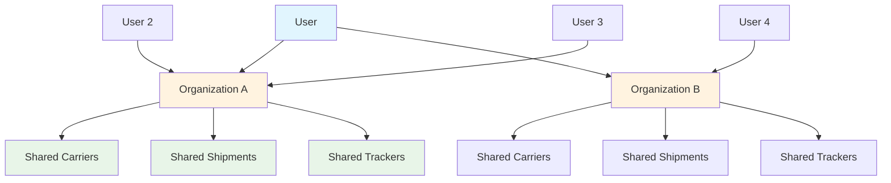

# Multi Organizations

Karrio's Multi-Organization system enables team management and shared ownership of shipping resources through organization-based access control. Users can belong to multiple organizations with different roles and permissions within each organization.

## Overview

Organizations provide a way to group users together and share ownership of shipping resources like carrier connections, shipments, and trackers. Each organization has its own set of users, roles, and permissions, enabling team collaboration and resource sharing.

### Key Features

- **Organization Management**: Create and manage organizations via GraphQL API
- **User Invitations**: Invite users to join organizations via email
- **Role-Based Access**: Assign roles to users within organizations
- **Shared Resources**: Share carrier connections, shipments, and trackers within organizations
- **Ownership Transfer**: Change organization ownership between users

## Organization Structure

### Organizations and Users



### Core Components

- **Organizations**: Groups that contain users and resources
- **Users**: Individual accounts that can belong to multiple organizations
- **Invitations**: Email-based invitations to join organizations
- **Roles**: Permission levels within organizations
- **Shared Resources**: Carrier connections, shipments, and trackers owned by organizations

## GraphQL API Operations

### Organization Management

```bash
# Create organization
curl -X POST "https://api.karrio.io/graphql" \
  -H "Authorization: Token YOUR_API_KEY" \
  -H "Content-Type: application/json" \
  -d '{
    "query": "mutation CreateOrganization($input: CreateOrganizationMutationInput!) { createOrganization(input: $input) { organization { id name slug } errors { field messages } } }",
    "variables": {
      "input": {
        "name": "Acme Shipping Team",
        "slug": "acme-shipping"
      }
    }
  }'

# Update organization
curl -X POST "https://api.karrio.io/graphql" \
  -H "Authorization: Token YOUR_API_KEY" \
  -H "Content-Type: application/json" \
  -d '{
    "query": "mutation UpdateOrganization($input: UpdateOrganizationMutationInput!) { updateOrganization(input: $input) { organization { id name } errors { field messages } } }",
    "variables": {
      "input": {
        "id": "org_123",
        "name": "Updated Team Name"
      }
    }
  }'

# Delete organization
curl -X POST "https://api.karrio.io/graphql" \
  -H "Authorization: Token YOUR_API_KEY" \
  -H "Content-Type: application/json" \
  -d '{
    "query": "mutation DeleteOrganization($input: DeleteOrganizationMutationInput!) { deleteOrganization(input: $input) { organization { id } errors { field messages } } }",
    "variables": {
      "input": {
        "id": "org_123"
      }
    }
  }'
```

### Querying Organizations

```bash
# Get single organization
curl -X POST "https://api.karrio.io/graphql" \
  -H "Authorization: Token YOUR_API_KEY" \
  -H "Content-Type: application/json" \
  -d '{
    "query": "query GetOrganization($id: String!) { organization(id: $id) { id name slug } }",
    "variables": {
      "id": "org_123"
    }
  }'

# List all organizations (for current user)
curl -X POST "https://api.karrio.io/graphql" \
  -H "Authorization: Token YOUR_API_KEY" \
  -H "Content-Type: application/json" \
  -d '{
    "query": "query { organizations { id name slug } }"
  }'
```

## User Management

### User Invitations

```bash
# Send organization invites
curl -X POST "https://api.karrio.io/graphql" \
  -H "Authorization: Token YOUR_API_KEY" \
  -H "Content-Type: application/json" \
  -d '{
    "query": "mutation SendInvites($input: SendOrganizationInvitesMutationInput!) { sendOrganizationInvites(input: $input) { invitations { id email } errors { field messages } } }",
    "variables": {
      "input": {
        "emails": ["teammate@example.com", "manager@example.com"],
        "organizationId": "org_123"
      }
    }
  }'

# Accept organization invitation
curl -X POST "https://api.karrio.io/graphql" \
  -H "Authorization: Token YOUR_API_KEY" \
  -H "Content-Type: application/json" \
  -d '{
    "query": "mutation AcceptInvitation($input: AcceptOrganizationInvitationMutationInput!) { acceptOrganizationInvitation(input: $input) { organization { id name } errors { field messages } } }",
    "variables": {
      "input": {
        "invitationId": "inv_456"
      }
    }
  }'

# Get organization invitation details
curl -X POST "https://api.karrio.io/graphql" \
  -H "Authorization: Token YOUR_API_KEY" \
  -H "Content-Type: application/json" \
  -d '{
    "query": "query GetInvitation($id: String!) { organizationInvitation(id: $id) { id email organization { name } } }",
    "variables": {
      "id": "inv_456"
    }
  }'

# Delete organization invitation
curl -X POST "https://api.karrio.io/graphql" \
  -H "Authorization: Token YOUR_API_KEY" \
  -H "Content-Type: application/json" \
  -d '{
    "query": "mutation DeleteInvitation($input: DeleteMutationInput!) { deleteOrganizationInvitation(input: $input) { id } }",
    "variables": {
      "input": {
        "id": "inv_456"
      }
    }
  }'
```

## Roles and Permissions

### Managing User Roles

```bash
# Set user roles within organization
curl -X POST "https://api.karrio.io/graphql" \
  -H "Authorization: Token YOUR_API_KEY" \
  -H "Content-Type: application/json" \
  -d '{
    "query": "mutation SetUserRoles($input: SetOrganizationUserRolesMutationInput!) { setOrganizationUserRoles(input: $input) { user { id email } errors { field messages } } }",
    "variables": {
      "input": {
        "userId": "user_789",
        "organizationId": "org_123",
        "roles": ["admin"]
      }
    }
  }'

# Change organization owner
curl -X POST "https://api.karrio.io/graphql" \
  -H "Authorization: Token YOUR_API_KEY" \
  -H "Content-Type: application/json" \
  -d '{
    "query": "mutation ChangeOwner($input: ChangeOrganizationOwnerMutationInput!) { changeOrganizationOwner(input: $input) { organization { id owner { email } } errors { field messages } } }",
    "variables": {
      "input": {
        "organizationId": "org_123",
        "userId": "user_456"
      }
    }
  }'
```

### Role Types

Based on the GraphQL schema, organizations support role-based access control:

- **Owner**: Full control over the organization and all resources
- **Admin**: Administrative access to organization settings and users
- **Member**: Access to organization resources with limited administrative privileges

## Shared Resources

### Carrier Connections

Organizations can share carrier connections among team members:

```bash
# Create carrier connection for organization
curl -X POST "https://api.karrio.io/v1/connections" \
  -H "Authorization: Token YOUR_API_KEY" \
  -H "Content-Type: application/json" \
  -d '{
    "carrier_name": "fedex",
    "carrier_id": "team_fedex_account",
    "test_mode": false,
    "config": {
      "account_number": "123456789",
      "meter_number": "987654321"
    }
  }'

# List organization carrier connections
curl -X GET "https://api.karrio.io/v1/connections" \
  -H "Authorization: Token YOUR_API_KEY"
```

### Shipments and Tracking

All shipments and trackers created within an organization context are shared among organization members:

```bash
# Create shipment using organization carrier
curl -X POST "https://api.karrio.io/v1/shipments" \
  -H "Authorization: Token YOUR_API_KEY" \
  -H "Content-Type: application/json" \
  -d '{
    "service": "fedex_ground",
    "carrier_ids": ["team_fedex_account"],
    "shipper": {
      "company_name": "Acme Shipping Team",
      "address_line1": "123 Business St",
      "city": "New York",
      "state_code": "NY",
      "postal_code": "10001",
      "country_code": "US"
    },
    "recipient": {
      "person_name": "John Doe",
      "address_line1": "456 Customer Ave",
      "city": "Los Angeles",
      "state_code": "CA",
      "postal_code": "90210",
      "country_code": "US"
    },
    "parcels": [
      {
        "weight": 2.5,
        "weight_unit": "LB"
      }
    ]
  }'
```

## Team Collaboration

### Use Cases

#### Small Business Team

```bash
# Create organization for small business
{
  "name": "Acme Store Shipping",
  "slug": "acme-store"
}

# Invite team members
{
  "emails": ["manager@acme.com", "shipper@acme.com"],
  "organizationId": "org_acme"
}

# Set different roles
{
  "userId": "manager_123",
  "organizationId": "org_acme",
  "roles": ["admin"]
}
```

#### Enterprise Department

```bash
# Create organization for department
{
  "name": "Enterprise Logistics Dept",
  "slug": "enterprise-logistics"
}

# Add department members with specific roles
{
  "userId": "dept_head_123",
  "organizationId": "org_logistics",
  "roles": ["admin"]
}
```

#### Service Provider

```bash
# Create organization for 3PL service
{
  "name": "3PL Service Provider",
  "slug": "3pl-provider"
}

# Share carrier connections with client teams
# Each client gets their own organization with shared carrier access
```

## Best Practices

### Organization Setup

1. **Clear Naming**: Use descriptive organization names that reflect the team or purpose
2. **Appropriate Slugs**: Choose URL-friendly slugs for organization identification
3. **Role Assignment**: Assign appropriate roles based on team member responsibilities
4. **Resource Sharing**: Share carrier connections at the organization level for team access

### User Management

```bash
# Workflow for adding new team member:
# 1. Send invitation
{
  "emails": ["newteam@company.com"],
  "organizationId": "org_123"
}

# 2. User accepts invitation
{
  "invitationId": "inv_456"
}

# 3. Set appropriate role
{
  "userId": "newuser_789",
  "organizationId": "org_123",
  "roles": ["member"]
}
```

### Security Considerations

- **Owner Transfer**: Only transfer organization ownership to trusted users
- **Role Management**: Regularly review user roles and permissions
- **Invitation Cleanup**: Delete unused invitations to prevent unauthorized access
- **Resource Access**: Monitor shared resource usage within organizations

## Integration Examples

### Organization-Aware Application

```javascript
// Example: Check user's organizations
async function getUserOrganizations() {
  const response = await fetch("https://api.karrio.io/graphql", {
    method: "POST",
    headers: {
      Authorization: "Token YOUR_API_KEY",
      "Content-Type": "application/json",
    },
    body: JSON.stringify({
      query: `
        query {
          organizations {
            id
            name
            slug
          }
        }
      `,
    }),
  });

  const data = await response.json();
  return data.data.organizations;
}

// Example: Create shipment for specific organization context
async function createTeamShipment(shipmentData) {
  // Use organization-shared carrier connections
  const organizations = await getUserOrganizations();
  const targetOrg = organizations.find((org) => org.slug === "shipping-team");

  // Create shipment with organization context
  return await createShipment({
    ...shipmentData,
    // Organization context is handled automatically by API
  });
}
```

## What's Next?

- [User Management →](/docs/products/user-management) - Individual user administration
- [Admin Console →](/docs/products/admin-console) - Administrative interface
- [API Reference →](/docs/reference/graphql) - Complete GraphQL API documentation
