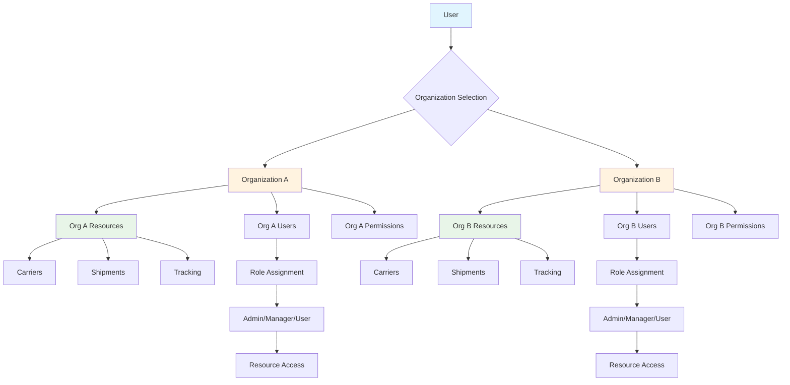

# Multi-Organizations

<div className="flex gap-2 mb-6">
  <div className="inline-flex items-center rounded-md bg-purple-50 px-2 py-1 text-xs font-medium text-purple-700 ring-1 ring-inset ring-purple-700/10 dark:bg-purple-400/10 dark:text-purple-400 dark:ring-purple-400/30">
    <span className="text-xs">Insiders</span>
  </div>
  <div className="inline-flex items-center rounded-md bg-amber-50 px-2 py-1 text-xs font-medium text-amber-700 ring-1 ring-inset ring-amber-700/10 dark:bg-amber-400/10 dark:text-amber-400 dark:ring-amber-400/30">
    <span className="text-xs">Enterprise</span>
  </div>
</div>

Every Karrio project comes with multi-organization capabilities when using Karrio Insiders, providing tenant isolation, organization-based resource management, team collaboration tools, and hierarchical access control for enterprise deployments.

## Features

### Organization-Based Resource Management

You don't have to manage resources individually. Our multi-organization system provides shared ownership of carrier connections, shipments, tracking, and other resources within organizational boundaries.

<div className="bg-gray-50 dark:bg-gray-900 rounded-lg p-4 my-6">
  <div className="text-sm text-gray-600 dark:text-gray-400 mb-2">
    Multi-Organization Dashboard
  </div>
  <div className="bg-white dark:bg-gray-800 rounded border h-64 flex items-center justify-center">
    <span className="text-gray-400">
      Screenshot: Organization management, user roles, and resource sharing
      interface
    </span>
  </div>
</div>

### Team Collaboration

Enable seamless collaboration with role-based access control, user invitations, and shared workspaces for each organization.

### Flexible User Management

Users can belong to multiple organizations with different permission levels, enabling complex organizational structures.

### Ownership Transfer

Change organization ownership and transfer resources between organizations as your business structure evolves.

### Additional features

- Karrio extends multi-organization support with custom branding and tenant-specific configurations.
- Every organization includes automatic resource quotas and usage tracking.
- Karrio manages cross-organization billing and subscription management.
- Support for hierarchical organizations and department-level access control.

## Data Flow

### Multi-Organization Resource Management Flow



## API Reference

### GraphQL API

#### Create Organization

```graphql
mutation CreateOrganization($input: CreateOrganizationMutationInput!) {
  create_organization(input: $input) {
    organization {
      id
      name
      slug
      owner {
        id
        email
      }
      created_at
      updated_at
    }
    errors {
      field
      messages
    }
  }
}
```

**Variables:**

```json
{
  "input": {
    "name": "Acme Shipping Team",
    "slug": "acme-shipping"
  }
}
```

**Response:**

```json
{
  "data": {
    "create_organization": {
      "organization": {
        "id": "org_1234567890",
        "name": "Acme Shipping Team",
        "slug": "acme-shipping",
        "owner": {
          "id": "usr_1234567890",
          "email": "owner@example.com"
        },
        "created_at": "2024-01-15T10:30:00Z",
        "updated_at": "2024-01-15T10:30:00Z"
      },
      "errors": []
    }
  }
}
```

#### Query Organizations

```graphql
query GetOrganizations {
  organizations {
    edges {
      node {
        id
        name
        slug
        owner {
          id
          email
        }
        users {
          id
          email
          role
        }
        created_at
      }
    }
    pageInfo {
      hasNextPage
      hasPreviousPage
    }
  }
}
```

**Response:**

```json
{
  "data": {
    "organizations": {
      "edges": [
        {
          "node": {
            "id": "org_1234567890",
            "name": "Acme Shipping Team",
            "slug": "acme-shipping",
            "owner": {
              "id": "usr_1234567890",
              "email": "owner@example.com"
            },
            "users": [
              {
                "id": "usr_1234567890",
                "email": "owner@example.com",
                "role": "admin"
              },
              {
                "id": "usr_1234567891",
                "email": "member@example.com",
                "role": "user"
              }
            ],
            "created_at": "2024-01-15T10:30:00Z"
          }
        }
      ],
      "pageInfo": {
        "hasNextPage": false,
        "hasPreviousPage": false
      }
    }
  }
}
```

#### Send Organization Invitations

```graphql
mutation SendInvitations($input: SendOrganizationInvitesMutationInput!) {
  send_organization_invites(input: $input) {
    invitations {
      id
      email
      organization {
        id
        name
      }
      role
      invited_by {
        id
        email
      }
      expires_at
      created_at
    }
    errors {
      field
      messages
    }
  }
}
```

**Variables:**

```json
{
  "input": {
    "emails": ["teammate@example.com", "manager@example.com"],
    "organization_id": "org_1234567890",
    "role": "user"
  }
}
```

**Response:**

```json
{
  "data": {
    "send_organization_invites": {
      "invitations": [
        {
          "id": "inv_1234567890",
          "email": "teammate@example.com",
          "organization": {
            "id": "org_1234567890",
            "name": "Acme Shipping Team"
          },
          "role": "user",
          "invited_by": {
            "id": "usr_1234567890",
            "email": "owner@example.com"
          },
          "expires_at": "2024-01-22T10:30:00Z",
          "created_at": "2024-01-15T10:30:00Z"
        }
      ],
      "errors": []
    }
  }
}
```

#### Accept Organization Invitation

```graphql
mutation AcceptInvitation($input: AcceptOrganizationInvitationMutationInput!) {
  accept_organization_invitation(input: $input) {
    organization {
      id
      name
      users {
        id
        email
        role
      }
    }
    errors {
      field
      messages
    }
  }
}
```

**Variables:**

```json
{
  "input": {
    "invitation_id": "inv_1234567890"
  }
}
```

**Response:**

```json
{
  "data": {
    "accept_organization_invitation": {
      "organization": {
        "id": "org_1234567890",
        "name": "Acme Shipping Team",
        "users": [
          {
            "id": "usr_1234567890",
            "email": "owner@example.com",
            "role": "admin"
          },
          {
            "id": "usr_1234567891",
            "email": "teammate@example.com",
            "role": "user"
          }
        ]
      },
      "errors": []
    }
  }
}
```

#### Update User Roles

```graphql
mutation SetUserRoles($input: SetOrganizationUserRolesMutationInput!) {
  set_organization_user_roles(input: $input) {
    user {
      id
      email
      organizations {
        id
        name
        role
      }
    }
    errors {
      field
      messages
    }
  }
}
```

**Variables:**

```json
{
  "input": {
    "user_id": "usr_1234567891",
    "organization_id": "org_1234567890",
    "roles": ["manager"]
  }
}
```

**Response:**

```json
{
  "data": {
    "set_organization_user_roles": {
      "user": {
        "id": "usr_1234567891",
        "email": "teammate@example.com",
        "organizations": [
          {
            "id": "org_1234567890",
            "name": "Acme Shipping Team",
            "role": "manager"
          }
        ]
      },
      "errors": []
    }
  }
}
```

#### Change Organization Owner

```graphql
mutation ChangeOwner($input: ChangeOrganizationOwnerMutationInput!) {
  change_organization_owner(input: $input) {
    organization {
      id
      name
      owner {
        id
        email
      }
    }
    errors {
      field
      messages
    }
  }
}
```

**Variables:**

```json
{
  "input": {
    "organization_id": "org_1234567890",
    "user_id": "usr_1234567891"
  }
}
```

**Response:**

```json
{
  "data": {
    "change_organization_owner": {
      "organization": {
        "id": "org_1234567890",
        "name": "Acme Shipping Team",
        "owner": {
          "id": "usr_1234567891",
          "email": "new-owner@example.com"
        }
      },
      "errors": []
    }
  }
}
```

## Organization Roles

### Role Hierarchy

Organizations support a hierarchical role system with different permission levels:

#### Admin

- **Full Organization Control**: Manage organization settings, billing, and deletion
- **User Management**: Invite, remove, and change roles for all users
- **Resource Management**: Full access to all organization resources
- **Ownership Transfer**: Can transfer organization ownership

#### Manager

- **User Management**: Invite users and manage roles (except admin)
- **Resource Management**: Create, read, update, and delete organization resources
- **Team Oversight**: Monitor team activities and resource usage
- **Limited Settings**: Access to operational settings only

#### User

- **Resource Access**: Create and manage their own resources within the organization
- **Shared Resources**: Access to shared organization resources based on permissions
- **Collaboration**: Participate in team workflows and processes
- **Read Access**: View organization information and team member lists

#### Viewer

- **Read-Only Access**: View all organization resources and activities
- **No Modification**: Cannot create, update, or delete any resources
- **Reporting**: Access to reports and analytics
- **Limited Interaction**: Can only view and export data

## Resource Sharing

### Shared Resources

Organizations automatically share the following resources among members:

#### Carrier Connections

- **Shared Access**: All organization members can use configured carriers
- **Centralized Management**: Admins and managers control carrier configurations
- **Cost Optimization**: Shared carrier accounts reduce setup overhead

#### Shipments

- **Visibility**: Organization members can view relevant shipments based on permissions
- **Collaboration**: Multiple users can work on the same shipment workflows
- **Tracking**: Shared tracking access for customer service teams

#### Documents

- **Template Sharing**: Organization-wide document templates and branding
- **Storage Access**: Shared document storage and retrieval
- **Brand Consistency**: Unified branding across all generated documents

### Resource Isolation

Each organization maintains strict resource isolation:

```javascript
// Resources are automatically filtered by organization context
// Organization switching is handled through the web interface
// API calls automatically use the active organization's context

// Use organization-specific API keys for automated processes
```

## Use Cases

### Multi-Tenant SaaS Platforms

Perfect for SaaS platforms serving multiple clients:

- **Client Isolation**: Each client gets their own organization with isolated resources
- **White-Label Branding**: Custom branding per organization
- **Usage Tracking**: Per-organization billing and usage monitoring
- **Scalability**: Easy onboarding of new clients as organizations

### Enterprise Departments

Ideal for large enterprises with multiple departments:

- **Department Separation**: Each department manages its own shipping operations
- **Cross-Department Collaboration**: Users can participate in multiple departments
- **Centralized Oversight**: Enterprise-wide visibility for executives
- **Budget Management**: Department-level cost tracking and budgeting

### Partner Ecosystems

Enable partner and vendor collaboration:

- **Partner Organizations**: Create organizations for external partners
- **Limited Access**: Provide specific access to relevant resources only
- **Collaboration Workflows**: Enable joint shipping operations
- **Audit Trails**: Track partner activities and resource usage

### Franchise Management

Support franchise business models:

- **Franchise Organizations**: Each franchise location gets its own organization
- **Brand Consistency**: Shared branding and templates across franchises
- **Centralized Support**: Headquarters can assist franchise operations
- **Performance Monitoring**: Track performance across all franchise locations

## Integration Examples

### Organization Switching

```javascript
// Organization switching is handled through the web interface
// Each organization has its own dedicated workspace and API keys
// Users can access multiple organizations through the dashboard

// For API integrations, use organization-specific API keys
const getOrganizationData = async (orgApiKey) => {
  const client = new KarrioClient({ apiKey: orgApiKey });
  const shipments = await client.shipments.list();
  const carriers = await client.carriers.list();

  return { shipments, carriers };
};
```

### Team Invitation Workflow

```javascript
// Team invitations are handled through the admin dashboard
// Admins can invite users via the web interface
// Invitation emails are sent automatically with secure links

// Users accept invitations by following the email link
// This creates their account and grants access to the organization
```

### Role Management

```javascript
// User role management is handled through the admin dashboard
// Admins can update user roles and permission groups
// Role changes take effect immediately for the user's session

// Available roles: owner, admin, developer, member
// Permission groups can be customized per user as needed
```

## Best Practices

### Organization Structure

#### Naming Conventions

- Use descriptive, meaningful organization names
- Include department or team identifiers
- Consider using consistent naming patterns

#### Role Assignment

- Start with minimal permissions and expand as needed
- Regular review of user roles and permissions
- Document role responsibilities and expectations

#### Resource Management

- Establish clear ownership of shared resources
- Regular cleanup of unused carrier connections
- Monitor resource usage and costs per organization

### Security Considerations

#### Access Control

- Implement least-privilege access principles
- Regular audit of user permissions
- Monitor cross-organization access patterns

#### Data Isolation

- Verify organization-based data filtering
- Test resource isolation boundaries
- Implement proper error handling for unauthorized access

## Getting Started

Ready to implement multi-organization support in your application? Follow these steps:

1. **Create your first organization** and invite team members
2. **Set up role-based access control** for different user types
3. **Configure resource sharing** based on your business needs
4. **Implement organization switching** in your user interface

### Next Steps

- Learn about [user management](/docs/products/user-management) for detailed user administration
- Explore [admin console](/docs/products/admin-console) for centralized management
- Set up [webhooks](/docs/products/webhooks) for organization activity notifications
- Configure [API logs](/docs/products/api-logs) for organization-level monitoring
