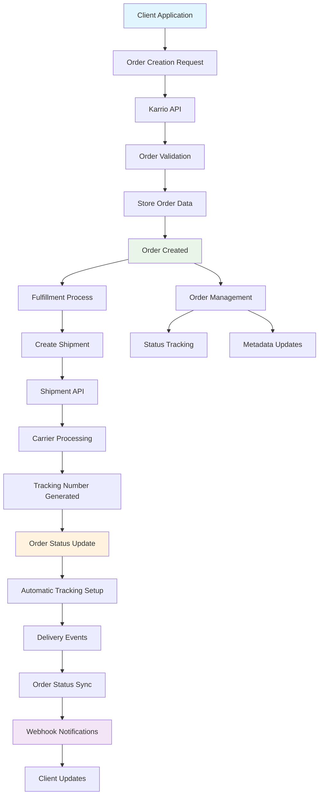
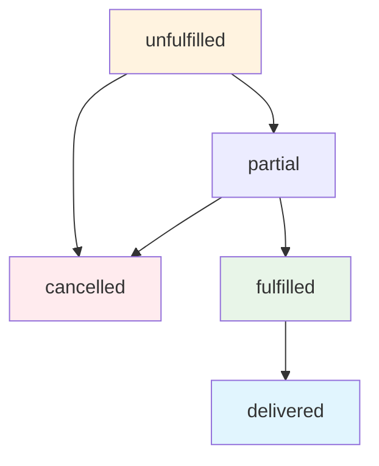

# Orders Management

<div className="flex gap-2 mb-6">
  <div className="inline-flex items-center rounded-md bg-green-50 px-2 py-1 text-xs font-medium text-green-700 ring-1 ring-inset ring-green-600/20 dark:bg-green-400/10 dark:text-green-400 dark:ring-green-400/30">
    <span className="text-xs">Community Edition</span>
  </div>
  <div className="inline-flex items-center rounded-md bg-blue-50 px-2 py-1 text-xs font-medium text-blue-700 ring-1 ring-inset ring-blue-700/10 dark:bg-blue-400/10 dark:text-blue-400 dark:ring-blue-400/30">
    <span className="text-xs">Core Feature</span>
  </div>
</div>

Every Karrio project comes with comprehensive order management capabilities, providing a complete system to create, manage, and track order records with line items, customer information, and fulfillment workflows.

## Features

### Complete Order Lifecycle

You don't have to build order management from scratch. Our orders system provides complete lifecycle management from creation to fulfillment and delivery tracking.

<div className="bg-gray-50 dark:bg-gray-900 rounded-lg p-4 my-6">
  <div className="text-sm text-gray-600 dark:text-gray-400 mb-2">
    Orders Management Dashboard
  </div>
  <div className="bg-white dark:bg-gray-800 rounded border overflow-hidden">
    
  </div>
</div>

### Line Items Management

Manage detailed line items with SKU, quantity, weight, and pricing information for accurate fulfillment and shipping calculations.

### Shipment Integration

Seamlessly link orders to shipments for complete fulfillment tracking and automated status updates.

### Customer Information

Store comprehensive customer details including shipping addresses, contact information, and order preferences.

### Status Tracking

Track orders through the entire fulfillment lifecycle with customizable status workflows and automated updates.

### Additional features

- Karrio extends orders with real-time fulfillment status synchronization.
- Every order includes comprehensive metadata support for integration needs.
- Karrio manages automatic order-to-shipment linking and status updates.
- Support for bulk order operations and batch processing.

## Data Flow

### Order Management Flow



## API Reference

### REST API

#### Create Order

```bash
curl -X POST "https://api.karrio.io/v1/orders" \
  -H "Authorization: Token YOUR_API_KEY" \
  -H "Content-Type: application/json" \
  -d '{
    "order_id": "ORDER-2024-001",
    "order_date": "2024-01-15",
    "source": "API",
    "shipping_to": {
      "person_name": "John Doe",
      "company_name": "Acme Corp",
      "email": "john@acme.com",
      "phone_number": "+1234567890",
      "address_line1": "123 Customer Street",
      "city": "New York",
      "state_code": "NY",
      "postal_code": "10001",
      "country_code": "US"
    },
    "shipping_from": {
      "company_name": "Warehouse Inc",
      "address_line1": "456 Warehouse Ave",
      "city": "Chicago",
      "state_code": "IL",
      "postal_code": "60601",
      "country_code": "US"
    },
    "line_items": [
      {
        "sku": "WIDGET-001",
        "title": "Red Widget",
        "quantity": 2,
        "weight": 1.5,
        "weight_unit": "LB",
        "value_amount": 25.00,
        "value_currency": "USD"
      },
      {
        "sku": "GADGET-002",
        "title": "Blue Gadget",
        "quantity": 1,
        "weight": 0.8,
        "weight_unit": "LB",
        "value_amount": 15.00,
        "value_currency": "USD"
      }
    ],
    "options": {
      "currency": "USD",
      "shipping_method": "ground"
    },
    "metadata": {
      "customer_id": "CUST-12345",
      "order_source": "website"
    }
  }'
```

**Response:**

```json
{
  "id": "ord_1234567890",
  "order_id": "ORDER-2024-001",
  "order_date": "2024-01-15",
  "source": "API",
  "status": "unfulfilled",
  "shipping_to": {
    "person_name": "John Doe",
    "company_name": "Acme Corp",
    "email": "john@acme.com",
    "phone_number": "+1234567890",
    "address_line1": "123 Customer Street",
    "city": "New York",
    "state_code": "NY",
    "postal_code": "10001",
    "country_code": "US"
  },
  "shipping_from": {
    "company_name": "Warehouse Inc",
    "address_line1": "456 Warehouse Ave",
    "city": "Chicago",
    "state_code": "IL",
    "postal_code": "60601",
    "country_code": "US"
  },
  "line_items": [
    {
      "id": "cdt_549f66b743a147958f084f5b1928e08e",
      "sku": "WIDGET-001",
      "title": "Red Widget",
      "quantity": 2,
      "unfulfilled_quantity": 2,
      "weight": 1.5,
      "weight_unit": "LB",
      "value_amount": 25.0,
      "value_currency": "USD"
    },
    {
      "id": "cdt_e44ecabf0d904aa9b45d1139d4ce045a",
      "sku": "GADGET-002",
      "title": "Blue Gadget",
      "quantity": 1,
      "unfulfilled_quantity": 1,
      "weight": 0.8,
      "weight_unit": "LB",
      "value_amount": 15.0,
      "value_currency": "USD"
    }
  ],
  "test_mode": false,
  "created_at": "2024-01-15T10:30:00Z",
  "updated_at": "2024-01-15T10:30:00Z"
}
```

#### Get Order

```bash
curl -X GET "https://api.karrio.io/v1/orders/ord_1234567890" \
  -H "Authorization: Token YOUR_API_KEY"
```

**Response:**

```json
{
  "id": "ord_1234567890",
  "order_id": "ORDER-2024-001",
  "order_date": "2024-01-15",
  "source": "API",
  "status": "fulfilled",
  "shipping_to": {
    "person_name": "John Doe",
    "company_name": "Acme Corp",
    "email": "john@acme.com",
    "address_line1": "123 Customer Street",
    "city": "New York",
    "state_code": "NY",
    "postal_code": "10001",
    "country_code": "US"
  },
  "line_items": [
    {
      "id": "cdt_549f66b743a147958f084f5b1928e08e",
      "sku": "WIDGET-001",
      "title": "Red Widget",
      "quantity": 2,
      "unfulfilled_quantity": 0,
      "weight": 1.5,
      "weight_unit": "LB",
      "value_amount": 25.0,
      "value_currency": "USD"
    }
  ],
  "shipments": [
    {
      "id": "shp_0987654321",
      "tracking_number": "1Z12345E0205271688",
      "carrier_name": "ups",
      "status": "purchased"
    }
  ],
  "test_mode": false,
  "created_at": "2024-01-15T10:30:00Z",
  "updated_at": "2024-01-16T14:20:00Z"
}
```

#### List Orders

```bash
curl -X GET "https://api.karrio.io/v1/orders?status=unfulfilled&limit=10" \
  -H "Authorization: Token YOUR_API_KEY"
```

**Response:**

```json
{
  "count": 35,
  "next": "/v1/orders?status=unfulfilled&limit=10&offset=10",
  "previous": null,
  "results": [
    {
      "id": "ord_1234567890",
      "order_id": "ORDER-2024-001",
      "order_date": "2024-01-15",
      "status": "unfulfilled",
      "shipping_to": {
        "person_name": "John Doe",
        "city": "New York",
        "state_code": "NY"
      },
      "created_at": "2024-01-15T10:30:00Z"
    },
    {
      "id": "ord_2345678901",
      "order_id": "ORDER-2024-002",
      "order_date": "2024-01-15",
      "status": "unfulfilled",
      "shipping_to": {
        "person_name": "Jane Smith",
        "city": "Los Angeles",
        "state_code": "CA"
      },
      "created_at": "2024-01-15T11:45:00Z"
    }
  ]
}
```

#### Update Order Status

```bash
curl -X PATCH "https://api.karrio.io/v1/orders/ord_1234567890" \
  -H "Authorization: Token YOUR_API_KEY" \
  -H "Content-Type: application/json" \
  -d '{
    "options": {
      "priority": "high",
      "special_instructions": "Handle with care"
    },
    "metadata": {
      "updated_by": "admin",
      "notes": "Customer requested expedited shipping"
    }
  }'
```

**Response:**

```json
{
  "id": "ord_1234567890",
  "order_id": "ORDER-2024-001",
  "status": "unfulfilled",
  "options": {
    "currency": "USD",
    "shipping_method": "ground",
    "priority": "high",
    "special_instructions": "Handle with care"
  },
  "metadata": {
    "customer_id": "CUST-12345",
    "order_source": "website",
    "updated_by": "admin",
    "notes": "Customer requested expedited shipping"
  },
  "updated_at": "2024-01-15T15:30:00Z"
}
```

#### Create Shipment from Order

When creating a shipment from an order, Karrio automatically links the order line items to the shipment parcels using the `parent_id` field. This mechanism enables accurate fulfillment tracking and order status computation.

```bash
curl -X POST "https://api.karrio.io/v1/shipments" \
  -H "Authorization: Token YOUR_API_KEY" \
  -H "Content-Type: application/json" \
  -d '{
    "carrier_ids": ["ups-account"],
    "label_type": "PDF",
    "metadata": {
      "order_ids": "ORDER-2024-001"
    },
    "options": {
      "currency": "USD",
      "declared_value": 65.00,
      "preferred_service": "ups_ground"
    },
    "parcels": [
      {
        "weight": 3.1,
        "weight_unit": "LB",
        "dimension_unit": "IN",
        "height": 6,
        "length": 12,
        "width": 8,
        "items": [
          {
            "description": "Red Widget",
            "quantity": 2,
            "weight": 1.5,
            "weight_unit": "LB",
            "value_amount": 25.00,
            "value_currency": "USD",
            "parent_id": "cdt_549f66b743a147958f084f5b1928e08e"
          },
          {
            "description": "Blue Gadget",
            "quantity": 1,
            "weight": 0.8,
            "weight_unit": "LB",
            "value_amount": 15.00,
            "value_currency": "USD",
            "parent_id": "cdt_e44ecabf0d904aa9b45d1139d4ce045a"
          }
        ]
      }
    ],
    "recipient": {
      "person_name": "John Doe",
      "company_name": "Acme Corp",
      "address_line1": "123 Customer Street",
      "city": "New York",
      "state_code": "NY",
      "postal_code": "10001",
      "country_code": "US"
    },
    "shipper": {
      "company_name": "Warehouse Inc",
      "address_line1": "456 Warehouse Ave",
      "city": "Chicago",
      "state_code": "IL",
      "postal_code": "60601",
      "country_code": "US"
    }
  }'
```

**Response:**

```json
{
  "id": "shp_0987654321",
  "carrier_name": "ups",
  "service": "ups_ground",
  "tracking_number": "1Z12345E0205271688",
  "status": "purchased",
  "selected_rate": {
    "total_charge": 15.99,
    "currency": "USD",
    "service": "ups_ground"
  },
  "parcels": [
    {
      "items": [
        {
          "description": "Red Widget",
          "quantity": 2,
          "parent_id": "cdt_549f66b743a147958f084f5b1928e08e"
        },
        {
          "description": "Blue Gadget",
          "quantity": 1,
          "parent_id": "cdt_e44ecabf0d904aa9b45d1139d4ce045a"
        }
      ]
    }
  ],
  "label_url": "https://api.karrio.io/v1/documents/label_123.pdf",
  "created_at": "2024-01-15T16:00:00Z"
}
```

### Order Fulfillment

**Critical**: The `parent_id` field in shipment parcel items references the `id` of order line items. This enables Karrio to:

1. **Track Fulfillment**: Determine how much of each line item has been shipped
2. **Compute Order Status**: Automatically update order status based on fulfillment progress
3. **Handle Partial Fulfillment**: Support multiple shipments for a single order
4. **Maintain Inventory Accuracy**: Track unfulfilled quantities per line item

**Example Flow**:

```text
Order Line Item (id: cdt_549f66b743a147958f084f5b1928e08e)
├── quantity: 2
├── unfulfilled_quantity: 2 (initially)
└── Shipment Parcel Item (parent_id: cdt_549f66b743a147958f084f5b1928e08e)
    ├── quantity: 2 (fulfills entire line item)
    └── unfulfilled_quantity: 0 (after shipment)
```

When Karrio processes the shipment, it:

- Matches parcel items to order line items using `parent_id`
- Reduces `unfulfilled_quantity` by the shipped quantity
- Updates order status when all line items are fully shipped

### GraphQL API

#### Query Orders

```graphql
query GetOrders($filter: OrderFilter) {
  orders(filter: $filter) {
    edges {
      node {
        id
        order_id
        status
        source
        shipping_to {
          person_name
          company_name
          email
          phone_number
          address_line1
          address_line2
          city
          state_code
          postal_code
          country_code
        }
        shipping_from {
          person_name
          company_name
          address_line1
          city
          state_code
          postal_code
          country_code
        }
        billing_address {
          person_name
          company_name
          email
          address_line1
          city
          state_code
          postal_code
          country_code
        }
        line_items {
          id
          sku
          title
          description
          quantity
          unfulfilled_quantity
          weight
          weight_unit
          value_amount
          value_currency
          origin_country
          hs_code
          metadata
          parent_id
        }
        created_at
        updated_at
        created_by {
          email
          full_name
        }
        test_mode
        options
        metadata
        shipments {
          id
          status
          tracking_number
        }
      }
    }
    page_info {
      count
      has_next_page
      has_previous_page
      start_cursor
      end_cursor
    }
  }
}
```

**Variables:**

```json
{
  "filter": {
    "status": ["unfulfilled"],
    "source": ["API"]
  }
}
```

**Response:**

```json
{
  "data": {
    "orders": {
      "edges": [
        {
          "node": {
            "id": "ord_1234567890",
            "order_id": "ORDER-2024-001",
            "status": "unfulfilled",
            "source": "API",
            "shipping_to": {
              "person_name": "John Doe",
              "company_name": "Acme Corp",
              "email": "john@acme.com",
              "phone_number": "+1234567890",
              "address_line1": "123 Main St",
              "address_line2": "Suite 100",
              "city": "New York",
              "state_code": "NY",
              "postal_code": "10001",
              "country_code": "US"
            },
            "shipping_from": {
              "company_name": "Warehouse Inc",
              "address_line1": "456 Warehouse Ave",
              "city": "Chicago",
              "state_code": "IL",
              "postal_code": "60601",
              "country_code": "US"
            },
            "billing_address": null,
            "line_items": [
              {
                "id": "cdt_549f66b743a147958f084f5b1928e08e",
                "sku": "WIDGET-001",
                "title": "Red Widget",
                "description": "Premium red widget",
                "quantity": 2,
                "unfulfilled_quantity": 2,
                "weight": 1.5,
                "weight_unit": "LB",
                "value_amount": 25.0,
                "value_currency": "USD",
                "origin_country": "US",
                "hs_code": "1234567890",
                "metadata": {},
                "parent_id": null
              }
            ],
            "created_at": "2024-01-15T10:30:00Z",
            "updated_at": "2024-01-15T10:30:00Z",
            "created_by": {
              "email": "admin@acme.com",
              "full_name": "Admin User"
            },
            "test_mode": false,
            "options": {},
            "metadata": {},
            "shipments": []
          }
        }
      ],
      "page_info": {
        "count": 1,
        "has_next_page": false,
        "has_previous_page": false,
        "start_cursor": "YXJyYXljb25uZWN0aW9uOjA=",
        "end_cursor": "YXJyYXljb25uZWN0aW9uOjA="
      }
    }
  }
}
```

#### Create Order Mutation

```graphql
mutation CreateOrder($data: CreateOrderMutationInput!) {
  create_order(data: $data) {
    order {
      id
      order_id
      status
      source
      shipping_to {
        person_name
        email
        city
        state_code
      }
      line_items {
        id
        sku
        title
        quantity
        weight
        value_amount
      }
    }
    errors {
      field
      messages
    }
  }
}
```

**Variables:**

```json
{
  "data": {
    "order_id": "ORDER-2024-002",
    "shipping_to": {
      "person_name": "Jane Smith",
      "company_name": "Tech Solutions",
      "email": "jane@techsolutions.com",
      "phone_number": "+1987654321",
      "address_line1": "789 Oak Avenue",
      "city": "Los Angeles",
      "state_code": "CA",
      "postal_code": "90210",
      "country_code": "US"
    },
    "shipping_from": {
      "company_name": "Fulfillment Center",
      "address_line1": "100 Industrial Blvd",
      "city": "Phoenix",
      "state_code": "AZ",
      "postal_code": "85001",
      "country_code": "US"
    },
    "line_items": [
      {
        "sku": "PRODUCT-003",
        "title": "Premium Item",
        "description": "High-quality premium product",
        "quantity": 1,
        "weight": 2.0,
        "weight_unit": "LB",
        "value_amount": 50.0,
        "value_currency": "USD",
        "origin_country": "US"
      }
    ],
    "metadata": {
      "channel": "website",
      "campaign": "summer_sale"
    },
    "options": {
      "signature_required": true
    }
  }
}
```

## Order Status Workflow

### Standard Statuses

Orders support these standard status values:

- **unfulfilled** - Order received, awaiting fulfillment
- **partial** - Order partially fulfilled (some line items shipped)
- **fulfilled** - Order fully fulfilled (all line items shipped)
- **delivered** - Order has been delivered (automatically updated from tracking)
- **cancelled** - Order has been cancelled

### Status Transitions



## Use Cases

### E-commerce Integration

Perfect for online stores managing order fulfillment:

- **Order Processing**: Create orders from shopping cart checkouts
- **Inventory Management**: Track line items and quantities
- **Fulfillment Automation**: Automatically create shipments from orders
- **Status Synchronization**: Update order status based on shipment progress

### Warehouse Management

Designed for warehouse and fulfillment operations:

- **Pick Lists**: Generate pick lists from order line items
- **Batch Fulfillment**: Process multiple orders simultaneously
- **Shipping Integration**: Create optimized shipments from order data
- **Performance Tracking**: Monitor fulfillment times and accuracy

### Multi-Channel Commerce

Handle orders from multiple sales channels:

- **Channel Attribution**: Track order source (website, marketplace, POS)
- **Unified Processing**: Process orders from all channels consistently
- **Customer Data**: Maintain comprehensive customer information
- **Cross-Channel Analytics**: Analyze performance across channels

## Integration Examples

### Order-to-Shipment Workflow

```javascript
// 1. Create order
const order = await karrio.orders.create({
  orderData: {
    order_id: "ORDER-12345",
    shipping_to: {
      /* customer details */
    },
    line_items: [
      /* line items */
    ],
  },
});

// 2. Create shipment from order
const shipment = await karrio.shipments.create({
  shipmentData: {
    reference: order.order_id,
    service: "fedex_ground",
    recipient: order.shipping_to,
    shipper: order.shipping_from,
    parcels: order.line_items.map((item) => ({
      weight: item.weight,
      weight_unit: item.weight_unit || "LB",
    })),
    options: { insurance: 100.0 },
  },
});

// 3. Order status automatically updates to "fulfilled"
```

### Webhook Integration

```json
{
  "type": "order.status_updated",
  "data": {
    "id": "ord_1234567890",
    "order_id": "ORDER-2024-001",
    "status": "delivered",
    "previous_status": "fulfilled",
    "shipments": [
      {
        "tracking_number": "1Z12345E0205271688",
        "status": "delivered"
      }
    ]
  }
}
```

## Getting Started

Ready to start managing orders with Karrio? Follow these steps:

1. **Create your first order** with customer details and line items
2. **Set up fulfillment workflow** to create shipments from orders
3. **Configure status tracking** to monitor order progress
4. **Integrate with your systems** using webhooks and APIs

### Next Steps

- Learn about [shipments](/docs/products/shipments) to fulfill your orders
- Set up [webhooks](/docs/products/webhooks) for order status notifications
- Explore [tracking](/docs/products/tracking) to monitor order deliveries
- Configure [batch processing](/docs/products/batch-processing) for bulk operations

---

**Need help with order management?** Join our [community Discord](https://discord.gg/gS88uE7sEx) or contact our support team.
