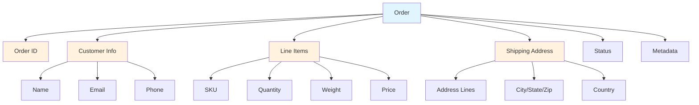

# Orders Management

Karrio's Orders API allows you to create and manage order records that contain line items and customer information. Orders serve as a record-keeping mechanism and can be linked to shipments for order fulfillment tracking.

## Overview

Orders in Karrio are data objects that represent a purchase or fulfillment request containing line items, customer information, and shipping addresses. They provide a way to track the relationship between your business orders and the shipments created to fulfill them.

### Key Features

- **Order Storage**: Store order information including line items and customer details
- **Shipment Linking**: Associate shipments with orders for fulfillment tracking
- **Status Management**: Track order status through fulfillment lifecycle
- **Metadata Support**: Add custom metadata to orders for integration needs

## Order Structure

### Core Components



### Order Fields

Based on the OpenAPI schema, orders contain:

- **order_id**: Your system's order identifier
- **order_date**: Date the order was placed (YYYY-MM-DD)
- **source**: Order source (API, POS, ERP, Shopify, etc.)
- **status**: Current order status
- **customer**: Customer/recipient shipping address
- **shipping_from**: Origin/warehouse address
- **line_items**: Array of line items with SKU, quantity, weight, price
- **options**: Order-level options and preferences
- **metadata**: Custom metadata for integration

## REST API Operations

### Create Order

```bash
curl -X POST "https://api.karrio.io/v1/orders" \
  -H "Authorization: Token YOUR_API_KEY" \
  -H "Content-Type: application/json" \
  -d '{
    "order_id": "ORDER-2024-001",
    "order_date": "2024-01-15",
    "source": "API",
    "customer": {
      "person_name": "John Doe",
      "company_name": "Acme Corp",
      "email": "john@acme.com",
      "phone_number": "+1234567890",
      "address_line1": "123 Customer Street",
      "city": "New York",
      "state_code": "NY",
      "postal_code": "10001",
      "country_code": "US"
    },
    "shipping_from": {
      "company_name": "Warehouse Inc",
      "address_line1": "456 Warehouse Ave",
      "city": "Chicago",
      "state_code": "IL",
      "postal_code": "60601",
      "country_code": "US"
    },
    "line_items": [
      {
        "sku": "WIDGET-001",
        "title": "Red Widget",
        "quantity": 2,
        "weight": 1.5,
        "weight_unit": "LB",
        "value_amount": 25.00,
        "value_currency": "USD"
      },
      {
        "sku": "GADGET-002",
        "title": "Blue Gadget",
        "quantity": 1,
        "weight": 0.8,
        "weight_unit": "LB",
        "value_amount": 15.00,
        "value_currency": "USD"
      }
    ],
    "options": {
      "currency": "USD",
      "shipping_method": "ground"
    },
    "metadata": {
      "customer_id": "CUST-12345",
      "order_source": "website"
    }
  }'
```

### List Orders

```bash
curl -X GET "https://api.karrio.io/v1/orders" \
  -H "Authorization: Token YOUR_API_KEY"
```

### Retrieve Order

```bash
curl -X GET "https://api.karrio.io/v1/orders/order_123456789" \
  -H "Authorization: Token YOUR_API_KEY"
```

### Update Order

Update order metadata and options (line items cannot be edited):

```bash
curl -X PUT "https://api.karrio.io/v1/orders/order_123456789" \
  -H "Authorization: Token YOUR_API_KEY" \
  -H "Content-Type: application/json" \
  -d '{
    "options": {
      "priority": "high",
      "special_instructions": "Handle with care"
    },
    "metadata": {
      "updated_by": "admin",
      "notes": "Customer requested expedited shipping"
    }
  }'
```

### Cancel Order

```bash
curl -X POST "https://api.karrio.io/v1/orders/order_123456789/cancel" \
  -H "Authorization: Token YOUR_API_KEY"
```

## Order Status Management

Orders support the following status values based on your business logic:

- **pending**: Order received, awaiting fulfillment
- **processing**: Order is being prepared for shipment
- **shipped**: Order has been shipped
- **delivered**: Order has been delivered
- **cancelled**: Order has been cancelled
- **returned**: Order has been returned

## Creating Shipments from Orders

While orders don't automatically create shipments, you can use order data to create shipments:

```bash
# First, get the order details
ORDER=$(curl -X GET "https://api.karrio.io/v1/orders/order_123456789" \
  -H "Authorization: Token YOUR_API_KEY")

# Then create a shipment using order data
curl -X POST "https://api.karrio.io/v1/shipments" \
  -H "Authorization: Token YOUR_API_KEY" \
  -H "Content-Type: application/json" \
  -d '{
    "shipper": {
      "company_name": "Your Warehouse",
      "address_line1": "123 Warehouse St",
      "city": "Chicago",
      "state_code": "IL",
      "postal_code": "60601",
      "country_code": "US"
    },
    "recipient": {
      "person_name": "John Doe",
      "address_line1": "123 Customer Street",
      "city": "New York",
      "state_code": "NY",
      "postal_code": "10001",
      "country_code": "US"
    },
    "parcels": [
      {
        "weight": 2.3,
        "weight_unit": "LB",
        "items": [
          {
            "sku": "WIDGET-001",
            "quantity": 2,
            "weight": 1.5,
            "weight_unit": "LB"
          }
        ]
      }
    ],
    "service": "fedex_ground",
    "reference": "ORDER-2024-001",
    "metadata": {
      "order_id": "order_123456789"
    }
  }'
```

## Batch Order Processing

Create multiple orders in a batch:

```bash
curl -X POST "https://api.karrio.io/v1/batches/orders" \
  -H "Authorization: Token YOUR_API_KEY" \
  -H "Content-Type: application/json" \
  -d '{
    "orders": [
      {
        "order_id": "BATCH-ORDER-001",
        "order_date": "2024-01-15",
        "customer": {
          "person_name": "Customer 1",
          "address_line1": "123 First Street",
          "city": "New York",
          "state_code": "NY",
          "postal_code": "10001",
          "country_code": "US"
        },
        "line_items": [
          {
            "sku": "ITEM-001",
            "quantity": 1,
            "weight": 1.0,
            "weight_unit": "LB"
          }
        ]
      },
      {
        "order_id": "BATCH-ORDER-002",
        "order_date": "2024-01-15",
        "customer": {
          "person_name": "Customer 2",
          "address_line1": "456 Second Street",
          "city": "Los Angeles",
          "state_code": "CA",
          "postal_code": "90210",
          "country_code": "US"
        },
        "line_items": [
          {
            "sku": "ITEM-002",
            "quantity": 2,
            "weight": 1.5,
            "weight_unit": "LB"
          }
        ]
      }
    ]
  }'
```

## Webhook Events

Karrio supports the following order-related webhook events:

- **order_created**: Triggered when a new order is created
- **order_updated**: Triggered when order metadata/options are updated
- **order_fulfilled**: Triggered when order status changes to fulfilled
- **order_cancelled**: Triggered when an order is cancelled
- **order_delivered**: Triggered when order status changes to delivered

### Webhook Payload Example

```json
{
  "type": "order_created",
  "data": {
    "id": "order_123456789",
    "order_id": "ORDER-2024-001",
    "status": "pending",
    "customer": {
      "person_name": "John Doe",
      "address_line1": "123 Customer Street"
    },
    "line_items": [
      {
        "sku": "WIDGET-001",
        "quantity": 2
      }
    ],
    "test_mode": false
  }
}
```

## Integration Examples

### E-commerce Platform Integration

```javascript
// Example webhook handler for order events
app.post("/webhooks/orders", (req, res) => {
  const event = req.body;

  switch (event.type) {
    case "order_created":
      console.log("New order received:", event.data.order_id);
      // Process new order
      break;

    case "order_updated":
      console.log("Order updated:", event.data.order_id);
      // Sync order changes
      break;

    case "order_cancelled":
      console.log("Order cancelled:", event.data.order_id);
      // Handle cancellation
      break;
  }

  res.status(200).send("OK");
});
```

### Order Management Workflow

```javascript
// Create order from e-commerce data
async function createOrderFromCart(cartData) {
  const order = await fetch("https://api.karrio.io/v1/orders", {
    method: "POST",
    headers: {
      Authorization: "Token YOUR_API_KEY",
      "Content-Type": "application/json",
    },
    body: JSON.stringify({
      order_id: cartData.orderNumber,
      order_date: new Date().toISOString().split("T")[0],
      source: "website",
      customer: cartData.shippingAddress,
      line_items: cartData.items.map((item) => ({
        sku: item.sku,
        title: item.name,
        quantity: item.quantity,
        weight: item.weight,
        weight_unit: "LB",
        value_amount: item.price,
        value_currency: "USD",
      })),
      metadata: {
        cart_id: cartData.id,
        customer_id: cartData.customerId,
      },
    }),
  });

  return await order.json();
}
```

## Best Practices

### Order Management

1. **Unique Order IDs**: Use unique order_id values from your system
2. **Proper Dates**: Use YYYY-MM-DD format for order_date
3. **Complete Addresses**: Include all required address fields for customer
4. **Accurate Line Items**: Ensure SKU, quantity, and weight are accurate
5. **Meaningful Metadata**: Use metadata for integration and tracking needs

### Status Tracking

```bash
# Update order status after shipment
curl -X PUT "https://api.karrio.io/v1/orders/order_123456789" \
  -H "Authorization: Token YOUR_API_KEY" \
  -H "Content-Type: application/json" \
  -d '{
    "metadata": {
      "status": "shipped",
      "shipment_id": "shp_987654321",
      "tracking_number": "1Z999AA1234567890"
    }
  }'
```

### Error Handling

```javascript
// Handle order creation errors
try {
  const response = await fetch("https://api.karrio.io/v1/orders", {
    method: "POST",
    headers: {
      Authorization: "Token YOUR_API_KEY",
      "Content-Type": "application/json",
    },
    body: JSON.stringify(orderData),
  });

  if (!response.ok) {
    const error = await response.json();
    console.error("Order creation failed:", error);
    return;
  }

  const order = await response.json();
  console.log("Order created successfully:", order.id);
} catch (error) {
  console.error("Network error:", error);
}
```

## What's Next?

- [Shipments →](/docs/products/shipments) - Create shipments for order fulfillment
- [Batch Processing →](/docs/products/batch-processing) - Process multiple orders efficiently
- [Webhooks →](/docs/products/webhooks) - Monitor order events and status changes
- [API Reference →](/docs/reference/rest) - Complete REST API documentation

---

**Need help with order management?** Join our [community Discord](https://discord.gg/karrio) or contact our support team.
