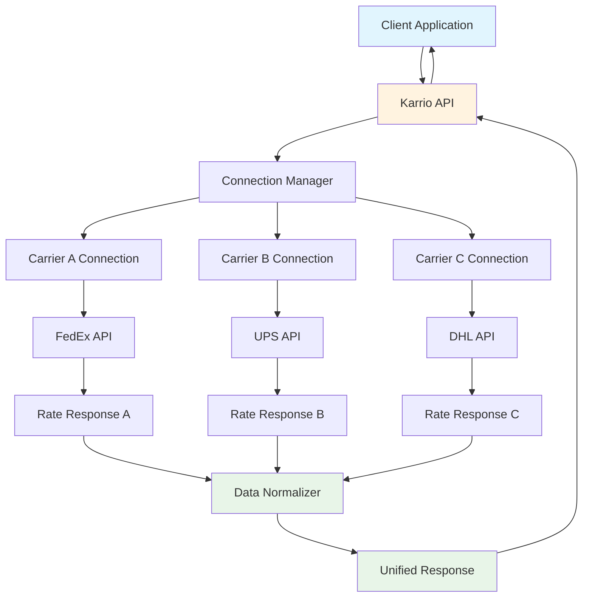

# Carrier Connections

Karrio's Carrier Connections provide a unified API to integrate with 50+ shipping carriers worldwide. Manage all your carrier accounts, credentials, and configurations in one place while maintaining consistent interfaces across different shipping providers.

## Overview

Instead of integrating with dozens of different carrier APIs, each with their own authentication methods, data formats, and business logic, Karrio provides a single, standardized interface. Whether you're shipping with FedEx, UPS, DHL, or any other supported carrier, the integration process remains consistent.

### Key Benefits

- **Universal Integration**: One API interface for all supported carriers
- **Standardized Data**: Consistent request/response formats across carriers
- **Simplified Authentication**: Manage all carrier credentials in one place
- **Real-time Rate Comparison**: Compare rates across multiple carriers instantly
- **Test and Production**: Separate environments for development and live operations

## Architecture

### Connection Management Flow



### Core Components

#### 1. Connection Registry

Central registry for all carrier connections:

- **Credential Management**: Secure storage and encryption of carrier API credentials
- **Connection Status**: Real-time monitoring of carrier API availability
- **Configuration Management**: Carrier-specific settings and preferences
- **Access Control**: User and organization-level access to specific carriers

#### 2. API Abstraction Layer

Standardizes communication with different carrier APIs:

- **Request Translation**: Converts unified requests to carrier-specific formats
- **Response Normalization**: Standardizes carrier responses to unified format
- **Error Handling**: Consistent error handling across all carriers

#### 3. Authentication Manager

Handles diverse carrier authentication methods:

- **OAuth Integration**: OAuth2 flows for supported carriers
- **API Key Management**: Secure API key storage and rotation
- **Certificate Handling**: SSL certificate management for carriers requiring them
- **Token Refresh**: Automatic token refresh for time-limited credentials

## Supported Carriers

### Major International Carriers

- **FedEx**: Express, Ground, Freight services
- **UPS**: Ground, Air, International services
- **DHL**: Express, Parcel, eCommerce solutions
- **TNT**: International express delivery

### Regional Carriers

- **Canada Post**: Canadian postal services
- **Australia Post**: Australian postal services
- **Royal Mail**: UK postal services
- **La Poste**: French postal services

### Specialized Carriers

- **Purolator**: Canadian courier services
- **Canpar**: Canadian ground delivery
- **Sendle**: Australian parcel delivery
- **Zoom2u**: On-demand delivery

[View complete list of supported carriers →](/docs/reference/carriers)

## Getting Started

### 1. Create Your First Carrier Connection

```bash
curl -X POST "https://api.karrio.io/v1/connections" \
  -H "Authorization: Token YOUR_API_KEY" \
  -H "Content-Type: application/json" \
  -d '{
    "carrier_name": "fedex",
    "carrier_id": "fedex_production",
    "credentials": {
      "account_number": "YOUR_FEDEX_ACCOUNT",
      "meter_number": "YOUR_METER_NUMBER",
      "user_key": "YOUR_USER_KEY",
      "password": "YOUR_PASSWORD"
    },
    "test_mode": false,
    "active": true
  }'
```

### 2. Test Your Connection

```bash
# Get carrier services
curl -X GET "https://api.karrio.io/v1/carriers/fedex/services" \
  -H "Authorization: Token YOUR_API_KEY"

# Test with a rate request
curl -X POST "https://api.karrio.io/v1/rates" \
  -H "Authorization: Token YOUR_API_KEY" \
  -H "Content-Type: application/json" \
  -d '{
    "shipper": {
      "postal_code": "10001",
      "country_code": "US"
    },
    "recipient": {
      "postal_code": "90210",
      "country_code": "US"
    },
    "parcels": [{
      "weight": 2.5,
      "weight_unit": "LB"
    }],
    "carrier_ids": ["fedex_production"]
  }'
```

### 3. Configure Multiple Carriers

```bash
# Add UPS connection
curl -X POST "https://api.karrio.io/v1/connections" \
  -H "Authorization: Token YOUR_API_KEY" \
  -H "Content-Type: application/json" \
  -d '{
    "carrier_name": "ups",
    "carrier_id": "ups_production",
    "credentials": {
      "account_number": "UPS_ACCOUNT",
      "access_key": "UPS_ACCESS_KEY",
      "user_id": "UPS_USER_ID",
      "password": "UPS_PASSWORD"
    },
    "test_mode": false,
    "active": true
  }'

# Add USPS connection
curl -X POST "https://api.karrio.io/v1/connections" \
  -H "Authorization: Token YOUR_API_KEY" \
  -H "Content-Type: application/json" \
  -d '{
    "carrier_name": "usps",
    "carrier_id": "usps_production",
    "credentials": {
      "username": "USPS_USERNAME",
      "password": "USPS_PASSWORD"
    },
    "test_mode": false,
    "active": true
  }'

# Compare rates across all carriers
curl -X POST "https://api.karrio.io/v1/rates" \
  -H "Authorization: Token YOUR_API_KEY" \
  -H "Content-Type: application/json" \
  -d '{
    "shipper": {
      "postal_code": "10001",
      "country_code": "US"
    },
    "recipient": {
      "postal_code": "90210",
      "country_code": "US"
    },
    "parcels": [{
      "weight": 2.5,
      "weight_unit": "LB"
    }],
    "carrier_ids": ["fedex_production", "ups_production", "usps_production"]
  }'
```

## Use Cases

### E-commerce Integration

Integrate shipping into your e-commerce platform:

```bash
# Create shipment with auto-carrier selection
curl -X POST "https://api.karrio.io/v1/shipments" \
  -H "Authorization: Token YOUR_API_KEY" \
  -H "Content-Type: application/json" \
  -d '{
    "service": "fedex_ground",
    "shipper": {
      "person_name": "John Doe",
      "company_name": "Example Corp",
      "address_line1": "123 Main St",
      "city": "New York",
      "state_code": "NY",
      "postal_code": "10001",
      "country_code": "US"
    },
    "recipient": {
      "person_name": "Jane Smith",
      "address_line1": "456 Oak Ave",
      "city": "Los Angeles",
      "state_code": "CA",
      "postal_code": "90210",
      "country_code": "US"
    },
    "parcels": [{
      "weight": 2.5,
      "weight_unit": "LB",
      "length": 10,
      "width": 8,
      "height": 6,
      "dimension_unit": "IN"
    }],
    "carrier_ids": ["fedex_production"]
  }'
```

### Multi-Carrier Rate Shopping

Compare rates and select best option:

```bash
# Get rates from multiple carriers
curl -X POST "https://api.karrio.io/v1/rates" \
  -H "Authorization: Token YOUR_API_KEY" \
  -H "Content-Type: application/json" \
  -d '{
    "shipper": {
      "postal_code": "10001",
      "country_code": "US"
    },
    "recipient": {
      "postal_code": "90210",
      "country_code": "US"
    },
    "parcels": [{
      "weight": 2.5,
      "weight_unit": "LB"
    }],
    "services": ["ground", "express"]
  }' | jq '.rates | sort_by(.total_charge)'
```

### International Shipping

Handle customs and international requirements:

```bash
curl -X POST "https://api.karrio.io/v1/shipments" \
  -H "Authorization: Token YOUR_API_KEY" \
  -H "Content-Type: application/json" \
  -d '{
    "service": "fedex_international_priority",
    "shipper": {
      "person_name": "John Doe",
      "address_line1": "123 Main St",
      "city": "New York",
      "postal_code": "10001",
      "country_code": "US"
    },
    "recipient": {
      "person_name": "Jean Dupont",
      "address_line1": "456 Rue de la Paix",
      "city": "Paris",
      "postal_code": "75001",
      "country_code": "FR"
    },
    "parcels": [{
      "weight": 2.5,
      "weight_unit": "LB",
      "items": [{
        "title": "Electronics",
        "quantity": 1,
        "value_amount": 150.00,
        "value_currency": "USD",
        "origin_country": "US"
      }]
    }],
    "customs": {
      "commodities": [{
        "title": "Electronics",
        "quantity": 1,
        "value_amount": 150.00,
        "value_currency": "USD",
        "origin_country": "US"
      }],
      "content_type": "merchandise",
      "commercial_invoice": true
    },
    "carrier_ids": ["fedex_production"]
  }'
```

## Advanced Features

### Connection Management

#### List All Connections

```bash
curl -X GET "https://api.karrio.io/v1/connections" \
  -H "Authorization: Token YOUR_API_KEY"
```

#### Update Connection Settings

```bash
curl -X PATCH "https://api.karrio.io/v1/connections/CONNECTION_ID" \
  -H "Authorization: Token YOUR_API_KEY" \
  -H "Content-Type: application/json" \
  -d '{
    "active": false,
    "config": {
      "default_service": "ground"
    }
  }'
```

#### Remove Connection

```bash
curl -X DELETE "https://api.karrio.io/v1/connections/CONNECTION_ID" \
  -H "Authorization: Token YOUR_API_KEY"
```

### Carrier-Specific Configuration

Each carrier supports specific configuration options:

```bash
# FedEx with custom config
curl -X POST "https://api.karrio.io/v1/connections" \
  -H "Authorization: Token YOUR_API_KEY" \
  -H "Content-Type: application/json" \
  -d '{
    "carrier_name": "fedex",
    "carrier_id": "fedex_custom",
    "credentials": {
      "account_number": "YOUR_ACCOUNT",
      "meter_number": "YOUR_METER",
      "user_key": "YOUR_KEY",
      "password": "YOUR_PASSWORD"
    },
    "config": {
      "smart_post_hub_id": "5087",
      "freight_account_number": "FREIGHT_ACCOUNT"
    },
    "test_mode": false
  }'
```

## Security & Compliance

### Credential Security

- **Encryption**: All credentials encrypted at rest using AES-256
- **Access Control**: Role-based access to carrier connections
- **Audit Logging**: Complete audit trail of credential access and modifications
- **Automatic Rotation**: Support for automatic credential rotation where supported by carriers

### Compliance

- **PCI DSS**: PCI DSS compliant credential storage
- **SOC 2**: SOC 2 Type II certified infrastructure
- **GDPR**: GDPR compliant data handling
- **Regional Compliance**: Meets regional shipping and data protection requirements

## Error Handling

Common connection errors and solutions:

```bash
# Test connection health
curl -X POST "https://api.karrio.io/v1/rates" \
  -H "Authorization: Token YOUR_API_KEY" \
  -H "Content-Type: application/json" \
  -d '{
    "shipper": {"postal_code": "10001", "country_code": "US"},
    "recipient": {"postal_code": "90210", "country_code": "US"},
    "parcels": [{"weight": 1, "weight_unit": "LB"}],
    "carrier_ids": ["CONNECTION_ID"]
  }'

# Handle common errors:
# - 401: Invalid credentials
# - 424: Carrier API unavailable
# - 400: Invalid request data
```

## Best Practices

### Connection Naming

Use descriptive carrier IDs for better organization:

```bash
# Good examples
"carrier_id": "fedex_production_main"
"carrier_id": "ups_test_warehouse_1"
"carrier_id": "dhl_express_eu"

# Avoid generic names
"carrier_id": "fedex1"
"carrier_id": "test"
```

### Environment Management

Separate test and production connections:

```bash
# Test environment
{
  "carrier_id": "fedex_test",
  "test_mode": true
}

# Production environment
{
  "carrier_id": "fedex_production",
  "test_mode": false
}
```

### Metadata Usage

Use metadata for organizational purposes:

```bash
{
  "carrier_id": "fedex_warehouse_1",
  "metadata": {
    "warehouse": "east-coast",
    "department": "fulfillment",
    "cost_center": "logistics"
  }
}
```

## What's Next?

- [Shipments →](/docs/products/shipments) - Create and manage shipments
- [Tracking →](/docs/products/tracking) - Track packages in real-time
- [Orders →](/docs/products/orders) - Complete order management
- [Webhooks →](/docs/products/webhooks) - Real-time event notifications
- [API Reference →](/docs/reference/api) - Complete API documentation

---

**Need help connecting a carrier?** Join our [community Discord](https://discord.gg/karrio) or check our [carrier-specific guides](/docs/carriers).
