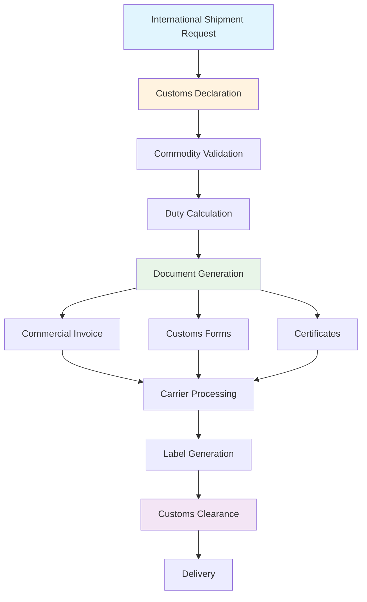

# International Shipments & Customs

<div className="flex gap-2 mb-6">
  <div className="inline-flex items-center rounded-md bg-green-50 px-2 py-1 text-xs font-medium text-green-700 ring-1 ring-inset ring-green-600/20 dark:bg-green-400/10 dark:text-green-400 dark:ring-green-400/30">
    <span className="text-xs">Community Edition</span>
  </div>
  <div className="inline-flex items-center rounded-md bg-red-50 px-2 py-1 text-xs font-medium text-red-700 ring-1 ring-inset ring-red-700/10 dark:bg-red-400/10 dark:text-red-400 dark:ring-red-400/30">
    <span className="text-xs">International Feature</span>
  </div>
</div>

Karrio's international shipping capabilities handle the complexities of cross-border commerce, including automatic customs documentation generation, duty calculation, and compliance with international trade regulations.

## Overview

International shipping with Karrio includes:

- **Customs Documentation**: Automatic generation of commercial invoices, customs forms, and certificates
- **Compliance Management**: Ensure compliance with international trade regulations

## International Shipping Workflow



## API Reference

### Basic International Shipment

Create an international shipment with customs declaration:

```bash
curl -X POST "https://api.karrio.io/v1/shipments" \
  -H "Authorization: Token YOUR_API_KEY" \
  -H "Content-Type: application/json" \
  -d '{
    "service": "fedex_international_priority",
    "shipper": {
      "person_name": "John Doe",
      "company_name": "Example Corp",
      "address_line1": "123 Main St",
      "city": "New York",
      "state_code": "NY",
      "postal_code": "10001",
      "country_code": "US",
      "phone_number": "555-1234",
      "email": "john@example.com"
    },
    "recipient": {
      "person_name": "Marie Dubois",
      "company_name": "Paris Imports",
      "address_line1": "123 Rue de la Paix",
      "city": "Paris",
      "postal_code": "75001",
      "country_code": "FR",
      "phone_number": "+33-1-42-60-30-30",
      "email": "marie@parisimports.fr"
    },
    "parcels": [{
      "weight": 2.5,
      "weight_unit": "LB",
      "length": 10,
      "width": 8,
      "height": 6,
      "dimension_unit": "IN"
    }],
    "customs": {
      "content_type": "merchandise",
      "content_description": "Clothing items",
      "incoterm": "DDP",
      "invoice": "INV-2024-001",
      "invoice_date": "2024-01-15",
      "commercial_invoice": true,
      "commodities": [{
        "description": "Cotton T-Shirt",
        "quantity": 2,
        "value_amount": 25.00,
        "value_currency": "USD",
        "weight": 0.5,
        "weight_unit": "LB",
        "origin_country": "US",
        "hs_code": "6109100010"
      }]
    }
  }'
```

**Response:**

```json
{
  "id": "shp_1234567890",
  "carrier_name": "fedex",
  "service": "fedex_international_priority",
  "tracking_number": "1234567890123456",
  "status": "purchased",
  "selected_rate": {
    "total_charge": 45.99,
    "currency": "USD",
    "transit_days": 2
  },
  "label_url": "https://api.karrio.io/v1/documents/label_123.pdf",
  "invoice_url": "https://api.karrio.io/v1/documents/invoice_123.pdf",
  "customs": {
    "content_type": "merchandise",
    "incoterm": "DDP",
    "commodities": [{
      "description": "Cotton T-Shirt",
      "quantity": 2,
      "value_amount": 25.00,
      "value_currency": "USD",
      "hs_code": "6109100010"
    }]
  }
}
```

### International Shipment with Detailed Customs

Include comprehensive customs information:

```bash
curl -X POST "https://api.karrio.io/v1/shipments" \
  -H "Authorization: Token YOUR_API_KEY" \
  -H "Content-Type: application/json" \
  -d '{
    "service": "ups_worldwide_express",
    "shipper": {
      "person_name": "John Doe",
      "company_name": "Example Corp",
      "address_line1": "123 Main St",
      "city": "New York",
      "state_code": "NY",
      "postal_code": "10001",
      "country_code": "US",
      "tax_id": "123456789"
    },
    "recipient": {
      "person_name": "Hans Mueller",
      "company_name": "Berlin Imports GmbH",
      "address_line1": "Unter den Linden 1",
      "city": "Berlin",
      "postal_code": "10117",
      "country_code": "DE",
      "tax_id": "DE123456789"
    },
    "parcels": [{
      "weight": 5.0,
      "weight_unit": "LB"
    }],
    "customs": {
      "content_type": "merchandise",
      "content_description": "Electronic components",
      "incoterm": "DDU",
      "invoice": "INV-2024-002",
      "invoice_date": "2024-01-15",
      "commercial_invoice": true,
      "certify": true,
      "signer": "John Doe",
      "commodities": [{
        "description": "Electronic Circuit Board",
        "quantity": 1,
        "value_amount": 150.00,
        "value_currency": "USD",
        "weight": 2.0,
        "weight_unit": "LB",
        "origin_country": "US",
        "hs_code": "8534001000",
        "sku": "ECB-001"
      }, {
        "description": "Power Supply Unit",
        "quantity": 1,
        "value_amount": 75.00,
        "value_currency": "USD",
        "weight": 3.0,
        "weight_unit": "LB",
        "origin_country": "US",
        "hs_code": "8504401000",
        "sku": "PSU-001"
      }],
      "duty": {
        "paid_by": "recipient",
        "currency": "USD",
        "declared_value": 225.00
      }
    }
  }'
```

### Document-Only Shipment

Create a shipment for documents only:

```bash
curl -X POST "https://api.karrio.io/v1/shipments" \
  -H "Authorization: Token YOUR_API_KEY" \
  -H "Content-Type: application/json" \
  -d '{
    "service": "fedex_international_priority",
    "shipper": {
      "person_name": "John Doe",
      "address_line1": "123 Main St",
      "city": "New York",
      "postal_code": "10001",
      "country_code": "US"
    },
    "recipient": {
      "person_name": "Marie Dubois",
      "address_line1": "123 Rue de la Paix",
      "city": "Paris",
      "postal_code": "75001",
      "country_code": "FR"
    },
    "parcels": [{
      "weight": 0.5,
      "weight_unit": "LB",
      "is_document": true
    }],
    "customs": {
      "content_type": "documents",
      "content_description": "Business documents",
      "commodities": [{
        "description": "Business contracts",
        "quantity": 1,
        "value_amount": 0.00,
        "value_currency": "USD",
        "weight": 0.5,
        "weight_unit": "LB"
      }]
    }
  }'
```

## Customs Information

### Content Types

Different content types for international shipments:

- **merchandise**: Commercial goods for sale
- **documents**: Business or personal documents
- **gift**: Personal gifts (value restrictions apply)
- **sample**: Product samples for evaluation
- **return_merchandise**: Returned goods
- **other**: Other content types

### Incoterms

International Commercial Terms define responsibilities:

- **DDP (Delivered Duty Paid)**: Seller pays all duties and taxes
- **DDU (Delivered Duty Unpaid)**: Buyer pays duties and taxes
- **CFR (Cost and Freight)**: Seller pays freight, buyer pays duties
- **CIF (Cost, Insurance, and Freight)**: Seller pays freight and insurance
- **EXW (Ex Works)**: Buyer handles all shipping and duties
- **FCA (Free Carrier)**: Seller delivers to carrier
- **FOB (Free on Board)**: Transfer of risk at shipping point

### Commodity Information

Required information for each commodity:

```bash
curl -X POST "https://api.karrio.io/v1/shipments" \
  -H "Authorization: Token YOUR_API_KEY" \
  -H "Content-Type: application/json" \
  -d '{
    "service": "dhl_express",
    "shipper": {...},
    "recipient": {...},
    "parcels": [{
      "weight": 3.0,
      "weight_unit": "KG"
    }],
    "customs": {
      "content_type": "merchandise",
      "incoterm": "DDP",
      "commodities": [{
        "description": "Wireless Headphones",
        "quantity": 1,
        "value_amount": 199.99,
        "value_currency": "USD",
        "weight": 0.5,
        "weight_unit": "KG",
        "origin_country": "CN",
        "hs_code": "8518300000",
        "sku": "WH-001",
        "manufacturer": "TechCorp",
        "made_in": "China"
      }]
    }
  }'
```

## Duty and Tax Management

### Duty Payment Options

Configure who pays duties and taxes:

```bash
curl -X POST "https://api.karrio.io/v1/shipments" \
  -H "Authorization: Token YOUR_API_KEY" \
  -H "Content-Type: application/json" \
  -d '{
    "service": "fedex_international_priority",
    "shipper": {...},
    "recipient": {...},
    "parcels": [...],
    "customs": {
      "content_type": "merchandise",
      "incoterm": "DDU",
      "commodities": [...],
      "duty": {
        "paid_by": "recipient",
        "currency": "USD",
        "declared_value": 500.00,
        "account_number": "123456789"
      }
    }
  }'
```

### Third-Party Billing

Use third-party billing for duties:

```bash
curl -X POST "https://api.karrio.io/v1/shipments" \
  -H "Authorization: Token YOUR_API_KEY" \
  -H "Content-Type: application/json" \
  -d '{
    "service": "ups_worldwide_express",
    "shipper": {...},
    "recipient": {...},
    "billing_address": {
      "person_name": "Billing Contact",
      "company_name": "Billing Company",
      "address_line1": "456 Billing St",
      "city": "Billing City",
      "postal_code": "12345",
      "country_code": "US"
    },
    "customs": {
      "content_type": "merchandise",
      "incoterm": "DDP",
      "commodities": [...],
      "duty": {
        "paid_by": "third_party",
        "currency": "USD",
        "declared_value": 500.00,
        "account_number": "987654321"
      },
      "duty_billing_address": {
        "person_name": "Duty Payer",
        "company_name": "Duty Company",
        "address_line1": "789 Duty St",
        "city": "Duty City",
        "postal_code": "54321",
        "country_code": "US"
      }
    }
  }'
```

## International Options

### Special Services

International shipping options:

```bash
curl -X POST "https://api.karrio.io/v1/shipments" \
  -H "Authorization: Token YOUR_API_KEY" \
  -H "Content-Type: application/json" \
  -d '{
    "service": "fedex_international_priority",
    "shipper": {...},
    "recipient": {...},
    "parcels": [...],
    "options": {
      "insurance": 500.00,
      "signature_confirmation": true,
      "dangerous_good": false,
      "declared_value": 500.00,
      "email_notification": true,
      "email_notification_to": "customer@example.com"
    },
    "customs": {
      "content_type": "merchandise",
      "incoterm": "DDP",
      "commodities": [...]
    }
  }'
```

### Currency Handling

Handle multiple currencies:

```bash
curl -X POST "https://api.karrio.io/v1/shipments" \
  -H "Authorization: Token YOUR_API_KEY" \
  -H "Content-Type: application/json" \
  -d '{
    "service": "dhl_express",
    "shipper": {...},
    "recipient": {...},
    "parcels": [...],
    "options": {
      "currency": "EUR",
      "declared_value": 420.00
    },
    "customs": {
      "content_type": "merchandise",
      "incoterm": "DDP",
      "commodities": [{
        "description": "Product",
        "quantity": 1,
        "value_amount": 420.00,
        "value_currency": "EUR",
        "weight": 1.0,
        "weight_unit": "KG"
      }]
    }
  }'
```

## Multi-Country Scenarios

### US to Canada

Common North American shipping:

```bash
curl -X POST "https://api.karrio.io/v1/shipments" \
  -H "Authorization: Token YOUR_API_KEY" \
  -H "Content-Type: application/json" \
  -d '{
    "service": "fedex_international_priority",
    "shipper": {
      "person_name": "John Doe",
      "address_line1": "123 Main St",
      "city": "New York",
      "state_code": "NY",
      "postal_code": "10001",
      "country_code": "US"
    },
    "recipient": {
      "person_name": "Jane Smith",
      "address_line1": "456 Maple Ave",
      "city": "Toronto",
      "state_code": "ON",
      "postal_code": "M5V 3A8",
      "country_code": "CA"
    },
    "parcels": [{
      "weight": 2.0,
      "weight_unit": "LB"
    }],
    "customs": {
      "content_type": "merchandise",
      "incoterm": "DDU",
      "commodities": [{
        "description": "Electronics",
        "quantity": 1,
        "value_amount": 100.00,
        "value_currency": "USD",
        "weight": 2.0,
        "weight_unit": "LB",
        "origin_country": "US"
      }]
    }
  }'
```

### US to EU

Shipping to European Union:

```bash
curl -X POST "https://api.karrio.io/v1/shipments" \
  -H "Authorization: Token YOUR_API_KEY" \
  -H "Content-Type: application/json" \
  -d '{
    "service": "ups_worldwide_express",
    "shipper": {
      "person_name": "John Doe",
      "address_line1": "123 Main St",
      "city": "New York",
      "postal_code": "10001",
      "country_code": "US"
    },
    "recipient": {
      "person_name": "Hans Mueller",
      "address_line1": "Unter den Linden 1",
      "city": "Berlin",
      "postal_code": "10117",
      "country_code": "DE"
    },
    "parcels": [{
      "weight": 3.0,
      "weight_unit": "KG"
    }],
    "customs": {
      "content_type": "merchandise",
      "incoterm": "DDP",
      "commodities": [{
        "description": "Consumer Electronics",
        "quantity": 1,
        "value_amount": 200.00,
        "value_currency": "USD",
        "weight": 3.0,
        "weight_unit": "KG",
        "origin_country": "US",
        "hs_code": "8517120000"
      }]
    }
  }'
```

### Asia-Pacific Shipping

Shipping to Asia-Pacific region:

```bash
curl -X POST "https://api.karrio.io/v1/shipments" \
  -H "Authorization: Token YOUR_API_KEY" \
  -H "Content-Type: application/json" \
  -d '{
    "service": "dhl_express",
    "shipper": {
      "person_name": "John Doe",
      "address_line1": "123 Main St",
      "city": "New York",
      "postal_code": "10001",
      "country_code": "US"
    },
    "recipient": {
      "person_name": "Tanaka Hiroshi",
      "address_line1": "1-1-1 Shibuya",
      "city": "Tokyo",
      "postal_code": "150-0002",
      "country_code": "JP"
    },
    "parcels": [{
      "weight": 1.5,
      "weight_unit": "KG"
    }],
    "customs": {
      "content_type": "merchandise",
      "incoterm": "DDU",
      "commodities": [{
        "description": "Fashion Accessories",
        "quantity": 1,
        "value_amount": 150.00,
        "value_currency": "USD",
        "weight": 1.5,
        "weight_unit": "KG",
        "origin_country": "US",
        "hs_code": "4202220000"
      }]
    }
  }'
```

## Error Handling

### Customs Validation Errors

Handle customs-related errors:

```json
{
  "errors": [
    {
      "code": "CUSTOMS_INVALID_HS_CODE",
      "message": "Invalid HS code for commodity",
      "details": "HS code 1234567890 is not valid"
    }
  ]
}
```
