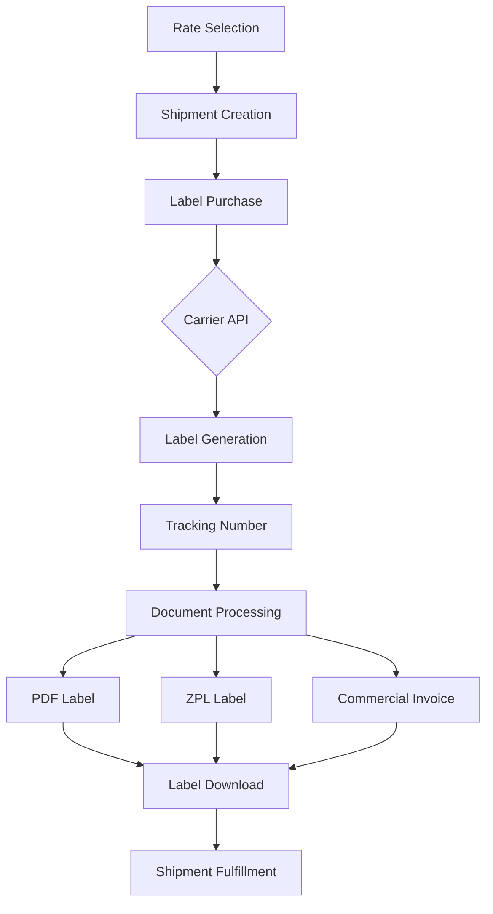

# Label Generation & Purchase

<div className="flex gap-2 mb-6">
  <div className="inline-flex items-center rounded-md bg-green-50 px-2 py-1 text-xs font-medium text-green-700 ring-1 ring-inset ring-green-600/20 dark:bg-green-400/10 dark:text-green-400 dark:ring-green-400/30">
    <span className="text-xs">Community Edition</span>
  </div>
  <div className="inline-flex items-center rounded-md bg-orange-50 px-2 py-1 text-xs font-medium text-orange-700 ring-1 ring-inset ring-orange-700/10 dark:bg-orange-400/10 dark:text-orange-400 dark:ring-orange-400/30">
    <span className="text-xs">Label Purchase</span>
  </div>
</div>

Karrio's label generation system allows you to create and purchase shipping labels from multiple carriers with a single API call. Generate labels in various formats (PDF, PNG, ZPL, EPL) with automatic carrier compliance and tracking number generation.

## Overview

The label generation system provides:

- **Multi-Carrier Support**: Generate labels for FedEx, UPS, DHL, and other carriers
- **Multiple Formats**: Support for PDF, PNG, and ZPL label formats
- **Automatic Compliance**: Carrier-specific label requirements handled automatically
- **Document Generation**: Commercial invoices and customs forms included

## Label Generation Workflow



## API Reference

### Create Shipment with Label

Create a shipment and generate a label in one request:

```bash
curl -X POST "https://api.karrio.io/v1/shipments" \
  -H "Authorization: Token YOUR_API_KEY" \
  -H "Content-Type: application/json" \
  -d '{
    "service": "fedex_ground",
    "shipper": {
      "person_name": "John Doe",
      "company_name": "Example Corp",
      "address_line1": "123 Main St",
      "city": "New York",
      "state_code": "NY",
      "postal_code": "10001",
      "country_code": "US",
      "phone_number": "555-1234"
    },
    "recipient": {
      "person_name": "Jane Smith",
      "address_line1": "456 Oak Ave",
      "city": "Los Angeles",
      "state_code": "CA",
      "postal_code": "90210",
      "country_code": "US",
      "phone_number": "555-5678"
    },
    "parcels": [{
      "weight": 2.5,
      "weight_unit": "LB",
      "length": 10,
      "width": 8,
      "height": 6,
      "dimension_unit": "IN"
    }],
    "label_type": "PDF",
    "options": {
      "insurance": 100.00,
      "signature_confirmation": true
    }
  }'
```

**Response:**

```json
{
  "id": "shp_1234567890",
  "carrier_name": "fedex",
  "carrier_id": "fedex_production",
  "service": "fedex_ground",
  "tracking_number": "1234567890123456",
  "shipment_identifier": "FDX_SHIP_123",
  "status": "purchased",
  "selected_rate": {
    "id": "rate_1",
    "carrier_name": "fedex",
    "service": "fedex_ground",
    "total_charge": 15.99,
    "currency": "USD",
    "transit_days": 3
  },
  "label_type": "PDF",
  "label_url": "https://api.karrio.io/v1/documents/label_123.pdf",
  "invoice_url": "https://api.karrio.io/v1/documents/invoice_123.pdf",
  "created_at": "2024-01-15T10:30:00Z"
}
```

### Rate Shopping with Label Purchase

Create a shipment without service selection to get rates first:

```bash
curl -X POST "https://api.karrio.io/v1/shipments" \
  -H "Authorization: Token YOUR_API_KEY" \
  -H "Content-Type: application/json" \
  -d '{
    "shipper": {
      "person_name": "John Doe",
      "address_line1": "123 Main St",
      "city": "New York",
      "state_code": "NY",
      "postal_code": "10001",
      "country_code": "US"
    },
    "recipient": {
      "person_name": "Jane Smith",
      "address_line1": "456 Oak Ave",
      "city": "Los Angeles",
      "state_code": "CA",
      "postal_code": "90210",
      "country_code": "US"
    },
    "parcels": [{
      "weight": 2.5,
      "weight_unit": "LB"
    }]
  }'
```

**Response with Available Rates:**

```json
{
  "id": "shp_1234567890",
  "status": "draft",
  "rates": [
    {
      "id": "rate_1",
      "carrier_name": "fedex",
      "service": "fedex_ground",
      "total_charge": 15.99,
      "currency": "USD",
      "transit_days": 3
    },
    {
      "id": "rate_2",
      "carrier_name": "ups",
      "service": "ups_ground",
      "total_charge": 16.49,
      "currency": "USD",
      "transit_days": 3
    }
  ],
  "label_url": null,
  "invoice_url": null
}
```

### Purchase Label for Existing Shipment

Purchase a label for a shipment by selecting a rate:

```bash
curl -X POST "https://api.karrio.io/v1/shipments/shp_1234567890/purchase" \
  -H "Authorization: Token YOUR_API_KEY" \
  -H "Content-Type: application/json" \
  -d '{
    "selected_rate_id": "rate_1",
    "label_type": "PDF",
    "payment": {
      "paid_by": "sender",
      "currency": "USD"
    }
  }'
```

**Response:**

```json
{
  "id": "shp_1234567890",
  "status": "purchased",
  "tracking_number": "1234567890123456",
  "selected_rate": {
    "id": "rate_1",
    "carrier_name": "fedex",
    "service": "fedex_ground",
    "total_charge": 15.99,
    "currency": "USD"
  },
  "label_type": "PDF",
  "label_url": "https://api.karrio.io/v1/documents/label_123.pdf",
  "invoice_url": "https://api.karrio.io/v1/documents/invoice_123.pdf"
}
```

## Label Formats

### PDF Labels

Standard PDF format suitable for most printers:

```bash
curl -X POST "https://api.karrio.io/v1/shipments" \
  -H "Authorization: Token YOUR_API_KEY" \
  -H "Content-Type: application/json" \
  -d '{
    "service": "fedex_ground",
    "label_type": "PDF",
    "shipper": {...},
    "recipient": {...},
    "parcels": [...]
  }'
```

### ZPL Labels

ZPL format for Zebra thermal printers:

```bash
curl -X POST "https://api.karrio.io/v1/shipments" \
  -H "Authorization: Token YOUR_API_KEY" \
  -H "Content-Type: application/json" \
  -d '{
    "service": "ups_ground",
    "label_type": "ZPL",
    "shipper": {...},
    "recipient": {...},
    "parcels": [...]
  }'
```

### PNG Labels

PNG image format for web display:

```bash
curl -X POST "https://api.karrio.io/v1/shipments" \
  -H "Authorization: Token YOUR_API_KEY" \
  -H "Content-Type: application/json" \
  -d '{
    "service": "dhl_express",
    "label_type": "PNG",
    "shipper": {...},
    "recipient": {...},
    "parcels": [...]
  }'
```

## Label Customization

### Label Size Options

Different carriers support various label sizes:

```bash
curl -X POST "https://api.karrio.io/v1/shipments" \
  -H "Authorization: Token YOUR_API_KEY" \
  -H "Content-Type: application/json" \
  -d '{
    "service": "fedex_ground",
    "label_type": "PDF",
    "options": {
      "label_size": "4x6",
      "label_format": "PDF_4x6"
    },
    "shipper": {...},
    "recipient": {...},
    "parcels": [...]
  }'
```

## Carrier-Specific Features

### UPS Label Generation

UPS-specific label features:

```bash
curl -X POST "https://api.karrio.io/v1/shipments" \
  -H "Authorization: Token YOUR_API_KEY" \
  -H "Content-Type: application/json" \
  -d '{
    "service": "ups_ground",
    "label_type": "PDF",
    "shipper": {
      "person_name": "John Doe",
      "address_line1": "123 Main St",
      "city": "New York",
      "state_code": "NY",
      "postal_code": "10001",
      "country_code": "US"
    },
    "recipient": {
      "person_name": "Jane Smith",
      "address_line1": "456 Oak Ave",
      "city": "Los Angeles",
      "state_code": "CA",
      "postal_code": "90210",
      "country_code": "US"
    },
    "parcels": [{
      "weight": 2.5,
      "weight_unit": "LB"
    }],
    "options": {
      "saturday_delivery": true,
      "delivery_confirmation": "signature_required"
    }
  }'
```

### FedEx Label Generation

FedEx-specific label features:

```bash
curl -X POST "https://api.karrio.io/v1/shipments" \
  -H "Authorization: Token YOUR_API_KEY" \
  -H "Content-Type: application/json" \
  -d '{
    "service": "fedex_ground",
    "label_type": "PDF",
    "shipper": {
      "person_name": "John Doe",
      "address_line1": "123 Main St",
      "city": "New York",
      "state_code": "NY",
      "postal_code": "10001",
      "country_code": "US"
    },
    "recipient": {
      "person_name": "Jane Smith",
      "address_line1": "456 Oak Ave",
      "city": "Los Angeles",
      "state_code": "CA",
      "postal_code": "90210",
      "country_code": "US"
    },
    "parcels": [{
      "weight": 2.5,
      "weight_unit": "LB"
    }],
    "options": {
      "saturday_delivery": true,
      "hold_at_location": true
    }
  }'
```

## Error Handling

### Label Generation Errors

Handle common label generation errors:

```json
{
  "errors": [
    {
      "code": "INVALID_ADDRESS",
      "message": "Invalid recipient address",
      "details": "Address validation failed for postal code"
    }
  ]
}
```

### Carrier-Specific Errors

Handle carrier-specific validation errors:

```json
{
  "errors": [
    {
      "code": "CARRIER_ERROR",
      "message": "FedEx service unavailable",
      "carrier_name": "fedex",
      "details": "Service temporarily unavailable in destination area"
    }
  ]
}
```

## Troubleshooting

### Common Issues

1. **Address Validation Failures**: Ensure complete and accurate address information
2. **Service Unavailability**: Check carrier service coverage for destination
3. **Authentication Errors**: Validate API keys and carrier credentials

### Debugging Tips

1. **Test Mode**: Use test mode for development and testing
2. **Verbose Logging**: Enable detailed logging for troubleshooting
3. **Error Messages**: Check error messages for specific guidance
4. **Carrier Documentation**: Refer to carrier-specific documentation

---

**Need help?** Join our [community Discord](https://discord.gg/gS88uE7sEx) or contact our support team.
