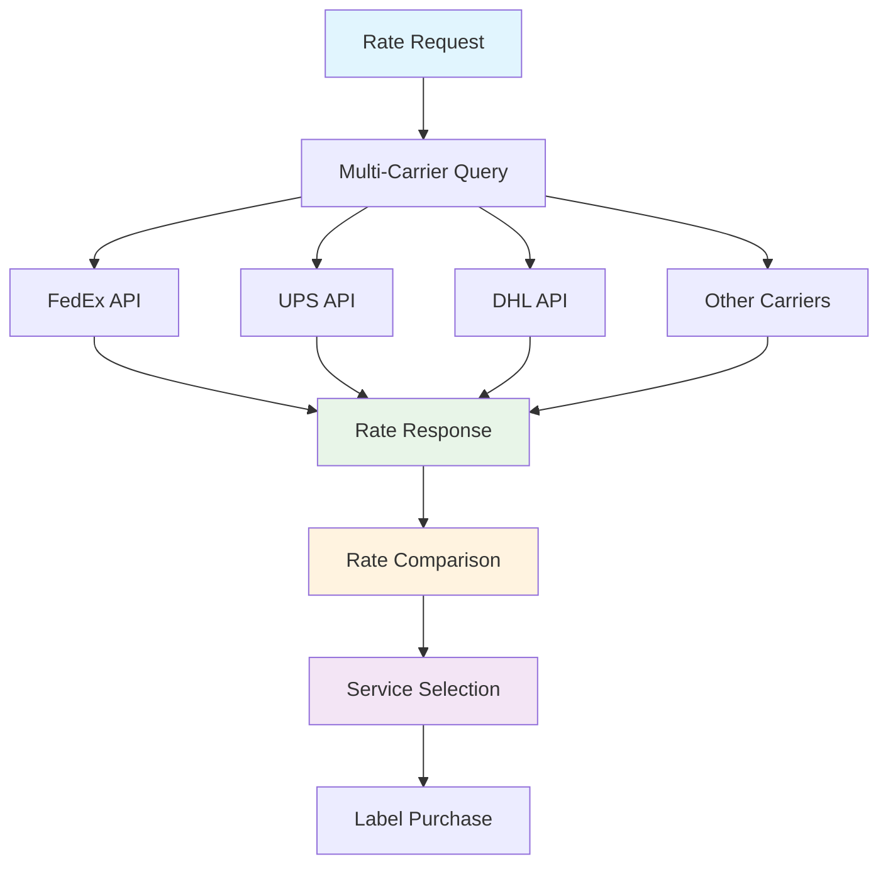

# Live Rates & Service Selection

<div className="flex gap-2 mb-6">
  <div className="inline-flex items-center rounded-md bg-green-50 px-2 py-1 text-xs font-medium text-green-700 ring-1 ring-inset ring-green-600/20 dark:bg-green-400/10 dark:text-green-400 dark:ring-green-400/30">
    <span className="text-xs">Community Edition</span>
  </div>
  <div className="inline-flex items-center rounded-md bg-blue-50 px-2 py-1 text-xs font-medium text-blue-700 ring-1 ring-inset ring-blue-700/10 dark:bg-blue-400/10 dark:text-blue-400 dark:ring-blue-400/30">
    <span className="text-xs">Core Feature</span>
  </div>
</div>

Karrio's live rates API allows you to compare shipping rates across multiple carriers in real-time, helping you find the most cost-effective shipping options for your customers. Get instant quotes from FedEx, UPS, DHL, and other carriers with a single API call.

## Overview

The live rates system enables you to:

- **Compare Rates**: Get quotes from multiple carriers simultaneously
- **Service Selection**: Choose from different service levels (ground, express, overnight)
- **Real-time Pricing**: Access current carrier rates and surcharges
- **Delivery Estimates**: Get estimated delivery times for each service
- **Cost Optimization**: Find the best balance between cost and delivery speed

## Rate Shopping Workflow



## API Reference

### Get Live Rates

Compare shipping rates across multiple carriers without creating a shipment.

```bash
curl -X POST "https://api.karrio.io/v1/proxy/rates" \
  -H "Authorization: Token YOUR_API_KEY" \
  -H "Content-Type: application/json" \
  -d '{
    "shipper": {
      "postal_code": "10001",
      "country_code": "US"
    },
    "recipient": {
      "postal_code": "90210",
      "country_code": "US"
    },
    "parcels": [{
      "weight": 2.5,
      "weight_unit": "LB",
      "length": 10,
      "width": 8,
      "height": 6,
      "dimension_unit": "IN"
    }],
    "services": ["ground", "express"],
    "options": {
      "insurance": 100.00,
      "signature_confirmation": true
    }
  }'
```

**Response:**

```json
{
  "rates": [
    {
      "id": "rate_fedex_ground",
      "carrier_name": "fedex",
      "carrier_id": "fedex_production",
      "service": "fedex_ground",
      "total_charge": 15.99,
      "currency": "USD",
      "transit_days": 3,
      "estimated_delivery": "2024-01-18",
      "extra_charges": [
        {
          "name": "Fuel surcharge",
          "amount": 2.5,
          "currency": "USD"
        }
      ],
      "test_mode": false
    },
    {
      "id": "rate_ups_ground",
      "carrier_name": "ups",
      "carrier_id": "ups_production",
      "service": "ups_ground",
      "total_charge": 16.49,
      "currency": "USD",
      "transit_days": 3,
      "estimated_delivery": "2024-01-18",
      "extra_charges": [
        {
          "name": "Fuel surcharge",
          "amount": 2.75,
          "currency": "USD"
        }
      ],
      "test_mode": false
    }
  ],
  "messages": []
}
```

### Filtered Rate Request

Request rates for specific carriers or services:

```bash
curl -X POST "https://api.karrio.io/v1/proxy/rates" \
  -H "Authorization: Token YOUR_API_KEY" \
  -H "Content-Type: application/json" \
  -d '{
    "shipper": {
      "postal_code": "10001",
      "country_code": "US"
    },
    "recipient": {
      "postal_code": "M5V 3A8",
      "country_code": "CA"
    },
    "parcels": [{
      "weight": 1.0,
      "weight_unit": "KG"
    }],
    "carrier_ids": ["fedex_production", "ups_production"],
    "services": ["fedex_international_priority", "ups_worldwide_express"]
  }'
```

### International Rate Request

Get rates for international shipments with customs information:

```bash
curl -X POST "https://api.karrio.io/v1/proxy/rates" \
  -H "Authorization: Token YOUR_API_KEY" \
  -H "Content-Type: application/json" \
  -d '{
    "shipper": {
      "postal_code": "10001",
      "country_code": "US"
    },
    "recipient": {
      "postal_code": "SW1A 1AA",
      "country_code": "GB"
    },
    "parcels": [{
      "weight": 2.0,
      "weight_unit": "LB",
      "items": [{
        "description": "Sample Product",
        "quantity": 1,
        "value_amount": 50.00,
        "value_currency": "USD",
        "weight": 2.0,
        "weight_unit": "LB"
      }]
    }],
    "customs": {
      "content_type": "merchandise",
      "incoterm": "DDU",
      "commodities": [{
        "description": "Sample Product",
        "quantity": 1,
        "value_amount": 50.00,
        "value_currency": "USD",
        "weight": 2.0,
        "weight_unit": "LB",
        "origin_country": "US"
      }]
    }
  }'
```

## Implementation Examples

### Basic Rate Shopping

```bash
# Get all available rates for a shipment
curl -X POST "https://api.karrio.io/v1/proxy/rates" \
  -H "Authorization: Token YOUR_API_KEY" \
  -H "Content-Type: application/json" \
  -d '{
    "shipper": {
      "postal_code": "10001",
      "country_code": "US"
    },
    "recipient": {
      "postal_code": "90210",
      "country_code": "US"
    },
    "parcels": [{
      "weight": 2.5,
      "weight_unit": "LB"
    }]
  }'
```

### Service-Specific Rates

```bash
# Get rates for specific services only
curl -X POST "https://api.karrio.io/v1/proxy/rates" \
  -H "Authorization: Token YOUR_API_KEY" \
  -H "Content-Type: application/json" \
  -d '{
    "shipper": {
      "postal_code": "10001",
      "country_code": "US"
    },
    "recipient": {
      "postal_code": "90210",
      "country_code": "US"
    },
    "parcels": [{
      "weight": 2.5,
      "weight_unit": "LB"
    }],
    "services": ["fedex_ground", "ups_ground"]
  }'
```

### Carrier-Specific Rates

```bash
# Get rates from specific carriers only
curl -X POST "https://api.karrio.io/v1/proxy/rates" \
  -H "Authorization: Token YOUR_API_KEY" \
  -H "Content-Type: application/json" \
  -d '{
    "shipper": {
      "postal_code": "10001",
      "country_code": "US"
    },
    "recipient": {
      "postal_code": "90210",
      "country_code": "US"
    },
    "parcels": [{
      "weight": 2.5,
      "weight_unit": "LB"
    }],
    "carrier_ids": ["fedex_production", "ups_production"]
  }'
```

## Error Handling

### Rate Request Errors

Common error scenarios and responses:

```json
{
  "rates": [],
  "messages": [
    {
      "code": "INVALID_POSTAL_CODE",
      "message": "Invalid postal code format",
      "details": "Postal code must be in format XXXXX or XXXXX-XXXX"
    }
  ]
}
```
