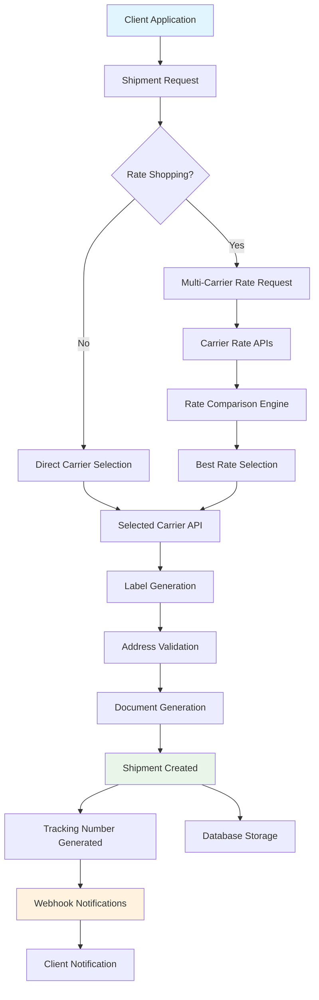

# Shipments

Karrio's Shipments product is the core of our shipping automation platform. It provides a unified interface to create, manage, and optimize shipments across 50+ carriers worldwide, with intelligent rate shopping, automated label generation, and comprehensive tracking integration.

## Overview

The Shipments API transforms complex multi-carrier shipping operations into simple API calls. Whether you're shipping a single package or processing thousands of orders daily, Karrio handles the complexity of different carrier APIs, formats, and requirements behind a consistent interface.

### Key Benefits

- **Universal API**: One API for all carriers - no need to integrate with multiple carrier APIs
- **Intelligent Rate Shopping**: Automatically compare rates across carriers to find the best price and service
- **Automated Validation**: Built-in address validation and shipping requirement checks
- **Flexible Integration**: Support for both synchronous and asynchronous processing
- **Cost Optimization**: Smart carrier selection based on your business rules and preferences

## Architecture

### Data Flow



### Core Components

#### 1. Shipment Engine

The central orchestrator that manages the entire shipment lifecycle:

- **Request Processing**: Validates and normalizes shipment requests
- **Carrier Selection**: Chooses the optimal carrier based on rules and preferences
- **Error Handling**: Manages carrier API failures and retries
- **Status Management**: Tracks shipment status throughout the lifecycle

#### 2. Rate Shopping Engine

Intelligent rate comparison across multiple carriers:

- **Parallel Processing**: Simultaneous rate requests to multiple carriers
- **Smart Filtering**: Filters rates based on service requirements and constraints
- **Cost Optimization**: Compares total costs including additional fees
- **Performance Caching**: Caches frequently requested routes for faster response

#### 3. Label Generation Service

Automated shipping label creation and management:

- **Multi-Format Support**: PDF, PNG, ZPL, EPL label formats
- **Custom Templates**: Branded label templates with your logo and styling
- **Batch Processing**: Generate multiple labels in a single request
- **Document Packaging**: Combine labels with customs forms and invoices

#### 4. Validation Engine

Comprehensive validation for shipping requirements:

- **Address Validation**: Real-time address verification and correction
- **Service Compatibility**: Validates service availability for origin-destination pairs
- **Customs Requirements**: Checks international shipping documentation requirements
- **Weight and Dimension Limits**: Validates package constraints per carrier

## Use Cases

### E-commerce Integration

Perfect for online stores needing automated shipping:

```json
{
  "shipper": {
    "person_name": "Your Store",
    "company_name": "Your Company Inc.",
    "address_line1": "123 Main St",
    "city": "New York",
    "state_code": "NY",
    "postal_code": "10001",
    "country_code": "US"
  },
  "recipient": {
    "person_name": "John Doe",
    "address_line1": "456 Oak Ave",
    "city": "Los Angeles",
    "state_code": "CA",
    "postal_code": "90210",
    "country_code": "US"
  },
  "parcels": [
    {
      "weight": 1.5,
      "weight_unit": "LB",
      "width": 10,
      "height": 8,
      "length": 12,
      "dimension_unit": "IN"
    }
  ],
  "service": "fedex_ground",
  "options": {
    "insurance": 100.0,
    "signature_confirmation": true
  }
}
```

### Multi-Carrier Rate Shopping

Compare rates across multiple carriers before shipping:

```json
{
  "shipper": { ... },
  "recipient": { ... },
  "parcels": [{ ... }],
  "carrier_ids": ["fedex", "ups", "usps"],
  "services": ["ground", "express"],
  "options": {
    "currency": "USD",
    "preferred_service": "ground"
  }
}
```

### International Shipping

Handle complex international shipments with customs:

```json
{
  "shipper": { ... },
  "recipient": {
    "person_name": "Marie Dubois",
    "address_line1": "123 Rue de la Paix",
    "city": "Paris",
    "postal_code": "75001",
    "country_code": "FR"
  },
  "parcels": [{ ... }],
  "customs": {
    "content_type": "merchandise",
    "incoterm": "DDP",
    "commodities": [{
      "description": "T-Shirt",
      "quantity": 2,
      "value_amount": 25.00,
      "value_currency": "USD",
      "weight": 0.5,
      "weight_unit": "LB",
      "origin_country": "US"
    }]
  }
}
```

### Bulk Processing

Process multiple shipments efficiently:

```json
{
  "shipments": [
    {
      "reference": "ORDER-001",
      "shipper": { ... },
      "recipient": { ... },
      "parcels": [{ ... }]
    },
    {
      "reference": "ORDER-002",
      "shipper": { ... },
      "recipient": { ... },
      "parcels": [{ ... }]
    }
  ],
  "options": {
    "async": true,
    "notify_webhook": "https://your-app.com/webhooks/shipments"
  }
}
```

## Getting Started

### 1. Set Up Carrier Connections

First, configure your carrier accounts:

```bash
curl -X POST "https://api.karrio.io/v1/carriers" \
  -H "Authorization: Token YOUR_API_KEY" \
  -H "Content-Type: application/json" \
  -d '{
    "carrier_name": "fedex",
    "display_name": "FedEx Production",
    "credentials": {
      "account_number": "YOUR_ACCOUNT",
      "meter_number": "YOUR_METER",
      "user_key": "YOUR_USER_KEY",
      "password": "YOUR_PASSWORD"
    },
    "test_mode": false
  }'
```

### 2. Create Your First Shipment

```javascript
const karrio = require("karrio");

const client = new karrio.Client({
  apiKey: "YOUR_API_KEY",
  testMode: true,
});

// Get rates first
const rates = await client.shipments.getRates({
  shipper: {
    person_name: "John Smith",
    company_name: "ABC Corp",
    address_line1: "123 Main St",
    city: "New York",
    state_code: "NY",
    postal_code: "10001",
    country_code: "US",
  },
  recipient: {
    person_name: "Jane Doe",
    address_line1: "456 Oak Ave",
    city: "Los Angeles",
    state_code: "CA",
    postal_code: "90210",
    country_code: "US",
  },
  parcels: [
    {
      weight: 2.5,
      weight_unit: "LB",
      width: 12,
      height: 8,
      length: 10,
      dimension_unit: "IN",
    },
  ],
});

// Create shipment with selected rate
const shipment = await client.shipments.create({
  selected_rate_id: rates.rates[0].id,
  // ... same addresses and parcels as above
});

console.log("Tracking Number:", shipment.tracking_number);
console.log("Label URL:", shipment.label_url);
```

### 3. Handle Webhooks

Set up webhooks to receive real-time updates:

```javascript
app.post("/webhooks/shipments", (req, res) => {
  const event = req.body;

  switch (event.type) {
    case "shipment.created":
      console.log("Shipment created:", event.data.tracking_number);
      break;
    case "shipment.delivered":
      console.log("Shipment delivered:", event.data.tracking_number);
      break;
    case "shipment.exception":
      console.log("Shipment exception:", event.data.exception_description);
      break;
  }

  res.status(200).send("OK");
});
```

## Advanced Features

### Smart Carrier Selection

Configure business rules for automatic carrier selection:

```json
{
  "rules": [
    {
      "name": "Express for High Value",
      "condition": "declared_value > 500",
      "action": "prefer_service",
      "value": "express"
    },
    {
      "name": "Ground for Heavy Packages",
      "condition": "weight > 50",
      "action": "exclude_carriers",
      "value": ["fedex_express", "ups_express"]
    }
  ]
}
```

### Address Validation

Automatically validate and correct addresses:

```json
{
  "recipient": {
    "person_name": "John Doe",
    "address_line1": "123 Main Street",
    "city": "New York",
    "state_code": "NY",
    "postal_code": "10001",
    "country_code": "US",
    "validate_location": true
  }
}
```

### Custom Document Templates

Use branded shipping labels and documents:

```json
{
  "options": {
    "label_template": "your-custom-template",
    "invoice_template": "your-invoice-template",
    "branding": {
      "logo_url": "https://your-domain.com/logo.png",
      "primary_color": "#007bff"
    }
  }
}
```

## Integration with Karrio Ecosystem

### With Tracking

Shipments automatically integrate with Karrio's tracking system:

- **Real-time Updates**: Automatic tracking data synchronization
- **Event Notifications**: Webhook events for delivery milestones
- **Exception Handling**: Automated alerts for delivery issues

### With Orders

Seamless integration with order management:

- **Order Fulfillment**: Automatic shipment creation from orders
- **Order Status Sync**: Keep order status updated with shipment progress

### With Workflows

Automate complex shipping processes:

- **Conditional Logic**: Ship based on customer preferences or product types
- **Approval Workflows**: Require approval for high-value shipments
- **Exception Handling**: Automated responses to shipping issues

### With Multi-Tenant

Perfect for platforms and marketplaces:

- **Isolated Operations**: Each tenant's shipments are completely isolated
- **Custom Branding**: Branded labels and documents per tenant
- **Usage Analytics**: Detailed shipping analytics per tenant

## Performance and Scaling

### Optimization Tips

1. **Rate Caching**: Cache frequently requested routes for faster response times
2. **Batch Processing**: Use bulk APIs for high-volume operations
3. **Async Processing**: Use webhooks for time-intensive operations
4. **Carrier Selection**: Pre-filter carriers based on service requirements

### Monitoring

Monitor your shipping operations with built-in analytics:

- **Success Rates**: Track successful shipment creation rates per carrier
- **Performance Metrics**: Monitor API response times and error rates
- **Cost Analysis**: Analyze shipping costs and optimization opportunities
- **Usage Patterns**: Understand peak shipping times and volumes

## What's Next

Ready to dive deeper? Explore these resources:

### API Documentation

- **[Shipments API Reference](/docs/reference/api/shipments)**: Complete API documentation
- **[Rate Shopping API](/docs/reference/api/rates)**: Detailed rate comparison endpoints
- **[Webhooks Reference](/docs/reference/api/webhooks)**: Event notifications and payload schemas

### Advanced Topics

- **[Shipping Rules Engine](/docs/products/shipping-rules)**: Configure intelligent shipping automation
- **[Batch Processing](/docs/products/batch-processing)**: Handle high-volume shipping operations
- **[Document Generation](/docs/products/document-generation)**: Custom shipping documents and forms

### Integration Guides

- **[E-commerce Platforms](/docs/integrations/ecommerce)**: Shopify, WooCommerce, Magento integrations
- **[Webhook Implementation](/docs/guides/webhooks)**: Best practices for webhook handling
- **[Error Handling](/docs/guides/error-handling)**: Robust error handling strategies

---

**Need help?** Join our [community Discord](https://discord.gg/karrio) or contact our support team.
