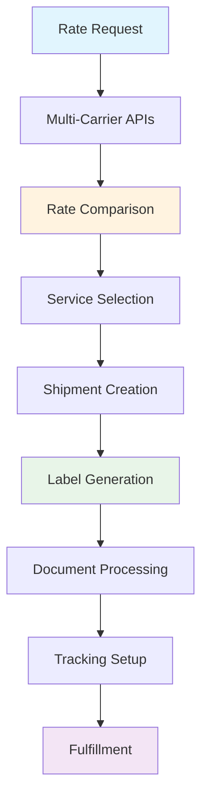

# Shipments Management

<div className="flex gap-2 mb-6">
  <div className="inline-flex items-center rounded-md bg-green-50 px-2 py-1 text-xs font-medium text-green-700 ring-1 ring-inset ring-green-600/20 dark:bg-green-400/10 dark:text-green-400 dark:ring-green-400/30">
    <span className="text-xs">Community Edition</span>
  </div>
  <div className="inline-flex items-center rounded-md bg-blue-50 px-2 py-1 text-xs font-medium text-blue-700 ring-1 ring-inset ring-blue-700/10 dark:bg-blue-400/10 dark:text-blue-400 dark:ring-blue-400/30">
    <span className="text-xs">Core Feature</span>
  </div>
</div>

Every Karrio project comes with comprehensive shipment management capabilities, providing multi-carrier rate shopping, automated label generation, real-time tracking integration, and seamless order fulfillment workflows.

<div className="bg-gray-50 dark:bg-gray-900 rounded-lg p-4 my-6">
  <div className="text-sm text-gray-600 dark:text-gray-400 mb-2">
    Shipment Management Dashboard
  </div>
  <div className="bg-white dark:bg-gray-800 rounded border overflow-hidden">
    
  </div>
</div>

## Core Features

Karrio's shipment management system provides everything you need for modern shipping operations:

### [Live Rates & Service Selection](./live-rates)

Compare shipping rates across multiple carriers in real-time to find the most cost-effective options for your customers.

- **Multi-Carrier Rate Shopping**: Get quotes from FedEx, UPS, DHL, and others simultaneously
- **Real-time Pricing**: Access current carrier rates including surcharges and fees
- **Delivery Estimates**: Get accurate delivery time estimates for each service

### [Label Generation & Purchase](./label-generation)

Create and purchase shipping labels with automatic carrier compliance and tracking integration.

- **Multi-Format Labels**: Generate PDF, PNG, and ZPL labels for any printer
- **Automatic Compliance**: Carrier-specific requirements handled automatically
- **Batch Processing**: Generate multiple labels efficiently

### [International Shipments](./international)

Handle complex international shipping with automated customs documentation and compliance.

- **Customs Documentation**: Automatic generation of commercial invoices and customs forms
- **Compliance Management**: Ensure compliance with international trade regulations
- **Multi-Currency Support**: Handle pricing in local currencies

### [Paperless Trade](./paperless-trade)

Electronic customs documentation for international shipments with intelligent UPS and FedEx integration.

- **Smart Document Processing**: UPS automatically selects optimal FormType based on document availability
- **Multiple Workflows**: Support for pre-uploaded documents and inline document upload
- **Carrier Optimization**: UPS uses API-generated invoices when no documents provided; FedEx supports ETD workflows

## Quick Start

### 1. Get Live Rates

Start by comparing rates across multiple carriers:

```bash
curl -X POST "https://api.karrio.io/v1/proxy/rates" \
  -H "Authorization: Token YOUR_API_KEY" \
  -H "Content-Type: application/json" \
  -d '{
    "shipper": {
      "postal_code": "10001",
      "country_code": "US"
    },
    "recipient": {
      "postal_code": "90210",
      "country_code": "US"
    },
    "parcels": [{
      "weight": 2.5,
      "weight_unit": "LB"
    }]
  }'
```

### 2. Create Shipment with Label

Purchase a shipping label using the selected service:

```bash
curl -X POST "https://api.karrio.io/v1/shipments" \
  -H "Authorization: Token YOUR_API_KEY" \
  -H "Content-Type: application/json" \
  -d '{
    "service": "fedex_ground",
    "shipper": {
      "person_name": "John Doe",
      "address_line1": "123 Main St",
      "city": "New York",
      "postal_code": "10001",
      "country_code": "US"
    },
    "recipient": {
      "person_name": "Jane Smith",
      "address_line1": "456 Oak Ave",
      "city": "Los Angeles",
      "postal_code": "90210",
      "country_code": "US"
    },
    "parcels": [{
      "weight": 2.5,
      "weight_unit": "LB"
    }]
  }'
```

**Response:**

```json
{
  "id": "shp_1234567890",
  "tracking_number": "1234567890123456",
  "status": "purchased",
  "label_url": "https://api.karrio.io/v1/documents/label_123.pdf",
  "selected_rate": {
    "carrier_name": "fedex",
    "service": "fedex_ground",
    "total_charge": 15.99,
    "currency": "USD"
  }
}
```

### 3. Track Your Shipment

Shipments are automatically set up for tracking:

```bash
curl -X GET "https://api.karrio.io/v1/shipments/shp_1234567890" \
  -H "Authorization: Token YOUR_API_KEY"
```

## Data Flow

### Shipment Creation Workflow



## Common Use Cases

### E-commerce Integration

Perfect for online stores needing automated shipping:

- **Order Fulfillment**: Automatically create shipments from orders
- **Multi-Warehouse**: Route shipments from optimal warehouse locations
- **Rate Shopping**: Compare carriers to minimize shipping costs
- **Customer Experience**: Provide accurate delivery estimates

### Enterprise Shipping

Designed for high-volume enterprise operations:

- **Batch Processing**: Process hundreds of shipments simultaneously
- **Carrier Diversification**: Distribute volume across multiple carriers
- **SLA Management**: Route shipments based on delivery requirements
- **Cost Control**: Implement shipping rules and budgets

### International Commerce

Handle complex international shipping requirements:

- **Customs Documentation**: Automatic customs forms and commercial invoices
- **Duty Calculation**: Estimate landed costs for customers
- **Compliance**: Validate items against carrier and country restrictions
- **Multi-Currency**: Handle pricing in local currencies

## Next Steps

Ready to start shipping with Karrio? Explore our detailed documentation:

1. **[Live Rates](./live-rates)** - Learn rate shopping and service selection
2. **[Label Generation](./label-generation)** - Master label creation and formats
3. **[International Shipments](./international)** - Handle customs and compliance
4. **[Paperless Trade](./paperless-trade)** - Implement electronic documentation

### Additional Resources

- Set up [carrier connections](/docs/products/carrier-connections) for your shipping accounts
- Configure [tracking](/docs/products/tracking) for real-time package monitoring
- Explore [webhooks](/docs/products/webhooks) for shipment status notifications
- Learn about [batch processing](/docs/products/batch-processing) for bulk operations

---

**Need help?** Join our [community Discord](https://discord.gg/gS88uE7sEx) or contact our support team.
