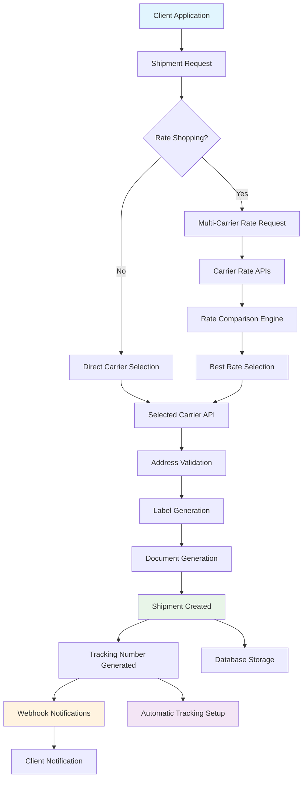

# Shipments Management

<div className="flex gap-2 mb-6">
  <div className="inline-flex items-center rounded-md bg-green-50 px-2 py-1 text-xs font-medium text-green-700 ring-1 ring-inset ring-green-600/20 dark:bg-green-400/10 dark:text-green-400 dark:ring-green-400/30">
    <span className="text-xs">Community Edition</span>
  </div>
  <div className="inline-flex items-center rounded-md bg-blue-50 px-2 py-1 text-xs font-medium text-blue-700 ring-1 ring-inset ring-blue-700/10 dark:bg-blue-400/10 dark:text-blue-400 dark:ring-blue-400/30">
    <span className="text-xs">Core Feature</span>
  </div>
</div>

Every Karrio project comes with comprehensive shipment management capabilities, providing multi-carrier rate shopping, automated label generation, real-time tracking integration, and seamless order fulfillment workflows.

## Features

### Multi-Carrier Shipping

You don't have to integrate with multiple carrier APIs to start shipping. Our shipment engine makes creating FedEx, UPS, DHL, and other carrier shipments as simple as a single API call.

<div className="bg-gray-50 dark:bg-gray-900 rounded-lg p-4 my-6">
  <div className="text-sm text-gray-600 dark:text-gray-400 mb-2">
    Shipment Management Dashboard
  </div>
  <div className="bg-white dark:bg-gray-800 rounded border h-64 flex items-center justify-center">
    <span className="text-gray-400">
      Screenshot: Shipment creation and management interface
    </span>
  </div>
</div>

### Intelligent Rate Shopping

Compare shipping rates across multiple carriers automatically to find the best prices and service levels for each shipment.

### Automated Label Generation

Generate shipping labels in multiple formats (PDF, PNG, ZPL, EPL) with custom branding and automatic compliance documentation.

### Real-time Tracking Integration

Every shipment includes automatic tracking number generation and integration with Karrio's tracking system.

### Batch Processing

Process multiple shipments efficiently with bulk creation APIs and asynchronous processing capabilities.

### Additional features

- Karrio extends shipments with real-time rate comparison across all connected carriers.
- Every shipment includes automatic address validation and correction.
- Karrio manages international customs documentation automatically.
- Import shipment data directly from CSV files or integrate with e-commerce platforms.

## Data Flow

### Shipment Creation Flow



## API Reference

### REST API

#### Create Shipment

```bash
curl -X POST "https://api.karrio.io/v1/shipments" \
  -H "Authorization: Token YOUR_API_KEY" \
  -H "Content-Type: application/json" \
  -d '{
    "service": "fedex_ground",
  "shipper": {
      "person_name": "John Doe",
      "company_name": "Example Corp",
    "address_line1": "123 Main St",
    "city": "New York",
    "state_code": "NY",
    "postal_code": "10001",
      "country_code": "US",
      "phone_number": "555-1234"
  },
  "recipient": {
      "person_name": "Jane Smith",
    "address_line1": "456 Oak Ave",
    "city": "Los Angeles",
    "state_code": "CA",
    "postal_code": "90210",
      "country_code": "US",
      "phone_number": "555-5678"
  },
    "parcels": [{
      "weight": 2.5,
      "weight_unit": "LB",
      "length": 10,
      "width": 8,
      "height": 6,
      "dimension_unit": "IN"
    }],
    "options": {
      "insurance": 100.00,
      "signature_confirmation": true
    }
  }'
```

**Response:**

```json
{
  "id": "shp_1234567890",
  "carrier_name": "fedex",
  "carrier_id": "fedex_production",
  "service": "fedex_ground",
  "tracking_number": "1234567890123456",
  "shipment_identifier": "FDX_SHIP_123",
  "status": "purchased",
  "selected_rate": {
    "carrier_name": "fedex",
    "service": "fedex_ground",
    "total_charge": 15.99,
    "currency": "USD",
    "transit_days": 3
  },
  "label_type": "PDF",
  "label_url": "https://api.karrio.io/v1/documents/label_123.pdf",
  "invoice_url": "https://api.karrio.io/v1/documents/invoice_123.pdf",
  "created_at": "2024-01-15T10:30:00Z",
  "updated_at": "2024-01-15T10:30:00Z"
}
```

#### Get Shipping Rates

```bash
curl -X POST "https://api.karrio.io/v1/proxy/rates" \
  -H "Authorization: Token YOUR_API_KEY" \
  -H "Content-Type: application/json" \
  -d '{
    "shipper": {
      "postal_code": "10001",
      "country_code": "US"
    },
    "recipient": {
      "postal_code": "90210",
      "country_code": "US"
    },
    "parcels": [{
      "weight": 2.5,
      "weight_unit": "LB",
      "length": 10,
      "width": 8,
      "height": 6,
      "dimension_unit": "IN"
    }],
    "services": ["ground", "express"]
  }'
```

**Response:**

```json
{
  "rates": [
    {
      "carrier_name": "fedex",
      "service": "fedex_ground",
      "total_charge": 15.99,
      "currency": "USD",
      "transit_days": 3,
      "extra_charges": [
        {
          "name": "Fuel surcharge",
          "amount": 2.5,
          "currency": "USD"
        }
      ]
    },
    {
      "carrier_name": "ups",
      "service": "ups_ground",
      "total_charge": 16.49,
      "currency": "USD",
      "transit_days": 3,
      "extra_charges": [
        {
          "name": "Fuel surcharge",
          "amount": 2.75,
          "currency": "USD"
        }
      ]
    }
  ]
}
```

#### List Shipments

```bash
curl -X GET "https://api.karrio.io/v1/shipments?limit=10&offset=0" \
  -H "Authorization: Token YOUR_API_KEY"
```

**Response:**

```json
{
  "count": 25,
  "next": "/v1/shipments?limit=10&offset=10",
  "previous": null,
  "results": [
    {
      "id": "shp_1234567890",
      "carrier_name": "fedex",
      "service": "fedex_ground",
      "tracking_number": "1234567890123456",
      "status": "delivered",
      "shipper": {
        "person_name": "John Doe",
        "city": "New York",
        "state_code": "NY"
      },
      "recipient": {
        "person_name": "Jane Smith",
        "city": "Los Angeles",
        "state_code": "CA"
      },
      "created_at": "2024-01-15T10:30:00Z"
    }
  ]
}
```

#### International Shipment with Customs

```bash
curl -X POST "https://api.karrio.io/v1/shipments" \
  -H "Authorization: Token YOUR_API_KEY" \
  -H "Content-Type: application/json" \
  -d '{
    "service": "fedex_international_priority",
    "shipper": {
      "person_name": "John Doe",
      "address_line1": "123 Main St",
      "city": "New York",
      "postal_code": "10001",
      "country_code": "US"
    },
  "recipient": {
    "person_name": "Marie Dubois",
    "address_line1": "123 Rue de la Paix",
    "city": "Paris",
    "postal_code": "75001",
    "country_code": "FR"
  },
    "parcels": [{
      "weight": 1.5,
      "weight_unit": "LB"
    }],
  "customs": {
    "content_type": "merchandise",
    "incoterm": "DDP",
    "commodities": [{
      "description": "T-Shirt",
      "quantity": 2,
      "value_amount": 25.00,
      "value_currency": "USD",
      "weight": 0.5,
      "weight_unit": "LB",
      "origin_country": "US"
    }]
    }
  }'
```

### GraphQL API

#### Create Shipment Mutation

```graphql
mutation CreateShipment($data: CreateShipmentMutationInput!) {
  create_shipment(data: $data) {
    id
    carrier_name
    service
    tracking_number
    status
    selected_rate {
      total_charge
      currency
      service
    }
    label_url
    invoice_url
  }
}
```

**Variables:**

```json
{
  "data": {
    "service": "fedex_ground",
    "shipper": {
      "person_name": "John Doe",
      "address_line1": "123 Main St",
      "city": "New York",
      "state_code": "NY",
      "postal_code": "10001",
      "country_code": "US"
    },
    "recipient": {
      "person_name": "Jane Smith",
      "address_line1": "456 Oak Ave",
      "city": "Los Angeles",
      "state_code": "CA",
      "postal_code": "90210",
      "country_code": "US"
    },
    "parcels": [
      {
        "weight": 2.5,
        "weight_unit": "LB"
      }
    ]
  }
}
```

**Response:**

```json
{
  "data": {
    "create_shipment": {
      "id": "shp_1234567890",
      "carrier_name": "fedex",
      "service": "fedex_ground",
      "tracking_number": "1234567890123456",
      "status": "purchased",
      "selected_rate": {
        "total_charge": 15.99,
        "currency": "USD",
        "service": "fedex_ground"
      },
      "label_url": "https://api.karrio.io/v1/documents/label_123.pdf",
      "invoice_url": "https://api.karrio.io/v1/documents/invoice_123.pdf"
    }
  }
}
```

#### Query Shipments

```graphql
query GetShipments($filter: ShipmentFilter) {
  shipments(filter: $filter) {
    edges {
      node {
        id
        carrier_name
        service
        tracking_number
        status
        shipper {
          person_name
          city
          state_code
        }
        recipient {
          person_name
          city
          state_code
        }
        created_at
      }
    }
    pageInfo {
      hasNextPage
      hasPreviousPage
    }
  }
}
```

**Variables:**

```json
{
  "filter": {
    "status": "delivered",
    "carrier_name": "fedex"
  }
}
```

## Use Cases

### E-commerce Integration

Perfect for online stores needing automated shipping:

- **Order Fulfillment**: Automatically create shipments from orders
- **Multi-Warehouse**: Route shipments from optimal warehouse locations
- **Rate Shopping**: Compare carriers to minimize shipping costs
- **Label Printing**: Generate labels for pick-and-pack operations

### Enterprise Shipping

Designed for high-volume enterprise operations:

- **Batch Processing**: Process hundreds of shipments simultaneously
- **Carrier Diversification**: Distribute volume across multiple carriers
- **SLA Management**: Route shipments based on delivery requirements
- **Cost Control**: Implement shipping rules and budgets

### International Commerce

Handle complex international shipping requirements:

- **Customs Documentation**: Automatic customs forms and commercial invoices
- **Duty and Tax Calculation**: Estimate landed costs for customers
- **Restricted Items**: Validate items against carrier and country restrictions
- **Multi-Currency**: Handle pricing in local currencies

## Getting Started

Ready to start shipping with Karrio? Follow these steps:

1. **Connect your carriers** using our [carrier connections](/docs/products/carrier-connections)
2. **Get shipping rates** to compare prices and services
3. **Create your first shipment** with automatic label generation
4. **Track your packages** with integrated tracking

### Next Steps

- Set up [tracking](/docs/products/tracking) for real-time package monitoring
- Configure [webhooks](/docs/products/webhooks) for shipment status notifications
- Explore [batch processing](/docs/products/batch-processing) for bulk shipments
- Learn about [document generation](/docs/products/document-generation) for customs forms

---

**Need help?** Join our [community Discord](https://discord.gg/karrio) or contact our support team.
