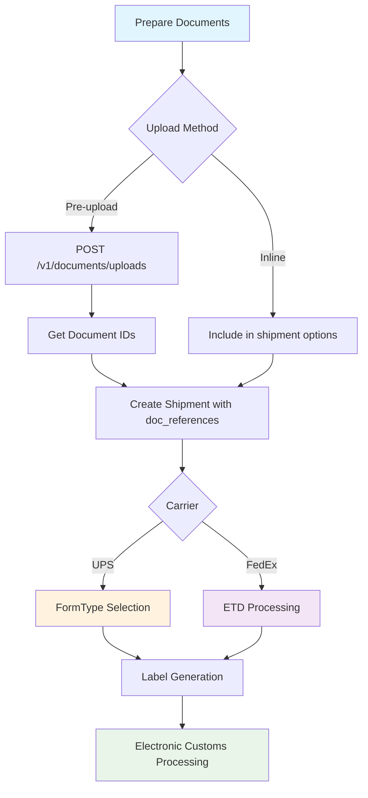

# Paperless Trade & Document Upload

<div className="flex gap-2 mb-6">
  <div className="inline-flex items-center rounded-md bg-green-50 px-2 py-1 text-xs font-medium text-green-700 ring-1 ring-inset ring-green-600/20 dark:bg-green-400/10 dark:text-green-400 dark:ring-green-400/30">
    <span className="text-xs">Community Edition</span>
  </div>
  <div className="inline-flex items-center rounded-md bg-purple-50 px-2 py-1 text-xs font-medium text-purple-700 ring-1 ring-inset ring-purple-700/10 dark:bg-purple-400/10 dark:text-purple-400 dark:ring-purple-400/30">
    <span className="text-xs">International Feature</span>
  </div>
</div>

Karrio's paperless trade functionality enables electronic customs documentation for international shipments, supporting both UPS and FedEx carriers. Upload trade documents electronically to reduce paper-based processes and accelerate customs clearance.

## Overview

Paperless trade eliminates physical customs documentation by allowing electronic upload of required documents. These documents are transmitted to customs authorities and carriers for faster processing.

### Supported Carriers

| Carrier | Implementation | Document Workflows |
|---------|----------------|-------------------|
| **UPS** | UPS Paperless Documents API v1 | User-created forms with document references |
| **FedEx** | FedEx Electronic Trade Documents (ETD) | Pre-shipment and post-shipment document upload |

### Supported Document Types

- `commercial_invoice` - Commercial invoice for customs
- `pro_forma_invoice` - Pro forma invoice
- `certificate_of_origin` - Certificate of origin
- `packing_list` - Detailed packing list
- `other` - Other customs documents

## Document Upload API

### Upload Documents

Upload customs documents for a shipment to enable paperless trade processing.

```bash
curl -X POST "https://api.karrio.io/v1/documents/uploads" \
  -H "Authorization: Token YOUR_API_KEY" \
  -H "Content-Type: application/json" \
  -d '{
    "shipment_id": "shp_1234567890",
    "document_files": [
      {
        "doc_type": "commercial_invoice",
        "doc_name": "commercial_invoice.pdf",
        "doc_format": "pdf",
        "doc_file": "base64_encoded_document_content"
      },
      {
        "doc_type": "certificate_of_origin",
        "doc_name": "certificate_of_origin.pdf",
        "doc_format": "pdf",
        "doc_file": "base64_encoded_document_content"
      }
    ],
    "reference": "CUSTOMS_DOCS_001"
  }'
```

**Response:**

```json
{
  "id": "uprec_1234567890",
  "carrier_name": "fedex",
  "carrier_id": "fedex_production",
  "documents": [
    {
      "doc_id": "090493e181586308",
      "file_name": "commercial_invoice.pdf"
    },
    {
      "doc_id": "090493e181586309",
      "file_name": "certificate_of_origin.pdf"
    }
  ],
  "reference": "CUSTOMS_DOCS_001",
  "messages": []
}
```

### Retrieve Upload Records

```bash
curl -X GET "https://api.karrio.io/v1/documents/uploads" \
  -H "Authorization: Token YOUR_API_KEY"
```

```bash
curl -X GET "https://api.karrio.io/v1/documents/uploads/uprec_1234567890" \
  -H "Authorization: Token YOUR_API_KEY"
```

## UPS Implementation

### How UPS Paperless Trade Works

UPS paperless trade uses a **smart FormType selection** based on document availability:

- **FormType="07"** - User-created forms (when documents are uploaded)
- **FormType="03"** - API-generated commercial invoice (paperless without documents)
- **FormType="01"** - Traditional paper forms (when paperless is disabled)

### 1. Upload Documents (Optional)

For UPS shipments, you can upload documents in advance:

```bash
curl -X POST "https://api.karrio.io/v1/documents/uploads" \
  -H "Authorization: Token YOUR_API_KEY" \
  -H "Content-Type: application/json" \
  -d '{
    "shipment_id": "shp_ups_example",
    "document_files": [
      {
        "doc_type": "commercial_invoice",
        "doc_name": "invoice.pdf",
        "doc_format": "pdf",
        "doc_file": "base64_encoded_content"
      }
    ]
  }'
```

### 2. Create Shipment with Paperless Trade

**Option A: With Pre-uploaded Documents**

```bash
curl -X POST "https://api.karrio.io/v1/shipments" \
  -H "Authorization: Token YOUR_API_KEY" \
  -H "Content-Type: application/json" \
  -d '{
    "service": "ups_worldwide_express",
    "shipper": {
      "person_name": "John Doe",
      "address_line1": "123 Main St",
      "city": "New York",
      "state_code": "NY",
      "postal_code": "10001",
      "country_code": "US"
    },
    "recipient": {
      "person_name": "Jane Smith",
      "address_line1": "456 Oak Ave",
      "city": "London",
      "postal_code": "SW1A 1AA",
      "country_code": "GB"
    },
    "parcels": [{
      "weight": 2.5,
      "weight_unit": "LB"
    }],
    "options": {
      "paperless_trade": true,
      "doc_references": [
        {
          "doc_id": "2016-01-18-11.01.07.589501",
          "doc_type": "commercial_invoice"
        }
      ]
    },
    "customs": {
      "content_type": "merchandise",
      "incoterm": "DDP",
      "commodities": [{
        "description": "Sample Product",
        "quantity": 1,
        "value_amount": 100.00,
        "value_currency": "USD",
        "weight": 2.5,
        "weight_unit": "LB",
        "origin_country": "US"
      }]
    }
  }'
```

**Option B: Paperless Without Documents (Uses API-generated invoice)**

```bash
curl -X POST "https://api.karrio.io/v1/shipments" \
  -H "Authorization: Token YOUR_API_KEY" \
  -H "Content-Type: application/json" \
  -d '{
    "service": "ups_worldwide_express",
    "shipper": { /* same as above */ },
    "recipient": { /* same as above */ },
    "parcels": [{ /* same as above */ }],
    "options": {
      "paperless_trade": true
      // No doc_references - UPS will use FormType="03" for API-generated invoice
    },
    "customs": { /* same as above */ }
  }'
```

## FedEx Implementation

### How FedEx Electronic Trade Documents Work

FedEx supports two document workflows:

1. **Inline Documents** - Upload documents during shipment creation
2. **Pre-uploaded Documents** - Reference previously uploaded documents

### Option A: Inline Document Upload

```bash
curl -X POST "https://api.karrio.io/v1/shipments" \
  -H "Authorization: Token YOUR_API_KEY" \
  -H "Content-Type: application/json" \
  -d '{
    "service": "fedex_international_priority",
    "shipper": {
      "person_name": "John Doe",
      "address_line1": "123 Main St",
      "city": "New York",
      "state_code": "NY",
      "postal_code": "10001",
      "country_code": "US"
    },
    "recipient": {
      "person_name": "Marie Dubois",
      "address_line1": "123 Rue de la Paix",
      "city": "Paris",
      "postal_code": "75001",
      "country_code": "FR"
    },
    "parcels": [{
      "weight": 1.5,
      "weight_unit": "LB"
    }],
    "options": {
      "paperless_trade": true,
      "doc_files": [
        {
          "doc_type": "commercial_invoice",
          "doc_name": "commercial_invoice.pdf",
          "doc_format": "pdf",
          "doc_file": "base64_encoded_document_content"
        }
      ]
    },
    "customs": {
      "content_type": "merchandise",
      "incoterm": "DDP",
      "commodities": [{
        "description": "T-Shirt",
        "quantity": 2,
        "value_amount": 25.00,
        "value_currency": "USD",
        "weight": 0.5,
        "weight_unit": "LB",
        "origin_country": "US"
      }]
    }
  }'
```

### Option B: Reference Pre-uploaded Documents

```bash
# 1. Upload documents first (same as UPS example above)

# 2. Create shipment with document references
curl -X POST "https://api.karrio.io/v1/shipments" \
  -H "Authorization: Token YOUR_API_KEY" \
  -H "Content-Type: application/json" \
  -d '{
    "service": "fedex_international_priority",
    "shipper": { /* same as above */ },
    "recipient": { /* same as above */ },
    "parcels": [{ /* same as above */ }],
    "options": {
      "paperless_trade": true,
      "doc_references": [
        {
          "doc_id": "090493e181586308",
          "doc_type": "commercial_invoice"
        }
      ]
    },
    "customs": { /* same as above */ }
  }'
```

## Document Workflow



## Best Practices

### Document Preparation

1. **File Format**: PDF is recommended for all document types
2. **File Size**: Keep documents under 5MB per file
3. **Encoding**: Always base64 encode document content
4. **Naming**: Use descriptive filenames for tracking

### Implementation Tips

1. **UPS**: Enable `paperless_trade: true` even without documents for API-generated invoices
2. **FedEx**: Use inline `doc_files` for simple workflows, pre-upload for complex scenarios
3. **Error Handling**: Always check the `messages` array in responses for warnings
4. **Testing**: Test with both document and no-document scenarios

## Error Handling

### Common Issues

| Error | Cause | Solution |
|-------|-------|----------|
| `Invalid document format` | Document not base64 encoded | Ensure proper base64 encoding |
| `Document size exceeds limit` | File too large | Compress or split documents |
| `Missing customs information` | Incomplete customs data | Provide complete commodity details |
| `Carrier authentication failed` | Invalid credentials | Verify carrier account setup |

### Response Validation

Always check the response `messages` array:

```json
{
  "id": "uprec_1234567890",
  "messages": [
    {
      "carrier_name": "fedex",
      "carrier_id": "fedex_production",
      "message": "Document uploaded successfully",
      "code": "SUCCESS"
    }
  ]
}
```

---

**Need help?** Join our [community Discord](https://discord.gg/karrio) or contact our support team.
