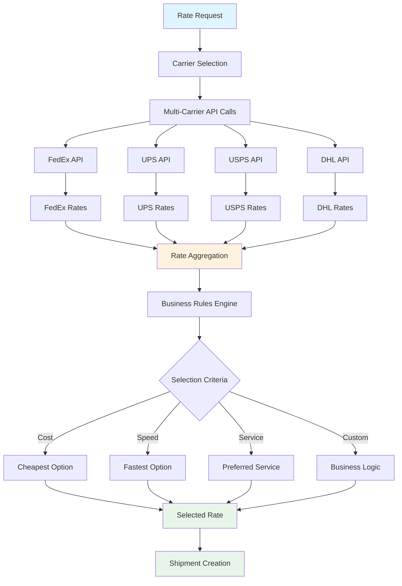

# Shipping Rules & Automation

<div className="flex gap-2 mb-6">
  <div className="inline-flex items-center rounded-md bg-purple-50 px-2 py-1 text-xs font-medium text-purple-700 ring-1 ring-inset ring-purple-700/10 dark:bg-purple-400/10 dark:text-purple-400 dark:ring-purple-400/30">
    <span className="text-xs">Insiders</span>
  </div>
  <div className="inline-flex items-center rounded-md bg-orange-50 px-2 py-1 text-xs font-medium text-orange-700 ring-1 ring-inset ring-orange-700/10 dark:bg-orange-400/10 dark:text-orange-400 dark:ring-orange-400/30">
    <span className="text-xs">Automation</span>
  </div>
</div>

Every Karrio Insiders project comes with comprehensive shipping rules and automation capabilities, providing intelligent carrier selection, cost optimization, delivery time preferences, and business rule enforcement across all shipping operations.

## Features

### Multi-Carrier Rate Shopping

You don't have to manually compare carrier rates. Our rate shopping engine automatically fetches rates from all configured carriers and presents the best options based on your criteria.

<div className="bg-gray-50 dark:bg-gray-900 rounded-lg p-4 my-6">
  <div className="text-sm text-gray-600 dark:text-gray-400 mb-2">
    Rate Shopping Dashboard
  </div>
  <div className="bg-white dark:bg-gray-800 rounded border h-64 flex items-center justify-center">
    <span className="text-gray-400">
      Screenshot: Rate comparison interface with carrier options and pricing
    </span>
  </div>
</div>

### Intelligent Carrier Selection

Automatically select the best carrier based on cost, delivery time, service level, or custom business rules.

### Service-Level Filtering

Filter carriers and services based on delivery requirements, package restrictions, and destination capabilities.

### Real-Time Rate Comparison

Get live rates from multiple carriers simultaneously with support for different package configurations and shipping options.

### Custom Business Logic

Implement sophisticated carrier selection rules based on your business requirements and shipping strategies.

### Additional features

- Karrio extends rate shopping with carrier performance analytics and delivery time estimates.
- Every rate request includes automatic fallback options for carrier failures.
- Karrio manages rate caching and optimization for faster response times.
- Support for zone skipping, dimensional weight pricing, and surcharge calculations.

## Data Flow

### Rate Shopping & Carrier Selection Flow



## API Reference

### REST API

#### Get Shipping Rates

```bash
curl -X POST "https://api.karrio.io/v1/proxy/rates" \
  -H "Authorization: Token YOUR_API_KEY" \
  -H "Content-Type: application/json" \
  -d '{
    "shipper": {
      "company_name": "Your Warehouse",
      "address_line1": "123 Warehouse St",
      "city": "Chicago",
      "state_code": "IL",
      "postal_code": "60601",
      "country_code": "US"
    },
    "recipient": {
      "person_name": "John Doe",
      "address_line1": "456 Customer Ave",
      "city": "New York",
      "state_code": "NY",
      "postal_code": "10001",
      "country_code": "US"
    },
    "parcels": [
      {
        "weight": 2.5,
        "weight_unit": "LB",
        "length": 12,
        "width": 8,
        "height": 6,
        "dimension_unit": "IN"
      }
    ]
  }'
```

**Response:**

```json
{
  "rates": [
    {
      "id": "rate_1234567890",
      "carrier_name": "fedex",
      "carrier_id": "fedex_connection",
      "service": "fedex_ground",
      "service_type": "ground",
      "total_charge": 12.45,
      "currency": "USD",
      "transit_days": 3,
      "delivery_date": "2024-01-18",
      "meta": {
        "service_name": "FedEx Ground"
      }
    },
    {
      "id": "rate_1234567891",
      "carrier_name": "ups",
      "carrier_id": "ups_connection",
      "service": "ups_ground",
      "service_type": "ground",
      "total_charge": 11.89,
      "currency": "USD",
      "transit_days": 3,
      "delivery_date": "2024-01-18",
      "meta": {
        "service_name": "UPS Ground"
      }
    },
    {
      "id": "rate_1234567892",
      "carrier_name": "usps",
      "carrier_id": "usps_connection",
      "service": "usps_priority",
      "service_type": "priority",
      "total_charge": 9.95,
      "currency": "USD",
      "transit_days": 2,
      "delivery_date": "2024-01-17",
      "meta": {
        "service_name": "USPS Priority Mail"
      }
    }
  ],
  "messages": []
}
```

#### Carrier-Specific Rate Shopping

```bash
curl -X POST "https://api.karrio.io/v1/proxy/rates" \
  -H "Authorization: Token YOUR_API_KEY" \
  -H "Content-Type: application/json" \
  -d '{
    "shipper": {
      "address_line1": "123 Warehouse St",
      "city": "Chicago",
      "state_code": "IL",
      "postal_code": "60601",
      "country_code": "US"
    },
    "recipient": {
      "person_name": "John Doe",
      "address_line1": "456 Customer Ave",
      "city": "New York",
      "state_code": "NY",
      "postal_code": "10001",
      "country_code": "US"
    },
    "parcels": [
      {
        "weight": 2.5,
        "weight_unit": "LB"
      }
    ],
    "carrier_ids": ["fedex_connection", "ups_connection"]
  }'
```

**Response:**

```json
{
  "rates": [
    {
      "id": "rate_1234567890",
      "carrier_name": "fedex",
      "carrier_id": "fedex_connection",
      "service": "fedex_ground",
      "total_charge": 12.45,
      "currency": "USD",
      "transit_days": 3
    },
    {
      "id": "rate_1234567891",
      "carrier_name": "ups",
      "carrier_id": "ups_connection",
      "service": "ups_ground",
      "total_charge": 11.89,
      "currency": "USD",
      "transit_days": 3
    }
  ],
  "messages": []
}
```

#### Service-Specific Requests

```bash
curl -X POST "https://api.karrio.io/v1/proxy/rates" \
  -H "Authorization: Token YOUR_API_KEY" \
  -H "Content-Type: application/json" \
  -d '{
    "shipper": {
      "address_line1": "123 Warehouse St",
      "city": "Chicago",
      "state_code": "IL",
      "postal_code": "60601",
      "country_code": "US"
    },
    "recipient": {
      "person_name": "John Doe",
      "address_line1": "456 Customer Ave",
      "city": "New York",
      "state_code": "NY",
      "postal_code": "10001",
      "country_code": "US"
    },
    "parcels": [
      {
        "weight": 2.5,
        "weight_unit": "LB"
      }
    ],
    "services": ["fedex_ground", "ups_ground", "usps_priority"]
  }'
```

**Response:**

```json
{
  "rates": [
    {
      "id": "rate_1234567890",
      "carrier_name": "fedex",
      "service": "fedex_ground",
      "total_charge": 12.45,
      "currency": "USD",
      "transit_days": 3,
      "meta": {
        "service_name": "FedEx Ground"
      }
    },
    {
      "id": "rate_1234567891",
      "carrier_name": "ups",
      "service": "ups_ground",
      "total_charge": 11.89,
      "currency": "USD",
      "transit_days": 3,
      "meta": {
        "service_name": "UPS Ground"
      }
    },
    {
      "id": "rate_1234567892",
      "carrier_name": "usps",
      "service": "usps_priority",
      "total_charge": 9.95,
      "currency": "USD",
      "transit_days": 2,
      "meta": {
        "service_name": "USPS Priority Mail"
      }
    }
  ],
  "messages": []
}
```

#### Create Shipment with Selected Rate

```bash
curl -X POST "https://api.karrio.io/v1/proxy/shipments" \
  -H "Authorization: Token YOUR_API_KEY" \
  -H "Content-Type: application/json" \
  -d '{
    "selected_rate_id": "rate_1234567892",
    "label_type": "PDF",
    "references": ["ORDER-12345"]
  }'
```

**Response:**

```json
{
  "id": "shp_1234567890",
  "carrier_name": "usps",
  "carrier_id": "usps_connection",
  "service": "usps_priority",
  "tracking_number": "9400109999999999999999",
  "shipment_identifier": "shp_1234567890",
  "label_url": "https://api.karrio.io/v1/shipments/shp_1234567890/label.pdf",
  "selected_rate": {
    "id": "rate_1234567892",
    "total_charge": 9.95,
    "currency": "USD"
  },
  "status": "purchased",
  "created_at": "2024-01-15T10:30:00Z"
}
```

### GraphQL API

#### Query Rates

```graphql
query GetRates($data: RateRequestInput!) {
  rates(data: $data) {
    rates {
      id
      carrier_name
      carrier_id
      service
      service_type
      total_charge
      currency
      transit_days
      delivery_date
      meta
    }
    messages {
      code
      message
    }
  }
}
```

**Variables:**

```json
{
  "data": {
    "shipper": {
      "company_name": "Your Warehouse",
      "address_line1": "123 Warehouse St",
      "city": "Chicago",
      "state_code": "IL",
      "postal_code": "60601",
      "country_code": "US"
    },
    "recipient": {
      "person_name": "John Doe",
      "address_line1": "456 Customer Ave",
      "city": "New York",
      "state_code": "NY",
      "postal_code": "10001",
      "country_code": "US"
    },
    "parcels": [
      {
        "weight": 2.5,
        "weight_unit": "LB"
      }
    ]
  }
}
```

## Carrier Selection Strategies

### Cost-Based Selection

Choose carriers based on shipping cost optimization:

#### Cheapest Option

```javascript
async function selectCheapestCarrier(shipmentData) {
  const response = await karrio.proxy.fetchRates({
    rateRequest: shipmentData,
  });

  if (!response.rates || response.rates.length === 0) {
    throw new Error("No rates available");
  }

  // Sort by total charge (ascending)
  const sortedRates = response.rates.sort(
    (a, b) => a.total_charge - b.total_charge,
  );

  return sortedRates[0]; // Return cheapest rate
}
```

#### Value-Based Selection

```javascript
async function selectBestValue(shipmentData) {
  const response = await karrio.proxy.fetchRates({
    rateRequest: shipmentData,
  });

  // Calculate value score (lower cost + faster delivery = higher score)
  const ratesWithScore = response.rates.map((rate) => ({
    ...rate,
    valueScore: (1 / rate.total_charge) * (1 / rate.transit_days),
  }));

  // Sort by value score (descending)
  const sortedRates = ratesWithScore.sort(
    (a, b) => b.valueScore - a.valueScore,
  );

  return sortedRates[0];
}
```

### Service-Level Selection

Choose carriers based on delivery requirements:

#### Speed Priority

```javascript
async function selectFastestCarrier(shipmentData) {
  const response = await karrio.proxy.fetchRates({
    rateRequest: shipmentData,
  });

  // Filter rates with transit days information
  const ratesWithTransit = response.rates.filter(
    (rate) => rate.transit_days !== null,
  );

  // Sort by transit days (ascending)
  const sortedRates = ratesWithTransit.sort(
    (a, b) => a.transit_days - b.transit_days,
  );

  return sortedRates[0]; // Return fastest option
}
```

#### Service Type Priority

```javascript
async function selectByServiceType(shipmentData, preferredType = "priority") {
  const response = await karrio.proxy.fetchRates({
    rateRequest: shipmentData,
  });

  // Filter by preferred service type
  const preferredRates = response.rates.filter(
    (rate) => rate.service_type === preferredType,
  );

  if (preferredRates.length > 0) {
    // Return cheapest among preferred service type
    return preferredRates.sort((a, b) => a.total_charge - b.total_charge)[0];
  }

  // Fallback to cheapest overall
  return response.rates.sort((a, b) => a.total_charge - b.total_charge)[0];
}
```

### Advanced Selection Rules

#### Business Rules Engine

```javascript
class ShippingRulesEngine {
  constructor(rules) {
    this.rules = rules;
  }

  async selectCarrier(shipmentData, rates) {
    // Apply rules in priority order
    for (const rule of this.rules) {
      const selectedRate = await rule.apply(rates, shipmentData);
      if (selectedRate) {
        return selectedRate;
      }
    }

    // Default fallback
    return rates.sort((a, b) => a.total_charge - b.total_charge)[0];
  }
}

// Example rules
const shippingRules = new ShippingRulesEngine([
  {
    name: "High-value items use FedEx",
    apply: (rates, shipmentData) => {
      const declaredValue = shipmentData.parcels.reduce(
        (sum, parcel) => sum + (parcel.value || 0),
        0,
      );

      if (declaredValue > 1000) {
        return rates.find((rate) => rate.carrier_name === "fedex");
      }
      return null;
    },
  },
  {
    name: "International shipments prefer DHL",
    apply: (rates, shipmentData) => {
      const isInternational =
        shipmentData.shipper.country_code !==
        shipmentData.recipient.country_code;

      if (isInternational) {
        return rates.find((rate) => rate.carrier_name === "dhl");
      }
      return null;
    },
  },
  {
    name: "Rush orders use fastest service",
    apply: (rates, shipmentData) => {
      if (shipmentData.rush_delivery) {
        return rates.sort((a, b) => a.transit_days - b.transit_days)[0];
      }
      return null;
    },
  },
]);

// Usage
const rateResponse = await karrio.proxy.fetchRates({
  rateRequest: shipmentData,
});
const selectedRate = await shippingRules.selectCarrier(
  shipmentData,
  rateResponse.rates,
);
```

## Rate Filtering & Constraints

### Geographic Constraints

Filter rates based on destination capabilities:

```javascript
async function filterByDestination(shipmentData) {
  const response = await karrio.proxy.fetchRates({
    rateRequest: shipmentData,
  });

  // Filter out carriers that don't serve the destination
  const validRates = response.rates.filter((rate) => {
    // Custom logic to check if carrier serves destination
    return isDestinationSupported(rate.carrier_name, shipmentData.recipient);
  });

  return validRates;
}

function isDestinationSupported(carrierName, recipient) {
  // Example: USPS only serves US addresses
  if (carrierName === "usps" && recipient.country_code !== "US") {
    return false;
  }

  // Add more carrier-specific logic
  return true;
}
```

### Package Restrictions

Filter rates based on package limitations:

```javascript
async function filterByPackageRestrictions(shipmentData) {
  const response = await karrio.proxy.fetchRates({
    rateRequest: shipmentData,
  });

  const validRates = response.rates.filter((rate) => {
    return shipmentData.parcels.every((parcel) =>
      isPackageAllowed(rate.carrier_name, parcel),
    );
  });

  return validRates;
}

function isPackageAllowed(carrierName, parcel) {
  const restrictions = {
    usps: { maxWeight: 70, maxLength: 108 },
    fedex: { maxWeight: 150, maxLength: 119 },
    ups: { maxWeight: 150, maxLength: 108 },
  };

  const carrierLimits = restrictions[carrierName];
  if (!carrierLimits) return true;

  return (
    parcel.weight <= carrierLimits.maxWeight &&
    (parcel.length || 0) <= carrierLimits.maxLength
  );
}
```

## Use Cases

### E-commerce Optimization

Perfect for online stores optimizing shipping costs:

- **Dynamic Pricing**: Show customers the best available rates in real-time
- **Cost Optimization**: Automatically select cheapest options to maximize margins
- **Service Options**: Offer multiple delivery speeds with transparent pricing
- **Zone Optimization**: Route shipments through optimal carrier networks

### Enterprise Shipping

Designed for large-scale shipping operations:

- **Volume Discounts**: Apply negotiated rates automatically
- **SLA Compliance**: Ensure delivery commitments are met
- **Carrier Diversification**: Distribute volume across multiple carriers
- **Performance Monitoring**: Track carrier performance metrics

### Marketplace Platforms

Enable sellers to optimize their shipping strategies:

- **Seller Tools**: Provide rate comparison tools for marketplace sellers
- **Platform Fees**: Apply platform-specific shipping fees and markups
- **Buyer Experience**: Show competitive shipping options to buyers
- **Logistics Optimization**: Optimize fulfillment across multiple warehouses

## Best Practices

### Rate Shopping Optimization

#### Request Optimization

- Batch rate requests when possible
- Use carrier-specific requests for known preferences
- Include all necessary package details for accurate rates

#### Error Handling

```javascript
async function getRatesWithFallback(rateRequest) {
  try {
    const rateResponse = await karrio.proxy.fetchRates({
      rateRequest: rateRequest,
    });
    const rates = rateResponse;

    if (!rates.rates || rates.rates.length === 0) {
      // Try with fewer restrictions
      return await karrio.proxy.fetchRates({
        rateRequest: {
          ...rateRequest,
          carrier_ids: undefined, // Remove carrier restrictions
          services: undefined, // Remove service restrictions
        },
      });
    }

    return rates;
  } catch (error) {
    console.error("Rate request failed:", error);

    // Implement fallback logic
    return await getFallbackRates(rateRequest);
  }
}
```

#### Performance Monitoring

- Track rate request response times
- Monitor carrier availability and success rates
- Log rate selection decisions for analysis
- Measure cost savings from optimization

## Getting Started

Ready to implement intelligent shipping rules with Karrio? Follow these steps:

1. **Set up rate shopping** to compare carrier options
2. **Define business rules** for carrier selection
3. **Implement selection logic** based on your requirements
4. **Monitor and optimize** carrier performance

### Next Steps

- Learn about [shipments](/docs/products/shipments) to create shipments with selected rates
- Explore [carrier connections](/docs/products/carrier-connections) to configure available carriers
- Set up [webhooks](/docs/products/webhooks) for rate and shipment notifications
- Configure [batch processing](/docs/products/batch-processing) for high-volume rate requests
