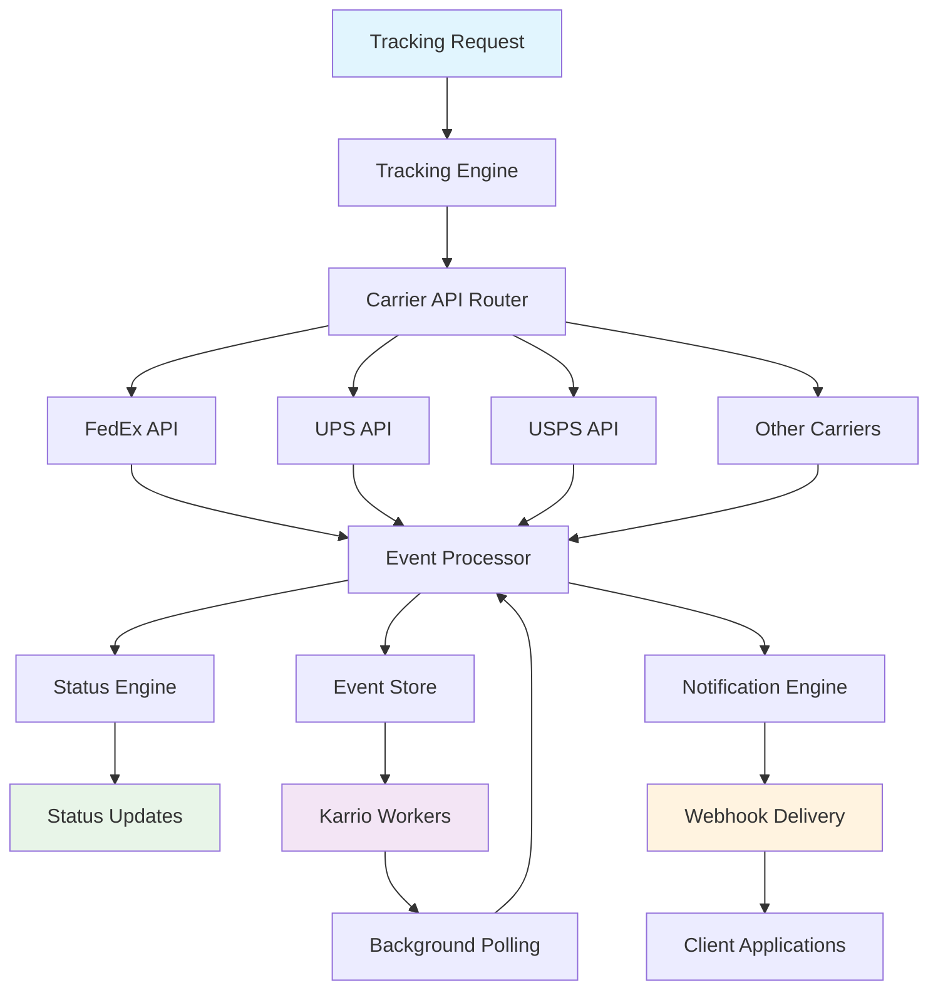

# Package Tracking

Karrio's Tracking system provides universal package tracking across 50+ carriers through a single API. Get real-time delivery updates, automated webhook notifications, and comprehensive delivery management with intelligent event processing.

## Overview

Transform disparate carrier tracking systems into a unified, reliable tracking experience. Whether you're tracking a single package or monitoring thousands of shipments daily, Karrio's tracking system provides consistent, real-time visibility across all carriers with intelligent event processing and automated notifications.

### Key Benefits

- **Universal Tracking API**: Track packages from any carrier through one consistent interface
- **Real-time Updates**: Instant delivery status updates with webhook notifications
- **Proactive Monitoring**: Automated exception detection and webhook notifications
- **Rich Event Data**: Detailed tracking events with location, timestamps, and context
- **Background Polling**: Karrio workers automatically update tracking status

## Architecture

### Data Flow



### Core Components

#### 1. Tracking Engine

Central orchestrator for all tracking operations:

- **Request Management**: Handles tracking requests and manages carrier connections
- **Data Normalization**: Converts carrier-specific data into unified format
- **Polling Optimization**: Intelligent polling schedules based on package status
- **Error Handling**: Manages carrier API failures and data inconsistencies

#### 2. Event Processor

Real-time event processing and enrichment:

- **Event Enrichment**: Adds location data and delivery context
- **Status Classification**: Intelligently categorizes tracking events into standard statuses
- **Exception Detection**: Identifies delivery exceptions and potential issues
- **Duplicate Prevention**: Prevents duplicate events from multiple data sources

#### 3. Notification Engine

Automated webhook notification system:

- **Webhook Delivery**: Real-time webhook notifications for tracking updates
- **Delivery Confirmation**: Ensures webhook delivery with retry logic
- **Event Filtering**: Configurable webhook event filtering
- **Security**: Webhook signature verification and authentication

#### 4. Karrio Workers

Background processing system for automatic tracking updates:

- **Polling Scheduler**: Automatically polls carriers for tracking updates
- **Status Synchronization**: Keeps tracking status synchronized across carriers
- **Batch Processing**: Efficiently processes multiple tracking updates
- **Smart Intervals**: Adjusts polling frequency based on package status and carrier

## Use Cases

### E-commerce Order Tracking

Provide customers with real-time order visibility:

```bash
# Create tracking for a new shipment
curl -X POST "https://api.karrio.io/v1/trackers" \
  -H "Authorization: Token YOUR_API_KEY" \
  -H "Content-Type: application/json" \
  -d '{
    "tracking_number": "1Z12345E0205271688",
    "carrier_name": "ups",
    "info": {
      "customer_name": "John Doe",
      "order_id": "ORDER-12345"
    }
  }'

# Set up webhook notifications
curl -X POST "https://api.karrio.io/v1/webhooks" \
  -H "Authorization: Token YOUR_API_KEY" \
  -H "Content-Type: application/json" \
  -d '{
    "url": "https://your-app.com/tracking-updates",
    "events": ["tracker.updated", "tracker.delivered"],
    "active": true
  }'
```

### Bulk Tracking Management

Monitor multiple shipments simultaneously:

```bash
# Track multiple packages using batch endpoint
curl -X POST "https://api.karrio.io/v1/batches/trackers" \
  -H "Authorization: Token YOUR_API_KEY" \
  -H "Content-Type: application/json" \
  -d '{
    "trackers": [
      {
        "tracking_number": "1Z12345E0205271688",
        "carrier_name": "ups"
      },
      {
        "tracking_number": "1Z12345E0305271689",
        "carrier_name": "ups"
      },
      {
        "tracking_number": "1234567890123456",
        "carrier_name": "fedex"
      }
    ]
  }'

# Get consolidated status for all trackers
curl -X GET "https://api.karrio.io/v1/trackers?status=in_transit" \
  -H "Authorization: Token YOUR_API_KEY"
```

### Exception Management

Handle delivery exceptions through webhooks:

```bash
# Handle exception webhooks in your application
# POST /webhooks/tracking endpoint
{
  "type": "tracker.updated",
  "data": {
    "id": "tracker_123",
    "tracking_number": "1Z12345E0205271688",
    "status": "delivery_failed",
    "events": [
      {
        "code": "DELIVERY_ATTEMPTED",
        "description": "Delivery attempted - customer not available",
        "date": "2024-01-15",
        "time": "14:30"
      }
    ],
    "carrier_name": "ups"
  }
}
```

### Real-time Status Updates

Get instant tracking updates as they happen:

```bash
# Get current tracking status
curl -X GET "https://api.karrio.io/v1/trackers/tracker_123" \
  -H "Authorization: Token YOUR_API_KEY"

# Webhook payload for status updates
{
  "type": "tracker.updated",
  "data": {
    "id": "tracker_123",
    "tracking_number": "1Z12345E0205271688",
    "status": "out_for_delivery",
    "estimated_delivery": "2024-01-15",
    "events": [
      {
        "description": "Out for delivery",
        "location": "Los Angeles, CA",
        "date": "2024-01-15",
        "time": "08:00"
      }
    ]
  }
}
```

## Advanced Features

### Webhook Configuration

Configure webhook events and filtering:

```bash
# Create webhook endpoint
curl -X POST "https://api.karrio.io/v1/webhooks" \
  -H "Authorization: Token YOUR_API_KEY" \
  -H "Content-Type: application/json" \
  -d '{
    "url": "https://your-app.com/webhooks/tracking",
    "events": [
      "tracker.created",
      "tracker.updated",
      "tracker.delivered"
    ],
    "active": true,
    "metadata": {
      "environment": "production"
    }
  }'

# Update webhook settings
curl -X PATCH "https://api.karrio.io/v1/webhooks/webhook_123" \
  -H "Authorization: Token YOUR_API_KEY" \
  -H "Content-Type: application/json" \
  -d '{
    "events": ["tracker.delivered", "tracker.exception"],
    "active": true
  }'
```

### Tracking Status Management

Monitor and update tracking status:

```bash
# List trackers by status
curl -X GET "https://api.karrio.io/v1/trackers?status=in_transit&limit=50" \
  -H "Authorization: Token YOUR_API_KEY"

# Get tracking details with events
curl -X GET "https://api.karrio.io/v1/trackers/tracker_123" \
  -H "Authorization: Token YOUR_API_KEY"

# Response includes full event history
{
  "id": "tracker_123",
  "tracking_number": "1Z12345E0205271688",
  "carrier_name": "ups",
  "status": "in_transit",
  "delivered": false,
  "events": [
    {
      "description": "Package picked up",
      "location": "New York, NY",
      "date": "2024-01-12",
      "time": "16:30"
    },
    {
      "description": "In transit",
      "location": "Philadelphia, PA",
      "date": "2024-01-13",
      "time": "05:45"
    }
  ],
  "info": {
    "customer_name": "John Doe",
    "order_id": "ORDER-12345"
  }
}
```

### Background Processing

Karrio workers automatically handle tracking updates:

```bash
# Workers automatically poll for updates based on:
# - Package status (more frequent for active shipments)
# - Carrier capabilities (real-time vs batch updates)
# - Expected delivery dates (increased frequency near delivery)
# - Exception handling (immediate updates for exceptions)

# Karrio workers automatically handle:
# - Package status (more frequent for active shipments)
# - Carrier capabilities (real-time vs batch updates)
# - Expected delivery dates (increased frequency near delivery)
# - Exception handling (immediate updates for exceptions)
#
# Workers operate in the background and polling frequency is automatically
# optimized based on package status and carrier capabilities
```

## Tracking States

### Standard Status Values

Karrio normalizes carrier statuses into standard values:

- **pending**: Tracking number created, shipment not yet picked up
- **in_transit**: Package is moving through carrier network
- **out_for_delivery**: Package is on delivery vehicle
- **delivered**: Package successfully delivered
- **delivery_failed**: Delivery attempt failed
- **return_to_sender**: Package being returned to sender
- **cancelled**: Shipment cancelled
- **unknown**: Status cannot be determined

### Event Types

Common tracking events include:

```bash
# Example tracking events from different carriers
{
  "events": [
    {
      "code": "PICKUP",
      "description": "Package picked up by carrier",
      "location": "Origin facility",
      "date": "2024-01-12",
      "time": "14:30"
    },
    {
      "code": "IN_TRANSIT",
      "description": "Package in transit",
      "location": "Sort facility",
      "date": "2024-01-13",
      "time": "06:15"
    },
    {
      "code": "OUT_FOR_DELIVERY",
      "description": "Out for delivery",
      "location": "Local facility",
      "date": "2024-01-15",
      "time": "08:00"
    }
  ]
}
```

## Integration Patterns

### Webhook Processing

Handle tracking webhooks in your application:

```bash
# Verify webhook signature (recommended)
import hashlib
import hmac

def verify_webhook_signature(payload, signature, secret):
    expected_signature = hmac.new(
        secret.encode('utf-8'),
        payload,
        hashlib.sha256
    ).hexdigest()
    return hmac.compare_digest(signature, expected_signature)

# Process webhook events
@app.route('/webhooks/tracking', methods=['POST'])
def handle_tracking_webhook():
    signature = request.headers.get('X-Karrio-Signature')
    payload = request.get_data()

    if not verify_webhook_signature(payload, signature, WEBHOOK_SECRET):
        return 'Invalid signature', 401

    event = request.json

    if event['type'] == 'tracker.delivered':
        # Handle delivery notification
        update_order_status(event['data']['tracking_number'], 'delivered')
        send_delivery_notification(event['data'])

    elif event['type'] == 'tracker.exception':
        # Handle delivery exception
        create_support_ticket(event['data'])
        notify_customer_service(event['data'])

    return 'OK', 200
```

### Polling vs Webhooks

Choose the right approach for your use case:

**Webhooks (Recommended)**:

- Real-time updates
- Efficient resource usage
- Event-driven architecture
- Automatic retries

**Manual Polling**:

- Full control over timing
- Batch processing capabilities
- Works behind firewalls
- Simpler implementation

```bash
# Manual polling example
curl -X GET "https://api.karrio.io/v1/trackers?updated_after=2024-01-15T00:00:00Z" \
  -H "Authorization: Token YOUR_API_KEY"
```

## Error Handling

### Common Issues

Handle tracking errors gracefully:

```bash
# Invalid tracking number
{
  "errors": [
    {
      "code": "INVALID_TRACKING_NUMBER",
      "message": "Tracking number format is invalid",
      "details": {
        "tracking_number": "invalid123",
        "carrier": "ups"
      }
    }
  ]
}

# Carrier API unavailable
{
  "errors": [
    {
      "code": "CARRIER_API_UNAVAILABLE",
      "message": "UPS API is temporarily unavailable",
      "retry_after": 300
    }
  ]
}

# Tracking not found
{
  "errors": [
    {
      "code": "TRACKING_NOT_FOUND",
      "message": "No tracking information found",
      "details": {
        "tracking_number": "1Z12345E0205271688",
        "carrier": "ups"
      }
    }
  ]
}
```

### Retry Logic

Implement proper retry logic for failed requests:

```bash
# Example retry implementation
def track_package_with_retry(tracking_number, carrier, max_retries=3):
    for attempt in range(max_retries):
        try:
            response = requests.get(
                f"https://api.karrio.io/v1/trackers",
                params={
                    "tracking_number": tracking_number,
                    "carrier_name": carrier
                },
                headers={"Authorization": f"Token {API_KEY}"}
            )

            if response.status_code == 200:
                return response.json()
            elif response.status_code == 424:  # Carrier API unavailable
                retry_after = response.headers.get('Retry-After', 60)
                time.sleep(int(retry_after))
            else:
                response.raise_for_status()

        except requests.exceptions.RequestException as e:
            if attempt == max_retries - 1:
                raise e
            time.sleep(2 ** attempt)  # Exponential backoff
```

## Performance Optimization

### Batch Operations

Process multiple tracking requests efficiently:

```bash
# Batch tracking creation
curl -X POST "https://api.karrio.io/v1/batches/trackers" \
  -H "Authorization: Token YOUR_API_KEY" \
  -H "Content-Type: application/json" \
  -d '{
    "trackers": [
      {"tracking_number": "123", "carrier_name": "ups"},
      {"tracking_number": "456", "carrier_name": "fedex"},
      {"tracking_number": "789", "carrier_name": "usps"}
    ]
  }'

# Batch status updates
curl -X GET "https://api.karrio.io/v1/trackers?created_after=2024-01-15T00:00:00Z&limit=100" \
  -H "Authorization: Token YOUR_API_KEY"
```

### Webhook Optimization

Optimize webhook processing:

```bash
# Process webhooks asynchronously
@app.route('/webhooks/tracking', methods=['POST'])
def handle_tracking_webhook():
    # Queue for background processing
    queue_tracking_update.delay(request.json)
    return 'OK', 200

# Background task processing
@celery.task
def queue_tracking_update(webhook_data):
    # Process webhook in background
    process_tracking_update(webhook_data)
```

## Best Practices

### Tracking Management

- Create trackers immediately after shipment creation
- Use meaningful metadata for organization and filtering
- Implement proper error handling for carrier API failures
- Set up webhook endpoints for real-time updates

### Webhook Security

```bash
# Always verify webhook signatures
# Use HTTPS endpoints only
# Implement idempotency for webhook processing
# Log webhook events for debugging

# Example webhook endpoint security
@app.route('/webhooks/tracking', methods=['POST'])
def secure_webhook_handler():
    # Verify signature
    if not verify_signature(request):
        return 'Unauthorized', 401

    # Check for duplicate processing
    event_id = request.headers.get('X-Event-ID')
    if is_duplicate_event(event_id):
        return 'Already processed', 200

    # Process webhook
    process_webhook(request.json)
    return 'OK', 200
```

### Status Monitoring

```bash
# Monitor tracking status distribution
curl -X GET "https://api.karrio.io/v1/trackers?status=in_transit&limit=1" \
  -H "Authorization: Token YOUR_API_KEY" | jq '.count'

# Track delivery performance
curl -X GET "https://api.karrio.io/v1/trackers?status=delivered&created_after=2024-01-01" \
  -H "Authorization: Token YOUR_API_KEY"
```

## What's Next?

- [Webhooks →](/docs/products/webhooks) - Configure webhook notifications
- [Shipments →](/docs/products/shipments) - Create shipments with tracking
- [Orders →](/docs/products/orders) - End-to-end order tracking
- [API Reference →](/docs/reference/api/tracking) - Complete tracking API docs

---

**Questions?** Join our [community Discord](https://discord.gg/karrio) or contact our support team for tracking implementation guidance.
