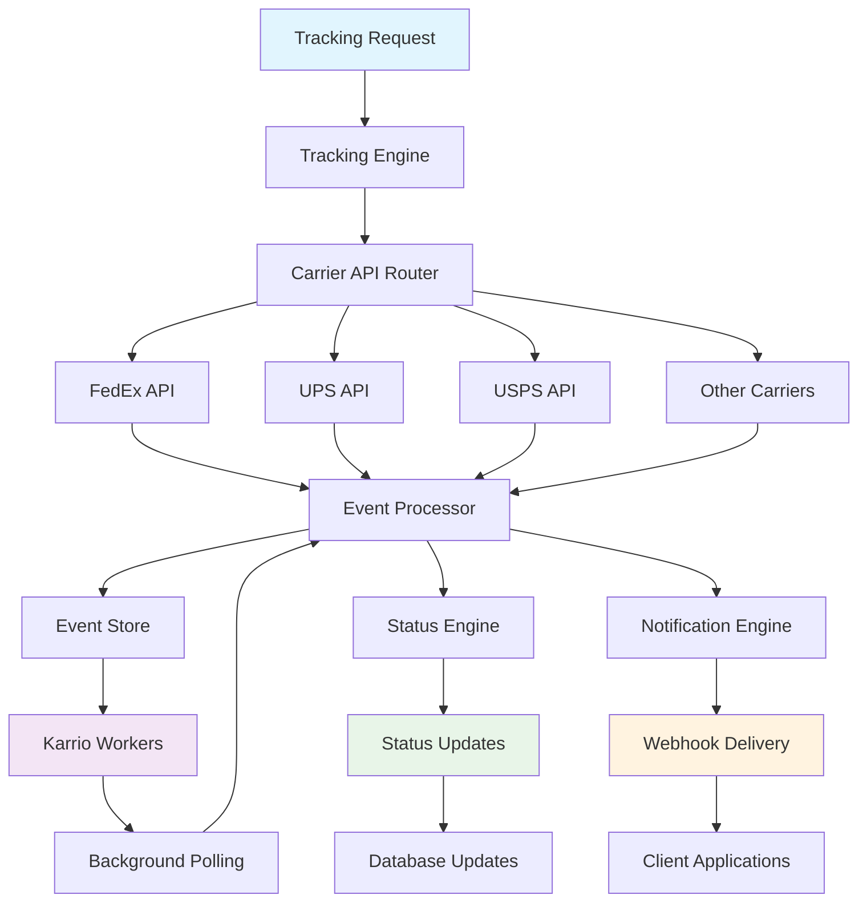

# Tracking & Notifications

<div className="flex gap-2 mb-6">
  <div className="inline-flex items-center rounded-md bg-green-50 px-2 py-1 text-xs font-medium text-green-700 ring-1 ring-inset ring-green-600/20 dark:bg-green-400/10 dark:text-green-400 dark:ring-green-400/30">
    <span className="text-xs">Community Edition</span>
  </div>
  <div className="inline-flex items-center rounded-md bg-blue-50 px-2 py-1 text-xs font-medium text-blue-700 ring-1 ring-inset ring-blue-700/10 dark:bg-blue-400/10 dark:text-blue-400 dark:ring-blue-400/30">
    <span className="text-xs">Core Feature</span>
  </div>
</div>

Every Karrio project comes with comprehensive tracking capabilities, providing real-time shipment monitoring, automated status updates, webhook notifications, and customer communication tools across all connected carriers.

## Features

### Universal Tracking API

You don't have to learn multiple carrier tracking systems to monitor packages. Our tracking API makes monitoring FedEx, UPS, DHL, and other carrier shipments as simple as a single API call.

<div className="bg-gray-50 dark:bg-gray-900 rounded-lg p-4 my-6">
  <div className="text-sm text-gray-600 dark:text-gray-400 mb-2">
    Package Tracking Dashboard
  </div>
  <div className="bg-white dark:bg-gray-800 rounded border overflow-hidden">
    
  </div>
</div>

### Real-time Status Updates

Get instant tracking updates as packages move through the carrier networks with automatic background polling and synchronization.

### Webhook Notifications

Receive real-time webhook notifications for delivery milestones, exceptions, and status changes across all carriers.

### Intelligent Event Processing

Our system automatically normalizes tracking events from different carriers into consistent, meaningful status updates.

### Background Monitoring

Karrio workers automatically poll carriers for tracking updates, keeping your package statuses synchronized without manual intervention.

### Additional features

- Karrio extends tracking with proactive exception detection and alerts.
- Every tracking request includes comprehensive event history and delivery details.
- Karrio manages automatic tracking number validation and carrier detection.
- Support for bulk tracking operations and batch status updates.

## Data Flow

### Package Tracking Flow



## API Reference

### REST API

#### Create Tracker

```bash
curl -X POST "https://api.karrio.io/v1/trackers" \
  -H "Authorization: Token YOUR_API_KEY" \
  -H "Content-Type: application/json" \
  -d '{
    "tracking_number": "1Z12345E0205271688",
    "carrier_name": "ups",
    "info": {
      "customer_name": "John Doe",
      "order_id": "ORDER-12345"
    }
  }'
```

**Response:**

```json
{
  "id": "trk_1234567890",
  "tracking_number": "1Z12345E0205271688",
  "carrier_name": "ups",
  "carrier_id": "ups_production",
  "status": "in_transit",
  "estimated_delivery": "2024-01-18",
  "events": [
    {
      "code": "DEPARTED_FACILITY",
      "description": "Departed from facility",
      "date": "2024-01-15",
      "time": "08:30",
      "location": "Atlanta, GA, US"
    },
    {
      "code": "ARRIVED_AT_FACILITY",
      "description": "Arrived at destination facility",
      "date": "2024-01-15",
      "time": "14:25",
      "location": "Los Angeles, CA, US"
    }
  ],
  "delivered": false,
  "info": {
    "customer_name": "John Doe",
    "order_id": "ORDER-12345"
  },
  "created_at": "2024-01-15T10:30:00Z",
  "updated_at": "2024-01-15T14:30:00Z"
}
```

#### Get Tracker Status

```bash
curl -X GET "https://api.karrio.io/v1/trackers/trk_1234567890" \
  -H "Authorization: Token YOUR_API_KEY"
```

**Response:**

```json
{
  "id": "trk_1234567890",
  "tracking_number": "1Z12345E0205271688",
  "carrier_name": "ups",
  "status": "delivered",
  "estimated_delivery": "2024-01-18",
  "delivery_date": "2024-01-17",
  "delivery_time": "15:30",
  "events": [
    {
      "code": "DELIVERED",
      "description": "Package delivered to recipient",
      "date": "2024-01-17",
      "time": "15:30",
      "location": "Los Angeles, CA, US",
      "signed_by": "J. SMITH"
    },
    {
      "code": "OUT_FOR_DELIVERY",
      "description": "Out for delivery",
      "date": "2024-01-17",
      "time": "09:15",
      "location": "Los Angeles, CA, US"
    }
  ],
  "delivered": true
}
```

#### List Trackers

```bash
curl -X GET "https://api.karrio.io/v1/trackers?status=in_transit&limit=10" \
  -H "Authorization: Token YOUR_API_KEY"
```

**Response:**

```json
{
  "count": 45,
  "next": "/v1/trackers?status=in_transit&limit=10&offset=10",
  "previous": null,
  "results": [
    {
      "id": "trk_1234567890",
      "tracking_number": "1Z12345E0205271688",
      "carrier_name": "ups",
      "status": "in_transit",
      "estimated_delivery": "2024-01-18",
      "created_at": "2024-01-15T10:30:00Z"
    },
    {
      "id": "trk_0987654321",
      "tracking_number": "1234567890123456",
      "carrier_name": "fedex",
      "status": "in_transit",
      "estimated_delivery": "2024-01-19",
      "created_at": "2024-01-15T11:15:00Z"
    }
  ]
}
```

#### Bulk Create Trackers

```bash
curl -X POST "https://api.karrio.io/v1/batches/trackers" \
  -H "Authorization: Token YOUR_API_KEY" \
  -H "Content-Type: application/json" \
  -d '{
    "trackers": [
      {
        "tracking_number": "1Z12345E0205271688",
        "carrier_name": "ups"
      },
      {
        "tracking_number": "1234567890123456",
        "carrier_name": "fedex"
      },
      {
        "tracking_number": "9405511206213025290016",
        "carrier_name": "usps"
      }
    ]
  }'
```

**Response:**

```json
{
  "batch_id": "batch_tracking_001",
  "status": "processing",
  "total_count": 3,
  "created_count": 3,
  "failed_count": 0,
  "created_trackers": [
    {
      "id": "trk_1234567890",
      "tracking_number": "1Z12345E0205271688",
      "carrier_name": "ups",
      "status": "pending"
    },
    {
      "id": "trk_0987654321",
      "tracking_number": "1234567890123456",
      "carrier_name": "fedex",
      "status": "pending"
    }
  ]
}
```

### GraphQL API

#### Query Trackers

```graphql
query GetTrackers($filter: TrackerFilter) {
  trackers(filter: $filter) {
    edges {
      node {
        id
        tracking_number
        carrier_name
        status
        estimated_delivery
        delivered
        events {
          code
          description
          date
          time
          location
        }
        created_at
      }
    }
    pageInfo {
      hasNextPage
      hasPreviousPage
    }
  }
}
```

**Variables:**

```json
{
  "filter": {
    "status": "in_transit",
    "carrier_name": "fedex"
  }
}
```

**Response:**

```json
{
  "data": {
    "trackers": {
      "edges": [
        {
          "node": {
            "id": "trk_0987654321",
            "tracking_number": "1234567890123456",
            "carrier_name": "fedex",
            "status": "in_transit",
            "estimated_delivery": "2024-01-19",
            "delivered": false,
            "events": [
              {
                "code": "IN_TRANSIT",
                "description": "Package in transit",
                "date": "2024-01-16",
                "time": "12:45",
                "location": "Memphis, TN, US"
              }
            ],
            "created_at": "2024-01-15T11:15:00Z"
          }
        }
      ],
      "pageInfo": {
        "hasNextPage": true,
        "hasPreviousPage": false
      }
    }
  }
}
```

#### Create Tracker Mutation

```graphql
mutation CreateTracker($data: CreateTrackerMutationInput!) {
  create_tracker(data: $data) {
    id
    tracking_number
    carrier_name
    status
    estimated_delivery
    events {
      code
      description
      date
      time
      location
    }
  }
}
```

**Variables:**

```json
{
  "data": {
    "tracking_number": "1Z12345E0205271688",
    "carrier_name": "ups",
    "info": {
      "customer_name": "John Doe",
      "order_id": "ORDER-12345"
    }
  }
}
```

**Response:**

```json
{
  "data": {
    "create_tracker": {
      "id": "trk_1234567890",
      "tracking_number": "1Z12345E0205271688",
      "carrier_name": "ups",
      "status": "in_transit",
      "estimated_delivery": "2024-01-18",
      "events": [
        {
          "code": "IN_TRANSIT",
          "description": "Package in transit",
          "date": "2024-01-15",
          "time": "14:30",
          "location": "Atlanta, GA, US"
        }
      ]
    }
  }
}
```

## Tracking Statuses

### Standard Statuses

Karrio normalizes carrier-specific statuses into these standard values:

- **pending** - Tracking number created but no carrier data yet
- **in_transit** - Package is moving through carrier network
- **delivered** - Package successfully delivered to recipient
- **delivery_delayed** - Delivery delayed due to various reasons
- **delivery_failed** - Delivery attempt failed
- **exception** - Package encountered an exception or issue
- **unknown** - Status cannot be determined

## Webhook Events

### Webhook Payload Structure

All tracking webhooks follow this structure:

```json
{
  "type": "tracker.updated",
  "data": {
    "id": "trk_1234567890",
    "tracking_number": "1Z12345E0205271688",
    "carrier_name": "ups",
    "status": "delivered",
    "delivered": true,
    "delivery_date": "2024-01-17",
    "events": [
      {
        "code": "DELIVERED",
        "description": "Package delivered",
        "date": "2024-01-17",
        "time": "15:30",
        "location": "Los Angeles, CA, US"
      }
    ]
  },
  "created_at": "2024-01-17T15:35:00Z"
}
```

### Event Types

- **tracker.created** - New tracker created
- **tracker.updated** - Tracking status updated
- **tracker.delivered** - Package delivered
- **tracker.exception** - Delivery exception occurred

## Use Cases

### E-commerce Order Tracking

Perfect for online stores providing customer visibility:

- **Order Status Updates**: Automatically update order status based on tracking
- **Customer Notifications**: Send tracking updates via email or SMS
- **Delivery Confirmation**: Confirm deliveries and update order status
- **Exception Handling**: Alert customers about delivery issues

### Logistics Operations

Designed for shipping and logistics companies:

- **Fleet Monitoring**: Track packages across entire logistics network
- **Performance Analytics**: Analyze delivery performance and carrier SLAs
- **Exception Management**: Proactively handle delivery exceptions
- **Customer Service**: Provide accurate tracking information to customers

### Multi-Tenant Platforms

Handle tracking for multiple organizations:

- **Isolated Tracking**: Each tenant's tracking data is completely separate
- **Custom Webhooks**: Configure different webhook endpoints per tenant
- **Branded Notifications**: Send tracking updates with tenant branding
- **Usage Analytics**: Track API usage and performance per tenant

## Getting Started

Ready to start tracking packages with Karrio? Follow these steps:

1. **Connect your carriers** using [carrier connections](/docs/products/carrier-connections)
2. **Create trackers** for your shipments or existing tracking numbers
3. **Set up webhooks** to receive real-time status updates
4. **Monitor deliveries** through the dashboard or API

### Next Steps

- Configure [webhooks](/docs/products/webhooks) for real-time tracking notifications
- Learn about [shipments](/docs/products/shipments) to create trackable packages
- Explore [batch processing](/docs/products/batch-processing) for bulk tracking operations
- Set up [events](/docs/products/events) for comprehensive activity monitoring

---

**Questions?** Join our [community Discord](https://discord.gg/gS88uE7sEx) or contact our support team for tracking implementation guidance.
