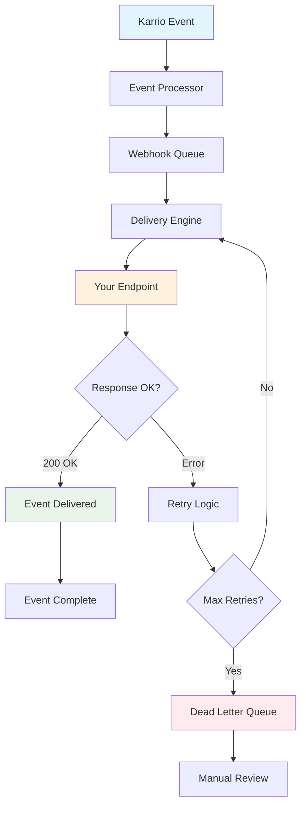

# Webhooks

Karrio's Webhook system provides real-time event notifications for all shipping activities. Get instant updates when shipments are created, tracking status changes, orders are fulfilled, and more. Build responsive applications that react immediately to shipping events.

## Overview

Instead of constantly polling APIs for status updates, webhooks push notifications to your application the moment events occur. This enables real-time user experiences, automated workflows, and efficient system integrations.

### Key Benefits

- **Real-time Updates**: Instant notifications when events occur
- **Reduced API Calls**: No need to poll for status changes
- **Reliable Delivery**: Automatic retry mechanism for failed deliveries
- **Secure Communication**: Signature verification for webhook authenticity
- **Event Filtering**: Subscribe only to events you need

## Architecture

### Webhook Flow



### Event Types

Karrio supports webhooks for these event categories:

#### Shipment Events

- `shipment.created` - New shipment created
- `shipment.purchased` - Shipping label purchased
- `shipment.cancelled` - Shipment cancelled
- `shipment.updated` - Shipment details updated

#### Tracking Events

- `tracking.status_updated` - Tracking status changed
- `tracking.delivered` - Package delivered
- `tracking.exception` - Delivery exception occurred
- `tracking.in_transit` - Package in transit

#### Order Events

- `order.created` - New order created
- `order.updated` - Order details updated
- `order.fulfilled` - Order fulfilled with shipment
- `order.cancelled` - Order cancelled

#### System Events

- `batch.completed` - Batch operation completed
- `batch.failed` - Batch operation failed

## Getting Started

### 1. Create a Webhook Endpoint

First, create an endpoint in your application to receive webhooks:

```javascript
// Express.js example
app.post("/webhooks/karrio", (req, res) => {
  const event = req.body;

  // Verify webhook signature (recommended)
  const signature = req.headers["x-karrio-signature"];
  if (!verifySignature(req.body, signature)) {
    return res.status(401).send("Unauthorized");
  }

  // Process the event
  console.log("Received event:", event.type);
  console.log("Event data:", event.data);

  // Respond with 200 to acknowledge receipt
  res.status(200).send("OK");
});

function verifySignature(payload, signature) {
  const crypto = require("crypto");
  const secret = process.env.WEBHOOK_SECRET;
  const expectedSignature = crypto
    .createHmac("sha256", secret)
    .update(JSON.stringify(payload))
    .digest("hex");

  return signature === `sha256=${expectedSignature}`;
}
```

### 2. Register Your Webhook

```bash
curl -X POST "https://api.karrio.io/v1/webhooks" \
  -H "Authorization: Token YOUR_API_KEY" \
  -H "Content-Type: application/json" \
  -d '{
    "url": "https://your-app.com/webhooks/karrio",
    "description": "Main webhook endpoint",
    "enabled_events": [
      "shipment.created",
      "shipment.purchased",
      "tracking.status_updated",
      "tracking.delivered"
    ],
    "secret": "your-webhook-secret"
  }'
```

### 3. Test Your Webhook

```bash
# Test webhook delivery
curl -X POST "https://api.karrio.io/v1/webhooks/{webhook_id}/test" \
  -H "Authorization: Token YOUR_API_KEY" \
  -H "Content-Type: application/json" \
  -d '{
    "event_type": "shipment.created"
  }'
```

## Event Handling

### Shipment Events

Handle shipment lifecycle events:

```javascript
app.post("/webhooks/karrio", (req, res) => {
  const { type, data } = req.body;

  switch (type) {
    case "shipment.created":
      console.log(`Shipment ${data.id} created`);
      // Update internal order status
      updateOrderStatus(data.reference, "processing");
      break;

    case "shipment.purchased":
      console.log(`Label purchased for ${data.tracking_number}`);
      // Send tracking info to customer
      sendTrackingNotification(data);
      break;

    case "shipment.cancelled":
      console.log(`Shipment ${data.id} cancelled`);
      // Handle cancellation logic
      handleShipmentCancellation(data);
      break;
  }

  res.status(200).send("OK");
});
```

### Tracking Events

Monitor package delivery progress:

```javascript
function handleTrackingEvent(event) {
  const { type, data } = event;

  switch (type) {
    case "tracking.status_updated":
      console.log(`Tracking ${data.tracking_number}: ${data.status}`);

      // Update customer with status
      notifyCustomer(data.tracking_number, {
        status: data.status,
        location: data.events[0]?.location,
        estimated_delivery: data.estimated_delivery,
      });
      break;

    case "tracking.delivered":
      console.log(`Package ${data.tracking_number} delivered`);

      // Mark order as complete
      completeOrder(data.tracking_number);

      // Request customer review
      requestReview(data.tracking_number);
      break;

    case "tracking.exception":
      console.log(`Delivery exception: ${data.tracking_number}`);

      // Alert customer service
      alertCustomerService({
        tracking_number: data.tracking_number,
        exception: data.events[0]?.description,
        action_required: true,
      });
      break;
  }
}
```

### Order Events

Track order fulfillment:

```javascript
function handleOrderEvent(event) {
  const { type, data } = event;

  switch (type) {
    case "order.created":
      console.log(`Order ${data.order_id} created`);
      // Trigger fulfillment workflow
      triggerFulfillment(data);
      break;

    case "order.fulfilled":
      console.log(`Order ${data.order_id} fulfilled`);
      // Update e-commerce platform
      updateEcommercePlatform(data.order_id, "fulfilled");
      break;

    case "order.cancelled":
      console.log(`Order ${data.order_id} cancelled`);
      // Process refund if needed
      processRefund(data);
      break;
  }
}
```

## Advanced Features

### Event Filtering

Subscribe only to specific events:

```javascript
// Create webhook with specific event filters
const webhook = await karrio.webhooks.create({
  url: "https://your-app.com/webhooks/tracking-only",
  description: "Tracking events only",
  enabled_events: [
    "tracking.status_updated",
    "tracking.delivered",
    "tracking.exception",
  ],
  // Optional: filter by metadata
  event_filters: {
    carrier_name: ["fedex", "ups"],
    test_mode: false,
  },
});
```

### Webhook Configuration

Configure webhook endpoints with proper settings:

```javascript
const webhook = await karrio.webhooks.create({
  url: "https://your-app.com/webhooks/karrio",
  description: "Main webhook endpoint",
  enabled_events: ["*"], // All events
  secret: "your-webhook-secret-key", // For signature verification
});
```

### Webhook Security

Implement robust security measures:

```javascript
const crypto = require("crypto");

function verifyWebhookSignature(payload, signature, secret) {
  // Verify timestamp to prevent replay attacks
  const timestamp = payload.timestamp;
  const currentTime = Math.floor(Date.now() / 1000);

  if (Math.abs(currentTime - timestamp) > 300) {
    // 5 minutes
    throw new Error("Webhook timestamp too old");
  }

  // Verify signature
  const expectedSignature = crypto
    .createHmac("sha256", secret)
    .update(`${timestamp}.${JSON.stringify(payload)}`)
    .digest("hex");

  if (signature !== `sha256=${expectedSignature}`) {
    throw new Error("Invalid webhook signature");
  }

  return true;
}

// Middleware for webhook verification
function webhookAuth(req, res, next) {
  try {
    const signature = req.headers["x-karrio-signature"];
    const secret = process.env.WEBHOOK_SECRET;

    verifyWebhookSignature(req.body, signature, secret);
    next();
  } catch (error) {
    console.error("Webhook verification failed:", error);
    res.status(401).send("Unauthorized");
  }
}

app.post("/webhooks/karrio", webhookAuth, handleWebhook);
```

### Idempotency Handling

Ensure events are processed only once:

```javascript
const processedEvents = new Set();

function handleWebhook(req, res) {
  const event = req.body;
  const eventId = event.id;

  // Check if event already processed
  if (processedEvents.has(eventId)) {
    console.log(`Event ${eventId} already processed`);
    return res.status(200).send("OK");
  }

  try {
    // Process the event
    processEvent(event);

    // Mark as processed
    processedEvents.add(eventId);

    res.status(200).send("OK");
  } catch (error) {
    console.error("Event processing failed:", error);
    res.status(500).send("Error processing event");
  }
}
```

## Event Processing

### Available Event Types

Karrio webhooks support these event types:

- `shipment.created` - New shipment created
- `shipment.purchased` - Shipping label purchased
- `shipment.cancelled` - Shipment cancelled
- `tracking.status_updated` - Tracking status changed
- `tracking.delivered` - Package delivered
- `order.created` - New order created
- `order.updated` - Order modified
- `order.fulfilled` - Order fulfilled

### Event Structure

All webhook events follow this structure:

```javascript
{
  "id": "evt_1234567890",
  "type": "shipment.created",
  "created_at": "2024-01-15T10:30:00Z",
  "data": {
    // Event-specific data
    "id": "shp_1234567890",
    "tracking_number": "1Z12345E0205271688",
    // ... additional fields
  }
}
```

### Webhook Testing

Test webhook endpoints to ensure they're working properly:

```javascript
// Test webhook endpoint
const testResult = await karrio.webhooks.test(webhookId, {
  event_type: "shipment.created",
});

console.log("Test successful:", testResult.success);
```

### Webhook Management

Manage webhook endpoints throughout their lifecycle:

```javascript
// List all webhooks
const webhooks = await karrio.webhooks.list();
console.log("Active webhooks:", webhooks.results);

// Update webhook
await karrio.webhooks.update(webhookId, {
  enabled_events: ["shipment.created", "tracking.delivered"],
  description: "Updated webhook configuration",
});

// Delete webhook
await karrio.webhooks.delete(webhookId);
```

## Best Practices

### Error Handling

```javascript
app.post("/webhooks/karrio", async (req, res) => {
  try {
    const event = req.body;

    // Validate event structure
    if (!event.type || !event.data) {
      return res.status(400).send("Invalid event structure");
    }

    // Process event with timeout
    await Promise.race([
      processEvent(event),
      new Promise((_, reject) =>
        setTimeout(() => reject(new Error("Timeout")), 10000),
      ),
    ]);

    res.status(200).send("OK");
  } catch (error) {
    console.error("Webhook processing error:", error);

    // Return 500 to trigger retry
    res.status(500).send("Processing error");
  }
});
```

### Database Transactions

Ensure data consistency:

```javascript
async function processShipmentEvent(event) {
  const transaction = await db.beginTransaction();

  try {
    // Update order status
    await db.orders.update(
      { reference: event.data.reference },
      { status: "shipped", tracking_number: event.data.tracking_number },
      { transaction },
    );

    // Log event
    await db.webhook_events.create(
      {
        event_id: event.id,
        event_type: event.type,
        processed_at: new Date(),
      },
      { transaction },
    );

    await transaction.commit();
  } catch (error) {
    await transaction.rollback();
    throw error;
  }
}
```

### Processing Best Practices

Handle webhook events efficiently:

```javascript
// Respond quickly to avoid timeouts
app.post("/webhooks/karrio", (req, res) => {
  // Acknowledge receipt immediately
  res.status(200).send("OK");

  // Process event asynchronously
  processWebhookAsync(req.body);
});

async function processWebhookAsync(event) {
  try {
    // Process the event
    await handleEvent(event);
  } catch (error) {
    console.error("Event processing failed:", error);
    // Handle error (e.g., retry, log, alert)
  }
}
```

## Integration Examples

### E-commerce Platform Sync

```javascript
async function syncWithShopify(event) {
  const { type, data } = event;

  if (type === "tracking.status_updated") {
    // Update Shopify order with tracking info
    await shopify.order.update(data.order_id, {
      fulfillment_status: mapKarrioToShopifyStatus(data.status),
      tracking_number: data.tracking_number,
      tracking_url: data.tracking_url,
    });
  }
}

function mapKarrioToShopifyStatus(karrioStatus) {
  const statusMap = {
    in_transit: "in_transit",
    out_for_delivery: "out_for_delivery",
    delivered: "delivered",
    delivery_failed: "failure",
  };

  return statusMap[karrioStatus] || "in_transit";
}
```

### Customer Notifications

```javascript
async function sendCustomerNotification(event) {
  const { type, data } = event;

  switch (type) {
    case "shipment.purchased":
      await sendEmail({
        to: data.recipient.email,
        subject: "Your order has shipped!",
        template: "shipment_confirmation",
        data: {
          tracking_number: data.tracking_number,
          tracking_url: data.tracking_url,
          estimated_delivery: data.estimated_delivery,
        },
      });
      break;

    case "tracking.delivered":
      await sendSMS({
        to: data.recipient.phone,
        message: `Your package has been delivered! Track: ${data.tracking_url}`,
      });
      break;
  }
}
```

## What's Next

Ready to implement webhooks? Explore these resources:

### API Documentation

- **[Webhooks API Reference](/docs/reference/api/webhooks)**: Complete webhook management API
- **[Events Reference](/docs/reference/events)**: All available event types and payloads
- **[Authentication Guide](/docs/reference/auth)**: Secure webhook verification

### Integration Guides

- **[E-commerce Webhooks](/docs/integrations/ecommerce-webhooks)**: Platform-specific webhook implementations
- **[Custom Notifications](/docs/guides/notifications)**: Build custom notification systems
- **[Webhook Security](/docs/guides/webhook-security)**: Best practices for secure webhooks

### Advanced Topics

- **[Event-Driven Architecture](/docs/guides/event-driven)**: Design event-driven shipping workflows
- **[Monitoring and Alerting](/docs/guides/monitoring)**: Monitor webhook health and performance
- **[Scaling Webhooks](/docs/guides/scaling)**: Handle high-volume webhook traffic

---

**Need help with webhooks?** Join our [community Discord](https://discord.gg/karrio) or check our webhook troubleshooting guide.
