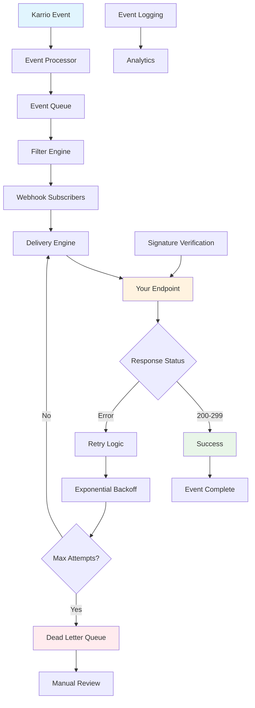

<div className="flex gap-2 mb-6">
  <div className="inline-flex items-center rounded-md bg-green-50 px-2 py-1 text-xs font-medium text-green-700 ring-1 ring-inset ring-green-600/20 dark:bg-green-400/10 dark:text-green-400 dark:ring-green-400/30">
    <span className="text-xs">Community Edition</span>
  </div>
  <div className="inline-flex items-center rounded-md bg-blue-50 px-2 py-1 text-xs font-medium text-blue-700 ring-1 ring-inset ring-blue-700/10 dark:bg-blue-400/10 dark:text-blue-400 dark:ring-blue-400/30">
    <span className="text-xs">Core Feature</span>
  </div>
</div>

# Webhooks

Every Karrio project comes with comprehensive webhook capabilities, providing real-time event notifications for all shipping activities with automatic retry mechanisms, signature verification, and event filtering for building responsive applications.

## Features

### Real-Time Event Notifications

You don't have to poll APIs for status updates. Our webhook system instantly pushes notifications to your application the moment shipping events occur, enabling immediate responses and real-time user experiences.

<div className="bg-gray-50 dark:bg-gray-900 rounded-lg p-4 my-6">
  <div className="text-sm text-gray-600 dark:text-gray-400 mb-2">
    Webhook Management Dashboard
  </div>
  <div className="bg-white dark:bg-gray-800 rounded border h-64 flex items-center justify-center">
    <span className="text-gray-400">
      Screenshot: Webhook configuration interface with event filters and
      delivery status
    </span>
  </div>
</div>

### Automatic Retry Mechanism

Failed webhook deliveries are automatically retried with exponential backoff to ensure reliable event delivery even during temporary outages.

### Signature Verification

All webhook payloads include cryptographic signatures to verify authenticity and prevent unauthorized access to your endpoints.

### Event Filtering

Subscribe only to the events you need, reducing unnecessary traffic and processing overhead in your application.

### Delivery Monitoring

Track webhook delivery success rates, response times, and failure patterns with detailed logging and analytics.

### Additional features

- Karrio extends webhooks with custom retry policies and delivery scheduling.
- Every webhook includes structured event data and comprehensive metadata.
- Karrio manages webhook endpoint health monitoring and automatic failover.
- Support for multiple webhook endpoints with different event configurations.

## Data Flow

### Webhook Architecture



## API Reference

### REST API

#### Create Webhook

```bash
curl -X POST "https://api.karrio.io/v1/webhooks" \
  -H "Authorization: Token YOUR_API_KEY" \
  -H "Content-Type: application/json" \
  -d '{
    "url": "https://your-app.com/webhooks/karrio",
    "description": "Main webhook endpoint",
    "enabled_events": [
      "shipment.created",
      "shipment.purchased",
      "tracking.status_updated",
      "tracking.delivered",
      "order.fulfilled"
    ],
    "secret": "your-webhook-secret"
  }'
```

**Response:**

```json
{
  "id": "wh_1234567890",
  "url": "https://your-app.com/webhooks/karrio",
  "description": "Main webhook endpoint",
  "enabled_events": [
    "shipment.created",
    "shipment.purchased",
    "tracking.status_updated",
    "tracking.delivered",
    "order.fulfilled"
  ],
  "secret": "your-webhook-secret",
  "created_at": "2024-01-15T10:30:00Z",
  "is_active": true,
  "last_response_status": null,
  "total_deliveries": 0,
  "successful_deliveries": 0
}
```

#### List Webhooks

```bash
curl -X GET "https://api.karrio.io/v1/webhooks" \
  -H "Authorization: Token YOUR_API_KEY"
```

**Response:**

```json
{
  "count": 2,
  "next": null,
  "previous": null,
  "results": [
    {
      "id": "wh_1234567890",
      "url": "https://your-app.com/webhooks/karrio",
      "description": "Main webhook endpoint",
      "enabled_events": ["shipment.created", "tracking.status_updated"],
      "is_active": true,
      "created_at": "2024-01-15T10:30:00Z",
      "last_response_status": 200,
      "total_deliveries": 150,
      "successful_deliveries": 148
    },
    {
      "id": "wh_1234567891",
      "url": "https://backup.your-app.com/webhooks",
      "description": "Backup webhook endpoint",
      "enabled_events": ["order.fulfilled"],
      "is_active": true,
      "created_at": "2024-01-16T09:00:00Z",
      "last_response_status": 200,
      "total_deliveries": 45,
      "successful_deliveries": 45
    }
  ]
}
```

#### Test Webhook

```bash
curl -X POST "https://api.karrio.io/v1/webhooks/wh_1234567890/test" \
  -H "Authorization: Token YOUR_API_KEY" \
  -H "Content-Type: application/json" \
  -d '{
    "event_type": "shipment.created"
  }'
```

**Response:**

```json
{
  "success": true,
  "delivery_id": "del_1234567890",
  "response_status": 200,
  "response_body": "OK",
  "response_time": 245,
  "delivered_at": "2024-01-15T10:35:00Z"
}
```

### Webhook Events

#### Shipment Created Event

```json
{
  "id": "evt_1234567890",
  "type": "shipment.created",
  "data": {
    "id": "shp_1234567890",
    "tracking_number": "1Z999AA1234567890",
    "carrier_name": "ups",
    "carrier_id": "ups_connection",
    "service": "ups_ground",
    "status": "created",
    "shipper": {
      "person_name": "Acme Corp",
      "address_line1": "123 Business Ave",
      "city": "Chicago",
      "state_code": "IL",
      "postal_code": "60601",
      "country_code": "US"
    },
    "recipient": {
      "person_name": "John Doe",
      "address_line1": "456 Customer St",
      "city": "New York",
      "state_code": "NY",
      "postal_code": "10001",
      "country_code": "US"
    },
    "parcels": [
      {
        "weight": 2.5,
        "weight_unit": "LB",
        "length": 12,
        "width": 8,
        "height": 6,
        "dimension_unit": "IN"
      }
    ],
    "selected_rate": {
      "id": "rate_1234567890",
      "total_charge": 15.25,
      "currency": "USD",
      "transit_days": 3
    },
    "reference": "ORDER-2024-001",
    "metadata": {
      "order_id": "ord_1234567890",
      "customer_id": "cust_1234567890"
    },
    "created_at": "2024-01-15T10:30:00Z"
  },
  "created_at": "2024-01-15T10:30:00Z",
  "api_version": "2024-01-01"
}
```

#### Tracking Status Updated Event

```json
{
  "id": "evt_1234567891",
  "type": "tracking.status_updated",
  "data": {
    "id": "trk_1234567890",
    "tracking_number": "1Z999AA1234567890",
    "carrier_name": "ups",
    "status": "in_transit",
    "previous_status": "shipped",
    "estimated_delivery": "2024-01-18T17:00:00Z",
    "events": [
      {
        "code": "IT",
        "description": "In Transit",
        "location": "Chicago, IL, US",
        "timestamp": "2024-01-16T08:30:00Z"
      },
      {
        "code": "DP",
        "description": "Departed Facility",
        "location": "Origin Facility",
        "timestamp": "2024-01-15T22:15:00Z"
      }
    ],
    "metadata": {
      "shipment_id": "shp_1234567890",
      "order_id": "ord_1234567890"
    },
    "updated_at": "2024-01-16T08:30:00Z"
  },
  "created_at": "2024-01-16T08:30:00Z",
  "api_version": "2024-01-01"
}
```

#### Order Fulfilled Event

```json
{
  "id": "evt_1234567892",
  "type": "order.fulfilled",
  "data": {
    "id": "ord_1234567890",
    "order_number": "ORDER-2024-001",
    "status": "fulfilled",
    "customer": {
      "id": "cust_1234567890",
      "email": "customer@example.com",
      "name": "John Doe"
    },
    "shipments": [
      {
        "id": "shp_1234567890",
        "tracking_number": "1Z999AA1234567890",
        "carrier_name": "ups",
        "service": "ups_ground"
      }
    ],
    "line_items": [
      {
        "id": "item_1234567890",
        "sku": "PRODUCT-001",
        "quantity": 2,
        "fulfilled_quantity": 2
      }
    ],
    "fulfilled_at": "2024-01-15T10:30:00Z",
    "metadata": {
      "source": "website",
      "sales_channel": "online"
    }
  },
  "created_at": "2024-01-15T10:30:00Z",
  "api_version": "2024-01-01"
}
```

## Event Handling

### Basic Webhook Handler

```javascript
const express = require("express");
const crypto = require("crypto");
const app = express();

app.use(express.json());

app.post("/webhooks/karrio", (req, res) => {
  const event = req.body;
  const signature = req.headers["x-karrio-signature"];

  // Verify webhook signature
  if (!verifySignature(req.body, signature)) {
    return res.status(401).send("Unauthorized");
  }

  // Process the event
  try {
    handleWebhookEvent(event);
    res.status(200).send("OK");
  } catch (error) {
    console.error("Webhook processing error:", error);
    res.status(500).send("Internal Server Error");
  }
});

function verifySignature(payload, signature) {
  const secret = process.env.WEBHOOK_SECRET;
  const expectedSignature = crypto
    .createHmac("sha256", secret)
    .update(JSON.stringify(payload))
    .digest("hex");

  return signature === `sha256=${expectedSignature}`;
}

function handleWebhookEvent(event) {
  console.log(`Received ${event.type} event:`, event.id);

  switch (event.type) {
    case "shipment.created":
      handleShipmentCreated(event.data);
      break;

    case "shipment.purchased":
      handleShipmentPurchased(event.data);
      break;

    case "tracking.status_updated":
      handleTrackingUpdate(event.data);
      break;

    case "tracking.delivered":
      handlePackageDelivered(event.data);
      break;

    case "order.fulfilled":
      handleOrderFulfilled(event.data);
      break;

    default:
      console.log(`Unhandled event type: ${event.type}`);
  }
}
```

### Shipment Event Handlers

```javascript
async function handleShipmentCreated(shipment) {
  console.log(
    `Shipment ${shipment.id} created for order ${shipment.reference}`,
  );

  // Update order status in database
  await updateOrderStatus(shipment.reference, "processing");

  // Create internal tracking record
  await createTrackingRecord({
    orderId: shipment.metadata.order_id,
    shipmentId: shipment.id,
    trackingNumber: shipment.tracking_number,
    carrier: shipment.carrier_name,
  });
}

async function handleShipmentPurchased(shipment) {
  console.log(`Label purchased for shipment ${shipment.tracking_number}`);

  // Send shipping confirmation to customer
  await sendShippingConfirmation({
    orderId: shipment.metadata.order_id,
    trackingNumber: shipment.tracking_number,
    carrier: shipment.carrier_name,
    estimatedDelivery: shipment.estimated_delivery,
  });

  // Update order status
  await updateOrderStatus(shipment.reference, "shipped");
}

async function sendShippingConfirmation(shipmentInfo) {
  const order = await getOrderById(shipmentInfo.orderId);

  await sendEmail({
    to: order.customer.email,
    subject: `Your order ${order.orderNumber} has shipped!`,
    template: "shipping_confirmation",
    data: {
      customerName: order.customer.name,
      orderNumber: order.orderNumber,
      trackingNumber: shipmentInfo.trackingNumber,
      carrier: shipmentInfo.carrier,
      trackingUrl: `https://your-app.com/track/${shipmentInfo.trackingNumber}`,
    },
  });
}
```

### Tracking Event Handlers

```javascript
async function handleTrackingUpdate(tracking) {
  console.log(
    `Tracking update: ${tracking.tracking_number} - ${tracking.status}`,
  );

  // Update tracking status in database
  await updateTrackingStatus(tracking.tracking_number, {
    status: tracking.status,
    location: tracking.events[0]?.location,
    timestamp: tracking.events[0]?.timestamp,
    estimatedDelivery: tracking.estimated_delivery,
  });

  // Send customer notification for key status updates
  const notificationStatuses = [
    "shipped",
    "in_transit",
    "out_for_delivery",
    "delivered",
  ];

  if (notificationStatuses.includes(tracking.status)) {
    await sendTrackingNotification(tracking);
  }

  // Handle delivery exceptions
  if (
    tracking.status === "delivery_failed" ||
    tracking.status === "exception"
  ) {
    await handleDeliveryException(tracking);
  }
}

async function handlePackageDelivered(tracking) {
  console.log(`Package delivered: ${tracking.tracking_number}`);

  // Update order status to completed
  const shipment = await getShipmentByTrackingNumber(tracking.tracking_number);
  if (shipment?.metadata?.order_id) {
    await updateOrderStatus(shipment.reference, "completed");
  }

  // Send delivery confirmation
  await sendDeliveryConfirmation(tracking);

  // Trigger post-delivery workflows
  await triggerPostDeliveryWorkflows(tracking);
}

async function sendTrackingNotification(tracking) {
  const shipment = await getShipmentByTrackingNumber(tracking.tracking_number);
  const order = await getOrderById(shipment.metadata.order_id);

  const statusMessages = {
    shipped: "Your package has been picked up and is on its way!",
    in_transit: "Your package is in transit",
    out_for_delivery: "Your package is out for delivery today!",
    delivered: "Your package has been delivered!",
  };

  await sendEmail({
    to: order.customer.email,
    subject: `Package Update: ${order.orderNumber}`,
    template: "tracking_update",
    data: {
      customerName: order.customer.name,
      orderNumber: order.orderNumber,
      trackingNumber: tracking.tracking_number,
      status: tracking.status,
      statusMessage: statusMessages[tracking.status],
      location: tracking.events[0]?.location,
      estimatedDelivery: tracking.estimated_delivery,
    },
  });
}
```

### Order Event Handlers

```javascript
async function handleOrderFulfilled(order) {
  console.log(
    `Order ${order.order_number} fulfilled with ${order.shipments.length} shipments`,
  );

  // Update order fulfillment status
  await updateOrderFulfillment(order.id, {
    status: "fulfilled",
    fulfilledAt: order.fulfilled_at,
    shipments: order.shipments,
  });

  // Send fulfillment notification
  await sendFulfillmentNotification(order);

  // Update inventory
  for (const item of order.line_items) {
    await updateInventory(item.sku, -item.fulfilled_quantity);
  }

  // Trigger post-fulfillment analytics
  await trackFulfillmentMetrics(order);
}

async function sendFulfillmentNotification(order) {
  const trackingNumbers = order.shipments.map((s) => s.tracking_number);

  await sendEmail({
    to: order.customer.email,
    subject: `Order ${order.order_number} Fulfilled`,
    template: "order_fulfilled",
    data: {
      customerName: order.customer.name,
      orderNumber: order.order_number,
      items: order.line_items,
      trackingNumbers: trackingNumbers,
      trackingUrl: `https://your-app.com/orders/${order.id}/tracking`,
    },
  });
}
```

## Error Handling & Reliability

### Retry Configuration

```javascript
class WebhookProcessor {
  constructor() {
    this.retryConfig = {
      maxAttempts: 5,
      initialDelay: 1000, // 1 second
      maxDelay: 300000, // 5 minutes
      backoffMultiplier: 2,
    };
  }

  async processWebhook(webhook, event) {
    let attempt = 1;
    let delay = this.retryConfig.initialDelay;

    while (attempt <= this.retryConfig.maxAttempts) {
      try {
        const response = await this.deliverWebhook(webhook, event);

        if (response.status >= 200 && response.status < 300) {
          await this.logDeliverySuccess(webhook, event, response);
          return { success: true, attempts: attempt };
        }

        throw new Error(`HTTP ${response.status}: ${response.statusText}`);
      } catch (error) {
        console.error(
          `Webhook delivery attempt ${attempt} failed:`,
          error.message,
        );

        if (attempt === this.retryConfig.maxAttempts) {
          await this.logDeliveryFailure(webhook, event, error);
          await this.sendToDeadLetterQueue(webhook, event, error);
          return { success: false, attempts: attempt, error: error.message };
        }

        // Wait before retry
        await this.sleep(delay);
        delay = Math.min(
          delay * this.retryConfig.backoffMultiplier,
          this.retryConfig.maxDelay,
        );
        attempt++;
      }
    }
  }

  async deliverWebhook(webhook, event) {
    const signature = this.generateSignature(event, webhook.secret);

    return await fetch(webhook.url, {
      method: "POST",
      headers: {
        "Content-Type": "application/json",
        "X-Karrio-Signature": signature,
        "X-Karrio-Event-Type": event.type,
        "X-Karrio-Delivery-Id": event.id,
      },
      body: JSON.stringify(event),
      timeout: 30000, // 30 seconds
    });
  }

  generateSignature(event, secret) {
    const payload = JSON.stringify(event);
    const signature = crypto
      .createHmac("sha256", secret)
      .update(payload)
      .digest("hex");

    return `sha256=${signature}`;
  }

  sleep(ms) {
    return new Promise((resolve) => setTimeout(resolve, ms));
  }
}
```

### Dead Letter Queue Handling

```javascript
class DeadLetterQueueHandler {
  async processFailedWebhooks() {
    const failedWebhooks = await this.getFailedWebhooks();

    for (const failedWebhook of failedWebhooks) {
      // Analyze failure reason
      const failureReason = this.analyzeFailure(failedWebhook);

      switch (failureReason) {
        case "endpoint_down":
          // Check if endpoint is back online
          if (await this.isEndpointHealthy(failedWebhook.webhook.url)) {
            await this.retryWebhook(failedWebhook);
          }
          break;

        case "invalid_endpoint":
          // Disable webhook and notify admin
          await this.disableWebhook(failedWebhook.webhook.id);
          await this.notifyAdmin(failedWebhook);
          break;

        case "authentication_error":
          // Webhook secret might be wrong
          await this.notifyWebhookOwner(failedWebhook);
          break;

        default:
          // Manual review required
          await this.flagForManualReview(failedWebhook);
      }
    }
  }

  analyzeFailure(failedWebhook) {
    const lastError = failedWebhook.lastError;

    if (lastError.includes("ECONNREFUSED") || lastError.includes("timeout")) {
      return "endpoint_down";
    }

    if (lastError.includes("404") || lastError.includes("DNS")) {
      return "invalid_endpoint";
    }

    if (lastError.includes("401") || lastError.includes("403")) {
      return "authentication_error";
    }

    return "unknown";
  }
}
```

## Use Cases

### E-commerce Order Fulfillment

Perfect for online stores:

- **Order-to-Shipment Automation**: Automatically update order status when shipments are created
- **Customer Communication**: Send real-time shipping and delivery notifications
- **Inventory Management**: Update stock levels when orders are fulfilled
- **Customer Service**: Proactively handle delivery exceptions

### Marketplace Integration

Designed for multi-vendor marketplaces:

- **Seller Notifications**: Notify sellers when their orders are shipped
- **Performance Tracking**: Monitor seller fulfillment performance
- **Customer Updates**: Provide unified tracking experience across vendors
- **Analytics**: Track marketplace shipping metrics

### Enterprise Operations

Built for complex shipping workflows:

- **System Integration**: Connect shipping events to ERP and CRM systems
- **Compliance Monitoring**: Track shipping compliance and audit requirements
- **Cost Tracking**: Monitor shipping costs and carrier performance
- **Exception Handling**: Automate responses to delivery issues

## Getting Started

Ready to implement real-time shipping notifications with Karrio webhooks? Follow these steps:

1. **Create webhook endpoints** in your application to receive events
2. **Register webhooks** with the events you need to monitor
3. **Implement signature verification** for security
4. **Test webhook delivery** and error handling

### Next Steps

- Learn about [workflows](/docs/products/workflows) for automated webhook-driven processes
- Explore [api logs](/docs/products/api-logs) for webhook delivery monitoring
- Set up [events](/docs/products/events) to understand the full event system
- Configure [tracking](/docs/products/tracking) for shipment monitoring events
