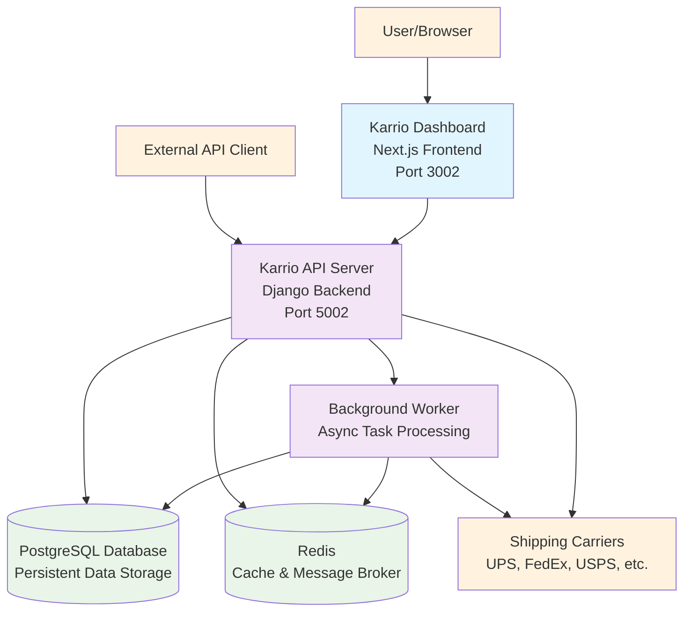
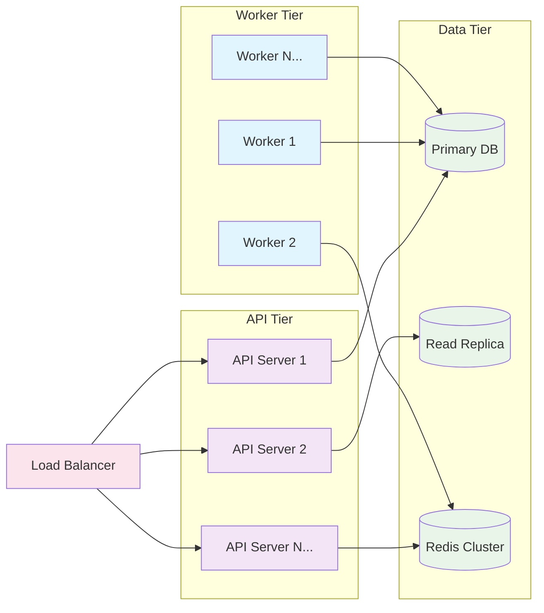

# Self-Hosting

There are multiple ways to deploy Karrio, providing support for customers who want to implement their shipping API infrastructure within their existing tech stack. This guide will help you get started with self-hosting Karrio.

## Architecture Overview

Karrio is built with a modern, scalable architecture designed for reliability and extensibility. Understanding the architecture helps you make informed decisions about deployment, scaling, and customization.

### Core Components

Karrio has three main components:

1. **Karrio SDK** - The foundational layer that unifies and standardizes communication with shipping carriers into a single interface. It's designed to be extensible, allowing integration of additional carrier support.

2. **Karrio Server** - The backend server that exposes REST and GraphQL APIs for shipping operations. Built with Django and Python, it maintains state in a PostgreSQL database and handles all business logic.

3. **Karrio Dashboard** - The user interface that operations teams use for manual fulfillment processes. Built with Next.js, it runs in the browser and communicates with the Karrio server via REST and GraphQL APIs.

### Service Architecture

When you deploy Karrio using Docker, several services work together to provide a complete shipping platform:



#### Service Details

- **Dashboard (Port 3002)**: The web interface built with Next.js that provides:

  - Shipment management
  - Carrier configuration
  - Order processing
  - Analytics and reporting

- **API Server (Port 5002)**: The core Django application that provides:

  - REST API endpoints for shipping operations
  - GraphQL API for data queries
  - Authentication and authorization
  - Business logic and carrier integrations

- **Background Worker**: Processes asynchronous tasks including:

  - Shipment tracking updates
  - Webhook deliveries
  - Email notifications
  - Data synchronization

- **PostgreSQL Database**: Stores all persistent data:

  - User accounts and permissions
  - Shipment records
  - Carrier configurations
  - Tracking information

- **Redis**: Provides caching and message queuing:
  - Session storage
  - API response caching
  - Task queue for background jobs
  - Real-time data synchronization

### Data Flow

1. **User Interactions**: Users interact with the Dashboard or make direct API calls
2. **API Processing**: The API server processes requests, applies business logic, and interacts with carriers
3. **Background Tasks**: Long-running operations are queued for background processing
4. **Data Persistence**: All data is stored in PostgreSQL with Redis providing caching
5. **Real-time Updates**: Changes are propagated through webhooks

### Extensibility

Rather than modifying Karrio's source code directly, we recommend developing external **Apps** that interact with Karrio through its APIs:

- **REST API**: For shipping operations, rate quotes, label generation, and tracking
- **GraphQL API**: For complex data queries and real-time subscriptions
- **Webhooks**: For event-driven integrations and real-time notifications
- **SDK Extensions**: For adding custom carrier integrations

This approach ensures your customizations remain compatible with future Karrio updates.

## Technology Stack & Scalability

Karrio is built on a proven technology stack designed for enterprise-scale shipping operations. Each component has been chosen for its ability to handle high-volume traffic, maintain reliability, and scale horizontally.

### Core Technologies

**Backend: Python & Django**

- **Python**: A mature, enterprise-ready language with extensive shipping and logistics libraries
- **Django**: Battle-tested web framework with built-in security, ORM, and admin interface
- **Django REST Framework**: Provides robust API capabilities with authentication, serialization, and documentation
- **Async Support**: Leverages Django's async capabilities and Celery/Huey for background task processing

**Frontend: Next.js**

- **React-based**: Modern, component-based architecture for maintainable user interfaces
- **Server-Side Rendering**: Improves performance and SEO for better user experience
- **Static Generation**: Optimizes page load times for frequently accessed content
- **API Routes**: Built-in API capabilities for seamless backend integration

**Infrastructure: Docker & Containerization**

- **Container Orchestration**: Enables easy scaling and deployment across environments
- **Resource Isolation**: Ensures stable performance under varying load conditions
- **Multi-stage Builds**: Optimized container images for production deployments
- **Health Checks**: Built-in monitoring and automatic recovery capabilities

### High-Volume Shipping Operations

Karrio's architecture is specifically designed to handle enterprise-scale shipping operations:

#### Performance Characteristics

**API Throughput**

- **Rate Limiting**: Configurable rate limits to manage carrier API quotas efficiently
- **Connection Pooling**: Optimized database and HTTP connections for high concurrency
- **Caching Strategy**: Multi-layer caching (Redis, Django cache framework) reduces API response times
- **Async Processing**: Background workers handle time-intensive operations without blocking user requests

**Database Optimization**

- **PostgreSQL**: Enterprise-grade database with excellent performance under heavy loads
- **Query Optimization**: Efficient database queries with proper indexing and query optimization
- **Connection Pooling**: PgBouncer integration for managing database connections at scale
- **Read Replicas**: Support for read-only replicas to distribute query load

**Carrier Integration Efficiency**

- **Batch Processing**: Groups multiple shipment requests to reduce carrier API calls
- **Circuit Breakers**: Prevents cascade failures when carrier services are unavailable
- **Rate Limiting**: Respects carrier API limits while maximizing throughput

#### Scalability Features

**Horizontal Scaling**



**Auto-scaling Capabilities**

- **Container Orchestration**: Docker Swarm or Kubernetes for automatic scaling
- **Resource Monitoring**: Built-in metrics for CPU, memory, and request volume
- **Dynamic Worker Scaling**: Automatically adjust worker count based on queue length
- **Database Scaling**: Support for read replicas and connection pooling

### Production Deployment Considerations

**High-Availability Setup**

- **Multi-Zone Deployment**: Deploy across multiple availability zones for redundancy
- **Database Clustering**: PostgreSQL streaming replication for failover capabilities
- **Redis Clustering**: Redis Sentinel or Cluster mode for cache high availability
- **Load Balancing**: Multiple API server instances behind load balancers

**Performance Optimization**

- **CDN Integration**: Static asset delivery through content delivery networks
- **Compression**: Gzip compression for API responses and static content
- **Database Indexing**: Optimized indexes for common shipping operation queries
- **Background Processing**: Offload heavy operations to dedicated worker processes

**Monitoring & Observability**

- **Application Metrics**: Built-in Django metrics for request/response monitoring
- **Database Performance**: PostgreSQL query analysis and performance monitoring
- **Redis Monitoring**: Cache hit rates and memory usage tracking
- **Carrier API Monitoring**: Success rates and response time tracking for each carrier

### Volume Capacity Examples

Based on production deployments, Karrio can handle:

**Small to Medium Operations (Single Instance)**

- 10,000+ shipments per day
- 100+ concurrent API requests
- Sub-second API response times
- 99.9% uptime with proper maintenance

**Large Scale Operations (Clustered Setup)**

- 1M+ shipments per day
- 1000+ concurrent API requests
- Horizontal scaling to dozens of instances
- 99.99% uptime with proper redundancy

**Enterprise Scale (Multi-Region)**

- Multi-million shipments per day
- Global deployment with regional data centers
- Custom carrier integrations and SLA requirements
- 24/7 support and monitoring

The technology stack's maturity and scalability ensure that Karrio can grow with your business from startup to enterprise scale without requiring architectural changes.

## Requirements

Karrio runs with minimal hardware requirements. The most resource-intensive operations are during initial setup and database migrations, but once running, it's relatively lightweight.

### Hardware Requirements

- **Minimal Setup**:

  - 2GB RAM
  - 1 CPU core
  - 10GB storage

- **Recommended Setup (Production)**:
  - 4GB+ RAM
  - 2+ CPU cores
  - 20GB+ storage

### Software Requirements

- **Operating System**:

  - Karrio works well on Linux, macOS, and Windows
  - For production deployments, we recommend Linux (Ubuntu 20.04+ or Debian 11+)

- **Required Software**:
  - Docker and Docker Compose (for container-based deployments)
  - Git (for source-based deployments)
  - PostgreSQL 12+ (if not using containerized database)
  - Redis (if not using containerized cache)

## Why Self-Host?

Self-hosting Karrio offers several advantages:

- **Data Control**: Keep all your shipping data within your own infrastructure
- **Customization**: Modify the platform to suit your specific needs
- **Integration**: Seamlessly integrate with your existing systems
- **Cost**: Potentially reduce costs for high-volume shipping operations
- **Compliance**: Meet specific regulatory or security requirements

## Deployment Options

### [Docker](/docs/self-hosting/docker)

Docker is the recommended and easiest way to get started with self-hosting Karrio. It provides a consistent environment across different platforms and simplifies the setup process.

For quick deployments, we offer a one-click installation script:

```bash
/bin/bash -c "$(curl -fsSL https://raw.githubusercontent.com/karrioapi/karrio/HEAD/bin/deploy-hobby)"
```

### Cloud Providers

Deploy Karrio on popular cloud platforms with detailed guides:

- [AWS](/docs/self-hosting/aws)
- [GCP](/docs/self-hosting/gcp)
- [Digital Ocean](/docs/self-hosting/digital-ocean)

## Environment Configuration

Karrio is configured primarily through environment variables. The most important ones are:

- `SECRET_KEY`: A secret key used for security
- `DOMAIN`: Your domain name (for production)
- `DASHBOARD_URL`: URL for the dashboard interface
- `KARRIO_PUBLIC_URL`: URL for the API
- `DATABASE_*`: Database connection details
- `REDIS_*`: Redis connection details

For a comprehensive list, see the [Environment Variables](/docs/self-hosting/environment) documentation.

## Initial Setup

After deployment, you can access your Karrio instance:

- Dashboard: Default at `http://localhost:3002` or your configured domain
- API: Default at `http://localhost:5002` or your configured domain

Default login credentials:

- Email: `admin@example.com`
- Password: `demo`

For production environments, we strongly recommend changing these credentials immediately.

## Integration with Shipping Carriers

Karrio supports multiple shipping carriers out of the box. To use them, you'll need to configure credentials in your environment variables:

- USPS
- UPS
- FedEx
- DHL
- And many more

Each carrier requires specific API credentials that you can obtain from your carrier account.

## Maintenance

### Backups

It's important to regularly back up your Karrio data:

```bash
# Backup PostgreSQL database
docker-compose exec db pg_dump -U postgres -d db > karrio_backup_$(date +%Y%m%d).sql

# Backup configuration
cp .env .env.backup.$(date +%Y%m%d)
```

### [Upgrades](/docs/self-hosting/upgrade)

To upgrade your Karrio instance, we provide an upgrade script for hobby deployments:

```bash
/bin/bash -c "$(curl -fsSL https://raw.githubusercontent.com/karrioapi/karrio/HEAD/bin/upgrade-hobby)"
```

For manual deployments, see our [Upgrade Guide](/docs/self-hosting/upgrade).

## Next Steps

1. Choose your preferred [deployment method](#deployment-options)
2. Set up your [environment variables](/docs/self-hosting/environment)
3. Learn how to [upgrade](/docs/self-hosting/upgrade) your installation
4. Explore [carrier configurations](/docs/carriers)

## Support

If you need help with your self-hosted Karrio instance:

- Join our [Community Forum](https://github.com/orgs/karrioapi/discussions)
- Consider our [Enterprise Support Plans](/platform) for priority assistance
