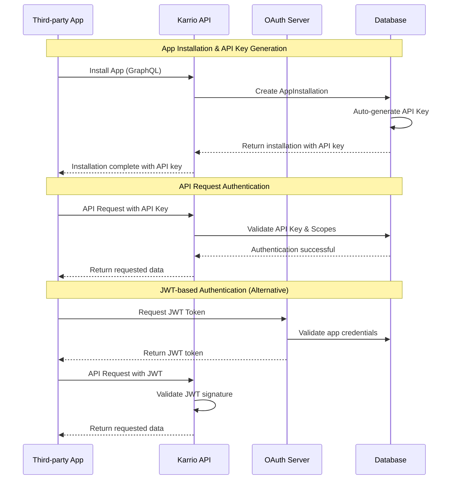
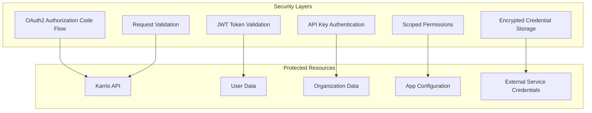
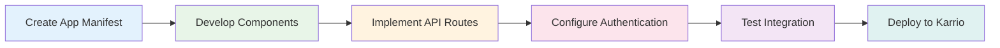

# Karrio Apps: Architecture & Implementation Status

## 1. Executive Summary

Karrio Apps enables third-party developers to extend Karrio's functionality through embedded applications and server-to-server integrations. This document outlines the current implementation status, architecture, and roadmap for the Karrio Apps platform.

**Current Status:** ✅ **Beta Ready** - Core functionality implemented and tested

**Key Achievements:**
- Complete OAuth2 authentication system with automatic API key generation
- GraphQL API for app management and installation
- Embedded app framework with React components
- JWT-based security for app-to-app communication
- Comprehensive test coverage for all core features
- Ready-to-use app development infrastructure

## 2. Implementation Status

### 2.1. ✅ Completed Features

#### Backend Infrastructure
- **OAuth App Management** (`karrio-insiders/modules/apps/`)
  - Complete CRUD operations via GraphQL
  - OAuth2 integration with django-oauth-toolkit
  - Authorization Code flow with proper security
  - Client credentials generation and management

- **App Installation System**
  - Automatic API key generation for each installation
  - Scoped permissions and access control
  - Metafields support for app configuration
  - Installation lifecycle management (install/uninstall/disable)

- **Authentication & Security**
  - JWT middleware for session-independent authentication
  - Dual authentication strategy (session + API key based)
  - App-specific API keys with automatic rotation
  - Encrypted credential storage in metafields

- **GraphQL API Layer**
  - Complete app management mutations and queries
  - Proper authentication and authorization decorators
  - Comprehensive error handling and validation
  - Support for both OAuth apps and physical app installations

#### Frontend Infrastructure
- **App Store Package** (`karrio/packages/app-store/`)
  - AppContainer for dynamic app loading
  - AppLauncher for installed app management
  - AppSheet for app configuration and details
  - Error boundaries and loading states

- **Developer Experience**
  - AppApiClient for authenticated API requests
  - KarrioClient integration for platform API access
  - Asset resolution and management system
  - App route handling and dynamic loading

- **User Interface Components**
  - App configuration views with metafields support
  - Installation flow with permission management
  - App details and documentation display
  - Error handling and user feedback systems

#### Testing & Quality Assurance
- **Comprehensive Test Suite** (`test_apps_graphql.py`)
  - OAuth app CRUD operations
  - App installation and uninstallation flows
  - API key generation and rotation
  - JWT authentication and middleware
  - Edge cases and error scenarios

### 2.2. 🔄 In Progress

#### Physical App System
- **App Manifest Structure**
  - Basic manifest loading and validation
  - Asset resolution (icons, screenshots, readme)
  - Component dynamic loading
  - Configuration schema definition

- **App Development Experience**
  - Sample apps (shipping-tasks) as reference
  - Component templates and patterns
  - Asset management and optimization
  - Development workflow documentation

### 2.3. 📋 Planned Features

#### Developer Tools
- [ ] CLI for app scaffolding and development
- [ ] Local development server with hot reload
- [ ] App bundling and optimization tools
- [ ] Debugging and logging utilities

#### App Store & Marketplace
- [ ] Public app registry and discovery
- [ ] App review and approval process
- [ ] Versioning and update management
- [ ] Analytics and usage tracking

#### Advanced Features
- [ ] Webhook system for app events
- [ ] Background job processing
- [ ] Real-time data synchronization
- [ ] Advanced permission management

## 3. Architecture Overview

### 3.1. System Components

```mermaid
graph TB
    subgraph "✅ Implemented"
        API[GraphQL API]
        OAuth[OAuth2 Server]
        JWT[JWT Middleware]
        Models[Data Models]
        Auth[Authentication]
        Tests[Test Suite]
        AppStore[App Store Package]
        Components[React Components]
    end

    subgraph "🔄 In Progress"
        Manifest[App Manifest System]
        Samples[Sample Apps]
        Assets[Asset Management]
    end

    subgraph "📋 Planned"
        CLI[Developer CLI]
        Registry[App Registry]
        Webhooks[Webhook System]
        Analytics[Analytics]
    end

    API --> OAuth
    API --> JWT
    API --> Models
    JWT --> Auth
    AppStore --> Components
    AppStore --> Manifest
    Manifest --> Samples
    Samples --> Assets

    style API fill:#d4edda
    style OAuth fill:#d4edda
    style JWT fill:#d4edda
    style Models fill:#d4edda
    style Auth fill:#d4edda
    style Tests fill:#d4edda
    style AppStore fill:#d4edda
    style Components fill:#d4edda
    style Manifest fill:#fff3cd
    style Samples fill:#fff3cd
    style Assets fill:#fff3cd
    style CLI fill:#f8d7da
    style Registry fill:#f8d7da
    style Webhooks fill:#f8d7da
    style Analytics fill:#f8d7da
```



### 3.2. Data Models

```python
# OAuth App - For developer-created applications
class OAuthApp(core.OwnedEntity):
    display_name = models.CharField(max_length=100)
    description = models.TextField(blank=True)
    launch_url = models.URLField()
    redirect_uris = models.TextField()
    features = models.JSONField(default=list)
    registration = models.OneToOneField(Application, on_delete=models.CASCADE)

    @property
    def client_id(self):
        return self.registration.client_id

    @property
    def client_secret(self):
        return self.registration.client_secret

# App Installation - Links apps to organizations
class AppInstallation(core.OwnedEntity):
    app_id = models.CharField(max_length=100)  # Can be OAuth app ID or physical app ID
    app_type = models.CharField(max_length=20)  # builtin, marketplace, private
    access_scopes = models.JSONField(default=list)
    api_key = models.CharField(max_length=255, null=True, blank=True)  # Auto-generated
    is_active = models.BooleanField(default=True)
    requires_oauth = models.BooleanField(default=False)
    oauth_app = models.ForeignKey(OAuthApp, null=True, blank=True, on_delete=models.CASCADE)

    # Configuration storage
    metafields = models.ManyToManyField(core.Metafield, through="AppInstallationMetafieldLink")

    def ensure_api_key(self):
        """Ensure API key exists, create if missing"""
        if not self.api_key:
            self.api_key = self.generate_api_key()
            self.save()

    def rotate_api_key(self):
        """Generate new API key"""
        self.api_key = self.generate_api_key()
        self.save()
```

### 3.3. Authentication Flow



### 3.4. App Development Architecture

```typescript
// App Manifest Structure
interface AppManifest {
  id: string;
  name: string;
  version: string;
  description: string;
  author: {
    name: string;
    email: string;
    website?: string;
  };
  permissions: string[];
  assets: {
    icon: string;
    screenshots: string[];
    readme: string;
  };
  components: {
    main: string;
    configuration?: string;
  };
  api?: {
    routes: Record<string, string>;
  };
}

// App Component Interface
interface AppComponent {
  appId: string;
  installation: AppInstallation;
  context: AppContext;
  karrio: KarrioClient;
}

// App Context
interface AppContext {
  user: User;
  organization: Organization;
  permissions: string[];
  settings: Record<string, any>;
}
```

## 4. Security Architecture

### 4.1. Multi-Layer Security



### 4.2. Authentication Methods

**1. Session-Independent Authentication (Primary)**
```typescript
// App makes API request with its own API key
const response = await fetch('/api/v1/shipments', {
  headers: {
    'Authorization': `Bearer ${app_api_key}`,
    'X-App-API-Key': app_api_key,
  }
});
```

**2. JWT-Based Authentication**
```typescript
// Dashboard generates JWT for embedded apps
const jwt = generateAppJWT({
  app_id: 'shopify-integration',
  installation_id: 'inst_123',
  user_id: 'user_456',
  permissions: ['read', 'write']
});
```

**3. OAuth2 Flow for External Services**
```typescript
// Shopify OAuth integration example
const authUrl = `https://shopify.com/oauth/authorize?client_id=${client_id}&scope=read_orders,write_shipping&redirect_uri=${redirect_uri}`;
```

## 5. Development Workflow

### 5.1. App Development Process



### 5.2. Sample App Structure

```
apps/
└── shipping-tasks/
    ├── manifest.ts          # App configuration
    ├── component.tsx        # Main UI component
    ├── configuration.tsx    # Settings component
    ├── api/
    │   ├── tasks/
    │   │   └── route.ts     # API endpoints
    │   └── sync/
    │       └── route.ts
    ├── assets/
    │   ├── icon.svg
    │   ├── screenshot1.png
    │   └── README.md
    └── types.ts            # TypeScript definitions
```

## 6. Next Steps & Roadmap

### 6.1. Phase 1: Documentation & Developer Experience (Current)
- [ ] Complete developer documentation
- [ ] Create sample apps and templates
- [ ] Improve error handling and debugging
- [ ] Add development workflow guides

### 6.2. Phase 2: App Store & Discovery
- [ ] Build public app registry
- [ ] Implement app versioning
- [ ] Create app review process
- [ ] Add analytics and monitoring

### 6.3. Phase 3: Advanced Features
- [ ] Webhook system
- [ ] Background job processing
- [ ] Real-time synchronization
- [ ] Advanced permission system

### 6.4. Phase 4: Enterprise Features
- [ ] Multi-tenant app support
- [ ] Custom app deployment
- [ ] Enterprise security features
- [ ] Compliance and audit tools

## 7. Implementation Checklist

### ✅ Completed
- [x] OAuth2 authentication system
- [x] GraphQL API for app management
- [x] App installation with API key generation
- [x] JWT authentication middleware
- [x] Embedded app framework
- [x] Comprehensive test suite
- [x] Basic app store components
- [x] Developer authentication flow

### 🔄 In Progress
- [ ] Physical app manifest system
- [ ] Sample app development
- [ ] Asset management optimization
- [ ] Developer documentation

### 📋 Upcoming
- [ ] CLI development tools
- [ ] App marketplace UI
- [ ] Webhook system implementation
- [ ] Advanced security features

## 8. Conclusion

The Karrio Apps platform has achieved significant milestones with a solid foundation of core features implemented and tested. The architecture supports both embedded applications and server-to-server integrations with proper security and authentication mechanisms.

**Current State:** Ready for developer preview and initial app development
**Next Focus:** Complete documentation and developer experience improvements
**Timeline:** Production-ready within 4-6 weeks with continued feature development

The platform is well-positioned to support a thriving third-party app ecosystem while maintaining security and performance standards.
