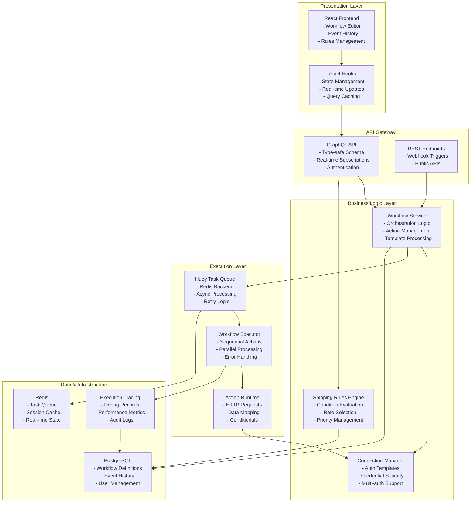
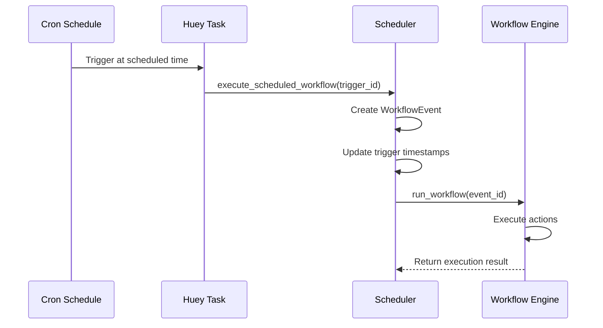

# Karrio Workflow Engine - Product Requirements Document (PRD)

## Executive Summary

The Karrio Workflow Engine is a production-ready automation platform designed to orchestrate business processes within the Karrio shipping ecosystem. It provides two complementary automation capabilities:

1. **General-Purpose Workflows**: Complex multi-step automation with HTTP integrations, data transformations, and conditional logic
2. **Shipping Rules Engine**: Specialized rate selection optimization with condition-based rule evaluation

**Current Status**: ✅ **Production Ready** (85/100 score)

## Table of Contents

1. [System Architecture](#system-architecture)
2. [Core Components](#core-components)
3. [Data Models & Schema](#data-models--schema)
4. [Execution Engine](#execution-engine)
5. [Action Types](#action-types)
6. [Connection Management](#connection-management)
7. [Scheduled Workflows](#scheduled-workflows)
8. [Security & Authentication](#security--authentication)
9. [Frontend Implementation](#frontend-implementation)
10. [API Layer](#api-layer)
11. [Production Considerations](#production-considerations)
12. [Testing Strategy](#testing-strategy)

## System Architecture

### High-Level Architecture



### Core Principles

- **Event-Driven Architecture**: Clean separation between workflow orchestration and execution
- **GraphQL-First API**: Type-safe, introspectable API with real-time capabilities
- **Modular Action System**: Extensible plugin architecture for action types
- **Template Engine Integration**: Powerful Jinja2-based dynamic parameter generation
- **Multi-tenant Support**: Organization-level isolation with proper context management
- **Comprehensive Observability**: Full execution tracing and debugging capabilities

## Core Components

### 1. Workflow Execution Engine

**Location**: `karrio-insiders/modules/automation/karrio/server/events/task_definitions/automation/workflow.py`

The execution engine orchestrates workflow events through ordered action sequences.

#### Key Functions:

```python
@utils.error_wrapper
def run_workflow(event_id: str):
    """Main entry point for workflow execution"""
    # 1. Load workflow event and setup tracing
    # 2. Update event status to 'running'
    # 3. Process workflow with error handling
    # 4. Save tracing records and update final status

@utils.error_wrapper
def process_workflow(event, tracer, cache, context) -> str:
    """Core workflow processing logic"""
    # 1. Get execution sequence by action order
    # 2. Execute actions sequentially by order
    # 3. Handle parallel execution within same order
    # 4. Propagate failures and conditional aborts
    # 5. Return final execution status

@utils.error_wrapper
def execute_workflow_action(action, event, tracer, cache, parameters):
    """Individual action execution"""
    # 1. Log pre-execution state
    # 2. Authenticate connection if required
    # 3. Execute action based on type
    # 4. Log execution results and errors
```

#### Execution Flow:

1. **Event Processing**: Workflow events trigger async task execution
2. **Sequential Actions**: Actions execute in defined order (0, 1, 2, ...)
3. **Parallel Within Order**: Multiple actions with same order run concurrently
4. **Context Passing**: Each action receives results from previous steps
5. **Error Propagation**: Failures abort remaining actions
6. **Comprehensive Tracing**: Every step logged for debugging

### 2. Workflow Scheduler System

**Location**: `karrio-insiders/modules/automation/karrio/server/automation/services/scheduler.py`

Dynamic scheduler service for cron-based workflows.

#### Key Classes:

```python
class ScheduledWorkflowRegistry:
    """Thread-safe registry for tracking registered tasks"""
    def register(self, trigger_id: str, task_function: callable)
    def unregister(self, trigger_id: str)
    def get_registered_triggers(self) → List[str]

class WorkflowScheduler:
    """Main service for managing scheduled workflows"""
    def register_scheduled_workflow(self, trigger: WorkflowTrigger) → callable
    def unregister_scheduled_workflow(self, trigger_id: str)
    def refresh_all_scheduled_workflows(self) → int
```

#### Dynamic Task Creation:

```python
# Input: WorkflowTrigger with schedule="0 9 * * 1"
@periodic_task(crontab(minute=0, hour=9, day_of_week=1))
def scheduled_workflow_wtrg_12345_timestamp():
    execute_scheduled_workflow("wtrg_12345")
```

## Data Models & Schema

### Core Models

#### Workflow Model
```python
class Workflow(core.OwnedEntity):
    id = models.CharField(max_length=50, primary_key=True, prefix="wkfl_")
    name = models.CharField(max_length=50)
    slug = models.CharField(max_length=100, db_index=True)
    is_public = models.BooleanField(default=False)
    is_active = models.BooleanField(default=False)
    description = models.CharField(max_length=150, null=True)
    action_nodes = models.JSONField(default=list)  # [{"order": 0, "slug": "action_slug"}]
    metadata = models.JSONField(default=dict)
    template = models.ForeignKey("self", null=True)  # Template reference
```

#### WorkflowAction Model
```python
class WorkflowAction(core.OwnedEntity):
    id = models.CharField(max_length=50, primary_key=True, prefix="wact_")
    name = models.CharField(max_length=50)
    slug = models.CharField(max_length=100, db_index=True)
    action_type = models.CharField(choices=ACTION_TYPES)  # http_request, data_mapping, conditional

    # HTTP-specific fields
    host = models.TextField(null=True)
    endpoint = models.TextField(null=True)
    method = models.CharField(choices=HTTP_METHODS, null=True)
    port = models.PositiveIntegerField(null=True)

    # Template fields
    parameters_template = models.TextField(null=True)  # Jinja2 template
    header_template = models.TextField(null=True)     # Jinja2 template

    # Configuration
    parameters_type = models.CharField(choices=["data", "querystring"], null=True)
    content_type = models.CharField(choices=["json", "xml", "text"], null=True)

    # Relationships
    connection = models.ForeignKey("WorkflowConnection", null=True)
    metafields = models.ManyToManyField(core.Metafield)
```

#### WorkflowConnection Model
```python
class WorkflowConnection(core.OwnedEntity):
    id = models.CharField(max_length=50, primary_key=True, prefix="wcon_")
    name = models.CharField(max_length=50)
    slug = models.CharField(max_length=100, db_index=True)
    auth_type = models.CharField(choices=AUTH_TYPES)  # basic, api_key, oauth2, jwt

    # Connection details
    host = models.TextField(null=True)
    port = models.TextField(null=True)
    endpoint = models.TextField(null=True)

    # Authentication
    credentials = models.JSONField(default=dict)       # Legacy credentials
    auth_template = models.TextField(null=True)        # Jinja2 auth template
    parameters_template = models.TextField(null=True)  # Connection parameters

    # Metafields-based credentials (new approach)
    metafields = models.ManyToManyField(core.Metafield)

    @property
    def credentials_from_metafields(self) -> dict:
        """Get credentials from metafields, replacing legacy credentials"""
        return self.metafields_object

    @property
    def required_credentials(self) -> list:
        """Get list of required credential metafields that need values"""
        return list(
            self.metafields.filter(is_required=True, value__isnull=True)
            .values_list('key', flat=True)
        )

    @property
    def is_credentials_complete(self) -> bool:
        """Check if all required credential metafields are provided"""
        return len(self.required_credentials) == 0
```

#### WorkflowTrigger Model
```python
class WorkflowTrigger(core.OwnedEntity):
    id = models.CharField(max_length=50, primary_key=True, prefix="wtrg_")
    trigger_type = models.CharField(choices=TRIGGER_TYPES)  # manual, webhook, scheduled

    # Webhook fields
    secret = models.CharField(max_length=100, null=True)
    secret_key = models.CharField(max_length=100, null=True)

    # Scheduled workflow fields
    schedule = models.TextField(null=True)              # Cron expression
    next_run_at = models.DateTimeField(null=True)       # Next execution time
    last_run_at = models.DateTimeField(null=True)       # Last execution time

    # Relationships
    workflow = models.OneToOneField(Workflow, related_name="workflow_trigger")

    @property
    def is_due(self) -> bool:
        """Check if scheduled workflow should execute now"""
        if self.trigger_type != "scheduled" or not self.schedule:
            return False
        return is_cron_due(self.schedule, self.last_run_at)
```

#### WorkflowEvent Model
```python
class WorkflowEvent(core.OwnedEntity):
    id = models.CharField(max_length=50, primary_key=True, prefix="wevt_")
    status = models.CharField(choices=EVENT_STATUSES)    # pending, running, success, failed, cancelled
    event_type = models.CharField(choices=EVENT_TYPES)   # manual, webhook, scheduled
    test_mode = models.BooleanField(default=False)
    parameters = models.JSONField(default=dict)          # Input parameters for workflow

    # Relationships
    workflow = models.ForeignKey(Workflow, related_name="events")
```

## Action Types

### 1. HTTP Request Actions (`action_type = "http_request"`)

Execute HTTP requests to external APIs with full authentication support.

```python
# Example HTTP action configuration
{
    "action_type": "http_request",
    "host": "https://api.shopify.com",
    "endpoint": "/admin/api/2023-04/orders.json",
    "method": "GET",
    "parameters_type": "querystring",
    "parameters_template": '{"status": "open", "limit": "{{parameters.limit}}"}',
    "header_template": '{"X-Shopify-Access-Token": "{{connection.access_token}}"}'
}
```

**Features**:
- All HTTP methods supported (GET, POST, PUT, DELETE, PATCH)
- Flexible parameter placement (query string, request body, headers)
- Template-driven parameter generation using Jinja2
- Connection-based authentication
- Response format handling (JSON, XML, text)
- Error handling with timeout and retry logic

### 2. Data Mapping Actions (`action_type = "data_mapping"`)

Transform data between formats using Jinja2 templates.

```python
# Example data transformation
{
    "action_type": "data_mapping",
    "parameters_template": '''
    {
      "transformed_orders": [
        
        {
          "order_id": "{{order.id}}",
          "customer_name": "{{order.customer.first_name}} {{order.customer.last_name}}",
          "total": {{order.total_price}},
          "currency": "{{order.currency}}"
        },
        
      ]
    }
    ''',
    "content_type": "json"
}
```

**Features**:
- Jinja2 template-based transformation
- Access to all previous action results via `steps` context
- Support for JSON and text output formats
- Built-in helper functions via `lib` context
- Complex data manipulations with loops and conditionals

### 3. Conditional Actions (`action_type = "conditional"`)

Boolean logic evaluation for workflow branching.

```python
# Example conditional logic
{
    "action_type": "conditional",
    "parameters_template": '''
    {
      "result": "{{steps.order_count.response.count > 10}}"
    }
    ''',
    "description": "Check if order count exceeds threshold"
}
```

**Features**:
- Boolean expression evaluation
- YAML/JSON result parsing
- Workflow termination on false conditions
- Context-aware condition checking
- Support for complex logical expressions

## Connection Management

### Authentication Types

#### 1. API Key Authentication
```python
connection = {
    "auth_type": "api_key",
    "auth_template": '{ "Authorization": "Bearer {{credentials.api_key}}" }',
    "credentials": {"api_key": "sk_test_123456"}
}
```

#### 2. Basic Authentication
```python
connection = {
    "auth_type": "basic",
    "auth_template": "{{credentials.username}}:{{credentials.password}}",
    "credentials": {"username": "user", "password": "pass"}
}
```

#### 3. OAuth2 (Planned)
```python
connection = {
    "auth_type": "oauth2",
    "auth_template": '{ "Authorization": "Bearer {{credentials.access_token}}" }',
    "credentials": {"access_token": "...", "refresh_token": "..."}
}
```

### Metafields-Based Credentials

**New Approach**: Replace legacy `credentials` JSONField with structured metafields.

```python
# Create metafields for API connection
api_key_metafield = Metafield.objects.create(
    key="api_key",
    value="test-api-key-123",
    type="string",
    is_required=True,
    created_by=user,
)

connection.metafields.add(api_key_metafield)

# Connection automatically uses metafields
assert connection.credentials_from_metafields == {"api_key": "test-api-key-123"}
assert connection.is_credentials_complete == True
```

**Benefits**:
- Type-safe credential storage (string, number, boolean)
- Required field validation
- Better template security (no credential export in templates)
- Backward compatibility with legacy credentials field

## Scheduled Workflows

### Cron-Based Scheduling

The scheduler supports full cron expression syntax:

```python
# Every weekday at 9 AM
schedule = "0 9 * * 1-5"

# Every 15 minutes
schedule = "*/15 * * * *"

# First day of every month at midnight
schedule = "0 0 1 * *"
```

### Dynamic Task Registration

Workflow triggers with schedules automatically register as Huey periodic tasks:

```python
# Signal handler automatically registers scheduled workflows
@receiver(post_save, sender=WorkflowTrigger)
def workflow_trigger_saved(sender, instance, created, **kwargs):
    if instance.trigger_type == "scheduled" and instance.schedule:
        scheduler = WorkflowScheduler()
        scheduler.register_scheduled_workflow(instance)
```

### Execution Flow



## Security & Authentication

### Multi-Tenant Architecture

- **Organization Isolation**: All entities scoped to organization
- **User Permissions**: Role-based access control (RBAC)
- **API Key Management**: Secure credential storage and rotation
- **Audit Logging**: Comprehensive tracing of all operations

### Connection Security

```python
def authenticate_connection(connection_data, event, tracer, cache, parameters=None):
    """Secure connection authentication with metafields priority"""

    # Prioritize metafields over legacy credentials
    connection_credentials = (
        connection_data.get('credentials') or
        connection_obj.credentials_from_metafields or
        connection_obj.credentials or
        {}
    )

    render_context = {
        "credentials": connection_credentials,
        "metadata": connection_data.get('metadata', {}),
        "metafields": connection_data.get('metafields', {}),
        "lib": lib,
    }

    # Render authentication template
    if connection_obj.auth_type == "api_key":
        auth_result = jinja2.Template(connection_obj.auth_template or "").render(**render_context)
        return lib.to_dict(auth_result)

    # Handle other auth types...
    return {"credentials": connection_credentials}
```

## Frontend Implementation

### React Components Architecture

```typescript
// Main workflow editor component
interface WorkflowEditorProps {
  workflowId?: string;
  onSave: (workflow: Workflow) => void;
}

// Action type selection
enum AutomationActionType {
  http_request = "http_request",
  data_mapping = "data_mapping",
  conditional = "conditional"
}

// Connection management
interface WorkflowConnection {
  id: string;
  name: string;
  auth_type: AutomationAuthType;
  credentials_from_metafields?: any;
  required_credentials?: string[];
  is_credentials_complete?: boolean;
  credential_validation?: any;
}
```

### Real-Time Updates

- **GraphQL Subscriptions**: Live workflow execution status
- **Event Streaming**: Real-time tracing record updates
- **Status Indicators**: Visual workflow state management
- **Error Notifications**: Immediate failure alerts

## API Layer

### GraphQL Schema

```graphql
type Workflow {
  id: String!
  name: String!
  slug: String!
  is_active: Boolean!
  action_nodes: [WorkflowActionNode!]!
  actions: [WorkflowAction!]!
  trigger: WorkflowTrigger
  events(filter: WorkflowEventFilter): WorkflowEventConnection!
}

type WorkflowAction {
  id: String!
  name: String!
  action_type: WorkflowActionType!
  host: String
  endpoint: String
  method: HTTPMethod
  parameters_template: String
  header_template: String
  connection: WorkflowConnection
  metafields: [Metafield!]!
}

type WorkflowConnection {
  id: String!
  name: String!
  auth_type: AuthType!
  credentials: JSON
  credentials_from_metafields: JSON
  required_credentials: [String!]!
  is_credentials_complete: Boolean!
  credential_validation: JSON!
  metafields: [Metafield!]!
}

type WorkflowEvent {
  id: String!
  status: WorkflowEventStatus!
  event_type: WorkflowEventType!
  parameters: JSON
  records: [TracingRecord!]!
  workflow: Workflow!
}

# Scheduled workflow specific types
type WorkflowTrigger {
  id: String!
  trigger_type: WorkflowTriggerType!
  schedule: String
  next_run_at: DateTime
  last_run_at: DateTime
  is_due: Boolean!
  next_run_description: String
}

type SchedulerStatus {
  registered_triggers_count: Int!
  active_scheduled_workflows_count: Int!
  registered_trigger_ids: [String!]!
}
```

### Key Mutations

```graphql
mutation CreateWorkflow($data: CreateWorkflowMutationInput!) {
  create_workflow(input: $data) {
    workflow { id name actions { id name action_type } }
    errors { field messages }
  }
}

mutation CreateWorkflowEvent($data: CreateWorkflowEventMutationInput!) {
  create_workflow_event(input: $data) {
    workflow_event { id status }
    errors { field messages }
  }
}

mutation TriggerScheduledWorkflow($trigger_id: String!) {
  trigger_scheduled_workflow(trigger_id: $trigger_id) {
    workflow_event { id status }
    errors { field messages }
  }
}

mutation ValidateCronExpression($input: ValidateCronExpressionInput!) {
  validate_cron_expression(input: $input) {
    is_valid: Boolean!
    description: String
    next_run_times: [DateTime!]
    error_message: String
  }
}
```

## Production Considerations

### Performance Optimization

1. **Database Indexing**:
   ```sql
   CREATE INDEX idx_workflow_events_status ON workflow_event(status);
   CREATE INDEX idx_workflow_events_workflow_id ON workflow_event(workflow_id);
   CREATE INDEX idx_workflow_triggers_next_run ON workflow_trigger(next_run_at) WHERE trigger_type = 'scheduled';
   ```

2. **Redis Caching**:
   - Task queue management
   - Session state caching
   - Workflow execution context

3. **Connection Pooling**:
   - PostgreSQL connection pooling
   - Redis connection management
   - HTTP client connection reuse

### Monitoring & Observability

```python
# Prometheus metrics integration
from prometheus_client import Counter, Histogram, Gauge

WORKFLOW_EXECUTIONS = Counter('workflow_executions_total', 'Total workflow executions', ['status', 'workflow_id'])
WORKFLOW_DURATION = Histogram('workflow_execution_duration_seconds', 'Workflow execution time', ['workflow_id'])
ACTIVE_WORKFLOWS = Gauge('workflow_active_count', 'Currently executing workflows')
QUEUE_DEPTH = Gauge('workflow_queue_depth', 'Number of pending workflow events')

def execute_workflow_with_metrics(event_id):
    start_time = time.time()
    ACTIVE_WORKFLOWS.inc()

    try:
        result = run_workflow(event_id)
        WORKFLOW_EXECUTIONS.labels(status='success', workflow_id=event.workflow.id).inc()
        return result
    except Exception as e:
        WORKFLOW_EXECUTIONS.labels(status='failed', workflow_id=event.workflow.id).inc()
        raise
    finally:
        ACTIVE_WORKFLOWS.dec()
        WORKFLOW_DURATION.labels(workflow_id=event.workflow.id).observe(time.time() - start_time)
```

### Error Handling & Resilience

1. **Circuit Breaker Pattern**:
   ```python
   class CircuitBreaker:
       def __init__(self, failure_threshold=5, timeout=60):
           self.failure_threshold = failure_threshold
           self.timeout = timeout
           self.failure_count = 0
           self.state = 'CLOSED'  # CLOSED, OPEN, HALF_OPEN
   ```

2. **Exponential Backoff Retry**:
   ```python
   def execute_with_retry(action_func, max_retries=3, base_delay=1.0):
       for attempt in range(max_retries + 1):
           try:
               return action_func()
           except Exception as e:
               if attempt == max_retries:
                   raise
               delay = min(base_delay * (2 ** attempt), 60.0)
               time.sleep(delay + random.uniform(0, 0.1) * delay)
   ```

3. **Health Checks**:
   ```python
   class WorkflowHealthCheck(APIView):
       def get(self, request):
           return {
               'status': 'healthy',
               'components': {
                   'database': self.check_database(),
                   'redis': self.check_redis(),
                   'task_queue': self.check_task_queue(),
                   'active_workflows': self.get_active_workflow_count()
               }
           }
   ```

## Testing Strategy

### Comprehensive Test Coverage

1. **Unit Tests**: Individual component testing
2. **Integration Tests**: End-to-end workflow execution
3. **Load Tests**: Performance under concurrent load
4. **Security Tests**: Authentication and authorization
5. **Scheduler Tests**: Cron expression validation and execution

### Test Examples

```python
class TestWorkflowEvents(base.WorkflowTestCase):
    def test_http_action_with_metafields_credentials(self):
        """Test HTTP action execution with metafields-based authentication"""

    def test_data_mapping_workflow_event(self):
        """Test data transformation with Jinja2 templates"""

    def test_conditional_workflow_execution(self):
        """Test conditional logic and workflow branching"""

    def test_scheduled_workflow_execution(self):
        """Test cron-based workflow scheduling"""

    def test_error_handling_scenarios(self):
        """Test timeout, connection errors, and retry logic"""
```

### Mock External Services

```python
with mock.patch("karrio.server.events.task_definitions.automation.workflow.lib.request") as mock_request:
    mock_request.return_value = '{"test": "success"}'

    # Execute workflow test
    completed_event = self.wait_for_workflow_completion(event_id)

    self.assertEqual(mock_request.call_count, 1)
    self.assertEqual(completed_event.status, "success")
```

## Deployment Architecture

### Infrastructure Requirements

1. **Application Servers**:
   - Django/Python application
   - Redis for task queue
   - PostgreSQL for data persistence

2. **Task Workers**:
   - Huey worker processes
   - Scheduled task execution
   - Background workflow processing

3. **Monitoring Stack**:
   - Prometheus metrics collection
   - Grafana dashboards
   - AlertManager notifications

### Scaling Considerations

- **Horizontal Scaling**: Multiple worker instances
- **Queue Management**: Redis cluster for high availability
- **Database Optimization**: Read replicas for query performance
- **Load Balancing**: Application server distribution

---

*This PRD serves as the definitive reference for the Karrio Workflow Engine, consolidating all architecture, implementation details, and operational guidance for development teams and AI agents.*
