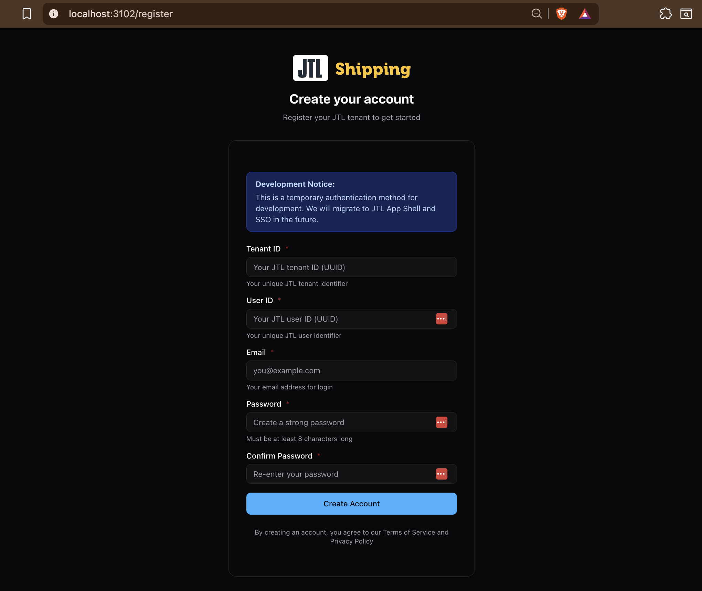

# JTL Authentication Guide

This guide explains how to register and authenticate with the JTL Karrio Shipping Platform using your JTL tenant and user identifiers.

## Table of Contents

- [Registration](#registration)
- [JWT Token Authentication](#jwt-token-authentication)
- [API Endpoints](#api-endpoints)

---

## Registration

### Prerequisites

- JTL Tenant ID (UUID format)
- JTL User ID (UUID format)
- Email address
- Password (minimum 8 characters)

### Registration Process

1. Navigate to [https://app.jtl.karrio.co/register](https://app.jtl.karrio.co/register)

2. Fill in the registration form:
   - **Tenant ID**: Your JTL tenant UUID (e.g., `23fea40b-5ec7-409a-b7f3-6fa8ed5b2d48`)
   - **User ID**: Your JTL user UUID (e.g., `12ded597-1967-4f7d-84df-c4566c8754aa`)
   - **Email**: Your email address for login
   - **Password**: Create a secure password (min. 8 characters)
   - **Confirm Password**: Re-enter your password

3. Click "Create Account"

4. After successful registration, you'll be redirected to the [sign-in page](https://app.jtl.karrio.co/signin)



### Using the Registration API

You can also register programmatically via the API:

```bash
curl -X POST https://api.jtl.karrio.co/jtl/tenants/onboarding \
  -H "Content-Type: application/json" \
  -d '{
    "tenantId": "your-tenant-uuid",
    "userId": "your-user-uuid",
    "email": "your@email.com",
    "password": "your-password"
  }'
```

**Response:**
```json
{
  "access_token": "eyJhbGci...",
  "refresh_token": "eyJhbGci...",
  "user": {
    "id": 2,
    "email": "your@email.com",
    "full_name": "Your Name"
  },
  "org": {
    "id": "org_...",
    "name": "Your Organization",
    "slug": "your-org-slug"
  },
  "org_user": {
    "id": "usr_...",
    "is_owner": true,
    "roles": ["member", "developer", "admin"]
  }
}
```

---

## JWT Token Authentication

The JTL Karrio platform supports custom JWT authentication using HS256 symmetric encryption. This allows external systems (like JTL WAWI) to authenticate users without storing passwords.

### JWT Token Structure

**Header:**
```json
{
  "alg": "HS256",
  "typ": "JWT"
}
```

**Payload:**
```json
{
  "tenantId": "23fea40b-5ec7-409a-b7f3-6fa8ed5b2d48",
  "userId": "12ded597-1967-4f7d-84df-c4566c8754aa",
  "iss": "jtl-wawi-api",
  "exp": 1792104666
}
```

**Required Claims:**
- `tenantId`: Your JTL tenant UUID
- `userId`: Your JTL user UUID
- `iss`: Must be `"jtl-wawi-api"`
- `exp`: Token expiration timestamp (Unix timestamp)

### Generating JWT Tokens

#### Using jwt.io

1. Go to [https://jwt.io](https://jwt.io)

2. In the **ALGORITHM** dropdown, select **HS256**

3. In the **HEADER** section, paste:
   ```json
   {
     "alg": "HS256",
     "typ": "JWT"
   }
   ```

4. In the **PAYLOAD** section, paste (replace with your values):
   ```json
   {
     "tenantId": "your-tenant-uuid",
     "userId": "your-user-uuid",
     "iss": "jtl-wawi-api",
     "exp": 1792104666
   }
   ```

5. In the **VERIFY SIGNATURE** section:
   - Keep the encoding as **UTF-8**
   - Enter the shared `JWT_SECRET` (contact your administrator)

6. Copy the generated token from the **Encoded** section

#### Using Command Line (Bash)

```bash
#!/bin/bash

# Configuration
TENANT_ID="your-tenant-uuid"
USER_ID="your-user-uuid"
JWT_SECRET="your-jwt-secret"
EXP=$(($(date +%s) + 31536000))  # 1 year from now

# Helper functions
base64url() { openssl base64 -e -A | tr '+/' '-_' | tr -d '='; }
hmac_sha256() { echo -n "$2" | openssl dgst -binary -sha256 -mac HMAC -macopt hexkey:"$(echo -n "$1" | xxd -p -c 256)" | base64url; }

# Generate JWT
HEADER='{"alg":"HS256","typ":"JWT"}'
PAYLOAD="{\"tenantId\":\"${TENANT_ID}\",\"userId\":\"${USER_ID}\",\"iss\":\"jtl-wawi-api\",\"exp\":${EXP}}"
HEADER_B64=$(echo -n "$HEADER" | base64url)
PAYLOAD_B64=$(echo -n "$PAYLOAD" | base64url)
UNSIGNED="${HEADER_B64}.${PAYLOAD_B64}"
SIGNATURE=$(hmac_sha256 "$JWT_SECRET" "$UNSIGNED")
JWT="${UNSIGNED}.${SIGNATURE}"

echo "JWT Token:"
echo "$JWT"
```

#### Using Python

```python
import jwt
import time

# Configuration
TENANT_ID = "your-tenant-uuid"
USER_ID = "your-user-uuid"
JWT_SECRET = "your-jwt-secret"

# Generate token
payload = {
    "tenantId": TENANT_ID,
    "userId": USER_ID,
    "iss": "jtl-wawi-api",
    "exp": int(time.time()) + 31536000  # 1 year from now
}

token = jwt.encode(payload, JWT_SECRET, algorithm="HS256")
print(f"JWT Token: {token}")
```

### Using JWT Tokens with the API

Once you have a JWT token, use it in the `Authorization` header:

```bash
curl https://api.jtl.karrio.co/graphql \
  -H "Authorization: Bearer YOUR_JWT_TOKEN" \
  -H "Content-Type: application/json" \
  -d '{"query":"{ user { email full_name } }"}'
```

**Example with shipping methods:**

```bash
curl https://api.jtl.karrio.co/graphql \
  -H "Authorization: Bearer YOUR_JWT_TOKEN" \
  -H "Content-Type: application/json" \
  -d '{"query":"{ shipping_methods { edges { node { id carrier_code } } } }"}'
```

### Token Expiration

- The `exp` claim determines when the token expires
- Use a Unix timestamp (seconds since epoch)
- Calculate expiration: `current_time + duration_in_seconds`

**Examples:**
```bash
# 1 hour from now
echo $(($(date +%s) + 3600))

# 1 day from now
echo $(($(date +%s) + 86400))

# 1 year from now
echo $(($(date +%s) + 31536000))
```

### Security Notes

⚠️ **Important:**
- The `JWT_SECRET` must be kept secure and shared only between JTL WAWI and Karrio
- JWT tokens grant full access to the user account - treat them like passwords
- Use HTTPS for all API requests
- Set appropriate expiration times based on your security requirements

---

## API Endpoints

### Base URLs

- **Frontend**: [https://app.jtl.karrio.co](https://app.jtl.karrio.co)
- **API**: [https://api.jtl.karrio.co](https://api.jtl.karrio.co)
- **OpenAPI Docs**: [https://api.jtl.karrio.co/openapi](https://api.jtl.karrio.co/openapi)

### Authentication Endpoints

| Endpoint | Method | Description |
|----------|--------|-------------|
| `/jtl/tenants/onboarding` | POST | Register a new JTL tenant |
| `/api/token` | POST | Login with email/password |
| `/api/token/refresh` | POST | Refresh access token |
| `/graphql` | POST | GraphQL API (requires auth) |

### Testing Your Authentication

After registration, test your JWT authentication:

```bash
# 1. Generate a JWT token (using jwt.io or script above)

# 2. Test with a simple query
curl https://api.jtl.karrio.co/graphql \
  -H "Authorization: Bearer YOUR_JWT_TOKEN" \
  -H "Content-Type: application/json" \
  -d '{"query":"{ user { email } }"}'
```

**Expected Response:**
```json
{
  "data": {
    "user": {
      "email": "your@email.com"
    }
  }
}
```

---

## Troubleshooting

### Registration Issues

**"Organization not found"**
- Ensure you've completed registration first via `/jtl/tenants/onboarding`
- Check that tenantId and userId are correct UUIDs

### JWT Authentication Issues

**"Invalid token"**
- Verify the `JWT_SECRET` matches the server configuration
- Check that all required claims are present (`tenantId`, `userId`, `iss`, `exp`)
- Ensure `iss` is exactly `"jtl-wawi-api"`

**"Token has expired"**
- Generate a new token with a future `exp` timestamp
- Check that your system clock is accurate

**"User not found"**
- Complete registration first using the onboarding API
- Verify tenantId and userId match your registration

### Getting Help

- **API Documentation**: [https://api.jtl.karrio.co/openapi](https://api.jtl.karrio.co/openapi)
- **Issues**: Contact your system administrator
- **JWT Debugging**: Use [jwt.io](https://jwt.io) to decode and verify tokens

---

## Quick Reference

### Complete Registration & Authentication Flow

```bash
# 1. Register tenant/user
curl -X POST https://api.jtl.karrio.co/jtl/tenants/onboarding \
  -H "Content-Type: application/json" \
  -d '{
    "tenantId": "23fea40b-5ec7-409a-b7f3-6fa8ed5b2d48",
    "userId": "12ded597-1967-4f7d-84df-c4566c8754aa",
    "email": "user@example.com",
    "password": "securepass123"
  }'

# 2. Generate JWT token (save this as test-jwt.sh)
TENANT_ID="23fea40b-5ec7-409a-b7f3-6fa8ed5b2d48"
USER_ID="12ded597-1967-4f7d-84df-c4566c8754aa"
JWT_SECRET="your-jwt-secret"
EXP=$(($(date +%s) + 86400))
base64url() { openssl base64 -e -A | tr '+/' '-_' | tr -d '='; }
hmac_sha256() { echo -n "$2" | openssl dgst -binary -sha256 -mac HMAC -macopt hexkey:"$(echo -n "$1" | xxd -p -c 256)" | base64url; }
HEADER='{"alg":"HS256","typ":"JWT"}'
PAYLOAD="{\"tenantId\":\"${TENANT_ID}\",\"userId\":\"${USER_ID}\",\"iss\":\"jtl-wawi-api\",\"exp\":${EXP}}"
HEADER_B64=$(echo -n "$HEADER" | base64url)
PAYLOAD_B64=$(echo -n "$PAYLOAD" | base64url)
UNSIGNED="${HEADER_B64}.${PAYLOAD_B64}"
SIGNATURE=$(hmac_sha256 "$JWT_SECRET" "$UNSIGNED")
JWT="${UNSIGNED}.${SIGNATURE}"

# 3. Use JWT token
curl https://api.jtl.karrio.co/graphql \
  -H "Authorization: Bearer ${JWT}" \
  -H "Content-Type: application/json" \
  -d '{"query":"{ shipping_methods { edges { node { id } } } }"}'
```

---

*Last Updated: October 2025*
