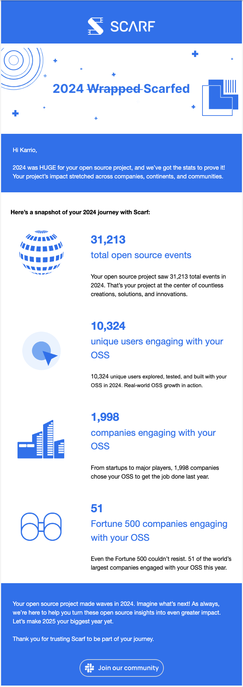

# KARRIO PLATFORM

## The Future of Open Shipping Infrastructure

<a href="https://platform.karrio.io" target="_blank">
  <picture>
    
  </picture>
</a>

**A White Paper by Karrio, Inc.**

---

## Executive Summary

In today's rapidly evolving e-commerce landscape, shipping has become a critical competitive differentiator. Yet, the integration of shipping functionality remains one of the most challenging technical hurdles facing platforms, logistics providers, and enterprises. Traditional shipping solutions are marked by arcane technologies, inconsistent APIs, and poor developer experiences that hinder innovation and growth.

Karrio emerged as an open-source solution to address these challenges, providing a unified API for shipping that abstracts the complexity of carrier integrations. After achieving significant traction with over beyond a million live transactions (live-rates, label-generation, live-tracking) per year and 5,00~ monthly open-source downloads, we're now introducing **Karrio Platform** – a sustainable, enterprise-ready evolution of our shipping infrastructure.

This white paper outlines our journey, the gaps we're addressing in the market, and our vision for creating an open logistics network that empowers businesses to build exceptional shipping experiences without the traditional pain points of carrier integration.

---

## Our Reach and Impact in 2023-2024

  

Karrio demonstrated remarkable growth and adoption last year:

### API Transaction Milestone

We've surpassed **1 million live API combined transactions** across our core services:

- Label generation
- Package tracking
- Live carrier rating

### Open Source Community Adoption

- **10,000~** OSS downloads
- A growing community of developers and logistics professionals network around the project

These metrics validate our approach and confirm the market need for a modern, developer-first shipping infrastructure. However, our growth has also highlighted challenges that have limited our ability to serve all customer needs at scale.

---

## Where We Fell Short and What's Changing

### The Unsustainable Open Source Model

While our open-source approach has driven adoption, it presented sustainability challenges:

- **Limited Development Resources**: With a single core maintainer, we couldn't keep pace with feature requests and carrier integration needs
- **Incomplete Enterprise Features**: Critical functionality like custom rate sheets, workflow automation, and batch operations remained in beta
- **Integration Gaps**: Many carrier integrations lacked production readiness or comprehensive testing
- **Support Limitations**: Without a sustainable funding model, we couldn't provide the enterprise-grade support that businesses require

### The Path Forward

These challenges have led us to evolve our business model while preserving our commitment to openness and developer experience:

- **Transitioning Beyond Pure OSS**: Introducing a sustainable platform that funds ongoing development and support
- **Expanding Our Team**: Growing from a single maintainer to a dedicated team of shipping technology experts
- **Prioritizing Enterprise Readiness**: Focusing on stability, security, and scalability for mission-critical shipping operations
- **Comprehensive Carrier Program**: Building deeper, more robust carrier integrations with thorough testing and certification

---

## The Future We Are Building

### Karrio Platform: Beyond Open Source

Karrio Platform represents the next evolution in shipping infrastructure, offering:

- **Production-Ready Carrier Integrations**: Thoroughly tested, maintained, and certified carrier connections
- **Enterprise-Grade Features**: Advanced functionality for businesses operating at scale
- **Self-Hosting Options**: Deploy in your own infrastructure with our expert support
- **Flexible Deployment Models**: Cloud, hybrid, or on-premises to meet your security and compliance requirements
- **SLAs and Premium Support**: Guaranteed uptime and dedicated assistance for business-critical operations

### Why We're Unique in the Shipping Infrastructure Space

Unlike traditional shipping solutions, Karrio offers:

1. **True Multi-Carrier Flexibility**: A programmable shipping API, allowing you to use your preferred shipping providers without lock-in
2. **Developer-First Approach**: Modern APIs, and tooling designed for engineers
3. **Composable Architecture**: Extend your platform and customize your usage of Karrio to meet your specific logistics needs
4. **Transparent Pricing**: Predictable costs without the hidden fees common in shipping platforms
5. **Open Core Foundation**: Benefit from our open-source roots while gaining enterprise stability

### Building an Open Logistics Network

Our vision extends beyond shipping APIs to create an ecosystem that connects all aspects of digitized logistics:

- **Unified Carrier Network**: Access global and regional carriers through a single integration
- **Developer Tooling**: SDKs, plugins, and integrations that accelerate shipping implementation
- **Partner Ecosystem**: Technology and service providers that extend Karrio's capabilities
- **Data Insights**: Analytics and optimization tools to improve shipping visibility and performance

---

## Plans for Sustainability

### Customer-Funded Growth

We're building a sustainable business that prioritizes customer success over rapid growth:

- **Transparent, Value-Based Pricing**: Pay for what you use, with plans that scale with your business
- **Reinvestment in Product Development**: Revenue directly funds new features and carrier integrations
- **Long-Term Vision**: Building for enduring impact rather than short-term gains

### Partnership Approach

Karrio Platform customers gain more than just software—they join a partnership with shipping technology experts:

- **Dedicated Support**: Direct access to our engineering team for complex integration challenges
- **Implementation Assistance**: Guidance on best practices for shipping integration
- **Roadmap Influence**: Shape our product direction based on your business needs
- **Custom Development**: Tailored solutions for unique shipping requirements

---

## Roadmap: Building the Future of Logistics Infrastructure

### Q1 2025: Logistics Automation Platform

- Shipping rules engine for automated carrier selection
- Batch processing capabilities for high-volume operations
- Advanced webhooks and event system for real-time logistics

### Q2-Q3 2025: Developer Experience Enhancement

- Comprehensive developer portal with interactive documentation
- Integration templates for common e-commerce platforms
- Extended API capabilities for specialized shipping scenarios
- Continuous carrier integrations for you or your merchants

### Q4 2025 and Beyond: Monetization and Analytics

- Tools to help platforms monetize shipping services
- Advanced analytics and reporting dashboard
- Machine learning-powered shipping optimization
- Enhanced compliance tools for cross-border shipping

---

## Our Team: Shipping Technology Experts

Karrio is led by a team of logistics technology specialists with deep expertise in shipping integration, platform development, and enterprise software:

### Daniel Kobina

**CTO/Creator of Karrio**

- Shipping technology specialist
- Core maintainer of Karrio OSS
- Expert in carrier API integration and logistics software architecture

### Kola

**Strategy/Finance**

- Business development and strategic partnerships
- Financial planning and sustainable growth
- Market analysis and product positioning

### Shadrack

**Software Development/Data Analysis**

- Core maintainer and developer
- Data analytics specialist
- Fullstack development

As we grow, we're expanding our team to enhance our capabilities in carrier integration, customer success, and platform development. Our commitment to our customers drives everything we do—from hiring decisions to feature prioritization.

---

## Ready to Transform Your Shipping Infrastructure?

### Schedule an Onboarding Call

Our team is ready to discuss your shipping needs and demonstrate how Karrio Platform can help you build exceptional shipping experiences for your customers.

During this call, we'll:

- Review your current shipping infrastructure and challenges
- Demonstrate Karrio Platform's capabilities
- Discuss implementation options and timelines
- Outline pricing and partnership options

### Contact Information

- **Email**: hello@karrio.io
- **Website**: https://platform.karrio.io
- **Schedule a Demo**: https://cal.com/karrio/enterprise

---

## Join the Future of Open Shipping Infrastructure

The future of logistics is open, flexible, and developer-friendly. With Karrio Platform, you're not just adopting a shipping solution—you're joining a movement to transform how businesses integrate and optimize shipping.

Whether you're a logistics provider looking to enhance your carrier network, a platform aiming to embed shipping functionality, or an enterprise seeking to streamline shipping operations, Karrio provides the infrastructure you need to succeed.

Contact us today to learn how **Karrio Platform** can power your shipping innovation.
