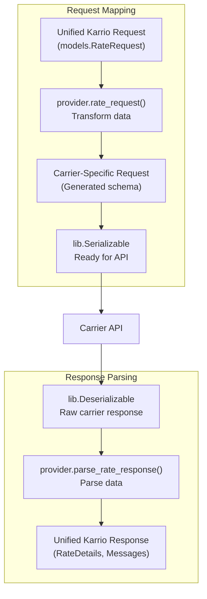
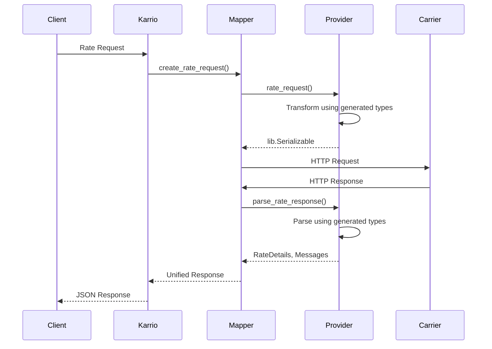

# Data Mapping

The core of a Karrio carrier integration is the data mapping layer. This layer transforms data between Karrio's unified models and the specific formats required by the carrier's API.

This transformation logic lives in two places:

1. The **`Mapper` class** in `karrio/mappers/[carrier_name]/mapper.py`
2. The **provider functions** in `karrio/providers/[carrier_name]/`

## Mapper Implementation

The `Mapper` class connects Karrio's core logic to your provider-specific implementation. It inherits from `karrio.api.mapper.Mapper` and delegates to functions in your `provider` module.

```python
# karrio/mappers/[carrier_name]/mapper.py
import typing
import karrio.lib as lib
import karrio.api.mapper as mapper
import karrio.core.models as models
import karrio.providers.[carrier_name] as provider
import karrio.mappers.[carrier_name].settings as provider_settings

class Mapper(mapper.Mapper):
    settings: provider_settings.Settings

    # Request Creation Methods
    def create_rate_request(
        self, payload: models.RateRequest
    ) -> lib.Serializable:
        return provider.rate_request(payload, self.settings)

    def create_shipment_request(
        self, payload: models.ShipmentRequest
    ) -> lib.Serializable:
        return provider.shipment_request(payload, self.settings)

    def create_tracking_request(
        self, payload: models.TrackingRequest
    ) -> lib.Serializable:
        return provider.tracking_request(payload, self.settings)

    # Response Parsing Methods
    def parse_rate_response(
        self, response: lib.Deserializable[str]
    ) -> typing.Tuple[typing.List[models.RateDetails], typing.List[models.Message]]:
        return provider.parse_rate_response(response, self.settings)

    def parse_shipment_response(
        self, response: lib.Deserializable[str]
    ) -> typing.Tuple[models.ShipmentDetails, typing.List[models.Message]]:
        return provider.parse_shipment_response(response, self.settings)

    def parse_tracking_response(
        self, response: lib.Deserializable[str]
    ) -> typing.Tuple[typing.List[models.TrackingDetails], typing.List[models.Message]]:
        return provider.parse_tracking_response(response, self.settings)
```

## Provider Mapping Functions

The actual mapping logic resides in functions within your `provider` modules. For each operation, you implement two functions: one to create the request and one to parse the response.



### Request Mapping Example: Rating

**File**: `karrio/providers/[carrier_name]/rate.py`

```python
import typing
import karrio.lib as lib
import karrio.core.models as models
import karrio.providers.[carrier_name].units as provider_units
import karrio.providers.[carrier_name].utils as provider_utils
import karrio.providers.[carrier_name].error as provider_error
# CRITICAL: Always import and use generated schema types
import karrio.schemas.[carrier_name].rate_request as carrier_req
import karrio.schemas.[carrier_name].rate_response as carrier_res

def rate_request(
    payload: models.RateRequest,
    settings: provider_utils.Settings,
) -> lib.Serializable:
    """Transform a Karrio RateRequest into a carrier-specific rate request."""

    # Use Karrio helpers to parse the unified payload
    shipper = lib.to_address(payload.shipper)
    recipient = lib.to_address(payload.recipient)
    packages = lib.to_packages(payload.parcels)
    services = lib.to_services(payload.services, provider_units.ShippingService)
    options = lib.to_shipping_options(
        payload.options,
        package_options=packages.options,
        initializer=provider_units.shipping_options_initializer,
    )

    # Create the carrier-specific request using generated schema types
    request = carrier_req.RateRequestType(
        shipper={
            "addressLine1": shipper.address_line1,
            "city": shipper.city,
            "postalCode": shipper.postal_code,
            "countryCode": shipper.country_code,
            "stateCode": shipper.state_code,
            "personName": shipper.person_name,
            "companyName": shipper.company_name,
        },
        recipient={
            "addressLine1": recipient.address_line1,
            "city": recipient.city,
            "postalCode": recipient.postal_code,
            "countryCode": recipient.country_code,
            "stateCode": recipient.state_code,
            "personName": recipient.person_name,
            "companyName": recipient.company_name,
        },
        packages=[
            {
                "weight": package.weight.value,
                "weightUnit": provider_units.WeightUnit[package.weight.unit].value,
                "length": package.length.value if package.length else None,
                "width": package.width.value if package.width else None,
                "height": package.height.value if package.height else None,
                "dimensionUnit": provider_units.DimensionUnit[package.dimension_unit].value if package.dimension_unit else None,
                "packagingType": provider_units.PackagingType[package.packaging_type or 'your_packaging'].value,
            }
            for package in packages
        ],
        services=[s.value_or_key for s in services] if services else None,
        customerNumber=settings.account_number,
    )

    return lib.Serializable(request, lib.to_dict)  # Use lib.to_xml for XML APIs

def parse_rate_response(
    _response: lib.Deserializable[str],
    settings: provider_utils.Settings,
) -> typing.Tuple[typing.List[models.RateDetails], typing.List[models.Message]]:
    """Parse a carrier rate response into Karrio RateDetails."""
    response = _response.deserialize()

    # Parse any errors first
    messages = provider_error.parse_error_response(response, settings)

    # Extract rates from response
    rate_objects = response.get("rates", []) if hasattr(response, 'get') else []
    rates = [_extract_rate_details(rate, settings) for rate in rate_objects]

    return rates, messages

def _extract_rate_details(
    data: dict,
    settings: provider_utils.Settings,
) -> models.RateDetails:
    """Helper function to map a single carrier rate to RateDetails."""
    # Convert to typed object using generated schema
    rate = lib.to_object(carrier_res.RateType, data)

    return models.RateDetails(
        carrier_name=settings.carrier_name,
        carrier_id=settings.carrier_id,
        service=rate.serviceCode if hasattr(rate, 'serviceCode') else "",
        total_charge=lib.to_money(rate.totalCharge),
        currency=rate.currency if hasattr(rate, 'currency') else "USD",
        transit_days=int(rate.transitDays) if hasattr(rate, 'transitDays') and rate.transitDays else None,
        meta=dict(
            service_name=rate.serviceName if hasattr(rate, 'serviceName') else "",
        ),
    )
```

### Shipment Implementation Example

**File**: `karrio/providers/[carrier_name]/shipment.py`

```python
import typing
import karrio.lib as lib
import karrio.core.models as models
import karrio.providers.[carrier_name].units as provider_units
import karrio.providers.[carrier_name].utils as provider_utils
import karrio.providers.[carrier_name].error as provider_error
import karrio.schemas.[carrier_name].shipment_request as carrier_req
import karrio.schemas.[carrier_name].shipment_response as carrier_res

def shipment_request(
    payload: models.ShipmentRequest,
    settings: provider_utils.Settings,
) -> lib.Serializable:
    """Create a shipment request for the carrier API."""

    shipper = lib.to_address(payload.shipper)
    recipient = lib.to_address(payload.recipient)
    packages = lib.to_packages(payload.parcels)
    service = lib.to_services(payload.service, provider_units.ShippingService).first
    options = lib.to_shipping_options(
        payload.options,
        package_options=packages.options,
        initializer=provider_units.shipping_options_initializer,
    )

    request = carrier_req.ShipmentRequestType(
        shipper={
            "addressLine1": shipper.address_line1,
            "city": shipper.city,
            "postalCode": shipper.postal_code,
            "countryCode": shipper.country_code,
            "personName": shipper.person_name,
            "companyName": shipper.company_name,
        },
        recipient={
            "addressLine1": recipient.address_line1,
            "city": recipient.city,
            "postalCode": recipient.postal_code,
            "countryCode": recipient.country_code,
            "personName": recipient.person_name,
            "companyName": recipient.company_name,
        },
        packages=[
            {
                "weight": package.weight.value,
                "weightUnit": provider_units.WeightUnit[package.weight.unit].value,
                "dimensions": {
                    "length": package.length.value if package.length else None,
                    "width": package.width.value if package.width else None,
                    "height": package.height.value if package.height else None,
                    "unit": provider_units.DimensionUnit[package.dimension_unit].value if package.dimension_unit else None,
                },
                "packagingType": provider_units.PackagingType[package.packaging_type or 'your_packaging'].value,
            }
            for package in packages
        ],
        serviceCode=service.value_or_key,
        customerNumber=settings.account_number,
        labelFormat=payload.label_type or "PDF",
    )

    return lib.Serializable(request, lib.to_dict)

def parse_shipment_response(
    _response: lib.Deserializable[str],
    settings: provider_utils.Settings,
) -> typing.Tuple[models.ShipmentDetails, typing.List[models.Message]]:
    """Parse a carrier shipment response into ShipmentDetails."""
    response = _response.deserialize()

    messages = provider_error.parse_error_response(response, settings)

    # Convert to typed object
    shipment = lib.to_object(carrier_res.ShipmentResponseType, response)

    return models.ShipmentDetails(
        carrier_id=settings.carrier_id,
        carrier_name=settings.carrier_name,
        tracking_number=shipment.trackingNumber,
        shipment_identifier=shipment.shipmentId if hasattr(shipment, 'shipmentId') else None,
        label=shipment.labelData if hasattr(shipment, 'labelData') else None,
        meta=dict(
            service_name=shipment.serviceName if hasattr(shipment, 'serviceName') else "",
            label_type=shipment.labelType if hasattr(shipment, 'labelType') else "PDF",
        ),
    ), messages
```

### Tracking Implementation Example

**File**: `karrio/providers/[carrier_name]/tracking.py`

```python
import typing
import karrio.lib as lib
import karrio.core.models as models
import karrio.providers.[carrier_name].units as provider_units
import karrio.providers.[carrier_name].utils as provider_utils
import karrio.schemas.[carrier_name].tracking_response as carrier_res

def tracking_request(
    payload: models.TrackingRequest,
    settings: provider_utils.Settings,
) -> lib.Serializable:
    """Create a tracking request object."""
    # Most carriers just need the tracking numbers
    return lib.Serializable(payload.tracking_numbers)

def parse_tracking_response(
    _response: lib.Deserializable,
    settings: provider_utils.Settings,
) -> typing.Tuple[typing.List[models.TrackingDetails], typing.List[models.Message]]:
    """Parse carrier tracking response into TrackingDetails."""
    response = _response.deserialize()

    tracking_details = []
    for tracking_number, tracking_data in response:
        if not tracking_data:
            continue

        # Convert to typed object
        tracking = lib.to_object(carrier_res.TrackingResponseType, tracking_data)

        events = [
            models.TrackingEvent(
                date=lib.to_date(event.date) if hasattr(event, 'date') else None,
                description=event.description if hasattr(event, 'description') else "",
                location=event.location if hasattr(event, 'location') else "",
                code=event.status if hasattr(event, 'status') else "",
                time=lib.to_time(event.time) if hasattr(event, 'time') else None,
            )
            for event in (getattr(tracking, 'events', None) or [])
        ]

        detail = models.TrackingDetails(
            carrier_id=settings.carrier_id,
            carrier_name=settings.carrier_name,
            tracking_number=tracking_number,
            events=events,
            status=provider_units.TrackingStatus.map(getattr(tracking, 'status', None)),
        )
        tracking_details.append(detail)

    return tracking_details, []
```

## Helper Functions

Karrio provides helper functions in `karrio.lib` to simplify common mapping tasks:

- **`lib.to_address`**: Converts payload address to standardized `Address` object
- **`lib.to_packages`**: Converts parcels list to standardized `Package` objects
- **`lib.to_shipping_options`**: Converts options to `ShippingOptions` object
- **`lib.to_services`**: Converts service strings to carrier-specific service codes
- **`lib.to_money`**: Converts values to `Decimal` money type
- **`lib.to_object`**: Converts dictionaries to specific schema class objects
- **`lib.to_date`**: Parses date strings into date objects
- **`lib.to_time`**: Parses time strings into time objects

## Unified Data Models

Karrio's unified data model is defined in `karrio.core.models`:

### Request Models
- **`RateRequest`**: Request for shipping rates
- **`ShipmentRequest`**: Request to create shipment
- **`TrackingRequest`**: Request to track shipments
- **`PickupRequest`**: Request to schedule pickup

### Response Models
- **`RateDetails`**: Individual rate quote
- **`ShipmentDetails`**: Created shipment information
- **`TrackingDetails`**: Tracking status and events
- **`PickupDetails`**: Pickup confirmation

### Supporting Models
- **`Address`**: Standardized address format
- **`Package`**: Package dimensions and weight
- **`Message`**: Error or warning message

## Best Practices

1. **Always Use Generated Types**: Import and use schema classes from `karrio.schemas.[carrier_name]`
2. **Handle Missing Data**: Provide sensible defaults for optional fields
3. **Use Helper Functions**: Leverage `karrio.lib` helpers for data conversion
4. **Map to Unified Types**: Always map from carrier-specific to unified formats
5. **Error Handling**: Parse and return carrier errors as `Message` objects
6. **Type Safety**: Use type hints and proper typing throughout
7. **Stay Pure**: Mapping functions should be side-effect free

## Common Patterns

### Address Mapping
```python
def _build_address(address: models.Address) -> dict:
    return {
        "addressLine1": address.address_line1,
        "city": address.city,
        "postalCode": address.postal_code,
        "countryCode": address.country_code,
        "stateCode": address.state_code,
        "personName": address.person_name,
        "companyName": address.company_name,
    }
```

### Service Code Mapping
```python
def _map_service_code(service_code: str) -> str:
    service_map = {
        "CARRIER_EXPRESS": "carrier_express",
        "CARRIER_STANDARD": "carrier_standard",
        "CARRIER_GROUND": "carrier_ground",
    }
    return service_map.get(service_code, service_code.lower())
```

### Weight/Dimension Conversion
```python
def _build_weight(package: models.Package) -> dict:
    return {
        "value": package.weight.value,
        "unit": "KG" if package.weight.unit == "KG" else "LB"
    }

def _build_dimensions(package: models.Package) -> dict:
    if not package.length:
        return None
    return {
        "length": package.length.value,
        "width": package.width.value,
        "height": package.height.value,
        "unit": "CM" if package.dimension_unit == "CM" else "IN"
    }
```

### Error Handling Pattern
```python
def parse_error_response(
    response: dict,
    settings: provider_utils.Settings,
) -> typing.List[models.Message]:
    """Parse carrier errors into Karrio Messages."""
    errors = response.get("errors", [])

    return [
        models.Message(
            carrier_id=settings.carrier_id,
            carrier_name=settings.carrier_name,
            code=error.get("code", ""),
            message=error.get("message", ""),
            details=error.get("details", {}),
        )
        for error in errors
    ]
```

## Integration Flow



## Testing Data Mapping

**CRITICAL**: Every mapping function must be tested with the exact patterns:

### 1. Request Transformation Test
```python
def test_create_rate_request(self):
    request = gateway.mapper.create_rate_request(self.RateRequest)
    print(f"Generated request: {lib.to_dict(request.serialize())}")
    self.assertEqual(lib.to_dict(request.serialize()), RateRequest)
```

### 2. Response Parsing Test
```python
def test_parse_rate_response(self):
    with patch("karrio.mappers.[carrier_id].proxy.lib.request") as mock:
        mock.return_value = RateResponse
        parsed_response = (
            karrio.Rating.fetch(self.RateRequest)
            .from_(gateway)
            .parse()
        )
        print(f"Parsed response: {lib.to_dict(parsed_response)}")
        self.assertListEqual(lib.to_dict(parsed_response), ParsedRateResponse)
```

### 3. Test Data Requirements
- **Input Payload**: Standard Karrio format with realistic test data
- **Expected Request**: Carrier-specific format that your `rate_request()` should produce
- **Mock Response**: Actual carrier API response format
- **Expected Output**: Karrio format with `[data, errors]` structure

### 4. Generated Types Validation
Always test that your mapping correctly uses generated schema types:
```python
# Verify request uses generated types
rate = lib.to_object(carrier_req.RateRequestType, request.serialize())
self.assertIsInstance(rate, carrier_req.RateRequestType)

# Verify response parsing uses generated types
response_obj = lib.to_object(carrier_res.RateResponseType, mock_data)
self.assertTrue(hasattr(response_obj, 'rates'))
```

The data mapping layer is the heart of your integration, transforming between Karrio's unified format and carrier-specific requirements while maintaining type safety and error handling throughout the process.
