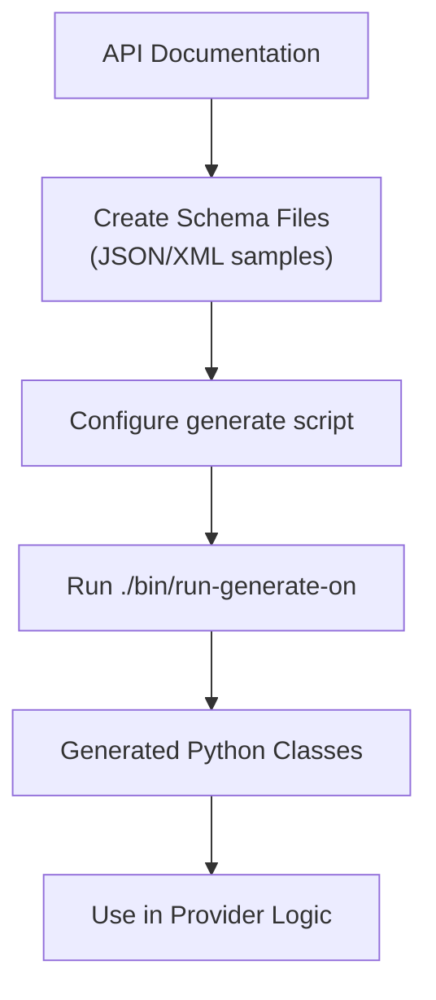

# Schema Generation

Karrio uses strongly-typed data structures to ensure data integrity and improve the developer experience. Schema generation converts a carrier's API specification into Python data classes that represent the exact structure of requests and responses for the carrier's API.

## Overview

The schema generation process involves:

1. **Prepare Schema Files**: Create JSON or XML files with API examples
2. **Configure Generation Script**: Set up the `generate` script with correct parameters
3. **Run Generation**: Execute `./bin/run-generate-on [path]` to generate Python classes
4. **Use Generated Types**: Import and use the generated classes in your provider implementation



## Step 1: Prepare Schema Files

Create schema files in the `schemas/` directory of your extension based on the carrier's API documentation.

### For JSON APIs

Create JSON files with actual API request/response examples (not JSON Schema definitions):

```text
schemas/
├── error_response.json      # Error response format
├── rate_request.json        # Rate request format
├── rate_response.json       # Rate response format
├── shipment_request.json    # Shipment request format
├── shipment_response.json   # Shipment response format
├── tracking_request.json    # Tracking request format
└── tracking_response.json   # Tracking response format
```

**Example rate_request.json:**
```json
{
  "shipper": {
    "addressLine1": "123 Main St",
    "city": "New York",
    "postalCode": "10001",
    "countryCode": "US"
  },
  "recipient": {
    "addressLine1": "456 Oak Ave",
    "city": "Los Angeles",
    "postalCode": "90210",
    "countryCode": "US"
  },
  "packages": [
    {
      "weight": 5.0,
      "weightUnit": "KG",
      "dimensions": {
        "length": 10.0,
        "width": 10.0,
        "height": 10.0,
        "unit": "CM"
      }
    }
  ]
}
```

### For XML/SOAP APIs

Create XSD schema files or XML examples:

```text
schemas/
├── error_response.xsd
├── rate_request.xsd
├── rate_response.xsd
└── ...
```

**Note**: Use actual API samples from the carrier's documentation, not abstract schema definitions.

## Step 2: Configure the Generate Script

The CLI automatically creates a `generate` script in your extension root. You need to configure it with the correct parameters for your carrier's API.

### Understanding Generation Parameters

The key parameters that affect how Python classes are generated:

| Parameter | Usage | API Field Format | Example |
|-----------|-------|------------------|---------|
| `--nice-property-names` | Convert to snake_case | APIs with camelCase fields | Easyship |
| `--no-nice-property-names` | Preserve original naming | APIs with camelCase that should stay camelCase | UPS, FedEx, SEKO |
| `--no-append-type-suffix --no-nice-property-names` | For PascalCase APIs | APIs with PascalCase fields | Some enterprise APIs |

### Example Generate Script

**File**: `modules/connectors/[carrier_name]/generate`

```bash
#!/bin/bash
set -e

SCHEMAS=./schemas
LIB_MODULES=./karrio/schemas/[carrier_name]
ROOT="$(pwd)"

# Clean existing generated files
find "${LIB_MODULES}" -name "*.py" -exec rm -r {} \;
touch "${LIB_MODULES}/__init__.py"

# Generation function
generate_schema() {
    echo "Generating $1..."
    "${ROOT}/bin/cli" codegen generate "$1" "$2" --no-nice-property-names
}

# Generate all required schemas
generate_schema "${SCHEMAS}/error_response.json" "${LIB_MODULES}/error_response.py"
generate_schema "${SCHEMAS}/rate_request.json" "${LIB_MODULES}/rate_request.py"
generate_schema "${SCHEMAS}/rate_response.json" "${LIB_MODULES}/rate_response.py"
generate_schema "${SCHEMAS}/shipment_request.json" "${LIB_MODULES}/shipment_request.py"
generate_schema "${SCHEMAS}/shipment_response.json" "${LIB_MODULES}/shipment_response.py"
generate_schema "${SCHEMAS}/tracking_request.json" "${LIB_MODULES}/tracking_request.py"
generate_schema "${SCHEMAS}/tracking_response.json" "${LIB_MODULES}/tracking_response.py"
```

### Choose Correct Parameters

**For camelCase APIs (UPS, FedEx, SEKO):**
```bash
"${ROOT}/bin/cli" codegen generate "$1" "$2" --no-nice-property-names
```

**For snake_case APIs (Easyship):**
```bash
"${ROOT}/bin/cli" codegen generate "$1" "$2" --nice-property-names
```

**For PascalCase APIs:**
```bash
"${ROOT}/bin/cli" codegen generate "$1" "$2" --no-append-type-suffix --no-nice-property-names
```

**🚨 CRITICAL RULES BEFORE GENERATION**:

1. **Generated Files Are READ-ONLY**:
   - **NEVER edit files in `karrio/schemas/[carrier_name]/`**
   - Generated files are completely overwritten on each run
   - Any manual changes will be lost permanently

2. **Source-Only Editing**:
   - Only modify files in `schemas/` directory (your source files)
   - To change API structure: Edit source schemas → regenerate
   - Never create schema files manually outside the CLI

3. **Generation Must Succeed**:
   - If generation fails, **STOP IMMEDIATELY**
   - Fix the source schema files or CLI parameters
   - Never proceed with incomplete/broken generation

4. **Verification Required**:
   - Always test imports after generation
   - Verify class names match expectations
   - Ensure type annotations are correct

## Step 3: Run Schema Generation

Execute the generation command from the project root:

```bash
# Activate environment first (CRITICAL)
source ./bin/activate-env

# Generate schemas for your carrier
./bin/run-generate-on modules/connectors/[carrier_name]

# For hub carriers
./bin/run-generate-on community/plugins/[carrier_name]

# Make the script executable if needed
chmod +x modules/connectors/[carrier_name]/generate
```

This command:
1. Finds the `generate` script in your extension
2. Executes it to process all schema files
3. Creates Python classes in `karrio/schemas/[carrier_name]/`

## Step 4: Verify Generated Code

After successful generation, verify the output:

```bash
# Check generated files
ls -la modules/connectors/[carrier_name]/karrio/schemas/[carrier_name]/

# Test imports
python -c "
import karrio.schemas.[carrier_name].rate_request as req
import karrio.schemas.[carrier_name].rate_response as res
print('Schema imports successful')
"
```

## Generated Code Structure

The generated Python classes use `attrs` and `jstruct` decorators for type safety and serialization:

**Example Generated Class:**
```python
# karrio/schemas/[carrier_name]/rate_request.py
import attr
import jstruct
import typing

@attr.s(auto_attribs=True)
class Address:
    addressLine1: typing.Optional[str] = None
    city: typing.Optional[str] = None
    postalCode: typing.Optional[str] = None
    countryCode: typing.Optional[str] = None

@attr.s(auto_attribs=True)
class Package:
    weight: typing.Optional[float] = None
    weightUnit: typing.Optional[str] = None
    dimensions: typing.Optional[Dimensions] = None

@attr.s(auto_attribs=True)
class RateRequestType:
    shipper: typing.Optional[Address] = None
    recipient: typing.Optional[Address] = None
    packages: typing.Optional[typing.List[Package]] = jstruct.JList[Package]
```

**Class Naming Conventions:**
- **With default settings**: Classes have `Type` suffix (e.g., `RateRequestType`)
- **With `--no-append-type-suffix`**: Classes named exactly as in schema (e.g., `RateRequest`)

## Step 5: Using Generated Types

Import and use the generated classes in your provider implementation:

**In Rate Implementation:**
```python
# karrio/providers/[carrier_name]/rate.py
import karrio.schemas.[carrier_name].rate_request as carrier_req
import karrio.schemas.[carrier_name].rate_response as carrier_res

def rate_request(payload: models.RateRequest, settings: Settings) -> lib.Serializable:
    # Use generated request type
    request = carrier_req.RateRequestType(
        shipper=carrier_req.Address(
            addressLine1=payload.shipper.address_line1,
            city=payload.shipper.city,
            # ... map other fields
        ),
        recipient=carrier_req.Address(
            addressLine1=payload.recipient.address_line1,
            city=payload.recipient.city,
            # ... map other fields
        ),
        packages=[
            carrier_req.Package(
                weight=package.weight.value,
                weightUnit=package.weight.unit,
                # ... map other fields
            )
            for package in packages
        ]
    )

    return lib.Serializable(request, lib.to_dict)

def parse_rate_response(response: lib.Deserializable, settings: Settings):
    data = response.deserialize()

    # Use generated response type
    rate_response = lib.to_object(carrier_res.RateResponseType, data)

    # Extract rates using typed access
    rates = [
        models.RateDetails(
            carrier_id=settings.carrier_id,
            service=rate.serviceCode,
            total_charge=lib.to_money(rate.totalCharge),
            currency=rate.currency,
        )
        for rate in (rate_response.rates or [])
    ]

    return rates, []
```

## Advanced CLI Tools

### Create Tree Command

Generate initialization templates for complex nested objects:

```bash
# Generate a tree structure for a class
kcli codegen tree --module=karrio.schemas.[carrier_name].rate_request --class-name=RateRequestType --module-alias=carrier

# Output example:
carrier.RateRequestType(
    shipper=carrier.Address(
        addressLine1=None,
        city=None,
        postalCode=None,
        countryCode=None,
    ),
    recipient=carrier.Address(
        addressLine1=None,
        city=None,
        postalCode=None,
        countryCode=None,
    ),
    packages=[
        carrier.Package(
            weight=None,
            weightUnit=None,
            dimensions=carrier.Dimensions(
                length=None,
                width=None,
                height=None,
                unit=None,
            ),
        )
    ],
)
```

This output can be copied directly into your mapping functions as a starting template.

## Troubleshooting

### Common Issues

**Generation Fails:**
- Ensure schema files contain valid JSON/XML
- Check that `generate` script is executable: `chmod +x generate`
- Verify environment is activated: `source ./bin/activate-env`

**Import Errors:**
- Verify extension is installed: `pip install -e modules/connectors/[carrier_name]`
- Check `__init__.py` files exist in schema directories
- Ensure class names match generated output

**Wrong Field Names:**
- Review generation parameters in your `generate` script
- Use `--nice-property-names` for snake_case conversion
- Use `--no-nice-property-names` to preserve original naming

### Testing Generation

Test your generation setup:

```bash
# Test CLI command directly
./bin/cli codegen generate schemas/rate_request.json test_output.py --no-nice-property-names

# Check output
cat test_output.py
```

## Best Practices

1. **Use Real API Examples**: Create schema files from actual carrier API documentation
2. **Choose Correct Parameters**: Match generation parameters to your API's field format
3. **Test Imports Early**: Verify generated classes import correctly before implementing logic
4. **Use Generated Types**: Always import and use generated classes in provider implementations
5. **Regenerate When Needed**: Only modify source schema files, never edit generated Python files

## XML API Considerations

For XML/SOAP APIs, the process is similar but uses `generateDS` instead:

```bash
# XML generation in generate script
generateDS --no-namespace-defs -o "${LIB_MODULES}/rate_request.py" $SCHEMAS/rate_request.xsd
```

Generated XML classes have different patterns:
- No `Type` suffix by default
- Use `lib.to_element` for deserialization
- Use `request.serialize()` for XML serialization

## Testing Generated Types

**MANDATORY**: Validate your generated types work correctly in tests:

### 1. Import Verification Test
```python
def test_schema_imports(self):
    """Verify all generated schema types import correctly."""
    try:
        import karrio.schemas.[carrier_name].rate_request as req
        import karrio.schemas.[carrier_name].rate_response as res
        print("All schema imports successful")
        self.assertTrue(hasattr(req, 'RateRequestType'))  # Adjust for your naming
        self.assertTrue(hasattr(res, 'RateResponseType'))
    except ImportError as e:
        self.fail(f"Schema import failed: {e}")
```

### 2. Type Validation Test
```python
def test_generated_types_usage(self):
    """Verify generated types work in mapping functions."""
    request = gateway.mapper.create_rate_request(self.RateRequest)

    # Verify the request uses generated types correctly
    serialized = request.serialize()
    self.assertIsInstance(serialized, dict)  # For JSON APIs

    # Verify specific required fields exist
    self.assertIn('shipper', serialized)
    self.assertIn('recipient', serialized)
    self.assertIn('packages', serialized)
```

### 3. Schema Regeneration Test
Always verify that schema regeneration still works:
```bash
# Test regeneration doesn't break
./bin/run-generate-on modules/connectors/[carrier_name]
python -c "import karrio.schemas.[carrier_name] as schemas; print('Regeneration successful')"
```

## Next Steps

Once schema generation is complete:

1. **Configure Metadata**: Set up connection settings and data units
2. **Implement API Requests**: Create the HTTP communication layer
3. **Implement Data Mapping**: Transform between Karrio and carrier formats
4. **Write Tests**: Validate your integration works correctly with exact patterns
