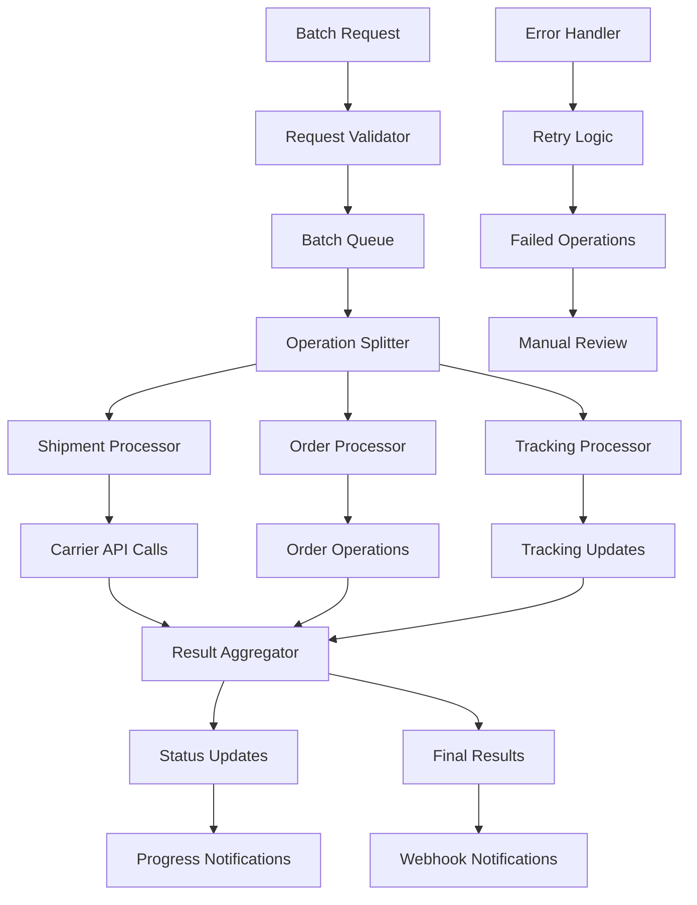

<div className="flex gap-2 mb-6">
  <div className="inline-flex items-center rounded-md bg-red-50 px-2 py-1 text-xs font-medium text-red-700 ring-1 ring-inset ring-red-700/10 dark:bg-red-400/10 dark:text-red-400 dark:ring-red-400/30">
    <span className="text-xs">High Volume</span>
  </div>
  <div className="inline-flex items-center rounded-md bg-purple-50 px-2 py-1 text-xs font-medium text-purple-700 ring-1 ring-inset ring-purple-700/10 dark:bg-purple-400/10 dark:text-purple-400 dark:ring-purple-400/30">
    <span className="text-xs">Insiders</span>
  </div>
  <div className="inline-flex items-center rounded-md bg-yellow-50 px-2 py-1 text-xs font-medium text-yellow-700 ring-1 ring-inset ring-yellow-700/10 dark:bg-yellow-400/10 dark:text-yellow-400 dark:ring-yellow-400/30">
    <span className="text-xs">PREVIEW</span>
  </div>
</div>

# Batch Processing

Every Karrio project comes with comprehensive batch processing capabilities, providing high-performance bulk operations for shipments, orders, tracking requests, and document generation with automatic error handling and progress monitoring.

## Features

### High-Volume Operations

You don't have to process shipments one by one. Our batch processing system handles thousands of operations simultaneously with optimized performance and resource utilization.

<div className="bg-gray-50 dark:bg-gray-900 rounded-lg p-4 my-6">
  <div className="text-sm text-gray-600 dark:text-gray-400 mb-2">
    Batch Processing Dashboard
  </div>
  <div className="bg-white dark:bg-gray-800 rounded border h-64 flex items-center justify-center">
    <span className="text-gray-400">
      Screenshot: Batch operation progress monitoring and results interface
    </span>
  </div>
</div>

### Intelligent Error Handling

Individual operation failures don't affect the entire batch. Failed operations are automatically retried with exponential backoff and detailed error reporting.

### Real-Time Progress Monitoring

Track batch operation progress in real-time with detailed status updates, completion rates, and performance metrics.

### Asynchronous Processing

Submit large batches and receive webhook notifications when processing completes, allowing your application to handle other tasks.

### Operation Optimization

Automatically optimize batch operations by grouping similar requests and leveraging carrier bulk APIs for maximum efficiency.

### Additional features

- Karrio extends batch processing with intelligent batching algorithms and carrier-specific optimizations.
- Every batch operation includes detailed logging and audit trails for compliance and debugging.
- Karrio manages resource allocation and rate limiting to prevent API overload.
- Support for custom batch validation rules and pre-processing workflows.

## Data Flow

### Batch Processing Flow



## API Reference

### REST API

#### Create Batch Shipments

```bash
curl -X POST "https://api.karrio.io/v1/batches/shipments" \
  -H "Authorization: Token YOUR_API_KEY" \
  -H "Content-Type: application/json" \
  -d '{
    "shipments": [
      {
        "recipient": {
          "person_name": "John Doe",
          "address_line1": "123 Main St",
          "city": "New York",
          "state_code": "NY",
          "postal_code": "10001",
          "country_code": "US"
        },
        "parcels": [
          {
            "weight": 2.5,
            "weight_unit": "LB"
          }
        ],
        "service": "ups_ground",
        "reference": "ORDER-001"
      },
      {
        "recipient": {
          "person_name": "Jane Smith",
          "address_line1": "456 Oak Ave",
          "city": "Los Angeles",
          "state_code": "CA",
          "postal_code": "90210",
          "country_code": "US"
        },
        "parcels": [
          {
            "weight": 1.8,
            "weight_unit": "LB"
          }
        ],
        "service": "fedex_ground",
        "reference": "ORDER-002"
      }
    ],
    "options": {
      "async": true,
      "auto_purchase": true,
      "notify_webhook": "https://your-app.com/webhooks/batch"
    }
  }'
```

**Response:**

```json
{
  "id": "batch_1234567890",
  "type": "shipments",
  "status": "processing",
  "total_count": 2,
  "completed_count": 0,
  "success_count": 0,
  "failed_count": 0,
  "progress_percentage": 0,
  "created_at": "2024-01-15T10:30:00Z",
  "estimated_completion": "2024-01-15T10:32:00Z",
  "options": {
    "async": true,
    "auto_purchase": true,
    "notify_webhook": "https://your-app.com/webhooks/batch"
  }
}
```

#### Get Batch Status

```bash
curl -X GET "https://api.karrio.io/v1/batches/operations/batch_1234567890" \
  -H "Authorization: Token YOUR_API_KEY"
```

**Response:**

```json
{
  "id": "batch_1234567890",
  "type": "shipments",
  "status": "completed",
  "total_count": 2,
  "completed_count": 2,
  "success_count": 2,
  "failed_count": 0,
  "progress_percentage": 100,
  "created_at": "2024-01-15T10:30:00Z",
  "completed_at": "2024-01-15T10:31:45Z",
  "processing_time": 105,
  "results": [
    {
      "index": 0,
      "success": true,
      "reference": "ORDER-001",
      "data": {
        "id": "shp_1234567890",
        "tracking_number": "1Z999AA1234567890",
        "carrier_name": "ups",
        "label_url": "https://api.karrio.io/v1/shipments/shp_1234567890/label.pdf"
      }
    },
    {
      "index": 1,
      "success": true,
      "reference": "ORDER-002",
      "data": {
        "id": "shp_1234567891",
        "tracking_number": "7721234567",
        "carrier_name": "fedex",
        "label_url": "https://api.karrio.io/v1/shipments/shp_1234567891/label.pdf"
      }
    }
  ]
}
```

#### Create Batch Trackers

```bash
curl -X POST "https://api.karrio.io/v1/batches/trackers" \
  -H "Authorization: Token YOUR_API_KEY" \
  -H "Content-Type: application/json" \
  -d '{
    "trackers": [
      {
        "tracking_number": "1Z999AA1234567890",
        "carrier_name": "ups"
      },
      {
        "tracking_number": "7721234567",
        "carrier_name": "fedex"
      }
    ]
  }'
```

**Response:**

```json
{
  "id": "batch_1234567892",
  "type": "trackers",
  "status": "completed",
  "total_count": 2,
  "success_count": 2,
  "failed_count": 0,
  "results": [
    {
      "index": 0,
      "success": true,
      "data": {
        "id": "trk_1234567890",
        "tracking_number": "1Z999AA1234567890",
        "carrier_name": "ups",
        "status": "in_transit",
        "estimated_delivery": "2024-01-18T17:00:00Z"
      }
    },
    {
      "index": 1,
      "success": true,
      "data": {
        "id": "trk_1234567891",
        "tracking_number": "7721234567",
        "carrier_name": "fedex",
        "status": "delivered",
        "delivered_at": "2024-01-17T14:30:00Z"
      }
    }
  ]
}
```

## Use Cases

### E-commerce Fulfillment

Perfect for high-volume order processing:

- **Daily Order Processing**: Process hundreds of orders in minutes
- **Peak Season Handling**: Handle holiday and sale volume spikes
- **Multi-Warehouse Operations**: Distribute orders across warehouses efficiently
- **Automated Fulfillment**: End-to-end order-to-shipment automation

### Enterprise Shipping

Designed for large-scale operations:

- **ERP Integration**: Bulk import and process shipments from ERP systems
- **Scheduled Processing**: Automated daily/weekly batch operations
- **Resource Optimization**: Maximize carrier bulk discounts
- **Compliance Reporting**: Generate bulk shipping reports for compliance

### 3PL Operations

Built for third-party logistics providers:

- **Multi-Client Processing**: Process shipments for multiple clients
- **SLA Management**: Ensure processing time commitments
- **Cost Optimization**: Bulk carrier negotiations and rate optimization
- **Performance Analytics**: Track processing efficiency and client satisfaction

## Integration Examples

### Automated Daily Processing

```javascript
class DailyBatchProcessor {
  constructor(config) {
    this.warehouseConfig = config.warehouses;
    this.batchSize = config.batchSize || 100;
  }

  async runDailyProcessing() {
    try {
      console.log("Starting daily batch processing...");

      // 1. Get pending orders
      const pendingOrders = await this.getPendingOrders();
      console.log(`Found ${pendingOrders.length} pending orders`);

      // 2. Group orders by warehouse
      const ordersByWarehouse = this.groupOrdersByWarehouse(pendingOrders);

      // 3. Process each warehouse batch
      const batchPromises = Object.entries(ordersByWarehouse).map(
        ([warehouseId, orders]) =>
          this.processWarehouseBatch(warehouseId, orders),
      );

      const results = await Promise.all(batchPromises);

      // 4. Generate summary report
      await this.generateProcessingReport(results);

      console.log("Daily batch processing completed");
    } catch (error) {
      console.error("Daily batch processing failed:", error);
      await this.notifyAdministrators(error);
    }
  }

  async processWarehouseBatch(warehouseId, orders) {
    // Split into smaller batches
    const batches = this.chunkArray(orders, this.batchSize);
    const batchResults = [];

    for (const batch of batches) {
      try {
        const shipmentRequests = batch.map((order) => ({
          recipient: order.shipping_address,
          parcels: this.mapOrderToParcels(order),
          service: this.selectShippingService(order),
          reference: order.order_number,
          metadata: {
            order_id: order.id,
            warehouse_id: warehouseId,
          },
        }));

        const batchResult = await karrio.batches.createShipments({
          batchShipmentData: {
            shipments: shipmentRequests,
          },
        });

        batchResults.push(batchResult);

        // Update order statuses
        await this.updateOrderStatuses(batch, batchResult);
      } catch (error) {
        console.error(
          `Batch processing failed for warehouse ${warehouseId}:`,
          error,
        );
        batchResults.push({ error, orders: batch });
      }
    }

    return { warehouseId, results: batchResults };
  }

  chunkArray(array, size) {
    const chunks = [];
    for (let i = 0; i < array.length; i += size) {
      chunks.push(array.slice(i, i + size));
    }
    return chunks;
  }
}

// Schedule daily processing
const processor = new DailyBatchProcessor({
  warehouses: warehouseConfig,
  batchSize: 50,
});

// Using cron or similar scheduler
cron.schedule("0 9 * * *", () => {
  processor.runDailyProcessing();
});
```

### Batch Progress Monitoring

```javascript
class BatchMonitor {
  constructor(batchId) {
    this.batchId = batchId;
    this.progressCallbacks = [];
  }

  onProgress(callback) {
    this.progressCallbacks.push(callback);
  }

  async startMonitoring() {
    const checkProgress = async () => {
      try {
        const status = await karrio.batches.retrieve({ id: this.batchId });

        // Notify all callbacks
        this.progressCallbacks.forEach((callback) => {
          callback(status);
        });

        if (status.status === "processing") {
          setTimeout(checkProgress, 5000); // Check every 5 seconds
        }
      } catch (error) {
        console.error("Failed to check batch progress:", error);
      }
    };

    await checkProgress();
  }
}

// Usage
const monitor = new BatchMonitor("batch_1234567890");
monitor.onProgress((status) => {
  console.log(`Progress: ${status.progress_percentage}%`);
  console.log(`Completed: ${status.completed_count}/${status.total_count}`);
});

await monitor.startMonitoring();
```

## Performance Optimization

### Batch Size Optimization

Choose optimal batch sizes based on your use case:

- **Small Batches (10-25)**: Better error isolation, faster individual results
- **Medium Batches (50-100)**: Balanced performance and error handling
- **Large Batches (200+)**: Maximum throughput for stable operations

### Error Recovery Strategy

```javascript
class BatchErrorRecovery {
  constructor() {
    this.maxRetries = 3;
  }

  async processBatchWithRecovery(operations) {
    let attempt = 1;
    let remainingOperations = [...operations];

    while (remainingOperations.length > 0 && attempt <= this.maxRetries) {
      console.log(
        `Batch attempt ${attempt}, processing ${remainingOperations.length} operations`,
      );

      const batch = await karrio.batches.createShipments({
        batchShipmentData: {
          shipments: remainingOperations,
        },
      });

      // Separate successful and failed operations
      const failed = batch.results
        .filter((result) => !result.success)
        .map((result) => remainingOperations[result.index]);

      const successful = batch.results
        .filter((result) => result.success)
        .map((result) => result.data);

      // Process successful operations
      await this.processSuccessfulShipments(successful);

      // Prepare failed operations for retry
      remainingOperations = failed.filter((operation) =>
        this.isRetryable(operation.error),
      );

      if (remainingOperations.length > 0) {
        // Apply backoff delay
        const delay = Math.pow(2, attempt) * 1000;
        await this.sleep(delay);
      }

      attempt++;
    }

    // Handle permanently failed operations
    if (remainingOperations.length > 0) {
      await this.handlePermanentFailures(remainingOperations);
    }
  }

  isRetryable(error) {
    const retryableCodes = [
      "RATE_LIMIT_EXCEEDED",
      "CARRIER_TIMEOUT",
      "TEMPORARY_ERROR",
    ];

    return retryableCodes.includes(error.code);
  }

  sleep(ms) {
    return new Promise((resolve) => setTimeout(resolve, ms));
  }
}
```

## Getting Started

Ready to implement high-performance batch processing with Karrio? Follow these steps:

1. **Identify batch operations** in your shipping workflow
2. **Implement batch request logic** using our API examples
3. **Set up progress monitoring** and error handling
4. **Optimize batch sizes** for your specific use case

### Next Steps

- Learn about [workflows](/docs/products/workflows) for automated batch triggering
- Explore [webhooks](/docs/products/webhooks) for batch completion notifications
- Set up [shipments](/docs/products/shipments) to understand individual operations
- Configure [admin console](/docs/products/admin-console) for batch monitoring
