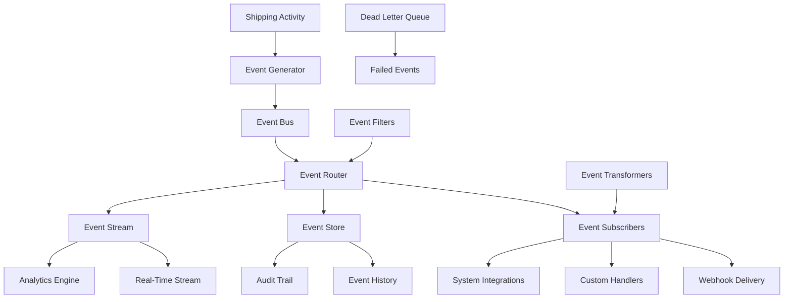

# Events & Real-Time Streaming

<div className="flex gap-2 mb-6">
  <div className="inline-flex items-center rounded-md bg-purple-50 px-2 py-1 text-xs font-medium text-purple-700 ring-1 ring-inset ring-purple-700/10 dark:bg-purple-400/10 dark:text-purple-400 dark:ring-purple-400/30">
    <span className="text-xs">Insiders</span>
  </div>
  <div className="inline-flex items-center rounded-md bg-pink-50 px-2 py-1 text-xs font-medium text-pink-700 ring-1 ring-inset ring-pink-700/10 dark:bg-pink-400/10 dark:text-pink-400 dark:ring-pink-400/30">
    <span className="text-xs">Real-Time</span>
  </div>
</div>

Every Karrio Insiders project comes with comprehensive event management and real-time streaming capabilities, providing event-driven architecture, real-time data synchronization, complete event history, and custom event handlers for complex automation workflows.

## Features

### Real-Time Event Processing

You don't have to constantly check for status updates. Our event system instantly publishes notifications when shipping activities occur, enabling immediate responses and real-time user experiences.

<div className="bg-gray-50 dark:bg-gray-900 rounded-lg p-4 my-6">
  <div className="text-sm text-gray-600 dark:text-gray-400 mb-2">
    Events Dashboard
  </div>
  <div className="bg-white dark:bg-gray-800 rounded border overflow-hidden">
    
  </div>
</div>

### Event Streaming

Continuous event streams for real-time processing with high-throughput, low-latency delivery to multiple subscribers.

### Complete Event History

Comprehensive audit trail of all system events with searchable history and detailed event metadata for compliance and debugging.

### Custom Event Handlers

Build custom logic to respond to events with flexible event routing and transformation capabilities.

### Advanced Event Filtering

Subscribe only to relevant events with powerful filtering by event type, metadata, and custom criteria.

### Additional features

- Karrio extends events with custom event routing and transformation pipelines.
- Every event includes structured metadata and correlation IDs for tracing.
- Karrio manages event ordering and guaranteed delivery with replay capabilities.
- Support for event aggregation and batch processing for high-volume scenarios.

## Data Flow

### Event-Driven Architecture



## API Reference

### GraphQL API

#### Query Events

```graphql
query GetEvents($filter: EventFilter) {
  events(filter: $filter) {
    page_info {
      count
      has_next_page
      has_previous_page
      start_cursor
      end_cursor
    }
    edges {
      node {
        id
        type
        data
        test_mode
        pending_webhooks
        created_at
      }
    }
  }
}
```

**Variables:**

```json
{
  "filter": {
    "type": ["shipment.created", "tracking.status_updated"],
    "offset": 0,
    "first": 20
  }
}
```

**Response:**

```json
{
  "data": {
    "events": {
      "page_info": {
        "count": 1534,
        "has_next_page": true,
        "has_previous_page": false,
        "start_cursor": "MjA5MA==",
        "end_cursor": "MjA2MA=="
      },
      "edges": [
        {
          "node": {
            "id": "evt_af5c3e8b94614bd1b8a0b8e2a5d9e7c4",
            "type": "shipment.created",
            "data": {
              "shipment": {
                "id": "shp_1234567890",
                "tracking_number": "1Z999AA1234567890",
                "carrier_name": "ups",
                "service": "ups_ground",
                "status": "purchased",
                "recipient": {
                  "person_name": "John Doe",
                  "city": "Los Angeles",
                  "state_code": "CA",
                  "postal_code": "90210",
                  "country_code": "US"
                },
                "shipper": {
                  "person_name": "Warehouse",
                  "city": "Chicago",
                  "state_code": "IL",
                  "postal_code": "60601",
                  "country_code": "US"
                },
                "parcels": [
                  {
                    "weight": 2.5,
                    "weight_unit": "LB"
                  }
                ]
              }
            },
            "test_mode": false,
            "pending_webhooks": 2,
            "created_at": "2024-01-15T10:30:00Z"
          }
        }
      ]
    }
  }
}
```

#### Get Single Event

```graphql
query GetEvent($id: String!) {
  event(id: $id) {
    id
    type
    data
    test_mode
    pending_webhooks
    created_at
  }
}
```

**Variables:**

```json
{
  "id": "evt_af5c3e8b94614bd1b8a0b8e2a5d9e7c4"
}
```

**Response:**

```json
{
  "data": {
    "event": {
      "id": "evt_af5c3e8b94614bd1b8a0b8e2a5d9e7c4",
      "type": "tracking.status_updated",
      "data": {
        "tracking": {
          "id": "trk_1234567890",
          "tracking_number": "1Z999AA1234567890",
          "carrier_name": "ups",
          "status": "in_transit",
          "events": [
            {
              "date": "2024-01-16",
              "description": "Package has left the origin facility",
              "location": "Chicago, IL",
              "code": "DP",
              "time": "08:30"
            }
          ]
        }
      },
      "test_mode": false,
      "pending_webhooks": 0,
      "created_at": "2024-01-16T08:30:00Z"
    }
  }
}
            "person_name": "Acme Corp",
            "city": "Chicago",
            "state_code": "IL",
            "postal_code": "60601",
            "country_code": "US"
          }
        }
      },
      "metadata": {
        "user_id": "usr_1234567890",
        "organization_id": "org_1234567890",
        "correlation_id": "corr_1234567890",
        "source": "api_request"
      },
      "version": "2024-01-01"
    },
    {
      "id": "evt_1234567891",
      "type": "tracking.status_updated",
      "timestamp": "2024-01-15T14:30:00Z",
      "data": {
        "tracking": {
          "tracking_number": "1Z999AA1234567890",
          "carrier_name": "ups",
          "status": "in_transit",
          "previous_status": "shipped",
          "estimated_delivery": "2024-01-18T17:00:00Z",
          "events": [
            {
              "code": "DP",
              "description": "Departed facility",
              "location": "Los Angeles, CA, US",
              "timestamp": "2024-01-15T14:30:00Z"
            }
          ]
        }
      },
      "metadata": {
        "organization_id": "org_1234567890",
        "shipment_id": "shp_1234567890",
        "correlation_id": "corr_1234567890",
        "source": "tracking_update"
      }
    }
  ]
}
```

### JavaScript/TypeScript SDK

Using the Karrio SDK to access events:

```typescript
import { useEvents, useEvent } from '@karrio/hooks';

// Query events with filtering
const EventsComponent = () => {
  const { query, filter, setFilter } = useEvents({
    type: ['shipment.created', 'tracking.status_updated'],
    offset: 0,
    first: 20
  });

  if (query.isLoading) return <div>Loading events...</div>;
  if (query.error) return <div>Error loading events</div>;

  return (
    <div>
      <h3>System Events</h3>
      {query.data?.events.edges.map(({ node: event }) => (
        <div key={event.id}>
          <p>{event.type} - {event.created_at}</p>
          <p>Test mode: {event.test_mode ? 'Yes' : 'No'}</p>
          <p>Pending webhooks: {event.pending_webhooks}</p>
          <pre>{JSON.stringify(event.data, null, 2)}</pre>
        </div>
      ))}
    </div>
  );
};

// Get single event
const EventDetailComponent = ({ eventId }) => {
  const { query } = useEvent(eventId);

  if (query.isLoading) return <div>Loading event...</div>;
  if (query.error) return <div>Error loading event</div>;

  const event = query.data?.event;

  return (
    <div>
      <h3>Event Details</h3>
      <p>ID: {event?.id}</p>
      <p>Type: {event?.type}</p>
      <p>Created: {event?.created_at}</p>
      <p>Test mode: {event?.test_mode ? 'Yes' : 'No'}</p>
      <pre>{JSON.stringify(event?.data, null, 2)}</pre>
    </div>
  );
};
```

## Event Types & Structure

Events in Karrio follow a standardized structure with event-specific data payloads. All events include the same base fields with type-specific data:

### Common Event Structure

```json
{
  "id": "evt_unique_identifier",
  "type": "event.type",
  "data": {
    // Event-specific data payload
  },
  "test_mode": false,
  "pending_webhooks": 0,
  "created_at": "2024-01-15T10:30:00Z"
}
```

### Available Event Types

Based on the Karrio event system, the following event types are supported:

- **shipment.created**: When a new shipment is created
- **shipment.updated**: When shipment details are modified
- **shipment.cancelled**: When a shipment is cancelled
- **tracking.updated**: When tracking information changes
- **order.created**: When a new order is created
- **order.fulfilled**: When an order is marked as fulfilled
- **webhook.delivered**: When a webhook is successfully delivered
- **webhook.failed**: When webhook delivery fails

## Real-Time Event Processing

### Event-Driven Workflows

Build reactive systems that respond immediately to shipping events:

```typescript
// Event-driven order fulfillment
class EventDrivenFulfillment {
  async handleShipmentCreated(event) {
    const { shipment } = event.data;

    // Update order status
    await this.updateOrderStatus(shipment.reference, "shipped");

    // Notify customer
    await this.sendShippingNotification(shipment);

    // Update inventory
    await this.decrementInventory(shipment.line_items);
  }

  async handleTrackingUpdated(event) {
    const { tracking } = event.data;

    if (tracking.status === "delivered") {
      // Complete order
      await this.completeOrder(tracking.reference);

      // Request review
      await this.requestCustomerReview(tracking.recipient);

      // Analytics tracking
      await this.trackDeliveryMetrics(tracking);
    }
  }
}
```

### Event Correlation

Track related events across the system:

````typescript
// Correlate events across shipment lifecycle
class EventCorrelator {
  async trackShipmentJourney(shipmentId) {
    const events = await this.getShipmentEvents(shipmentId);

    const journey = events.reduce((timeline, event) => {
      timeline.push({
        timestamp: event.created_at,
        type: event.type,
        status: this.extractStatus(event),
        location: this.extractLocation(event)
      });
      return timeline;
    }, []);

    return {
      shipment_id: shipmentId,
      timeline: journey.sort((a, b) =>
        new Date(a.timestamp) - new Date(b.timestamp)
      ),
      current_status: journey[journey.length - 1]?.status,
      total_events: events.length
    };
  }
}
```

## Use Cases

### Real-Time Order Management

Build responsive order management systems that react instantly to shipping events:

- **Automated Status Updates**: Update order status immediately when shipments are created or tracking changes
- **Customer Notifications**: Send real-time shipping notifications and delivery updates
- **Inventory Management**: Automatically adjust inventory when shipments are created or cancelled
- **Analytics & Reporting**: Track shipping performance and customer satisfaction metrics

### Integration & Automation

Connect Karrio events to external systems and automation workflows:

- **ERP Integration**: Sync shipping data with enterprise resource planning systems
- **CRM Updates**: Update customer records with shipping and delivery information
- **Webhook Triggering**: Trigger external webhooks and API calls based on events
- **Business Intelligence**: Stream events to analytics platforms for reporting

### Monitoring & Alerting

Monitor your shipping operations with real-time event streams:

- **Exception Handling**: Alert on failed shipments, delivery issues, or API errors
- **Performance Monitoring**: Track response times and system performance
- **Compliance Auditing**: Maintain audit trails for regulatory compliance
- **Operational Dashboards**: Build real-time dashboards showing shipping metrics

## Getting Started

Ready to implement real-time event processing with Karrio? Follow these steps:

1. **Set up event subscriptions** using GraphQL queries for your needed event types
2. **Configure webhooks** for real-time event delivery to your applications
3. **Implement event handlers** to process events and trigger business logic
4. **Build monitoring dashboards** to track event streams and system health

### Next Steps

- Learn about [webhooks](/docs/products/webhooks) for event delivery and automation
- Explore [workflows](/docs/products/workflows) for event-driven automation
- Set up [admin console](/docs/products/admin-console) for event management
- Configure [api logs](/docs/products/api-logs) for comprehensive system monitoring

### Real-Time Customer Notifications

Perfect for e-commerce and customer-facing applications:

- **Shipping Confirmations**: Instant notifications when labels are purchased
- **Delivery Updates**: Real-time tracking status updates to customers
- **Exception Handling**: Proactive customer service for delivery issues
- **Order Lifecycle**: Complete order-to-delivery communication

### System Integration

Designed for enterprise and platform integrations:

- **ERP Synchronization**: Keep enterprise systems in sync with shipping status
- **Inventory Management**: Update stock levels based on fulfillment events
- **Analytics & Reporting**: Real-time data feeds for business intelligence
- **Workflow Automation**: Trigger business processes based on shipping events

### Monitoring & Operations

Built for DevOps and operational teams:

- **System Health Monitoring**: Track platform performance and carrier status
- **Alert Management**: Real-time alerts for system issues and exceptions
- **Audit & Compliance**: Complete audit trails for regulatory requirements
- **Performance Analytics**: Monitor shipping performance and SLA compliance

## Getting Started

Ready to build event-driven shipping applications with Karrio? Follow these steps:

1. **Subscribe to events** you need to monitor in your application
2. **Implement event handlers** to process events and trigger actions
3. **Set up event streaming** for real-time processing
4. **Build event aggregation** for analytics and reporting

### Next Steps

- Learn about [webhooks](/docs/products/webhooks) for HTTP-based event delivery
- Explore [api logs](/docs/products/api-logs) for detailed event monitoring
- Set up [workflows](/docs/products/workflows) for event-driven automation
- Configure [admin console](/docs/products/admin-console) for event management
````
